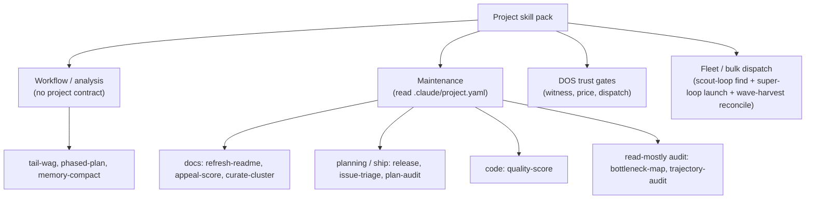

# Project skill pack

These are [Claude Code skills](https://docs.claude.com/en/docs/claude-code/skills)
checked into the repo so any agent working in `fak` can invoke them with `/<name>`.
Each skill is one `<name>/SKILL.md` with YAML front-matter; some bundle a small
read-only helper script beside it. The maintenance skills read `.claude/project.yaml`
for this repo's helper-script wiring — the skill text is universal, the helpers are
project-supplied.



*The page's skill families — and, within Maintenance, the surface each skill tends.*

## Workflow / analysis (no project contract)

| Skill | What it does |
|---|---|
| [`tail-wag`](tail-wag/SKILL.md) | Find the most "tail wagging the dog" inversion — a peripheral concern driving a core decision. Diagnoses, ranks, proposes a rebalance. |
| [`phased-plan`](phased-plan/SKILL.md) | Ceremony rules for shipping a phase of a phased plan — when to release, the hero-exit rule, the phase-split test. (Auto-loaded; not user-invocable.) |
| [`memory-compact`](memory-compact/SKILL.md) | Keep a Claude Code auto-memory store under the harness load cap (200 lines / 25 KB), tier into hot/cold, prove it with the bundled `check_memory.py` witness. |
| [`skill-lifecycle`](skill-lifecycle/SKILL.md) | Witnessed lifecycle for this skill pack — usage-telemetry sidecar, value/idle-driven auto-archive (never delete, restorable), pin-exemption, journaled reversible transitions. Bundled `skill_lifecycle_test.py` witness. |
| [`field-borrow`](field-borrow/SKILL.md) | Turn an outward field idea into grounded backlog *without guessing whether fak already has it*: **dogfood the self-query surface** (`fak_feature_query` / `fak index`) to witness PRESENT/PARTIAL/ABSENT, ground each real gap at a file:line seam, and file epic-anchored issues carrying the named source + the dogfood witness + a first checkable step. The witness-first, human-curated counterpart to the automated `idea-scout`; the product/agent-capability counterpart of the inward `sota-check` (kernels) and outward `industry-score` (the competitive map). Worked instance: [`CONCEPT-FIELD-BORROW-QUERY-QUALITY-2026-07-08`](../../docs/notes/CONCEPT-FIELD-BORROW-QUERY-QUALITY-2026-07-08.md). |
| [`study-repo`](study-repo/SKILL.md) | Turn "look at &lt;repo&gt;" into scoped, witnessed, license-clean backlog. Shallow-clone a specific GitHub repo into scratch (never the tree), **pin the commit SHA**, read the CODE not the pitch (load-bearing modules + tests + recent commits), extract candidate borrows each grounded at a real source `path:line@sha`, decide **borrow-vs-integrate** on the license, and — the heart — **decompose into many small independently-shippable tickets** (epic + leaves for a track), never one "adopt everything from repo X" monolith. The acquisition/exploration front-half that FEEDS `field-borrow`: study-repo starts from a repo URL and produces the candidates; field-borrow witnesses (PRESENT/PARTIAL/ABSENT) and files each. Distinct from the automated outward `idea-scout` and the kernel-only `sota-check`. |
| [`steer-prs`](steer-prs/SKILL.md) | The operator loop over the steer-prs overlay (`fak steer prs`, epic #5015): read the forming dev->release units **worst-attention-first** (RESIDUAL -> UNVERIFIABLE -> CLEARED), apply the **regime gate** (a CLEARED unit with a healthy curve means do nothing), pick the **weakest sufficient rung** (observe -> comment -> ack -> redirect -> pause; only observe ships today, the rest are honestly marked `[NOT YET SHIPPED]`), confirm on the next tick. Names the anti-gaming laws: an ack is not a witness — the residual pile falls when work gets witnessed. Read-only; the overlay gates nothing. Witness: `go test ./internal/steerpr/...`. |
| [`ticket-scope`](ticket-scope/SKILL.md) | Decide whether a GitHub ticket is a single dispatchable unit of agent work — or name exactly which of the six scope axes it fails and how to fix it. Wraps the native scope toolkit (`fak issue contract` for structure/size/routing, `fak dispatch issue-smallness-lint` for atomicity, `fak issue cohort` for batch/wave placement) and reads back one verdict per issue: **DISPATCHABLE**, or **TRIAGE** (add the missing section), **DECOMPOSE** (S2+ epic → leaves), **SPLIT** (two deliverables / not one witness). Read-only; edits are operator-approved. The executable pass over [`docs/ticket-scope.md`](../../docs/ticket-scope.md); scopes the *ticket* where [`issue-triage`](issue-triage/SKILL.md) scopes the *set*. |

## DOS trust gates

These skills make Claude use DOS as a witness layer rather than a vocabulary. They
are intentionally small local entry points over `dos` verbs and this repo's
`dos.toml`.

| Skill | What it does |
|---|---|
| [`dos-next-up`](dos-next-up/SKILL.md) | Snapshot the phased-plan portfolio with `dos verify`, render a dispatch packet, and classify the packet through `dos gate`. |
| [`dos-dispatch`](dos-dispatch/SKILL.md) | Take a lane through `dos arbitrate`, run the next-up packet, gate empty work, ship, and archive one lane without widening the lease. |
| [`dos-dispatch-loop`](dos-dispatch-loop/SKILL.md) | Repeat dispatch/replan cycles while the kernel's typed loop verdict says to continue. |
| [`dos-replan`](dos-replan/SKILL.md) | Refresh the portfolio from `dos verify` evidence and surface only the operator decisions that remain. |
| [`dos-witness-claim`](dos-witness-claim/SKILL.md) | Verify subagent results before folding them into synthesis; confirmed effects fold, narration does not. |
| [`verify`](verify/SKILL.md) | Bind a done-claim to a GREEN test run of the changed package, not just diff shape — run the resolving commit's affected tests (WSL-aware) and report `CLAIM_TEST_GREEN` / `CLAIM_TEST_RED` / `CLAIM_TEST_UNRUN`. The always-on consumer of `dispatch_tick_witness`'s additive `test_run_witness` rung; `dos-witness-claim` proves shape, `verify` proves the tests pass. |

## Fleet / bulk dispatch (launch headless work in bulk)

The "super loop" family: launch *detached* headless work sessions in bulk, then let
DOS witness what they actually shipped. These drive the proven launchers
(`tools/issue_dispatch.py --wave`, `tools/launch_wave_detached.ps1`) rather than
re-implementing process detachment — the skill supplies the ordering and the
discipline (PLAN first, price the fan-out, respect the no-DoS cap).

| Skill | What it does |
|---|---|
| [`fleet-wave`](fleet-wave/SKILL.md) | **The goal-shaped front door** — one wave of N `fak guard`ed **budget-aware** sessions against the top open issues, with a closing target and a wall-clock deadline (default: *30 issues, 30 sessions, 4 hours*). Prices the ask against the live `min()` cap, renders + size-gates the fuel, launches, watches, reconciles from git, releases. Composes rather than re-implements: `/super-loop` is the raw launcher underneath, `/wave-harvest` is Phase 5. Ships its supporting files — [`refusals.md`](fleet-wave/refusals.md) (the ONE canonical worker rule copy, read by path because the `/goal` condition is capped at 4000 chars), [`fuel-wave.md`](fleet-wave/fuel-wave.md) (budget-aware; gated by `go test ./internal/wavefuel/...`), [`monitor.md`](fleet-wave/monitor.md), [`RATIONALE.md`](fleet-wave/RATIONALE.md) (evidence; no worker loads it). |
| [`super-loop`](super-loop/SKILL.md) | Launch N detached `/goal` workers in bulk — tree-disjoint in one checkout (`issue_dispatch.py --wave`) or one-per-distinct-account for rate-limit headroom (`launch_wave_detached.ps1`). PLAN by default; prices collisions + account-distinctness before spawning; re-checks the preflight cap per spawn; holds the fan-out to the honesty boundary (a launch is not a ship — ancestry closes issues). Fuel: [`resolve-top-issue-witnessed`](../goal-prompts/resolve-top-issue-witnessed.md). |
| [`wave-harvest`](wave-harvest/SKILL.md) | The closing half of a super loop: after a wave runs, witness what each worker *actually* shipped from git (not its log), re-queue the claimed-but-unshipped leaves, stop workers spinning without net gain, and surface any stranded lane. Read-mostly; never closes an issue by narration. |
| [`scout-loop`](scout-loop/SKILL.md) | The research→backlog super loop: it CHAINS the outward crawler (`idea-scout`/`FleetIdeaScout`, which feeds a needs-triage queue) into the study pipeline (`/study-repo` → `/field-borrow`), on a cadence. One lead per pass — crawl the freshest signal → select the highest-value repo-shaped lead → study it at a pinned `@sha` → witness each borrow (PRESENT dropped, PARTIAL/ABSENT filed small) → register a dated note. Re-implements none of them; orders them, and holds the honesty boundary (a crawl is not a borrow, a study is not a ship). Set it running with [`register_scout_loop.ps1`](../../tools/register_scout_loop.ps1) (`FleetScoutLoop`, PLAN by default, `-Launch` opt-in). Fuel: [`scout-and-study-witnessed`](../goal-prompts/scout-and-study-witnessed.md). NOT `idea-scout` (the raw feed it consumes), NOT a single `/study-repo` (that's one lead by hand). |
| [`question-loop`](question-loop/SKILL.md) | The super loop that ASKS instead of ships. Launches detached workers whose only job is to ask 5–10 hard questions — unasked / afraid / contrarian / steelman — about what we're doing, into a durable ledger (`docs/questions/asked.jsonl`); a SEPARATE next-step loop, in a SEPARATE context window, turns qualifying questions into `question-loop`-labeled gh tickets. Fuel: [`ask-hard-questions`](../goal-prompts/ask-hard-questions.md) + [`questions-to-tickets`](../goal-prompts/questions-to-tickets.md). NOT idea-scout (external feeds), NOT the Go `superloop.Super` interior node. |
| [`stale-work-loop`](stale-work-loop/SKILL.md) | PLAN-first bridge from `fak stale-work` packets to one contract-valid issue per candidate, collision-safe fresh-worker dispatch, and reconciliation from independent issue/git/test witnesses rather than worker narration. GitHub writes and launches are separate explicit gates. |

`fleet-wave` is the family's SINGLE-DOOR member: when the ask arrives goal-shaped
("close the top 30 issues in 4 hours with 30 ultracode sessions") it runs the whole
arc in one skill, calling `super-loop`'s launcher and `wave-harvest` for the halves
it does not re-implement. Reach for `super-loop` directly when you want the raw
launcher and its regimes (ramp, reclaim, marathon) rather than one targeted wave.

The pair is the full loop: `super-loop` launches, `wave-harvest` reconciles.
`scout-loop` is the family's FINDING member — it runs *upstream* of the pair,
turning the outward crawler's feed into studied, witnessed backlog for `super-loop`
to then resolve; same detached-launcher + PLAN-by-default shape, but its workers
produce *filed tickets*, not commits. `question-loop` is the family's ASKING member
— same shape again, but its workers produce *questions*, not commits; it ships
nothing but the ledger.
Contrast with [`dos-dispatch-loop`](dos-dispatch-loop/SKILL.md) (an *in-session*
dispatch⇄replan cadence on one lane) and [`run-it-all-night`](run-it-all-night/SKILL.md)
(unattended *data collection*, not issue resolution).

## Maintenance (read `.claude/project.yaml`)

| Skill | What it does |
|---|---|
| [`commit-clean`](commit-clean/SKILL.md) | The everyday-ship pass: land YOUR finished paths on the shared trunk cleanly. Lint the subject with `fak commit --preview`, stage-and-commit EXACTLY your paths in one locked step via `fak commit --path …`, verify only your path-set + message landed, push when green. Mechanizes the "commit clean by default" mantra (trunk-only, explicit pathspec, DCO sign-off, bindable `(fak <leaf>)` stamp) and reads back the closed refusal vocabulary. The everyday counterpart of `release` (versioned cut). |
| [`release`](release/SKILL.md) | Full versioned release: decide → bump VERSION → draft notes → commit → push → tag → create the GitHub release page. Wraps `tools/release_*.py`; encodes the ordering gotchas the helpers enforce by refusing. |
| [`refresh-readme`](refresh-readme/SKILL.md) | Keep `README.md` current and honest: run the freshness auditor, fix every FAIL, apply the three front-page laws, re-stamp, commit only the README lane by explicit path. |
| [`issue-triage`](issue-triage/SKILL.md) | Classify + rank the open GitHub issue backlog, propose mechanical gardening moves (mark-stale, close-dormant), apply only on approval. Read-only helper; writes are gated. |
| [`bottleneck-map`](bottleneck-map/SKILL.md) | Map the current system and open-work bottlenecks in one pass: fleet/account/recovery limits from `fleet_bottleneck.py`, issue ownership/taxonomy limits from `issue_triage.py`, then route the next durable loop. Local note/audit writes only; no GitHub mutation. Standing runbook: [`docs/bottleneck-map-loop.md`](../../docs/bottleneck-map-loop.md). |
| [`plan-audit`](plan-audit/SKILL.md) | Reconcile every plan-state surface into one completion audit and render a dated snapshot. Read-only — never edits a plan file. |
| [`curate-cluster`](curate-cluster/SKILL.md) | Reconcile a project index doc against disk, gitignore artifacts, and commit only the quiescent curation lane by explicit path — never an actively-built code tree. |
| [`trajectory-audit`](trajectory-audit/SKILL.md) | Audit Claude and Codex transcripts through `fak trajectory audit` with exact token/cache buckets, behavior signals, deterministic bottlenecks, and baseline regressions. |
| [`quality-score`](quality-score/SKILL.md) | The CODE-quality RSI pass: run the code-quality scorecard, retire code-debt worst-first (gofmt, real tests, safe extraction), re-measure to prove the drop, ground the ship in DOS, commit by explicit path. Wraps `tools/code_quality_scorecard.py`. |
| [`milestone-score`](milestone-score/SKILL.md) | The MILESTONE RSI pass: run `fak milestone-scorecard --json`, fold the climb-to-MATURED shortfall + the un-progressed tracked-epic roadmap into one `milestone_debt` + worst-first worklist, retire it (climb the lowest-rung cell, then close the most-open epic), re-pin the climb ratchet on a real climb, commit the milestone lane by explicit path. Composes — does not duplicate — support-maturity. |
| [`appeal-score`](appeal-score/SKILL.md) | The PROSE-voice pass: make a doc read human, not machine. Run the doc-appeal scorecard, retire appeal-debt (em-dash flood, run-ons, walls, stacked contrast frames, LLM-scaffolding) WITHOUT changing a claim/number/link, re-measure, commit the doc lane. Wraps `tools/doc_appeal_scorecard.py`. |
| [`sota-check`](sota-check/SKILL.md) | The INWARD prior-art-before-scratch pass: before writing/optimizing a kernel, run `fak sota <op\|file>` to surface the production reference (llama.cpp/Marlin/CUTLASS/FlashInfer/vLLM/SGLang/a paper), route deliberately (borrow/bind/stay-minimal), prove against the oracle, and stamp a `Prior-art:` trailer. Source of truth `internal/sotamatrix`; coverage kept honest by `tools/sota_coverage_scorecard.py`. |

## Cross-loading into opencode (#422)

opencode scans `**/SKILL.md` too, but its skill loader honors only
`name, description, license, compatibility, metadata` — **every other
frontmatter field is silently dropped into inert `options`.** So these
Claude-only fields lose their meaning when a skill is cross-loaded:

| Field | What it does in Claude | What opencode does |
|---|---|---|
| `allowed-tools` | per-skill tool allowlist (a read-only skill stays read-only) | dropped — scope widens to the invoking *agent's* permission |
| `disable-model-invocation` | gate so only the operator can invoke | dropped — the model can invoke it |
| `user-invocable` | hide an auto-load-only skill from direct invocation | dropped — it becomes directly invocable |
| `argument-hint`, `output_root` | UX / output-path hints | dropped (cosmetic) |

A field is **load-bearing** when dropping it changes the access or invocation
posture — a read-only `allowed-tools` allowlist, or `disable-model-invocation:
true` / `user-invocable: false`. opencode's per-agent `permission:` lives on
the agent, not the skill, so there is no per-skill equivalent.

**You cannot exclude a skill from opencode's scan.** opencode *auto-discovers*
every `.claude/skills/<name>/SKILL.md` by walking up to the worktree root; its
`skills.paths` config only **adds** folders, it never subtracts one. So a
load-bearing skill is **always loaded** under opencode and its frontmatter is
**always dropped** — there is no "exclude from the scan." The boundary has to be
re-expressed in opencode's own access-control surface: the per-agent (or global,
in `opencode.json`) **`permission`** object.

| Claude frontmatter | opencode `permission:` equivalent |
|---|---|
| `disable-model-invocation` / `user-invocable: false` | `permission.skill: { "<name>": "deny" }` — gates invocation by skill name |
| read-only `allowed-tools` (no Write/Edit) | `permission.edit: "deny"` — read-only *agent* (covers edit/write/patch); per-agent, not per-skill |

**Mitigation.** A skill whose Claude-only frontmatter is load-bearing must
acknowledge the gap via the opencode-honored `metadata` field (it survives the
cross-load — though it is inert *data* to opencode, not a directive):

```yaml
metadata:
  opencode: agent-permission  # the gate IS re-expressed in opencode.json `permission`
  # or
  opencode: claude-only       # NOT portable per-skill — documented Claude-only; an
                              # opencode worker loses the boundary unless it runs under
                              # a read-only agent (`permission.edit: "deny"`)
```

This repo's `opencode.json` ports the one fully-portable gate — `phased-plan`
(operator-only) is denied via `permission.skill: { "phased-plan": "deny" }`
(`agent-permission`). The audit skills (`issue-triage`, `bottleneck-map`,
`trajectory-audit`) carry per-skill boundaries that opencode's per-*agent*
permission can't express one-to-one, so they stay `claude-only`: run them under
Claude, or under an opencode agent whose `permission.edit` is `deny`.

**Lint.** `python tools/skill_frontmatter_lint.py` flags every skill whose
Claude-only frontmatter is load-bearing and not yet acknowledged;
`--check` is the CI gate (exit 1 on an unacknowledged one).

## Live inventory

Every skill directory has `SKILL.md` as its entry point. A directory may also carry companion
rationale, fuel, monitor/refusal guidance, assets, tests, or legacy helper files; those companions
support the entry point and are not forbidden extra content.

The current entry-point inventory is:

- [`agent-readiness`](agent-readiness/SKILL.md)
- [`appeal-score`](appeal-score/SKILL.md)
- [`bottleneck-map`](bottleneck-map/SKILL.md)
- [`claim-repro-score`](claim-repro-score/SKILL.md)
- [`commit-clean`](commit-clean/SKILL.md)
- [`conflation-score`](conflation-score/SKILL.md)
- [`curate-cluster`](curate-cluster/SKILL.md)
- [`disambiguation-score`](disambiguation-score/SKILL.md)
- [`dojo-rsi-score`](dojo-rsi-score/SKILL.md)
- [`dos-dispatch`](dos-dispatch/SKILL.md)
- [`dos-dispatch-loop`](dos-dispatch-loop/SKILL.md)
- [`dos-next-up`](dos-next-up/SKILL.md)
- [`dos-replan`](dos-replan/SKILL.md)
- [`dos-witness-claim`](dos-witness-claim/SKILL.md)
- [`field-borrow`](field-borrow/SKILL.md)
- [`fleet-wave`](fleet-wave/SKILL.md)
- [`guard-rsi-score`](guard-rsi-score/SKILL.md)
- [`industry-score`](industry-score/SKILL.md)
- [`issue-triage`](issue-triage/SKILL.md)
- [`lightgap-score`](lightgap-score/SKILL.md)
- [`memory-compact`](memory-compact/SKILL.md)
- [`milestone-score`](milestone-score/SKILL.md)
- [`modularize`](modularize/SKILL.md)
- [`negframe-score`](negframe-score/SKILL.md)
- [`operator-heaviness-score`](operator-heaviness-score/SKILL.md)
- [`persona-score`](persona-score/SKILL.md)
- [`phased-plan`](phased-plan/SKILL.md)
- [`plan-audit`](plan-audit/SKILL.md)
- [`quality-score`](quality-score/SKILL.md)
- [`question-loop`](question-loop/SKILL.md)
- [`refresh-cachedoc-numbers`](refresh-cachedoc-numbers/SKILL.md)
- [`refresh-readme`](refresh-readme/SKILL.md)
- [`release`](release/SKILL.md)
- [`resume-watchdog-audit`](resume-watchdog-audit/SKILL.md)
- [`run-it-all-night`](run-it-all-night/SKILL.md)
- [`score-2x`](score-2x/SKILL.md)
- [`scorecard`](scorecard/SKILL.md)
- [`scout-loop`](scout-loop/SKILL.md)
- [`skill-lifecycle`](skill-lifecycle/SKILL.md)
- [`skill-overlap`](skill-overlap/SKILL.md)
- [`skill-score`](skill-score/SKILL.md)
- [`slop-score`](slop-score/SKILL.md)
- [`sota-check`](sota-check/SKILL.md)
- [`spine-fanout`](spine-fanout/SKILL.md)
- [`stability-score`](stability-score/SKILL.md)
- [`stale-work-loop`](stale-work-loop/SKILL.md)
- [`steer-prs`](steer-prs/SKILL.md)
- [`steerability-score`](steerability-score/SKILL.md)
- [`study-repo`](study-repo/SKILL.md)
- [`super-loop`](super-loop/SKILL.md)
- [`tail-wag`](tail-wag/SKILL.md)
- [`ticket-scope`](ticket-scope/SKILL.md)
- [`token-defaults-score`](token-defaults-score/SKILL.md)
- [`trajectory-audit`](trajectory-audit/SKILL.md)
- [`trajectory-control`](trajectory-control/SKILL.md)
- [`trajectory-garden`](trajectory-garden/SKILL.md)
- [`verify`](verify/SKILL.md)
- [`wave-harvest`](wave-harvest/SKILL.md)

## Conventions

- **Per-project overrides.** A project can ship a wrapper `SKILL.md` at the same
  path to extend a universal skill (e.g. add a registry stamp or a notify step);
  the local copy shadows this one.
- **Commit discipline.** Skills that commit stage **by explicit path** (never
  `git add -A`) and never add a `Co-Authored-By` trailer — matching this repo's
  trunk-only, explicit-pathspec rules in `AGENTS.md`.
- **Helper contract.** The maintenance skills resolve their helper scripts through
  `.claude/project.yaml`; if a key is absent the skill prints one line and stops
  rather than improvising.
