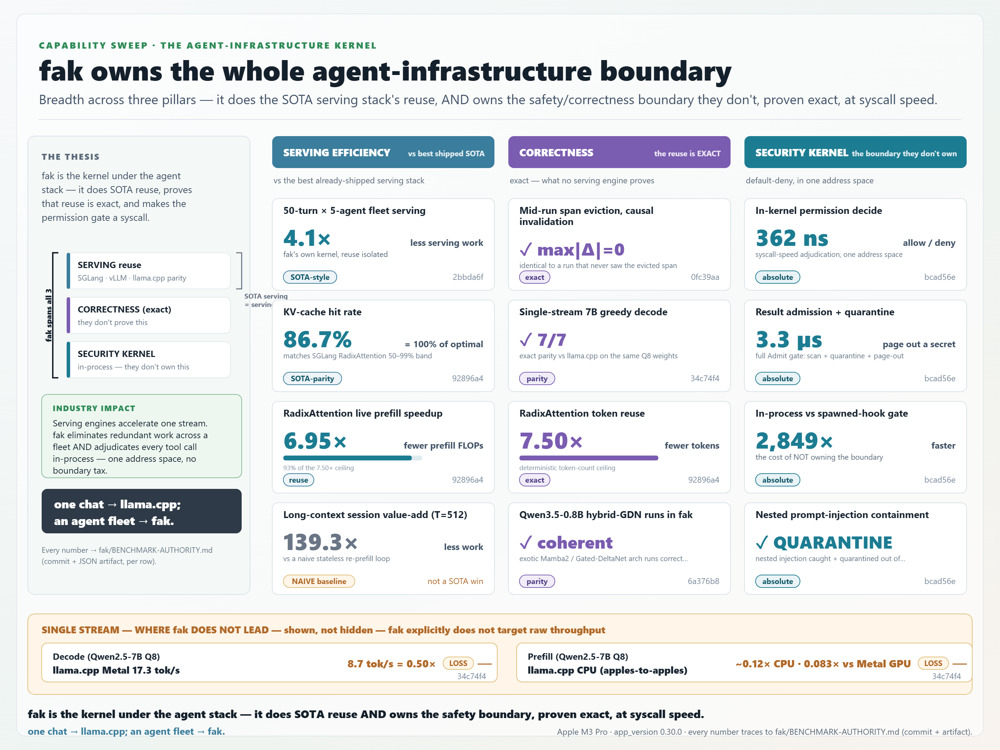
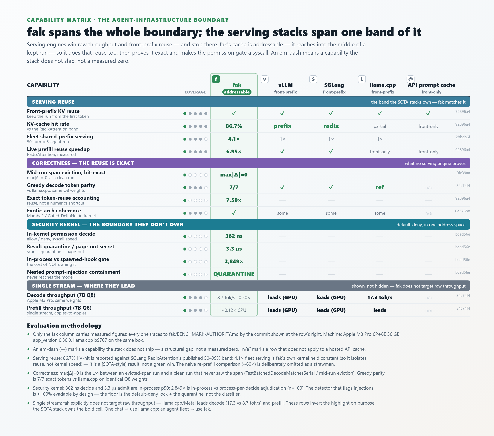
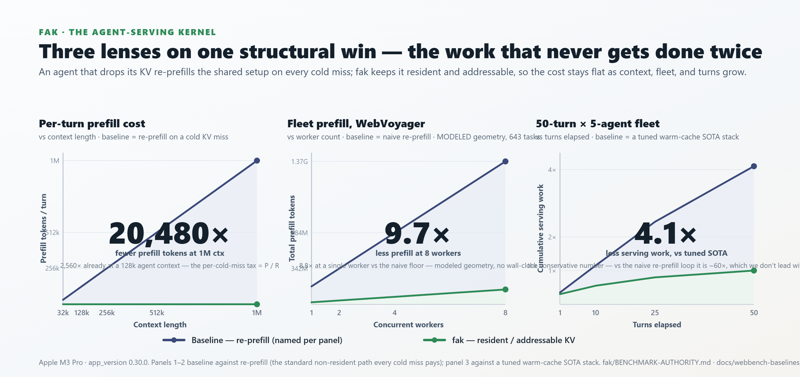
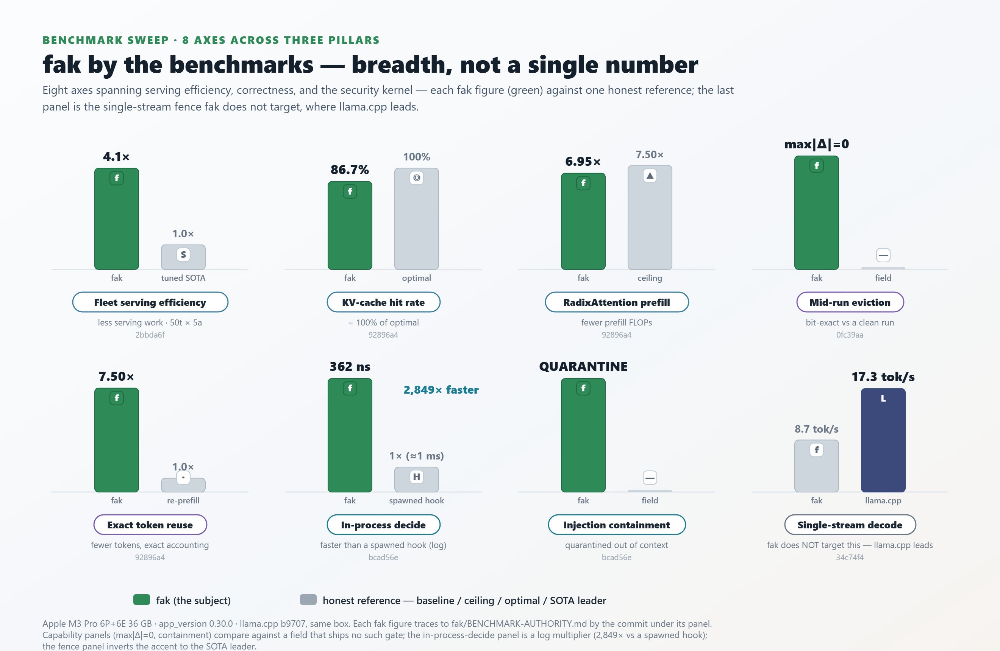

# The benchmark gallery — fak, the way a lab ships a model card

Four headline visuals, in the visual grammar a frontier lab releases a model with —
adapted to fak's context. They are **not hand-drawn**: each is generated from one
source-of-truth JSON by a pure-stdlib Python renderer, with a `--check` drift gate in CI
and a honesty-guard test suite, so a number can never change in a picture without
changing in the data (and its commit) first.

Every figure traces to **[BENCHMARK-AUTHORITY.md](BENCHMARK-AUTHORITY.md)** by commit.
The framing law is the same one the rest of the repo follows: compare only against the
**best already-shipped SOTA**, state the absolute number first, mark a `[NAIVE]`
baseline so it can never read as a SOTA win, and show the single-stream throughput fak
**does not** target — where llama.cpp leads — in the same frame, never hidden.

Each visual ships as a **PNG** — the bullet-proof artifact that renders in any markdown
viewer (a standalone `.svg` can preview as whitespace in a non-browser renderer) — plus
its crisp **SVG** vector source. The PNGs are rasterized from the SVGs by
[`visuals/render-hero-pngs.sh`](visuals/render-hero-pngs.sh); re-run it after
regenerating any hero SVG.

| # | Visual | The reference grammar it borrows | What it shows |
|---|--------|----------------------------------|---------------|
| 55 | Benchmark breadth card | model "stats card" (Anthropic / MLPerf) | the three pillars + the honest single-stream fence, on one card |
| 59 | Capability matrix | the model-vs-model comparison table | fak spans the whole boundary; the serving stacks span one band of it |
| 60 | Turn-tax curves | the attention-efficiency 3-panel chart | re-prefill cost is linear; resident, addressable KV is not |
| 61 | Benchmark sweep | the per-benchmark bar grid | eight axes across the three pillars, fak vs one honest reference each |

---

## 55 · Benchmark breadth card

A capabilities sweep across the three pillars fak spans — **serving efficiency**,
**correctness** (the reuse is bit-exact — the thing no serving engine proves), and a
**security kernel** (default-deny, at syscall speed) — with the single-stream rows it
does not target shown below the line. The `4.1×` is `[SOTA-style]` (its baseline is
fak's own kernel held constant, isolating reuse, not kernel speed), never a green win;
the seductive `139.3×` is greyed and `[NAIVE]`-tagged.

- **Regenerate:** `python tools/hero_statcard_gen.py` · **data:** `tools/hero_statcard.data.json` · **vector:** [55-hero-statcard.svg](visuals/55-hero-statcard.svg)

## 59 · Capability matrix

fak's analog of the model-comparison table: capabilities grouped by category down the
left, the serving stacks (`vLLM`, `SGLang`, `llama.cpp`, an API prompt cache) across the
top, the **fak column washed and highlighted**. Each column carries its *type* — fak is
**`addressable`** (it reaches into the middle of a kept run), the serving stacks are
`front-prefix` / `front-only` — the one-word statement of why fak owns rows they can't.
Every row has an inline **coverage pip-strip** (one pip per stack, filled if shipped): the
security and correctness rows visibly carry a single green pip — the moat, at a glance.
fak carries a value in every row; the serving stacks carry an honest **em-dash** outside
the serving band — "not a capability that stack ships," **not a measured zero**. Only
fak's column carries measured numbers; competitor cells are coverage marks, never
fabricated figures. The single-stream fence **inverts** the highlight to the SOTA leader.

- **Regenerate:** `python tools/hero_matrix_gen.py` · **data:** `tools/hero_matrix.data.json` · **vector:** [59-hero-capability-matrix.svg](visuals/59-hero-capability-matrix.svg)

## 60 · Turn-tax curves

Three lenses on one structural win, in the grammar of an attention-efficiency chart: a
baseline curve that rises ~linearly and a fak curve that stays ~flat, the gap shaded, one
big multiplier per panel. The shape is real, not stylised — re-prefill cost **is** linear
in context / fleet / turns, and resident, addressable KV is not. Each panel names its own
baseline: a structural per-cold-miss tax (vs re-prefill), a **modeled** WebVoyager
elimination vs the naive floor (`9.7×`, 643 tasks), and the conservative `4.1×` vs a tuned warm-cache SOTA
stack (the `~60×` vs naive is mentioned only as the thing we *don't* lead with).

- **Regenerate:** `python tools/hero_turntax_gen.py` · **data:** `tools/hero_turntax.data.json` · **vector:** [60-hero-turntax-curves.svg](visuals/60-hero-turntax-curves.svg)

## 61 · Benchmark sweep

fak's analog of the per-benchmark bar grid: eight panels across the three pillars + a
fence, each a grouped bar chart with **fak in the bright accent** against one honest
reference (a tuned-SOTA baseline, a deterministic ceiling, the optimal, a spawned hook,
or — for the two capability panels — a field that ships no such gate). The final panel is
the single-stream fence and **inverts** the accent: `llama.cpp` owns the tall bar, fak
shows its honest lower number.

- **Regenerate:** `python tools/hero_sweep_gen.py` · **data:** `tools/hero_sweep.data.json` · **vector:** [61-hero-benchmark-sweep.svg](visuals/61-hero-benchmark-sweep.svg)

---

### Why generated, not drawn

A hand-made chart rots the moment a benchmark moves: the number in the picture and the
number in the data drift apart silently, and a reader has no way to tell. These four are
each one `data.json` → one renderer → one `.svg` (→ one rasterized `.png`), with:

- a **`--check`** mode that fails CI if the committed SVG no longer matches the data, and
- a **honesty-guard test** (`tools/hero_*_gen_test.py`) that asserts the structural
  invariants hold — breadth not a single number, the `[NAIVE]` row fenced from the SOTA
  rows, competitor cells never carrying a fabricated number, the single-stream fence
  inverted and visible, every figure carrying a commit.

So "generated, not hand-maintained" is *enforced*, not a promise. To change a number,
edit the data file (and land the commit it cites), then re-run the generator — the
picture follows, or CI stops the build.

> Machine: Apple M3 Pro 6P+6E 36 GB · app_version 0.30.0 · llama.cpp b9707, same box.
> Every figure → [BENCHMARK-AUTHORITY.md](BENCHMARK-AUTHORITY.md) (commit + artifact).
