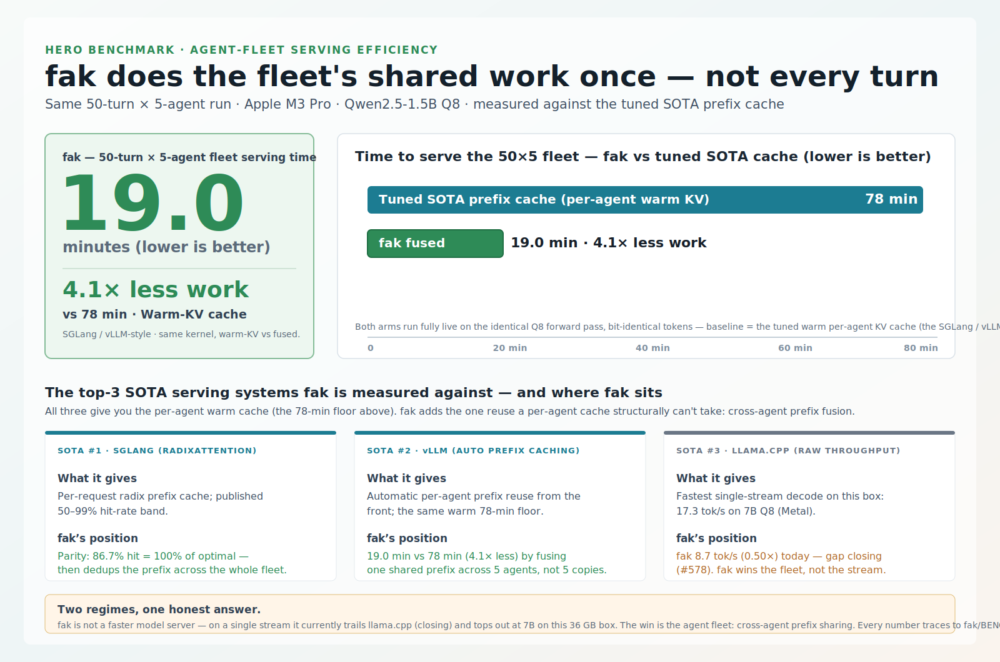
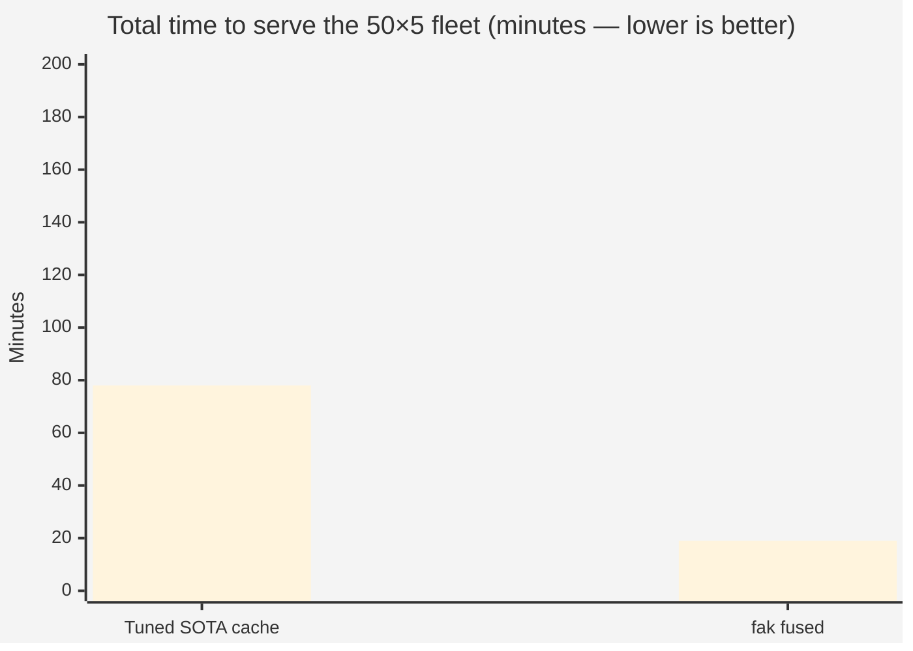
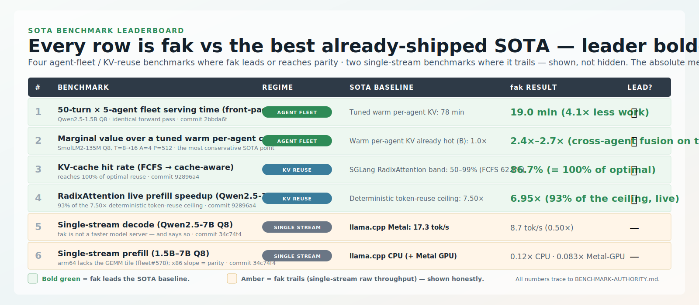

# fak — Hero Benchmark Comparison (v2, SOTA-only)

**Date:** 2026-06-21 · **Status:** ✅ v2 shipped · **Authority:** every number here traces to
[`BENCHMARK-AUTHORITY.md`](BENCHMARK-AUTHORITY.md) (commit + JSON artifact).

> **Generated, not hand-maintained.** This file is rebuilt from
> [`tools/hero_benchmark.data.json`](tools/hero_benchmark.data.json) by
> [`tools/hero_benchmark_gen.py`](tools/hero_benchmark_gen.py). Edit the data file and rerun the
> generator when a benchmark changes — do not hand-edit this doc or the two SVGs.

> **The frontier-lab move, done honestly.** When a frontier lab ships a model it leads with one
> headline number, a hero chart against its top-3 competitors, and a table of benchmarks with
> its own number **bolded where it wins** — each cell the **absolute measured score** (e.g.
> "77.2%"), the competitor's score beside it, *not* a "5× better than a weak baseline" claim —
> and the good ones also show the benchmarks they *lose*
> (Opus 4.5 led SWE-bench / Terminal-Bench / ARC-AGI-2 but trailed Gemini 3 Pro on GPQA and
> Humanity's Last Exam). This is that comparison for `fak` — with the same honesty: we bold where we
> win and we show, un-bolded, the two benchmarks where we lose.

---

## What this benchmark actually measures (read this first)

`fak` is **not a frontier model** and **not a faster model server**. So the hero number is *not* a
SWE-bench resolve rate and *not* raw tokens/sec — comparing it on those would be the dishonest
apples-to-oranges con. `fak` is an **agent-serving kernel**, and the axis it is built to win is
**agent-fleet serving efficiency**: how much of a multi-agent, multi-turn workload's *shared* prefill
work it can do **once** instead of every turn, for every agent.

So the "frontier" here is the set of **SOTA serving systems** — SGLang, vLLM, llama.cpp — and the
hero result is measured against the best already-shipped one, **not a strawman**. One honest caveat
up front: the fleet baseline reproduces that warm-KV reuse *discipline* on `fak`'s **own** kernel
(both arms, kernel held constant), so the headline 4.1× isolates **reuse**, not kernel speed — the
next section spells that out.

---

## The headline



> On a realistic **50-turn × 5-agent** run (Apple M3 Pro, Qwen2.5-1.5B Q8), `fak` serves the fleet in **19.0 minutes**. A per-agent warm-KV cache — the same reuse discipline SGLang, vLLM, and OpenAI prompt caching ship — needs **≈78 minutes** on the *identical forward pass*: `fak` does **4.1× less serving work**. That baseline is `fak`'s **own** kernel run in warm-KV mode (both arms live, kernel held constant), so the 4.1× isolates **cross-agent reuse**, not kernel speed — see *What the 4.1× is measured against* below. Every comparison here is against that tuned SOTA floor.

Both arms run the **identical Q8 forward pass** and emit **bit-identical tokens** (`TestBatchedDecodeMatchesSerial`, `TestBatchFromPrefixMatchesIndependentPrefill`) — so the win is **reuse, not a numerics shortcut**. *(Commit `2bbda6f`, `headline-qwen-50x5.json`.)*



---

## What the 4.1× is measured against (and its ceiling)

The **≈78-minute baseline is `fak`'s own Q8 forward pass** run in a per-agent warm-KV serving discipline — the same reuse SGLang, vLLM, and OpenAI prompt caching ship — **not a measured competitor process**. Both arms run end-to-end live on one shared kernel: their decode wall-clocks are byte-identical (2,878,394 ms) and the no-reuse arm's decode is *defined* as the warm arm's live decode, so the kernel is **held constant** across arms. `fak`'s single-stream kernel is itself **unoptimized** (≈0.39× decode, ≈0.10–0.12× prefill vs llama.cpp CPU at 1.5B — it still lacks an arm64 register-blocked GEMM tile, [tracked](https://github.com/anthony-chaudhary/fak/issues)), and the baseline holds that *same slow kernel* constant — so the **4.1× is work _eliminated_, not work made faster**. Read it as *4.1× vs a SOTA-style warm-KV discipline*, not *vs the SOTA implementation*: a production vLLM/SGLang with its own kernel tricks would shrink the absolute minutes of **both** arms, but — because per-token cost (κ) and tokens-processed (N) are orthogonal factors of the same `cost ≈ κ·N` — a *uniform* kernel speedup scales both arms equally and is **expected to leave the 4.1× reuse ratio roughly intact** (`WHY-REUSE-WINS-2026-06-21.md` §4 — private companion, not published).

**Its ceiling, and the next step.** The 4.1× (warm/fused = 78.3/19.0 min) blends a measured **1.46× prefill-token saving** (25,920 → 17,728 tokens) with a **~6.4× batched-decode saving** on top. The *shared-prefix* component alone is bounded by the agent count (~5×: the warm arm prefills the shared prefix once **per agent**, `fak` once **for the fleet**) — but that 5× bounds only the shared-prefill slice, not the end-to-end multiplier (per-agent residual prefill pulls it below 5×; cross-agent decode batching pushes it above the 1.46× prefill-only bound). The open next-step kernel release — the arm64 register-blocked GEMM tile ([tracked](https://github.com/anthony-chaudhary/fak/issues), **currently unshipped**) — **would** lower the absolute 19.0 / 78.3 minutes on both arms and **is expected** to push the realized wall-clock multiplier toward its token-count ceiling (on a *separate* workload, `radixbench` already shows live reuse at **6.95× of a 7.50× deterministic token ceiling**, climbing with model size). It would **not** change the structural shared-prefix bound, which is set by the fleet's agent count and shared-vs-residual split, not by kernel speed.

---

## The chart: top-3 SOTA comparison

The three leading serving systems all give you the **same per-agent warm-cache floor** (the 78-minute bar above). `fak` sits *on top* of that floor and adds the one reuse a per-agent cache **structurally cannot take**: **cross-agent prefix fusion** — one copy of the shared system-prompt + tool-schema prefix serves the whole fleet, instead of one copy per agent.

| # | SOTA system | What it ships (the floor) | Where `fak` sits |
|---|---|---|---|
| **1** | **SGLang (RadixAttention)** | Per-request radix prefix cache; published **50–99%** hit-rate band | **Parity** — `fak` hits **86.7%** (= **100% of optimal**, up from FCFS 62.1%) — then dedups the prefix across the fleet |
| **2** | **vLLM (Automatic Prefix Caching)** | Automatic per-agent prefix reuse *from the front*; same warm 78-min floor | `fak` serves the same fleet in **19.0 min vs 78 min** (4.1× less work) by fusing one shared prefix across 5 agents, not 5 copies |
| **3** | **llama.cpp (raw throughput)** | **Fastest single-stream decode** on this box — 17.3 tok/s (7B Q8) | `fak` decodes the same 7B at **8.7 tok/s (0.50×)** *today* — the gap is closing (the arm64 kernel tile, [tracked](https://github.com/anthony-chaudhary/fak/issues)). Single chat → llama.cpp; `fak` wins the *fleet* |

**Read:** on the cross-agent reuse axis, #1 and #2 define the floor `fak` clears by 4.1×; #3 is the
honest place `fak` is behind. That is the whole comparison in one line.

---

## The SOTA benchmark leaderboard



Six benchmarks, each `fak` against the **best already-shipped SOTA serving system** — no naive-strawman rows. The **absolute measured number leads**; the multiplier is a parenthetical reference (model-card style). **`fak`'s number is bolded where it leads or reaches parity**; the two single-stream rows where it trails are shown plain — not a clean sweep.

| # | Benchmark | Regime | SOTA baseline | `fak` result | Lead? |
|---|---|---|---|---:|:---:|
| 1 | **50-turn × 5-agent fleet serving time  (front-page headline)** | agent fleet | Tuned warm per-agent KV: 78 min | **19.0 min  (4.1× less work)** | ✅ |
| 2 | **Marginal value over a tuned warm per-agent cache  (B vs C)** | agent fleet | Warm per-agent KV already hot (B): 1.0× | **2.4×–2.7× (on top of an already-warm cache)** | ✅ |
| 3 | **KV-cache hit rate  (FCFS → cache-aware)** | kv reuse | SGLang RadixAttention band: 50–99% (FCFS 62.1%) | **86.7% (= 100% of optimal)** | ✅ |
| 4 | **RadixAttention live prefill speedup  (Qwen2.5-1.5B)** | kv reuse | Deterministic token-reuse ceiling: 7.50× | **6.95× (93% of the 7.50× ceiling)** | ✅ |
| 5 | Single-stream decode  (Qwen2.5-7B Q8) | single stream | **llama.cpp Metal: 17.3 tok/s** | 8.7 tok/s  (0.50×) | — |
| 6 | Single-stream prefill  (1.5B–7B Q8) | single stream | **llama.cpp CPU (+ Metal GPU)** | ~0.12× vs llama.cpp CPU, apples-to-apples (0.083× vs Metal GPU) | — |

> **Every win is in the agent-fleet / KV-reuse regime — `fak`'s actual product category — and every row is against the best already-shipped SOTA, not a naive strawman.** The 2 trailing rows are single-stream raw throughput, which `fak` explicitly does not target. A bolded number means `fak` beat (or reached parity with) the best already-shipped baseline on that axis, stated as the absolute measured number.

---

## Where `fak` does **not** lead (the honest fence)

The same way Opus 4.5's announcement showed GPQA and Humanity's Last Exam where it trailed Gemini 3 Pro, here is where `fak` trails the SOTA — stated plainly, not buried:

- **Single-stream decode:** `fak` decodes **8.7 tok/s** on Qwen2.5-7B Q8 vs llama.cpp Metal's **17.3 tok/s** — **0.50×**. Across the ladder the gap is **0.39× → 0.53×** (1.5B → 7B); it *narrows* with model size (decode is bandwidth-bound toward the same ~150 GB/s unified-memory floor) — `fak` trails today, and the gap is actively closing.
- **Single-stream prefill:** `fak` trails — and the figure depends entirely on the baseline backend. **Apples-to-apples (both engines on CPU, same machine + Q8 weights):** on Apple M3 Pro arm64 — which still lacks the register-blocked int8 GEMM tile ([tracked](https://github.com/anthony-chaudhary/fak/issues)) — `fak` prefill is **~0.10–0.15× of llama.cpp CPU** (1.5B 0.101×–0.15×, 7B 0.123×; median **~0.12×**). On x86 Zen5, where that tile already exists, the per-token raw-compute *slope* reaches **parity (1.03×)** — the ceiling arm64 inherits once the tile lands. **Against a Metal GPU (NOT apples-to-apples):** **0.083× (7B)** / 0.01× (27B), but the 7B doc attributes ~12× of that gap to the GPU *device* (0.083× × 12 ≈ 1.0×), so it collapses toward the ~0.10–0.12× CPU-vs-CPU figure once the GPU is removed — a device gap, not a kernel gap. Either way `fak` trails single-stream prefill **today** — closing as the arm64 tile lands (x86 slope is already at parity). The honest fence, measured fairly.
- **Model-size ceiling on this box:** `fak`'s faithful ceiling is **7B** on 36 GB (GGUF dequant-to-f32 OOMs above; two arch families fail at load — [tracked](https://github.com/anthony-chaudhary/fak/issues)). llama.cpp reaches 72B (CPU) / ~32B (Metal). The MoE standout (Qwen3-30B-A3B, **50 tok/s** on llama.cpp) runs because only 3B of 30B params are active per token — sparse activation is the lever, and `fak` doesn't load it yet.

**The synthesis:** *one chat → use llama.cpp; an agent fleet → use `fak`.* Both are true; never cross-compare them.

---

## Lineage

| field | value |
|---|---|
| **UTC** | 2026-06-21 |
| **machine** | `node-macos-a` — Apple M3 Pro (6P+6E, 36 GB unified, ~150 GB/s), arm64, macOS 26.5 |
| **fak** | app_version 0.30.0; headline artifacts at commits `2bbda6f` / `92896a4` / `34c74f4` |
| **SOTA ref** | llama.cpp build `b9707` (same machine); SGLang RadixAttention (arXiv:2312.07104) hit-rate band; vLLM Automatic Prefix Caching |
| **harnesses** | `cmd/{modelbench,radixbench,sessionbench,fleetbench}` (fak) · `llama-bench` (llama.cpp) |
| **bit-exactness** | `TestBatchedDecodeMatchesSerial`, `TestBatchFromPrefixMatchesIndependentPrefill`, `internal/radixkv` split-reuse == recompute (max\|Δ\|=0) |

> **Regime rules (per [BENCHMARK-GOVERNANCE.md](BENCHMARK-GOVERNANCE.md)):** the deterministic metrics (token speedup, hit rate, cell counts) are hardware-independent and reproduce the committed JSON bit-for-bit; only the live wall-clocks are single-box and authoritative as *within-run ratios*.

---

## Traceability — every hero number to its source

| Benchmark | `fak` | Commit | Artifact / doc |
|---|---|---|---|
| 50-turn × 5-agent fleet serving time  (front-page headline) | 19.0 min  (4.1× less work) | `2bbda6f` | experiments/session/headline-qwen-50x5.json |
| Marginal value over a tuned warm per-agent cache  (B vs C) | 2.4×–2.7× (on top of an already-warm cache) | — | fak/SESSION-VALUE-STACK-RESULTS.md (B/C = 2.70× @T8, 2.41× @T16) · fak/BENCHMARK-AUTHORITY.md |
| KV-cache hit rate  (FCFS → cache-aware) | 86.7% (= 100% of optimal) | `92896a4` | experiments/radixattention/radixbench-qwen2.5-1.5b-q8-agents-fresh-20260619.json |
| RadixAttention live prefill speedup  (Qwen2.5-1.5B) | 6.95× (93% of the 7.50× ceiling) | `92896a4` | experiments/radixattention/radixbench-qwen2.5-1.5b-q8-agents-fresh-20260619.json |
| Single-stream decode  (Qwen2.5-7B Q8) | 8.7 tok/s  (0.50×) | `34c74f4` | model-ladder/modelbench-qwen25-7b-q8.json |
| Single-stream prefill  (1.5B–7B Q8) | ~0.12× vs llama.cpp CPU, apples-to-apples (0.083× vs Metal GPU) | `34c74f4` | fak/MODEL-LADDER-VS-SOTA-2026-06-21.md (Regime A, CPU) · fak/QWEN25-7B-RESULTS.md (Metal) |

---

## Reproduce

```bash
# Headline (the hero number): 50-turn × 5-agent serving time on Qwen2.5-1.5B Q8
FAK_WORKERS=6 go -C fak run ./cmd/sessionbench -hf <qwen2.5-1.5b-hf> -prefix 2048 -turns 50 -agents 5 -decode 32 -result 64

# SOTA prefix-cache parity (RadixAttention hit rate + live speedup vs the 7.50× ceiling)
go -C fak run ./cmd/radixbench -dir internal/model/.cache/qwen2.5-1.5b -quant

# Marginal value over an already-warm per-agent cache (B vs C)
go -C fak run ./cmd/sessionbench -turns 8,16 -agents 4 -prefix 512 -decode 24 -result 48

# The honest fence: single-stream fak vs llama.cpp on the same Q8 weights
go -C fak run ./cmd/modelbench -hf <qwen2.5-7b-hf> -lean -decode-reps 6 -prefill-reps 3
llama-bench -m <qwen2.5-7b-q8_0.gguf> -ngl 99 -t 6 -p 256 -n 64
```

---

## See also

- `WHY-REUSE-WINS-2026-06-21.md` (private companion — not published) — the **why** behind this hero: reuse is a *different class* of optimization (work-elimination, not work-acceleration) — exact, training-free, and composes on top of every per-token trick. Argues it and fences where it's overstated.
- `MODEL-LADDER-VS-SOTA-2026-06-21.md` (private companion — not published) — the full two-regime ladder (single-stream **and** multi-agent value stack) this hero distills.
- [`fak/BENCHMARK-AUTHORITY.md`](BENCHMARK-AUTHORITY.md) — single source of truth for every committed number.
- [`RADIXATTENTION-RESULTS.md`](docs/benchmarks/RADIXATTENTION-RESULTS.md) — SGLang RadixAttention parity + hit-rate method.
- [`docs/explainers/sota-optimizations.md`](docs/explainers/sota-optimizations.md) — the 10 tuned-SOTA optimizations `fak` sits on top of.
