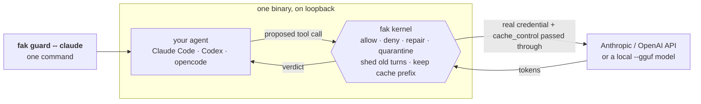
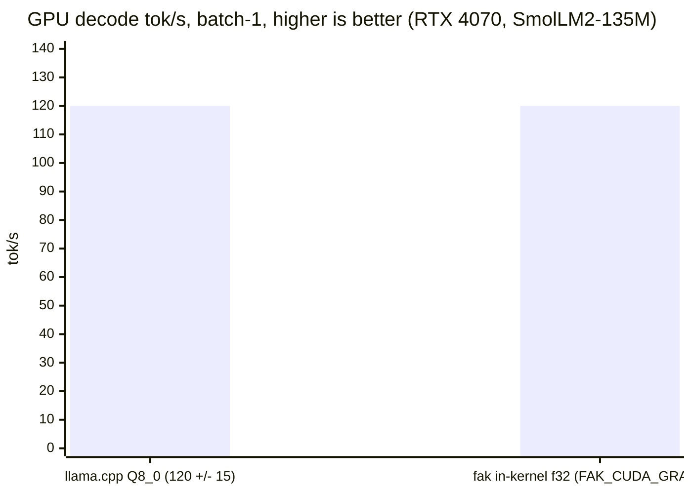
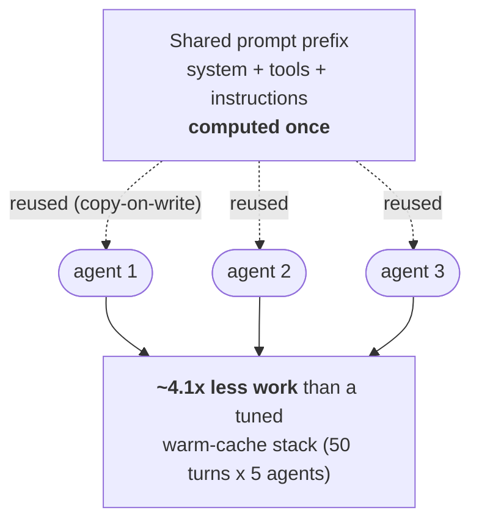
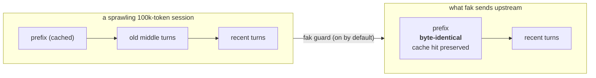

# fak — the **F**used **A**gent **K**ernel

[](https://github.com/anthony-chaudhary/fak/actions/workflows/ci.yml) [](https://github.com/anthony-chaudhary/fak/actions/workflows/cross-platform.yml) [](https://github.com/anthony-chaudhary/fak/actions/workflows/bench.yml) [](https://github.com/anthony-chaudhary/fak/actions/workflows/release-cadence.yml) [](https://github.com/anthony-chaudhary/fak/actions/workflows/release-artifacts.yml)

<!-- readme-verified: 2026-06-30 vs VERSION 0.36.0 + BENCHMARK-AUTHORITY · process: tools/readme_freshness_audit.py + /refresh-readme. Restructured 2026-06-29 to lead with the `fak guard` + API getting-started path, then the in-kernel model, then the performance value proposition; 2026-06-30 added the CI/CD ship-loop front-door note. Front-page overflow lives in docs/README-legacy.md; previous snapshot in docs/archive/README-2026-06-25-before-fresh-start.md. -->

**fak in one line:** fak is a fused agent kernel: one Go binary that sits in front of an
agent's tool calls, checks each call, and reuses the stable work in long sessions so the same
agent loop is safer, cheaper, and faster.

**Put one binary in front of the agent you already run — Claude Code, Codex, Cursor, or any OpenAI / Anthropic / MCP client — and the same long session gets cheaper and faster, with nothing else changed.**

`fak guard -- claude` wraps your normal agent in one command. It keeps your model, your IDE,
and your keys exactly as they are. You get back the parts of the agent loop that got
expensive. `fak` points one base URL at itself for you; nothing else in your setup changes.

**What you get, in numbers.** Every figure traces to
[BENCHMARK-AUTHORITY.md](BENCHMARK-AUTHORITY.md), and the honesty ledger is
[CLAIMS.md](CLAIMS.md):

- **~4.1× less work than a tuned warm-cache stack** on a 50-turn × 5-agent run. `fak` reuses
  the shared prompt prefix across agents (the system prompt + tools, the *KV cache* of the
  work so far) instead of re-paying for it. That reuse factor climbs to **6.95×** across the
  model ladder. (Against the naive re-send loop it is ~60×; the tuned number is the honest
  one to beat.)
- **~120 tok/s in-kernel GPU decode** on an RTX 4070 (SmolLM2-135M, f32 weights, gated
  `FAK_CUDA_GRAPH=1`), landing inside llama.cpp's Q8_0 range of 120 ± 15 tok/s — so a
  full-precision kernel **reaches parity with a quantized llama.cpp**.
- **The provider cache discount survives a long session.** `fak` sheds old turns while
  keeping the prompt-cache prefix byte-identical, so the rebate holds instead of breaking
  the moment the conversation sprawls.
- **The guard tax is ~362 ns per call.** The kernel's allow/deny decision runs in-process
  (measured, Apple M3 Pro), not as a network hop.

> **fak in one line:** put `fak` in front of the agent you already run. It makes long
> sessions cheaper, routes each call to the right model, and on the same boundary enforces a
> safety floor and records every decision. One binary, no rewrite, no key to start.

**Who is this for?** Pick your path: [run your agent through it now](#get-started-with-fak-guard)
· [run the modular Colab quickstart](https://colab.research.google.com/github/anthony-chaudhary/fak/blob/main/notebooks/fak-quickstart.ipynb) ·
[run a model in the kernel](#run-the-model-in-the-kernel) ·
[the performance story](#the-performance-value-proposition) ·
[a hard security floor](#for-security-teams).

## Get started with `fak guard`

The lowest-friction path: wrap the agent you already run in one command. No rewrite, no
config edit, no second terminal.

```bash
fak guard -- claude                                   # your Claude Code, on your Pro/Max subscription — no API key needed
fak guard --api-key-env ANTHROPIC_API_KEY -- claude   # use Anthropic API billing instead
fak guard --provider openai --api-key-env OPENAI_API_KEY -- opencode   # an OpenAI-compatible agent
```

`fak guard` starts a gateway in-process on a loopback port and injects the base URL into the
child process only, so your shell and other terminals are untouched. It forwards your real
upstream credential (and the `cache_control` prompt-cache breakpoints) byte-for-byte, so
there is no cost regression. On the same boundary it checks every tool call the agent
proposes against a built-in secure capability floor (a default-deny allow-list). When the
agent exits it prints what the kernel decided:

```
fak guard: 131 kernel decision(s) — 121 allowed, 5 denied, 2 repaired, 0 quarantined, 3 deferred
```



For Claude Code, `fak guard` uses your logged-in subscription by default, so no API key is
required. The full walkthrough includes an end-to-end proof that a real `/v1/messages` turn
crossed the gateway over your subscription:
[docs/integrations/claude.md](docs/integrations/claude.md).

### See a real number — no key, no model, no GPU

Installed the binary (see [Install](#install))? These run from the bare binary anywhere,
with no clone, no key, no model, and no GPU:

```bash
fak routebench                  # -> COST / LATENCY / QUALITY delta: per-aspect routing vs a one-model baseline
fak benchmarks list --offline   # -> the zero-asset benchmark set you can run right now
```

`fak routebench` replays a built-in 8-case corpus through a routing policy versus a
single-model baseline. On the demo corpus it prints `routed is ~20% cheaper, ~10% less total
compute, quality tied`. That is a deterministic offline lens, not a bill, and the fastest
way to see the kernel do something real before you wire it to anything.

Prefer a hosted run with expected-state checks? Open the
[modular Colab quickstart](https://colab.research.google.com/github/anthony-chaudhary/fak/blob/main/notebooks/fak-quickstart.ipynb):
policy proof, HTTP tool-call checking, offline value measurement, and an optional T4-backed
Ollama gateway case.

## Run the model in the kernel

`fak guard` is happiest in front of a frontier API, but the kernel can *be* the model host
too. `fak guard --gguf` loads a local GGUF model in-process, with no API key, no network,
and no second server:

```bash
fak guard --gguf qwen2.5:7b -- claude                       # local model in-kernel, your data never leaves the box
FAK_GGUF_LOAD_WORKERS=8 fak guard --gguf qwen2.5:7b --backend cuda -- claude   # decode on GPU
```

The kernel owns the KV cache (the per-token scratchpad), so the same reuse and quarantine
machinery applies to a local model as to a proxied one. On the gated reusable-CUDA-graph
path, fak's f32 in-kernel decode lands inside llama.cpp's Q8_0 band, reaching parity with a
quantized baseline at full precision:



Both land at ~120 tok/s: fak's f32 figure (119–120) sits inside llama.cpp's Q8_0 band of
120 ± 15. The number and its f32-vs-Q8_0 framing trace to
[docs/benchmarks/LLAMACPP-HEADTOHEAD-RESULTS.md](docs/benchmarks/LLAMACPP-HEADTOHEAD-RESULTS.md).

The honest fence: small local models are a quality ramp. A 7B model answers simple,
well-formed tasks but is not a frontier coder. Reach for `--gguf` for offline, air-gapped,
or privacy-bound work, and use the proxy path (`fak guard -- claude`) when you want the best
reasoning. Local-model build tags and GPU flags:
[docs/integrations/claude.md](docs/integrations/claude.md).

## The performance value proposition

A long agent session burns money re-solving the same setup. A 100k-token Claude Code
conversation re-sends its *whole* transcript every single turn, and a 5-agent fleet pays for
the same shared system prompt five times over. `fak` does the shared work **once**.

**Reuse the shared prefix across agents.** The system prompt, the tool table, and the
instructions are identical for every agent in a fleet. `fak` computes that prefix once and
reuses it (copy-on-write) for all of them, so a 50-turn × 5-agent run does **~4.1× less work
than a tuned warm-cache stack** (the prefix-reuse factor itself climbs to **6.95×** across
the model ladder).



**Shed history without losing the cache hit.** This is where most of the cost goes. Once a
conversation sprawls past ~48k resident tokens, `fak guard` (on by default) drops the old
middle turns. It copies the provider's cache prefix through byte-for-byte, so the prompt-cache
discount holds instead of breaking. The obvious alternative, summarizing the old turns,
rewrites the prompt and busts the cache, so it costs *more*. On any doubt `fak` forwards the
original prompt unchanged, and relays the provider's own `cache_read` number rather than
claiming the hit.



Tighten it with one flag, or pass `0` to disable:

```bash
fak guard --compact-history-budget 8000 -- claude   # tighter than the ~48k default
```

How and why, with the metrics:
[docs/explainers/long-sessions-keep-the-cache-hit.md](docs/explainers/long-sessions-keep-the-cache-hit.md).
The kernel also reports live prefill vs decode tok/s on `/metrics`, so a slow first request
gets an answer instead of a shrug. Want the trend - is the cache method actually paying off
over time? [docs/cache-value-rollup.md](docs/cache-value-rollup.md) explains the dogfooded
ledger roll-up and the shipped Track-1 witness (`fak nightrun score --json`). Want the
operating board that keeps the multi-agent reuse, O(1) context/query, provider-cache, and
KV-deletion work on the product path? See
[docs/CACHE-FRONTIER-OPERATING-PLAN.md](docs/CACHE-FRONTIER-OPERATING-PLAN.md).

## More ways to run it

`fak guard` is per-session and the right default. When you want something else:

- **Always-on gateway — `fak node`.** Install `fak serve` as a real system service (macOS
  launchd, Linux systemd `--user`, Windows Scheduled Task), connect a client to it from a
  phone or a second machine, and tear it down. Same five commands whether the node is local
  or fleet-wide. The upstream credential lives on the host; clients present only the
  gateway's bearer key. See [docs/fak/node-setup.md](docs/fak/node-setup.md).
- **Codex, Cursor, MCP hosts.** Keep your normal model wire but let the agent ask the kernel
  for verdicts over MCP: `fak serve --stdio --policy examples/dev-agent-policy.json` exposes
  five kernel tools (`fak_adjudicate`, `fak_syscall`, `fak_admit`, `fak_context_change`,
  session reset). See [docs/integrations/openai-codex.md](docs/integrations/openai-codex.md),
  [docs/integrations/cursor.md](docs/integrations/cursor.md), and [examples/mcp](examples/mcp).
- **Any OpenAI- or Anthropic-compatible client.** Put `fak serve` in front of a model
  endpoint and point the client at it:

  ```bash
  fak serve --addr 127.0.0.1:8080 \
    --base-url http://localhost:11434/v1 --model qwen2.5:1.5b \
    --policy examples/dev-agent-policy.json
  ```

  OpenAI traffic goes to `http://127.0.0.1:8080/v1`, Anthropic Messages to the bare host.
  Harden with `--require-key-env FAK_TOKEN` and scrape `/metrics`. See
  [GETTING-STARTED.md](GETTING-STARTED.md) and
  [docs/fak/api-reference.md](docs/fak/api-reference.md).

## Benchmarks, in one page

The rule is simple: every number traces to
[BENCHMARK-AUTHORITY.md](BENCHMARK-AUTHORITY.md). The ones worth remembering:

- 50-turn × 5-agent Qwen2.5-1.5B authority row: 4.1× vs a tuned warm-cache stack (prefix
  reuse climbs to 6.95× across the model ladder). Larger figures are fenced as vs-naive.
- GPU decode on the gated reusable-CUDA-graph path (`FAK_CUDA_GRAPH=1`): ~120 tok/s on an
  RTX 4070 (SmolLM2-135M, f32), inside llama.cpp's Q8_0 band of 120 ± 15 tok/s.
- Native in-kernel continuous batching: 1.54× req/s at 8-way batch (synthetic CPU witness)
  vs the legacy per-request lifecycle.
- WebVoyager geometry model: 8-worker fleet prefill is 1.10× less work than tuned per-agent
  KV (9.7× less than the naive re-prefill floor). Modeled prefill-token work, not wall-clock.
- Pure-kernel decide latency: 362 ns per allow decision; the read-path floor is ~0.55 ns/op,
  flat from 1 to 1000 registered drivers.

Use vLLM or SGLang for raw token serving. Put `fak` on the agent boundary for reuse, routing,
audit, and the capability floor.

## What the kernel does

| Surface | What it gives you | Status |
|---|---|---|
| `fak guard` | Drop-in guard around an existing CLI agent | shipped |
| `fak node` | Install/connect an always-on `fak serve` gateway as a system service | shipped |
| `fak console` | Native operator/client panes for issues, live sessions, guard artifacts | shipped |
| `fak serve` | OpenAI, Anthropic, fak-native HTTP, plus MCP over HTTP/stdio | shipped |
| Capability floor | JSON allow/deny manifest with closed refusal reasons | shipped |
| Result quarantine | Secret, poison, oversize, and pollution results held out of context | shipped |
| Audit/metrics | JSON logs, optional hash-chained journal, Prometheus, `/debug/vars` | shipped |
| Session control | Budgets, reset directives, cooperative MCP reset, live session state | shipped |
| Model routing | Per-aspect routing, ensembles, routebench, gateway seam | shipped spine |
| In-kernel model | Pure-Go reference model, kernel-owned KV cache, GPU/backend witnesses | correctness/reference path |
| Cross-platform spine | One kernel across the deployment substrate (IoT → edge → laptop → hyperscaler) | shipped |

Every claim in [CLAIMS.md](CLAIMS.md) carries exactly one tag: `[SHIPPED]`, `[SIMULATED]`,
or `[STUB]`. The lint gate enforces that honesty ledger.

## For security teams

If a hard capability floor is *why* you're here, not just a nice-to-have, this is your
section. The same boundary that sheds tokens above is, for your purposes, the lock around
tool execution. (This is the "policy" layer; it is deliberately not the front-page lead,
because most adopters meet it through `fak guard`'s built-in floor without ever editing it.)

Most agent security tries to recognize bad text. Recognizers help; they are not the floor.
Prompt injection is a text game, and attackers get turns too. `fak` moves the load-bearing
decision to the **capability floor**: a dangerous tool outside the allow-list cannot be
called, no matter what the model was told. Two independent gates carry it:

- **Call-side gate.** Tool names and selected arguments are checked before dispatch; a
  denied call never reaches the tool runner.
- **Result-side gate.** Tool output is screened before it enters context; a poisoned or
  secret-bearing result is paged out or quarantined instead of being handed back as trusted
  text.

The capability floor is a deployable JSON manifest: a reviewable allow-list you copy, trim,
and watch bite with `fak preflight`, no model in the loop:

```bash
fak preflight --tool refund_payment --args "{}"     # -> DENY (DEFAULT_DENY): not on the allow-list, fail-closed
fak preflight --tool shell_rm_rf    --args "{}"     # -> DENY (POLICY_BLOCK): refused by structure
fak agent --offline                                 # the injection / destructive-op A/B, fully offline
```

Point your agent at a starter floor with `fak guard --policy examples/<file>`:

| Domain | Starter floor | The dangerous action it denies |
|---|---|---|
| Coding agent | [`presets/coding-agent-safe.json`](examples/presets/coding-agent-safe.json) | force-push, `git add -A`, out-of-tree writes, destructive shell |
| Customer support | [`customer-support-readonly-policy.json`](examples/customer-support-readonly-policy.json) | `refund_payment`, direct account or email action |
| Infra / DevOps review | [`devops-dryrun-policy.json`](examples/devops-dryrun-policy.json) | `terraform_apply`, exec, delete, production deploy |

The full catalogue (flight booking, trading, clinical/PHI, SQL analyst, and more, each with
a witness command) is in [examples/README.md](examples/README.md) and the
[per-domain use-case page](docs/README-legacy.md#use-cases-by-domain). Every refusal cites a
closed reason code you can assert on (`POLICY_BLOCK`, `OVERSIZE`, `SECRET_EXFIL`, …). Read
[POLICY.md](POLICY.md), [docs/fak/security.md](docs/fak/security.md), and
[docs/integrations/agent-memory.md](docs/integrations/agent-memory.md).

## Install

From source:

```bash
go install github.com/anthony-chaudhary/fak/cmd/fak@latest
```

From a clone:

```bash
git clone https://github.com/anthony-chaudhary/fak
cd fak
go build -o fak ./cmd/fak
```

Go 1.26+ is required. With `GOTOOLCHAIN=auto`, Go can fetch the toolchain on first build.
There are no external Go dependencies and no `go.sum`. Prebuilt archives and container
guidance are in [INSTALL.md](INSTALL.md) and [GETTING-STARTED.md](GETTING-STARTED.md).

## Build, test, and ship

Run from the repository root:

```bash
go build ./cmd/fak
make test-fast
make ci
```

On native Windows, `go build` and `go vet` work normally, but native `go test` can be
blocked by OS Application Control on freshly compiled test binaries. Use `./test.ps1` under
WSL for the full suite on that host.

The badges at the top mirror this local loop. Run the cheapest witness that covers your
change first (`make test-fast` for code, `python tools/readme_freshness_audit.py --json`
for this page, or the relevant `--dry-run`/`--check` command), then use `make ci` as the
green bar before delivery. Shipping is continuous but path-scoped: preview the exact
subject and files with `fak commit --preview -m "<subject>" --path <p>`, commit only those
paths, and push after the gate is green. No side branch, no `git add -A`, no force-push.

## Boundaries

- Token serving: use vLLM or SGLang for raw throughput. `fak` is the agent kernel around them.
- Prompt injection: classifiers are useful, but the capability floor carries the load.
- Provider prompt caches: provider hits are rebates. Treat cache state as telemetry until you
  control the memory.
- In-kernel model: the shipped path is a correctness/reference witness with real tests. Use a
  tuned serving stack for production throughput.
- Dangerous tools: keep irreversible and exfil-shaped tools off the allow-list.

## Going deeper

Narrower-audience and deep-dive material that used to sit on this page now lives on the
[front-page overflow page](docs/README-legacy.md): why the agent stack needs this now, the
full per-domain use-case catalogue, the vCache provider-cache budget signal, model routing
and router fusion, and the three-axes view of the kernel (scale → depth → deployment
substrate).

## Docs map

| If you want... | Read |
|---|---|
| First real run | [GETTING-STARTED.md](GETTING-STARTED.md) |
| Claude Code / guard path | [docs/integrations/claude.md](docs/integrations/claude.md) |
| Always-on gateway (`fak node`) | [docs/fak/node-setup.md](docs/fak/node-setup.md) |
| Codex | [docs/integrations/openai-codex.md](docs/integrations/openai-codex.md) |
| MCP examples | [examples/mcp](examples/mcp) |
| Long sessions / cache | [docs/explainers/long-sessions-keep-the-cache-hit.md](docs/explainers/long-sessions-keep-the-cache-hit.md) |
| Is the cache paying off? (trend) | [docs/cache-value-rollup.md](docs/cache-value-rollup.md) |
| Capability floor (policy) | [POLICY.md](POLICY.md) · [examples/README.md](examples/README.md) |
| CLI verbs | [docs/cli-reference.md](docs/cli-reference.md) |
| Security model | [docs/fak/security.md](docs/fak/security.md) |
| API reference | [docs/fak/api-reference.md](docs/fak/api-reference.md) |
| CI/CD and local ship loop | [docs/dev-tooling.md](docs/dev-tooling.md) · [CONTRIBUTING.md](CONTRIBUTING.md) |
| Model routing | [docs/model-routing.md](docs/model-routing.md) |
| Benchmark authority | [BENCHMARK-AUTHORITY.md](BENCHMARK-AUTHORITY.md) |
| Honesty ledger | [CLAIMS.md](CLAIMS.md) |
| Front-page overflow (legacy) | [docs/README-legacy.md](docs/README-legacy.md) |
| Machine-readable map | [llms.txt](llms.txt) |
| Old README snapshot | [docs/archive/README-2026-06-25-before-fresh-start.md](docs/archive/README-2026-06-25-before-fresh-start.md) |

License: [Apache-2.0](LICENSE).
