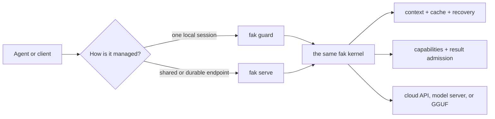

<p align="center">
  <picture><source media="(prefers-color-scheme: dark)" srcset="visuals/brand/fak-logo.svg"></picture>
</p>

# fak — the Fused Agent Kernel

**fak turns a tool-using agent into a managed agent.**

*This page is the front door, and the only one aimed at a reader who has not decided yet: what fak is, whether it fits, and the first command to run. Every other root document is narrower — [`GETTING-STARTED.md`](GETTING-STARTED.md) installs it and owns the verbatim proof output, [`START-HERE.md`](START-HERE.md) routes a job you already have to its one authority, [`INDEX.md`](INDEX.md) is the exhaustive by-name map, [`LEARNING-PATH.md`](LEARNING-PATH.md) teaches the concepts in prerequisite order, and [`AGENTS.md`](AGENTS.md) is for automated contributors, not humans.*

The agent keeps its interface and model. A fak *kernel* — a management plane for one model session, not an OS kernel and not a GPU compute kernel — manages its model traffic and cache reuse, its context lifetime, and its capabilities and recovery. That pairing is what this page means by a *managed agent*: the agent you already run, with those four things owned outside it.

> **TL;DR:** install one binary and run `fak agent --offline`. The managed agent still finishes its task while the kernel blocks a poisoned tool result and a destructive operation. No API key, model download, or GPU needed.

[](LICENSE) [](https://pkg.go.dev/github.com/anthony-chaudhary/fak) [](https://github.com/anthony-chaudhary/fak/releases/latest) [](go.mod) [](https://deepwiki.com/anthony-chaudhary/fak)

<!-- readme-verified: 2026-07-29 vs VERSION 0.43.0 + BENCHMARK-AUTHORITY · process: tools/readme_freshness_audit.py + /refresh-readme -->

## Try the kernel without a key, model, or GPU

Audience: first-time evaluators checking whether fak can manage a tool-using agent.

For the shortest public proof, install the one binary and run one deterministic end-to-end check:

```bash
curl -fsSL https://raw.githubusercontent.com/anthony-chaudhary/fak/main/install.sh | sh
fak agent --offline
# -> task completed (booked) YES / YES · poisoned result blocked YES · destructive op prevented YES
```

(Go 1.26+ users can substitute `go install github.com/anthony-chaudhary/fak/cmd/fak@latest`. Run it from any directory — no clone needed.) The run leaves one file behind: it writes `agent-report.json` into the directory you start it from and prints that full path when it finishes. Pass `--out PATH` to put it somewhere else.

Those three verdict rows are the proof: the managed agent still finishes its task while a poisoned tool result and a destructive operation are both stopped at the kernel boundary. Offline mode uses a deterministic mock planner, so it verifies the managed-agent path and the policy boundary without claiming live-model quality or latency.

The comment above is the short form. The verbatim expected output for this command is printed once among the root pages — in [Getting started § Tier 0](GETTING-STARTED.md#2-tier-0--try-the-kernel-zero-downloads-2-min) — and the complete unabridged capture is in the [tutorial](docs/fak/tutorial.md). Compare your run against one of those two rather than against a third copy.

The full report counts four kernel events beneath those rows: `in-syscall repairs` (a malformed tool call the kernel repaired in place instead of spending a retry turn), `vDSO dedup hits` (a repeated call answered from the kernel's own cache with no engine round-trip), `adjudicator denies` (a call the policy refused before it ran), and `MMU quarantines` (a tool result held out of the model's context). The [glossary](docs/glossary.md) defines these and the rest of the project's vocabulary.

Next action: run it and check those three rows. For the expanded policy, routing, and benchmark sequence, use the [reproduction packet](docs/repro-packet.md). To stand up a running, server-side governed agent in under 10 minutes, follow the [governed-agent quickstart](docs/fak/governed-agent-quickstart.md). That path is offline and gives you a default-deny floor, an audit journal, and a visible DENY.

## One managed agent, two ways to run the kernel

A managed agent pairs fak with Claude Code, Codex, opencode, or your own client and its chosen model. fak owns the operational boundary around that session: what context is retained and what work is reused. It also governs which tools may run, what results may return, and how the session recovers.

The roles stay separate. The agent or client owns the task loop and user experience; the fak kernel is the management plane; the model provider or server generates tokens. Change any one without replacing the others.

| Where the kernel runs | Start here | Use it when… |
|---|---|---|
| Beside one agent | [`fak guard`](#manage-one-local-agent-fak-guard) | You want a local launcher and supervisor for an existing agent. `guard` starts a private kernel gateway, points the child agent at it, and manages that session. |
| As an endpoint | [`fak serve`](#run-the-managed-agent-endpoint-fak-serve) | One or many OpenAI, Anthropic, or MCP clients need a durable kernel service. It can front an existing model server or load GGUF itself. |
| Entirely offline | [Run the one-minute proof](#try-the-kernel-without-a-key-model-or-gpu) | You want to evaluate the managed-agent path without an API key, model download, or GPU. |

Default: start with `fak guard` for one existing agent; choose `fak serve` when the kernel must be a shared or durable endpoint.

Both commands run the same kernel. `guard` runs it beside one agent session, as that session's launcher and supervisor; `serve` runs it as a standalone service. The model remains a replaceable backend—cloud API, local model server, or in-kernel GGUF.


```mermaid
flowchart LR
    A[Agent or client] --> G{How is it managed?}
    G -->|one local session| Guard[fak guard]
    G -->|shared or durable endpoint| Serve[fak serve]
    Guard --> K[the same fak kernel]
    Serve --> K
    K --> M[context + cache + recovery]
    K --> P[capabilities + result admission]
    K --> B[cloud API, model server, or GGUF]
```

For architecture, current evidence, and development workflow, start at [START-HERE.md](START-HERE.md).

## What the managed agent gains

- **Less repeated work, safely.** fak's core job is to coordinate several caching layers that would otherwise fight each other into one system. That coordination is on by default and does not change the model's output. It keeps shared prompt prefixes byte-stable so the provider's cache never busts, sheds stale history before it is sent again, and reuses KV directly when it owns inference. That is ~4.1× less work than a tuned warm-cache stack — the comparison is compute time against a baseline that already keeps per-agent KV warm, not against a re-send-everything loop, and in the measured run (Apple M3 Pro) a 50-turn × 5-agent Qwen2.5-1.5B Q8 session finishes in ~19 minutes where the tuned baseline needs ~78. Prefix reuse scored on its own, against full re-prefill, climbs 4.58× → 6.95× up a 135M → 1.5B model ladder.
- **Long runs keep moving.** Sessions compact their own history — up to ~107K tokens of aged middle-turn context dropped per compaction fire, measured on a real `fak guard -- claude` session held to a 48K resident-context budget — and can resume after a crash instead of dying at the context limit.
- **Policy is on the execution path.** Every proposed tool call receives ALLOW, DENY, TRANSFORM (run it, but rewritten into a safe form), or REQUIRE_WITNESS (hold it until an outside check confirms what it claims to do — and deny if nothing does) against a reviewable *capability floor*: the policy file listing which tools the session may use at all, so anything absent from it is denied before it runs. That verdict is an in-process function call: 362 ns per decision (measured on an M3 Pro; 560–605 ns once argument predicates run), with no policy model and no network hop. For scale, the same class of check costs milliseconds once it has to leave the process: fak's own out-of-process guard hook tail measures ~85 ms mean / ~175 ms p99. Tool results carry provenance too — where the bytes came from and whether that source is trusted — so poisoned content read from an untrusted source is stopped at *result admission*, before the model acts on it.
- **Big local models are first-class.** The kernel loads GGUF weights itself and serves OpenAI, Anthropic, and MCP clients directly. Mixture-of-experts models use only a few of the model's expert blocks per token. For those, the kernel pages just the needed expert weights in from SSD and stripes weight reads across sources by measured bandwidth. The whole model does not have to sit in RAM. Quantized (e.g. Q4) inference and grammar-constrained structured output — the decoder is held to your schema, so a reply cannot come back as malformed JSON — are built in.

Evidence: [tuned benchmark baselines](BENCHMARK-AUTHORITY.md) · [tagged claims ledger](CLAIMS.md). Every number above names its workload, hardware, and baseline in those two documents. Unfamiliar word: [glossary](docs/glossary.md).

<p align="center">
  
</p>

## What fak is not

fak is a management plane. It is not a model, not a faster model server, and not a prompt-injection detector. The boundaries, so you can rule it out quickly:

- **Not a faster model server.** vLLM, SGLang, llm-d, and llama.cpp win raw throughput; you run `fak serve` *in front of* one of them. The in-kernel GGUF path makes model state kernel-owned state and is checked at the tensor layer against a HuggingFace oracle — it is not a production serving engine. ([serving scope](docs/serving/README.md))
- **The security floor is structural, not detection.** An active policy limits which tools can run and quarantine holds classified results out of model context. fak does not claim to *detect* a successful prompt injection; it removes the tools and results an injection would need. Allow-listing a destructive tool is policy authoring, not a gate bypass. ([SECURITY.md](SECURITY.md) · [POLICY.md](POLICY.md))
- **Tool-calling turns are gated whole-turn, not token-streamed.** A call cannot be allowed, denied, or repaired until its arguments have fully arrived, so `stream:true` is adjudicated in full and then re-serialized as a well-formed SSE sequence. Prose deltas still stream; tool-call bytes do not. Expect full-turn latency when wiring an interactive harness to the gateway. That is the enforcement model, not a missing feature.
- **It does not change what your model says.** The cache coordination is output-neutral by design — it removes repeated work, not wrong answers.
- **Pre-1.0; interfaces still move.** Every capability claim carries exactly one of `[SHIPPED]`, `[SIMULATED]`, or `[STUB]` in [CLAIMS.md](CLAIMS.md), and [product status](docs/PRODUCT-STATUS.md) separates the concepts you can run today from the real subsystems that have no command yet. Check a capability's tag before you build on it.

## Manage one local agent: `fak guard`

Start with the agent you already run. No rewrite, config file, API key, or second terminal:

```bash
fak guard -- claude                                  # keep a Claude Pro/Max subscription — no API key
fak guard --provider openai -- codex                 # provider is normally auto-detected
fak guard --policy examples/dev-agent-policy.json -- opencode
```

Your model wire and credentials pass through unchanged. API billing is opt-in with `--api-key-env`; a local model with `--gguf` or `--local`. On exit, fak reports savings and decisions.

Read: [Claude Code walkthrough](docs/integrations/claude.md) · [Codex](docs/integrations/openai-codex.md) · [Cursor](docs/integrations/cursor.md) · [all supported hosts](docs/supported/README.md) · [policy guide](POLICY.md)

## Run the managed-agent endpoint: `fak serve`

Use fak as a shared OpenAI, Anthropic, or MCP endpoint. That one endpoint carries reuse and compaction, routing and observability, authentication and policy.

Front an existing local or remote model server:

```bash
fak serve --addr 127.0.0.1:8080 \
  --base-url http://localhost:11434/v1 \
  --model qwen2.5:1.5b \
  --policy examples/dev-agent-policy.json
```

Or stand alone with GGUF weights and no separate model server:

```bash
fak serve --addr 127.0.0.1:8080 \
  --gguf /path/to/model.gguf \
  --model my-local-model
```

Point OpenAI clients at `http://127.0.0.1:8080/v1` and Anthropic clients at the bare host. Use `--stdio` for MCP or `fak node install` for an always-on service. Your inference backend stays in place; fak owns cross-request reuse and the agent/tool boundary.

Read: [server quickstart](docs/fak/server-quickstart.md) · [serving architecture and engines](docs/serving/README.md) · [configuration](docs/fak/server-config.md) · [API reference](docs/fak/api-reference.md) · [deployment](docs/fak/deployment-guide.md)

**Showcase — Claude Code on a Mac's own local model.** A premium cloud agent, open weights on your own silicon, one static binary in between.

This one needs setup first: a Mac running a Qwen3.6-27B server with a `fak serve` gateway in front of it. Stand that up with the [server quickstart](docs/fak/server-quickstart.md). Once it is running, `fak mac` launches Claude Code against it:

```bash
export FAK_MAC_GATEWAY="http://<your-mac>:8080"       # the gateway you started above
fak mac                                              # long form: fak claude-mac-fak
```

`fak mac` targets a gateway over the network, so it works whether you are on the Mac or driving it from another machine — set `FAK_MAC_GATEWAY` either way. Honest expectations: the first full local turn is slow (10–15 min prefill on an M3 Pro) and single-stream. The wow is that it works end to end and stays observable the whole time via the preflight panel. The [operator walkthrough](docs/fak/mac-agent-ui.md) covers the launcher's flags, the preflight panel, and the live overlay — it assumes the gateway already exists.

## Install

No Go toolchain needed — the installer downloads a prebuilt binary and verifies its SHA-256 against the release's `SHA256SUMS`:

```bash
curl -fsSL https://raw.githubusercontent.com/anthony-chaudhary/fak/main/install.sh | sh
```

If you already have Go 1.26+, or you are on Windows without a POSIX shell:

```bash
go install github.com/anthony-chaudhary/fak/cmd/fak@latest
```

Either way, `fak version` confirms it. Manual archive downloads, containers, build-from-source, and release-provenance verification: [INSTALL.md](INSTALL.md).

## Going deeper

- Use it: [tutorial](docs/fak/tutorial.md) · [integration guides](docs/integrations/) · [examples](examples/README.md) · [first command didn't work?](docs/adoption/troubleshooting-first-run.md)
- Show it off: [the published showcase](https://anthony-chaudhary.github.io/fak/showcase.html) — this repository's configured homepage, built from [docs/showcase.html](docs/showcase.html) · [Claude Code on your own Mac's local model](docs/fak/mac-agent-ui.md) via `fak mac`; slow first turn and single-stream, observable end to end
- Operate it: [serving](docs/serving/README.md) · [observability](docs/fak/observability.md) · [deployment](docs/fak/deployment-guide.md)
- Understand it: [performance outcomes and proofs](docs/performance.md) · [glossary](docs/glossary.md) · [managed cache](docs/explainers/what-is-managed-cache.md) · [external system architecture](docs/architecture.md) · [concepts and story](docs/concepts-and-story.md)
- Verify it: [benchmark route](docs/benchmark-methodology.md) · [current benchmark authority](BENCHMARK-AUTHORITY.md) · [claims ledger](CLAIMS.md) · [reproduction packet](docs/repro-packet.md)
- Build it: [contributing](CONTRIBUTING.md) (no write access? [fork and open a PR](CONTRIBUTING.md#fork-and-open-a-pull-request)) · [security](SECURITY.md) · [documentation home by audience](docs/index.md) · [front-page overflow](docs/README-legacy.md)

Apache-2.0. Please report vulnerabilities privately as described in [SECURITY.md](SECURITY.md). Participation is governed by the [Code of Conduct](.github/CODE_OF_CONDUCT.md).