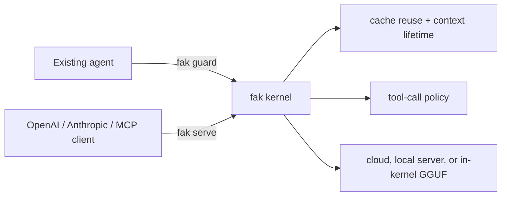

<p align="center">
  <picture><source media="(prefers-color-scheme: dark)" srcset="visuals/brand/fak-logo.svg"></picture>
</p>

# fak — the Fused Agent Kernel

**fak is a single Go binary that governs an agent's tool calls and model traffic.** It reuses shared setup, routes each call to the right model, serves repeated work locally, manages context, and enforces capability policy at the same checkpoint.

[](LICENSE) [](https://pkg.go.dev/github.com/anthony-chaudhary/fak) [](https://github.com/anthony-chaudhary/fak/releases/latest) [](go.mod) [](https://deepwiki.com/anthony-chaudhary/fak)

<!-- readme-verified: 2026-07-15 vs VERSION 0.41.0 + BENCHMARK-AUTHORITY · process: tools/readme_freshness_audit.py + /refresh-readme -->

## Choose your path

| Your goal | Start here | What it adds |
|---|---|---|
| Evaluate the kernel in about a minute | [Run the offline proof](#try-the-kernel-without-a-key-model-or-gpu) | A structural policy verdict and a complete offline agent task. |
| Keep an existing agent interface and model | [`fak guard`](#wrap-an-agent-fak-guard) | Cache coordination, resumable sessions, and a verdict before every tool call. |
| Connect a client or serve a model | [`fak serve`](#serve-a-model-or-api-fak-serve) | OpenAI, Anthropic, and MCP interfaces over cloud, local-server, or in-kernel GGUF backends. |
| Understand or contribute to fak | [Start here](START-HERE.md) | Architecture, current evidence, development workflow, and the deeper documentation map. |

**Default:** run the offline proof first. It needs no API key, model download, or GPU and establishes the policy and agent path before you choose a serving backend.


```mermaid
flowchart LR
    A[Existing agent] -->|fak guard| K[fak kernel]
    C[OpenAI / Anthropic / MCP client] -->|fak serve| K
    K --> R[cache reuse + context lifetime]
    K --> P[tool-call policy]
    K --> U[cloud, local server, or in-kernel GGUF]
```

## Why run a kernel between agents and tools?

- **Less repeated work.** fak keeps shared prompt prefixes stable, sheds stale history before it is sent again, and reuses KV directly when it owns inference: **~4.1× less work than a tuned warm-cache stack** (up to **6.95×** on larger models).
- **Long runs keep moving.** Sessions compact their own history (up to **~107K tokens** per trim) and can resume after a crash instead of dying at the context limit.
- **Policy is on the execution path.** Every proposed tool call receives ALLOW, DENY, TRANSFORM, or REQUIRE_WITNESS against a reviewable capability floor—**362 ns** in process, with no policy model or network hop.
- **Composable or standalone.** Use either capability, combine both, proxy an existing server, or run GGUF locally.

Evidence: [tuned benchmark baselines](BENCHMARK-AUTHORITY.md) · [tagged claims ledger](CLAIMS.md).

<p align="center">
  
</p>

## Wrap an agent: `fak guard`

Start with the agent you already run—no rewrite, config file, API key, or second terminal:

```bash
fak guard -- claude                                  # keep a Claude Pro/Max subscription
fak guard --provider openai -- codex                 # provider is normally auto-detected
fak guard --policy examples/dev-agent-policy.json -- opencode
```

Your model wire and credentials pass through unchanged. API billing is opt-in with `--api-key-env`; a local model with `--gguf` or `--local`. On exit, fak reports savings and decisions.

Read: [Claude Code walkthrough](docs/integrations/claude.md) · [Codex](docs/integrations/openai-codex.md) · [Cursor](docs/integrations/cursor.md) · [all supported hosts](docs/supported/README.md) · [policy guide](POLICY.md)

## Serve a model or API: `fak serve`

Use fak as a shared OpenAI, Anthropic, or MCP endpoint, with reuse, compaction, routing, observability, authentication, and policy in one place.

**Front an existing local or remote model server:**

```bash
fak serve --addr 127.0.0.1:8080 \
  --base-url http://localhost:11434/v1 \
  --model qwen2.5:1.5b \
  --policy examples/dev-agent-policy.json
```

**Or stand alone with GGUF weights—no separate model server:**

```bash
fak serve --addr 127.0.0.1:8080 \
  --gguf /path/to/model.gguf \
  --model my-local-model
```

Point OpenAI clients at `http://127.0.0.1:8080/v1` and Anthropic clients at the bare host. Use `--stdio` for MCP or `fak node install` for an always-on service. Your inference backend stays in place; fak owns cross-request reuse and the agent/tool boundary.

Read: [server quickstart](docs/fak/server-quickstart.md) · [serving architecture and engines](docs/serving/README.md) · [configuration](docs/fak/server-config.md) · [API reference](docs/fak/api-reference.md) · [deployment](docs/fak/deployment-guide.md)

## Try the kernel without a key, model, or GPU

```bash
fak routebench                                    # COST / LATENCY / QUALITY vs a one-model baseline
fak preflight --tool refund_payment --args "{}"   # DENY (DEFAULT_DENY): outside the capability floor
fak agent --offline                               # deterministic end-to-end agent demo
```

The policy floor is JSON, not a second model. Copy a manifest from [`examples/`](examples/), trim it, and test it before a model runs. [How the boundary works](docs/explainers/tool-call-is-a-syscall.md).

## Install

```bash
go install github.com/anthony-chaudhary/fak/cmd/fak@latest
```

Go 1.26+; no external Go dependencies. Source builds, archives, and containers: [INSTALL.md](INSTALL.md).

## Where to go next

- **Use it:** [tutorial](docs/fak/tutorial.md) · [integration guides](docs/integrations/) · [examples](examples/README.md)
- **Operate it:** [serving](docs/serving/README.md) · [observability](docs/fak/observability.md) · [deployment](docs/fak/deployment-guide.md)
- **Understand it:** [managed cache](docs/explainers/what-is-managed-cache.md) · [agent integration architecture](docs/fak/agent-integration-architecture.md) · [concepts and story](docs/concepts-and-story.md)
- **Verify it:** [benchmarks](BENCHMARK-AUTHORITY.md) · [claims ledger](CLAIMS.md) · [reproduction packet](docs/repro-packet.md)
- **Build it:** [contributing](CONTRIBUTING.md) · [security](SECURITY.md) · [full documentation index](docs/index.md)

Apache-2.0. Please report vulnerabilities privately as described in [SECURITY.md](SECURITY.md).