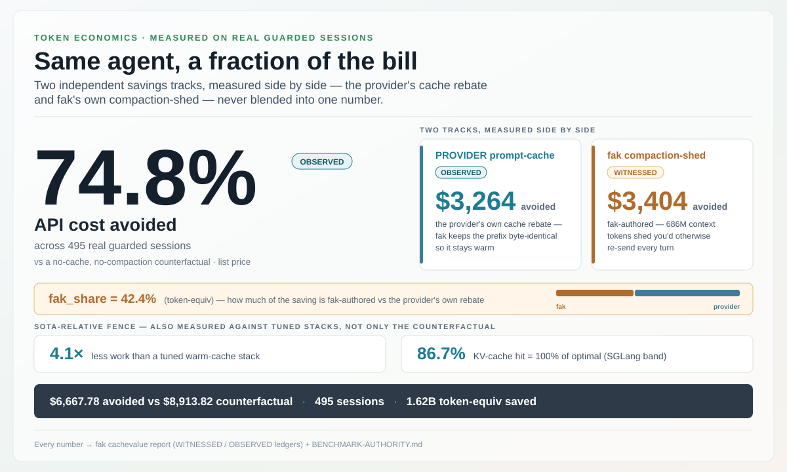

<p align="center">
  <picture><source media="(prefers-color-scheme: dark)" srcset="visuals/brand/fak-logo.svg"></picture>
</p>

# fak — the Fused Agent Kernel

**A management layer for the AI agent you already use.**

Run Claude Code, Codex, OpenCode, or your own client through one binary to reuse stable model work, compact long sessions, enforce tool policy, recover interrupted runs, and see what the agent actually did.

The agent still owns the task and user interface. Your provider or local server still generates the tokens. fak sits between them as the management plane for the session, where it can manage model traffic, context, tools, and recovery without asking you to adopt a new agent framework.

> **TL;DR:** install fak, then run `fak guard -- claude`. You keep the same agent, interface, and login; fak reduces repeated model work, keeps long sessions within a context budget, and can stop out-of-policy tools before they run.

[](LICENSE) [](https://pkg.go.dev/github.com/anthony-chaudhary/fak) [](https://github.com/anthony-chaudhary/fak/releases/latest) [](go.mod) [](https://deepwiki.com/anthony-chaudhary/fak)

*This page is the front door, and the only one aimed at a reader who has not decided yet. Every other root page is narrower: [`GETTING-STARTED.md`](GETTING-STARTED.md) owns the complete first-run sequence, [`START-HERE.md`](START-HERE.md) routes a job you already have, [`INDEX.md`](INDEX.md) is the by-name map, [`LEARNING-PATH.md`](LEARNING-PATH.md) teaches the concepts in order, and [`AGENTS.md`](AGENTS.md) is for automated contributors, not humans.*

<!-- readme-verified: 2026-08-09 vs VERSION 0.43.0 + BENCHMARK-AUTHORITY · process: tools/readme_freshness_audit.py + /refresh-readme -->

<a id="install"></a>
## Install, then run the agent you already use

Install the prebuilt binary on macOS or Linux; the installer verifies its SHA-256 against the release manifest:

```bash
curl -fsSL https://raw.githubusercontent.com/anthony-chaudhary/fak/main/install.sh | sh
fak version
```

Then put fak around a normal agent session:

```bash
fak guard -- claude                                  # -> Claude opens normally, now managed by fak
fak guard --provider openai -- codex                 # provider is normally auto-detected
fak guard --policy examples/dev-agent-policy.json -- opencode
```

There is no new chat UI, and no API key is required. `guard` starts a private kernel gateway, points the child process at it, and passes the model wire and existing credentials through unchanged. The agent behaves normally; on exit, fak summarizes reuse, context, and policy decisions. API billing is opt-in with `--api-key-env`; local models are available with `--local` or `--gguf`.

If you already have Go 1.26+, or you are on Windows without a POSIX shell, install with:

```bash
go install github.com/anthony-chaudhary/fak/cmd/fak@latest
```

Manual downloads, containers, source builds, and release verification are in [INSTALL.md](INSTALL.md). If the first command refuses to start, use [first-run troubleshooting](docs/adoption/troubleshooting-first-run.md).

## What you get

| Value | What fak does at the boundary |
|---|---|
| **Less repeated model work** | Keeps shared prompt prefixes stable for provider caches, drops stale history before it is sent again, deduplicates repeated tool calls, and directly reuses the model's running scratchpad (the KV cache) when fak owns inference. |
| **Longer, recoverable sessions** | Compacts aged middle turns to a resident-context budget, checkpoints kernel state, and resumes interrupted work instead of making every run disposable. |
| **Tool control that prompts cannot override** | Gives every proposed tool call an `ALLOW`, `DENY`, `TRANSFORM`, or `REQUIRE_WITNESS` verdict from a reviewable capability policy before it executes. Untrusted tool results can be quarantined before they return to the model. |
| **One observable boundary** | Records model traffic, cache hits, compaction, tool decisions, and recovery in one journal instead of scattering them across an agent, provider, and tool stack. |
| **A choice of model backends** | Preserves cloud providers, fronts OpenAI-compatible local servers, or loads GGUF weights itself while exposing OpenAI, Anthropic, and MCP interfaces. |

These are implemented features, not just an architecture pitch. In the current measured workload, fak performs about **4.1× less compute work** than a tuned baseline that already keeps each agent's KV cache warm: a 50-turn × 5-agent Qwen2.5-1.5B Q8 run on an Apple M3 Pro took about 19 minutes versus 78. In a real `fak guard -- claude` session, compaction removed up to about 107K aged tokens per fire while holding resident context to 48K. Policy verdicts are local in-process calls, measured at 362 ns without argument predicates and 560–605 ns with them. Workload, hardware, units, and tuned baselines: [benchmark authority](BENCHMARK-AUTHORITY.md) and [tagged claims ledger](CLAIMS.md).

<p align="center">
  
</p>

## Choose the shape that fits

The same kernel can manage one interactive agent or become shared infrastructure:

| Goal | Start with | What it gives you |
|---|---|---|
| Improve one agent you already run | [`fak guard -- claude`](#manage-one-local-agent-fak-guard) | A private per-session gateway, lifecycle supervision, reporting, and optional policy without replacing the agent UI or login. |
| Give several clients one managed endpoint | [`fak serve`](#run-the-managed-agent-endpoint-fak-serve) | OpenAI, Anthropic, and MCP interfaces in front of an existing model server or in-kernel GGUF. |
| Evaluate behavior before connecting a model | [`fak agent --offline`](#try-the-behavior-offline) | A deterministic demonstration of repair, reuse, policy denial, and result quarantine. |

A concrete local-stack example is Claude Code using a model on your own Mac through `fak serve` and `fak mac`. A concrete policy example is starting OpenCode with `examples/dev-agent-policy.json`, where tools outside the declared capability floor are denied before execution. The sections below show both operating modes; the [tutorial](docs/fak/tutorial.md) walks through their reports.

## How it works

```text
Claude Code / Codex / OpenCode / your client
                    │
                    ▼
        fak: cache · context · policy · journal · recovery
                    │
                    ▼
       Anthropic / OpenAI / local server / GGUF
```

fak is effective at this position because every model request and proposed tool call crosses the same checkpoint. Stable work can be reused before another inference request, old context can be shed before it consumes the next window, and a capability decision can be enforced before a tool runs. The kernel does not need to be the agent or the model to manage either boundary.

## Try the behavior offline

If you want to inspect fak before trusting it with an agent login or downloading a model, run the deterministic demo:

```bash
fak agent --offline
# -> task completed (booked) YES / YES · poisoned result blocked YES · destructive op prevented YES
```

This is a functional check, not the main product experience or a model-quality benchmark. A mock planner drives the real managed-agent path so you can see a malformed call repaired, a repeat served locally, a destructive operation denied, and an untrusted result kept out of context. The run writes `agent-report.json` in the current directory (or `--out PATH`) with the underlying kernel events.

The verbatim output and explanation are in [Getting started § Tier 0](GETTING-STARTED.md#2-tier-0--try-the-kernel-zero-downloads-2-min). For a server-side default-deny example with an audit journal and visible denial, use the [governed-agent quickstart](docs/fak/governed-agent-quickstart.md). For the full policy, routing, and benchmark sequence, use the [reproduction packet](docs/repro-packet.md).
## What fak is not

fak is a management plane. It is not a model, not a faster model server, and not a prompt-injection detector. The boundaries, so you can rule it out quickly:

- **Not a faster model server.** vLLM, SGLang, llm-d, and llama.cpp win raw throughput; you run `fak serve` *in front of* one of them. The in-kernel GGUF path makes model state kernel-owned state — it is not a production serving engine. ([serving scope](docs/serving/README.md))
- **The security floor is structural, not detection.** An active policy limits which tools can run, and quarantine holds classified results out of model context. fak does not claim to *detect* a successful prompt injection; it removes the tools and results an injection would need. Allow-listing a destructive tool is policy authoring, not a gate bypass. ([SECURITY.md](SECURITY.md) · [POLICY.md](POLICY.md))
- **Tool-calling turns are gated whole-turn, not token-streamed.** A call cannot be allowed, denied, or repaired until its arguments have fully arrived, so `stream:true` is adjudicated in full and then re-serialized as a well-formed SSE sequence. Prose deltas still stream; tool-call bytes do not. Expect full-turn latency when wiring an interactive harness to the gateway — that is the enforcement model, not a missing feature.
- **Pre-1.0; interfaces still move.** Every capability claim carries exactly one of `[SHIPPED]`, `[SIMULATED]`, or `[STUB]` in [CLAIMS.md](CLAIMS.md), and [product status](docs/PRODUCT-STATUS.md) separates what you can run today from the subsystems that have no command yet. Check a capability's tag before you build on it.

## Manage one local agent: `fak guard`

Start with the agent you already run. No rewrite, config file, API key, or second terminal:

```bash
fak guard -- claude                                  # keep a Claude Pro/Max subscription — no API key
fak guard --provider openai -- codex                 # provider is normally auto-detected
fak guard --policy examples/dev-agent-policy.json -- opencode
```

Your model wire and credentials pass through unchanged. API billing is opt-in with `--api-key-env`; a local model with `--gguf` or `--local`. On exit, fak reports savings and decisions.

Read: [Claude Code walkthrough](docs/integrations/claude.md) · [Codex](docs/integrations/openai-codex.md) · [Cursor](docs/integrations/cursor.md) · [all supported hosts](docs/supported/README.md) · [policy guide](POLICY.md)

## Run the managed-agent endpoint: `fak serve`

Use fak as a shared OpenAI, Anthropic, or MCP endpoint. That one endpoint carries reuse and compaction, routing and observability, authentication and policy.

Front an existing local or remote model server:

```bash
fak serve --addr 127.0.0.1:8080 \
  --base-url http://localhost:11434/v1 \
  --model qwen2.5:1.5b \
  --policy examples/dev-agent-policy.json
```

Or stand alone with GGUF weights and no separate model server:

```bash
fak serve --addr 127.0.0.1:8080 \
  --gguf /path/to/model.gguf \
  --model my-local-model
```

Point OpenAI clients at `http://127.0.0.1:8080/v1` and Anthropic clients at the bare host. Use `--stdio` for MCP, or `fak node install` to make it an always-on service. Your inference backend stays in place; fak owns cross-request reuse and the agent/tool boundary.

Read: [server quickstart](docs/fak/server-quickstart.md) · [serving architecture and engines](docs/serving/README.md) · [configuration answers](docs/fak/configuration.md) · [complete configuration reference](docs/fak/server-config.md) · [API reference](docs/fak/api-reference.md) · [deployment](docs/fak/deployment-guide.md)

**Showcase — Claude Code on a Mac's own local model.** A premium cloud agent, open weights on your own silicon, one static binary in between.

`fak mac` is a launcher, not an installer — it needs a Mac already running a local model server behind a `fak serve` gateway. [Stand up the Mac side](docs/fak/mac-agent-ui.md#stand-up-the-mac-side) builds that from scratch, including how to pick a model that fits your Mac's memory; `fak node install` is what makes the gateway survive a reboot. Then launch Claude Code against it:

```bash
export FAK_MAC_GATEWAY="http://<your-mac>:8080"       # the gateway you started above
fak mac                                              # long form: fak claude-mac-fak
```

`fak mac` targets a gateway over the network, so it works whether you are on the Mac or driving it from another machine. Honest expectations: the first full local turn is slow (10–15 min prefill on an M3 Pro) and single-stream. The wow is that it works end to end and stays observable the whole time via the preflight panel. The [operator walkthrough](docs/fak/mac-agent-ui.md) covers the launcher's flags, the preflight panel, and the live overlay.

## Make fak the default launcher

After trying `fak guard`, you can remove even that extra command: `fak launch install --provider all --default claude` installs reversible `claude`/`codex` shims and makes bare `fak` launch your chosen provider. The original provider binaries are not overwritten; use `--fak-direct`, `FAK_DIRECT=1`, or `fak launch disable` to bypass interception. Run `fak launch doctor` for a redacted readiness report. [Zero-adoption launch guide](docs/zero-adoption-launch.md).
## Going deeper

- Use it: [tutorial](docs/fak/tutorial.md) · [integration guides](docs/integrations/) · [examples](examples/README.md) · [first command didn't work?](docs/adoption/troubleshooting-first-run.md)
- Show it off: [the published showcase](https://anthony-chaudhary.github.io/fak/showcase.html) — this repository's configured homepage, built from [docs/showcase.html](docs/showcase.html) · [Claude Code on your own Mac's local model](docs/fak/mac-agent-ui.md) via `fak mac`
- Operate it: [serving](docs/serving/README.md) · [observability](docs/fak/observability.md) · [deployment](docs/fak/deployment-guide.md)
- Understand it: [performance outcomes and proofs](docs/performance.md) · [glossary](docs/glossary.md) · [managed cache](docs/explainers/what-is-managed-cache.md) · [external system architecture](docs/architecture.md) · [concepts and story](docs/concepts-and-story.md)
- Verify it: [benchmark route](docs/benchmark-methodology.md) · [current benchmark authority](BENCHMARK-AUTHORITY.md) · [claims ledger](CLAIMS.md) · [reproduction packet](docs/repro-packet.md)
- Build it: [contributing](CONTRIBUTING.md) (no write access? [fork and open a PR](CONTRIBUTING.md#fork-and-open-a-pull-request)) · [security](SECURITY.md) · [documentation home by audience](docs/index.md) · [front-page overflow](docs/README-legacy.md)

Apache-2.0. Please report vulnerabilities privately as described in [SECURITY.md](SECURITY.md). Participation is governed by the [Code of Conduct](.github/CODE_OF_CONDUCT.md).
