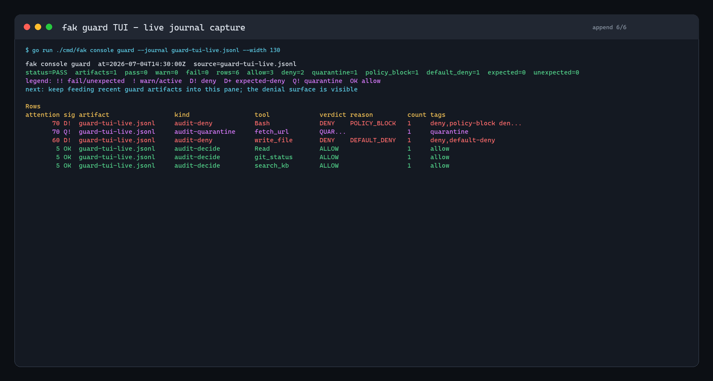

# fak: the Fused Agent Kernel

[](https://github.com/anthony-chaudhary/fak/actions/workflows/ci.yml) [](https://github.com/anthony-chaudhary/fak/actions/workflows/release-artifacts.yml)

<!-- readme-verified: 2026-07-06 vs VERSION 0.37.0 + BENCHMARK-AUTHORITY · process: tools/readme_freshness_audit.py + /refresh-readme. 2026-07-06: concision pass (front_page_focus) — collapsed the triple preamble lead to one (single_lead), glossed KV cache + vDSO for the first-screen reader (jargon), and trimmed the token/perf sections' duplicated trend prose; score 64→81 (D→B). 2026-07-04: token-savings value prop foregrounded — "Token savings, set and forget" section + the 6-defaults scorecard link, "What you get" bullet reframed to the set-and-forget catch-all; honest provider-owned-vs-fak-authored split preserved (SESSION-CACHE-SAVINGS ablation). Same day: refocused on the long-session TREND — fak-authored share climbs ~1%→~11% with length (new BENCHMARK-AUTHORITY row; shed token counts WITNESSED, % is MODELED, n=2 thin, peak-not-pool). 2026-07-03: release pin refreshed for v0.37.0. 2026-07-01: front page halved; overflow: docs/README-legacy.md. Same day: hero video + gallery/video links re-surfaced; examples generalized to the hardware/harness sweep (HARDWARE-MATRIX + supported/); guided tutorial surfaced (Pick-your-path + docs map). -->

<!-- lead source: docs/adoption/pitch-ladder.md (rung 1). Edit the ladder first; keep this lead consistent with its one-sentence pitch. State the pitch ONCE here — do not restate it before the first `## ` (front_page_focus single_lead). -->
**fak is a fused agent kernel** — one static Go binary you drop in front of the AI agent
you already run. It treats every tool call like a syscall: the model proposes, the kernel
disposes. It checks each call, routes work, and reuses the stable setup in long sessions,
so the same agent loop comes out more controlled, cheaper, and faster.

It works with Claude Code, Codex, Cursor, and OpenAI / Anthropic / MCP clients.
`fak guard -- claude` wraps your normal agent in one command — `fak` repoints one base URL
at itself, and your model, IDE, and keys stay exactly as they are.

[](visuals/hero-video.mp4)

<sub>▶ 41 s, silent, looping. Click it for the [full-resolution MP4 (1440p)](visuals/hero-video.mp4). Every chart in it is a still, with its source data and regeneration command, in the [benchmark gallery](BENCHMARK-GALLERY.md).</sub>

## Pick your path

[Run your agent through it now](#get-started-with-fak-guard) ·
[follow the guided tutorial, 15 min, no key, no GPU](docs/fak/tutorial.md) ·
[run the Colab quickstart](https://colab.research.google.com/github/anthony-chaudhary/fak/blob/main/notebooks/fak-quickstart.ipynb) ·
[run a model in the kernel](#run-the-model-in-the-kernel) ·
[the performance story](#the-performance-value-proposition) · [tool-call controls](#tool-call-controls).

## What you get, in numbers

Every figure traces to [BENCHMARK-AUTHORITY.md](BENCHMARK-AUTHORITY.md), and the honesty
ledger is [CLAIMS.md](CLAIMS.md):

- **~4.1× less work than a tuned warm-cache stack** on a 50-turn × 5-agent run. `fak`
  reuses the shared prompt prefix: the system prompt, tools, and the model's scratchpad of
  the work so far (the *KV cache*). It shares that prefix across agents instead of re-paying
  for it. Reuse climbs
  to **6.95×** across the model ladder (~60× versus a naive re-send loop; the tuned
  figure is the honest bar).
- **One kernel, four hardware platforms.** The same correctness gates run on Apple Metal
  and AMD Vulkan. They also run on NVIDIA CUDA (Ada + Ampere) across macOS, Windows, WSL2,
  and Linux. On CUDA, in-kernel decode reaches ~120 tok/s on a single RTX 4070, inside
  llama.cpp's Q8_0 band of 120 +/- 15 tok/s. The sweep, per box:
  [docs/HARDWARE-MATRIX.md](docs/HARDWARE-MATRIX.md).
- **Your token savings grow the longer you run.** `fak guard` turns on six safe
  token-savers by default (no flags). On a short session the provider's prompt cache
  does nearly all the work; as the session gets long, fak's *own* share climbs — on our
  longest measured session it reached **~11%** (1.67M tokens trimmed from old turns the
  cache could no longer reuse), up from ~1% on a shorter run. That is fak's slice on top
  of the provider discount, not the discount itself.
  [The savers + the honest split](docs/serving/token-defaults-scorecard.md).
- **The guard tax is ~362 ns per call:** the allow/deny decision runs in-process
  (measured, Apple M3 Pro), no network hop.

## Get started with `fak guard`

The lowest-friction path: wrap the agent you already run in one command. No rewrite, no
config edit, no second terminal.

```bash
fak guard -- claude                                   # your Claude Code, on your Pro/Max subscription; no API key needed
fak guard --api-key-env ANTHROPIC_API_KEY -- claude   # use Anthropic API billing instead
fak guard --provider openai --api-key-env OPENAI_API_KEY -- opencode   # an OpenAI-compatible agent
```

`fak guard` starts a gateway in-process on loopback and injects the base URL into the child
process only. It forwards your real upstream credential
(and the `cache_control` prompt-cache breakpoints) byte-for-byte, so there is no cost
regression. On that same boundary, it checks every tool call against a built-in secure
capability floor: a reviewable allow-list. On exit it prints a compact decision summary:
`fak guard: 131 kernel decisions; 121 allowed / 5 denied / 2 repaired / 0 quarantined / 3 deferred`.



<sub>The live pane, not a mock: a real `fak console guard --journal` render, captured as terminal frames — [silent GIF](visuals/guard-tui-video.gif) · [MP4](visuals/guard-tui-video.mp4).</sub>

For Claude Code, `fak guard` uses your logged-in subscription by default, so no API key is
required. The full walkthrough includes an end-to-end proof that a real `/v1/messages` turn
crossed the gateway: [docs/integrations/claude.md](docs/integrations/claude.md).

### See a real number: no key, no model, no GPU

Installed the binary (see [Install](#install))? These run from the bare binary anywhere. No
clone, no key, no model, no GPU:

```bash
fak routebench                  # -> COST / LATENCY / QUALITY delta vs a one-model baseline
fak benchmarks list --offline   # -> the zero-asset benchmark set
```

`fak routebench` replays a built-in 8-case corpus through a routing policy versus a
single-model baseline and prints `routed is ~20% cheaper, ~10% less total compute, quality
tied`: a deterministic offline lens.

## Token savings, set and forget

Run `fak guard` and six safe token-savers turn on by default, no flags — this is the stack
behind the growing-share number above.

| Default saver | What it does | Touches your output? |
|---|---|:--:|
| Provider prompt-cache passthrough | forwards the cache breakpoints byte-for-byte so the provider's discount holds | no |
| Tool-floor pruning | drops tool definitions the policy would deny anyway | no |
| Repeated-call dedup (vDSO) | answers an identical repeated call from the previous result, no round-trip | no |
| History compaction | sheds the un-cacheable middle of a long session past a budget | working set kept |
| Oversized-result elision | shrinks a scrolled-past tool result to head and tail | working set kept |
| Planned context view | re-materializes history under a token budget | working set kept |

The first three savers are lossless — they cannot change a single output token; the last
three keep the model's working set intact and note what they shed. The honest split most cost
pitches skip: on the Claude Code route the provider's prompt-cache discount is still the
bigger number, and fak's other job is to keep it alive — holding the cached prefix
byte-for-byte identical (the thing that breaks when a session outgrows the window or a
summarizer rewrites it) and relaying the provider's own saved-token count rather than claiming
it. fak's ~11% is a longest-session peak from a thin sample, not a fleet average. You tune
none of it: `fak token-defaults-scorecard` (grade A) proves the stack stays on, and every
`fak info` line shows the live `provider X% + fak Y%` split. Full attribution:
[what fak changed, and what the provider did](docs/notes/SESSION-CACHE-SAVINGS-ABLATION-2026-06-29.md).

## Run the model in the kernel

The kernel can also host the model. `fak guard --gguf qwen2.5:7b -- claude` loads a local
GGUF model in-process: no API key, no network, your data never leaves the box, and the kernel
owns the KV cache so the same reuse and quarantine machinery applies. The path is profiled on
Apple Metal, AMD Vulkan, and CUDA, where f32 in-kernel decode reaches parity with a quantized
llama.cpp ([head-to-head](docs/benchmarks/LLAMACPP-HEADTOHEAD-RESULTS.md)).

The honest fence: a small local model is a quality ramp, not a frontier coder. Use `--gguf`
for offline or privacy-bound work and the proxy path for the best reasoning; build tags and
GPU flags are in the walkthrough linked above.

## The performance value proposition

A long agent session burns money by re-solving the same setup: a 100k-token conversation
re-sends its whole transcript every turn, and a 5-agent fleet pays for the same shared system
prompt five times over. `fak` does the shared work once, two ways:

- **Reuse the shared prefix across agents.** The system prompt, tool table, and instructions
  are identical for every agent in a fleet, so `fak` computes that prefix once and reuses it
  (copy-on-write) for all of them — the ~4.1× figure above.
- **Shed history without losing the cache hit.** Past ~48k resident tokens, `fak guard` (on
  by default) drops the old middle turns while copying the provider's cache prefix through
  byte-for-byte, so the prompt-cache discount holds. (Summarizing instead would rewrite the
  prompt and bust the cache.) On any doubt `fak` forwards the original prompt unchanged and
  relays the provider's own `cache_read` number. Tune with
  `fak guard --compact-history-budget <tokens>` (`0` disables).

How and why:
[docs/explainers/long-sessions-keep-the-cache-hit.md](docs/explainers/long-sessions-keep-the-cache-hit.md);
the paying-off trend: [docs/cache-value-rollup.md](docs/cache-value-rollup.md). Prefer to
watch: [four wins, by example, a 29-second silent MP4](visuals/worked-examples-video.mp4).

## More ways to run it

`fak guard` is per-session and the right default. When you want something else:

- Always-on gateway: `fak node` installs `fak serve` as a real system service (macOS
  launchd, Linux systemd `--user`, a Windows Scheduled Task); credentials stay on the host.
  See [docs/fak/node-setup.md](docs/fak/node-setup.md).
- Codex, Cursor, MCP hosts: keep your normal model wire and let the agent ask the
  kernel for verdicts over MCP. See
  [docs/integrations/openai-codex.md](docs/integrations/openai-codex.md),
  [docs/integrations/cursor.md](docs/integrations/cursor.md), and [examples/mcp](examples/mcp).
- Any OpenAI- or Anthropic-compatible client: put `fak serve` in front of a model
  endpoint and point the client at it: [GETTING-STARTED.md](GETTING-STARTED.md) ·
  [docs/fak/api-reference.md](docs/fak/api-reference.md).
- From Slack: every `fak guard` session posts a durable run-card to a channel you name,
  and `fak chatrelay` bridges a served model into a channel as a chatbot — your own
  workspace bot, nothing baked into source. See
  [docs/fak/slack-sessions.md](docs/fak/slack-sessions.md).

Witnessed live in front of Claude Code (a measured 5-run A/B ablation), opencode, and
Codex. 41 of 47 surveyed harnesses and frameworks repoint with one base URL. The
catalogue: [docs/supported/README.md](docs/supported/README.md). Surface table + benchmark
list: [overflow page](docs/README-legacy.md#what-the-kernel-does). Every claim in
[CLAIMS.md](CLAIMS.md) carries exactly one tag: `[SHIPPED]`, `[SIMULATED]`, or `[STUB]`.
The lint gate enforces that honesty ledger.

## Tool-call controls

The same boundary that saves repeated work also gives teams a reviewable control plane for
agent effects. A tool call crosses the kernel before it runs, receives a verdict, and is
recorded with a reason. Dangerous tools stay outside the allow-list, result bytes can be
quarantined before they re-enter context, and the model does not get to widen its own
authority by text alone.


<sub>The model proposes; the kernel disposes. The call-side gate stops a denied call before
it runs; the result-side gate quarantines a distrusted output before it becomes the model's
next instructions. Full walkthrough: [the tool call is a syscall](docs/explainers/tool-call-is-a-syscall.md).</sub>

The floor is a deployable JSON manifest you copy, trim, and test, no model in the loop:

```bash
fak preflight --tool refund_payment --args "{}"     # -> DENY (DEFAULT_DENY): not on the allow-list, fail-closed
fak agent --offline                                 # the injection / destructive-op A/B, fully offline
```

Starter floors cover coding agents and customer support. They also cover DevOps, trading,
and clinical/PHI workflows. More domain floors live in the catalogue. Each floor names the
dangerous action it denies and carries a witness command. Point your agent at one with
`fak guard --policy examples/<file>`. The catalogue:
[examples/README.md](examples/README.md) and the
[per-domain table](docs/README-legacy.md#use-cases-by-domain). Every refusal cites a closed
reason code you can assert on (`POLICY_BLOCK`, `SECRET_EXFIL`, …). Read
[POLICY.md](POLICY.md) and [docs/integrations/agent-memory.md](docs/integrations/agent-memory.md),
or watch the boundary work: [the agent-kernel explainer, a 44-second silent MP4](visuals/agent-kernel-video.mp4).


<sub>Same four responsibilities on both sides; the collapse from four cooperating services to one process is the only difference. The floor is a flag you add to a binary you already run, not a stack you assemble and operate. The honest boundary: [what fak is not](docs/explainers/what-fak-is-not.md).</sub>

## Install

```bash
go install github.com/anthony-chaudhary/fak/cmd/fak@latest
```

From a clone: `go build -o fak ./cmd/fak` at the root. Go 1.26+ is required; there are no
external Go dependencies and no `go.sum`. Prebuilt archives and containers:
[INSTALL.md](INSTALL.md).

To build and test: `go build ./cmd/fak`, `make test-fast`, then `make ci` as the green bar.
(On native Windows, run the full test suite under WSL via `./test.ps1`.) The continuous,
path-scoped ship loop: [CONTRIBUTING.md](CONTRIBUTING.md) · [docs/dev-tooling.md](docs/dev-tooling.md).

## Boundaries

- Token serving: use vLLM or SGLang for raw throughput. `fak` is the agent kernel around them.
- Prompt injection: classifiers are useful, but tool authority still comes from policy.
- Provider prompt caches: hits are rebates, telemetry until you control the memory.
- In-kernel model: a correctness/reference witness with real tests; use a tuned serving
  stack for production throughput.
- Dangerous tools: keep irreversible and exfil-shaped tools off the allow-list.

## Going deeper

Narrower-audience and deep-dive material lives on the
[front-page overflow page](docs/README-legacy.md). It covers why now, the per-domain
use-case catalogue, vCache, and model routing. It also keeps the moved front-page detail
and the three-axes view (scale -> depth -> deployment substrate).

## Docs map

| If you want... | Read |
|---|---|
| Guided first session (15 min, real output at every step) | [docs/fak/tutorial.md](docs/fak/tutorial.md) |
| Install + the four usage tiers | [GETTING-STARTED.md](GETTING-STARTED.md) |
| Absolute-beginner start · the ordered concept path | [START-HERE.md](START-HERE.md) · [LEARNING-PATH.md](LEARNING-PATH.md) |
| Claude Code / guard path | [docs/integrations/claude.md](docs/integrations/claude.md) |
| Always-on gateway (`fak node`) | [docs/fak/node-setup.md](docs/fak/node-setup.md) |
| Guard sessions + a served model from Slack | [docs/fak/slack-sessions.md](docs/fak/slack-sessions.md) |
| Long sessions / cache | [docs/explainers/long-sessions-keep-the-cache-hit.md](docs/explainers/long-sessions-keep-the-cache-hit.md) |
| Token savings on by default (the set-and-forget stack) | [docs/serving/token-defaults-scorecard.md](docs/serving/token-defaults-scorecard.md) |
| Capability floor (policy) | [POLICY.md](POLICY.md) · [examples/README.md](examples/README.md) |
| CLI verbs | [docs/cli-reference.md](docs/cli-reference.md) |
| Security model | [docs/fak/security.md](docs/fak/security.md) |
| Hardware sweep (4 platforms) | [docs/HARDWARE-MATRIX.md](docs/HARDWARE-MATRIX.md) |
| Supported models / engines / harnesses | [docs/supported/README.md](docs/supported/README.md) |
| Benchmark authority | [BENCHMARK-AUTHORITY.md](BENCHMARK-AUTHORITY.md) |
| Charts, diagrams, videos | [BENCHMARK-GALLERY.md](BENCHMARK-GALLERY.md) · [visuals/](visuals/) |
| Honesty ledger | [CLAIMS.md](CLAIMS.md) |
| Machine-readable map | [llms.txt](llms.txt) |

License: [Apache-2.0](LICENSE).
