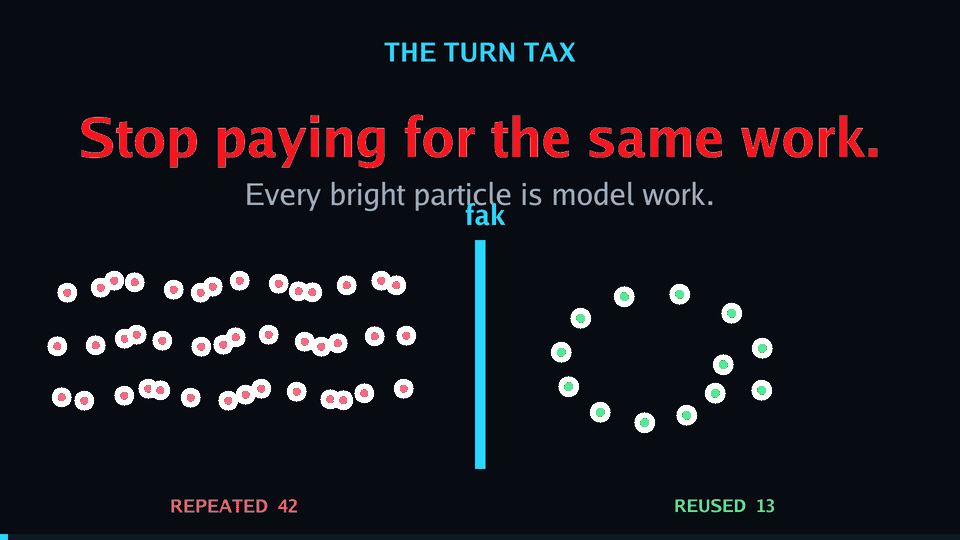

<p align="center">
  <picture><source media="(prefers-color-scheme: dark)" srcset="visuals/brand/fak-logo.svg"></picture>
</p>

# fak — the Fused Agent Kernel

**Manage the AI agent you already use.**

fak is an all-in-one agent boundary: one Go binary for model routing, context reuse, tool policy, journaling, and recovery. Put Claude Code, Codex, OpenCode, or a harness you write yourself on one side; keep its UI, login, cloud or local model, and tools on the other. The same native modules can also compose fleets of small, bounded agents in one process.

> **Start here:** install fak, then run `fak guard -- claude` to wrap the agent you already use with one drop-in command. It forwards your existing subscription credential—no separate API key—and places fak's managed-context decisions plus default-deny policy floor in front of every turn. The deterministic no-key proof remains below.

[](visuals/fak-homepage-hero.mp4)

<p align="center"><strong><a href="visuals/fak-homepage-hero.mp4">Watch the 20-second token-savings animation (MP4)</a></strong> · <a href="visuals/fak-hero-values.mp4">separate policy story</a> · <a href="tools/videogen/projects/token-savings/">reproduce the render</a></p>

[](LICENSE) [](https://pkg.go.dev/github.com/anthony-chaudhary/fak) [](https://github.com/anthony-chaudhary/fak/releases/latest) [](go.mod) [](https://deepwiki.com/anthony-chaudhary/fak)

<!-- readme-verified: 2026-08-15 vs VERSION 0.43.0 + BENCHMARK-AUTHORITY · process: tools/readme_freshness_audit.py + /refresh-readme -->

**Current focus: spend fewer tokens and turns.** See the [performance-first capability map](docs/CAPABILITIES.md) for the shipped turn-tax controls, stable-prefix reuse, managed context, per-call model routing, cache-value accounting, and out-of-band session controls. The security floor remains shipped and indexed, but it supports this efficiency story rather than leading it.

## Install and run

macOS or Linux (the installer verifies the release SHA-256):

```bash
curl -fsSL https://raw.githubusercontent.com/anthony-chaudhary/fak/main/install.sh | sh
fak manage claude                 # short form: fak m claude
```

With Go 1.26+, including Windows:

```bash
go install github.com/anthony-chaudhary/fak/cmd/fak@latest
fak manage --provider openai -- codex    # provider is normally auto-detected
```

`guard` starts a private gateway, points the child agent at it, and passes its model wire and credentials through unchanged. Add a capability floor with `--policy examples/dev-agent-policy.json`; opt into API billing with `--api-key-env`; or use local inference with `--local` or `--gguf`. Use that whole harness, or make your own loop against `fak serve`'s OpenAI-compatible API and MCP/tool boundary. On exit, fak reports reuse, context, and policy decisions.

See [INSTALL.md](INSTALL.md) for manual downloads, containers, source builds, and release verification, or [first-run troubleshooting](docs/adoption/troubleshooting-first-run.md) if the command refuses to start.

## What changes at the boundary

The largest avoidable cost is often not one token string but an entire extra model round trip: the resident prefix is processed again, latency is paid again, and the result enlarges later context. fak can measure that **turn tax**, complete kernel-known work without another model call, and let an operator budget or steer a live session without prompting the model to manage itself.

| Outcome | How fak provides it |
|---|---|
| **Less model work** | Stabilizes prefixes for provider caches, sheds stale history, deduplicates tool calls, and reuses the live KV cache when it owns inference. |
| **Longer, recoverable runs** | Compacts aged turns to a resident budget, checkpoints state, and resumes interrupted work. |
| **Tool control prompts cannot override** | Returns `ALLOW`, `DENY`, `TRANSFORM`, or `REQUIRE_WITNESS` before execution; untrusted results can be quarantined before reaching the model. |
| **One observable boundary** | Journals model traffic, reuse, compaction, policy, and recovery together. |
| **Backend choice** | Preserves cloud providers, fronts OpenAI-compatible servers, or loads GGUF weights while exposing OpenAI, Anthropic, and MCP interfaces. |

These are measured features. On the current 50-turn × 5-agent Qwen2.5-1.5B Q8 workload, fak did about **4.1× less compute work** than a tuned baseline that already kept each agent's KV cache warm (about 19 versus 78 minutes on an Apple M3 Pro). Real `fak manage -- claude` sessions compacted up to about 107K aged tokens per fire while holding resident context to 48K. Local policy verdicts measured 362 ns without argument predicates and 560–605 ns with them. Scope, hardware, units, and tuned baselines are in [BENCHMARK-AUTHORITY.md](BENCHMARK-AUTHORITY.md) and the tagged [claims ledger](CLAIMS.md).

<p align="center">
  
</p>

## Configure outcomes above implementations

fak is building a **portable intent** plane: name the behavior you want at a product layer,
then let a typed, versioned binding resolve it to the plugin, skill, prompt, model option, or
native mechanism available in each harness. A shared conversation-style profile, for example,
should not require every recipient to know or adopt the same implementation codename. The
contract and boundaries are in the [canonical problem map](docs/problems-we-solve.md#cross-cutting-outcome-portable-intent);
the runtime proof is tracked in [#6878](https://github.com/anthony-chaudhary/fak/issues/6878) and
is **not yet a shipped capability**.

## Use the whole harness—or make your own

`fak manage` is the all-in-one default: launch an existing coding agent and let fak own the boundary. `fak serve` is the composable default: write any loop or UI you want against a familiar OpenAI-compatible endpoint while fak keeps routing, context, policy, and evidence in one place.

| Goal | Command | Details |
|---|---|---|
| All-in-one managed agent | `fak manage claude` (or `fak m claude`) | Least-friction launch; model traffic and tool calls cross one observable boundary. [Claude](docs/integrations/claude.md) · [Codex](docs/integrations/openai-codex.md) · [all hosts](docs/supported/README.md) |
| Make your own harness | `fak serve --base-url http://localhost:11434/v1 --model qwen3.5:4b` | Your client owns the loop; fak supplies OpenAI, Anthropic, and MCP endpoints plus the tool checkpoint. [Server quickstart](docs/fak/server-quickstart.md) |
| Prove behavior offline | `fak agent --offline` | Deterministically demonstrates repair, reuse, policy denial, and result quarantine; writes `agent-report.json`. [Walkthrough](GETTING-STARTED.md#2-tier-0--try-the-kernel-zero-downloads-2-min) |
| Run many bounded agents | `go run ./cmd/microfleetdemo -selfcheck` | Proves 24 agents in one process, four resident at once, with shared base/model state, fair scheduling, hibernation, policy, and egress control. [Concept](docs/concepts/micro-agents.md) · [measured demo](cmd/microfleetdemo/README.md) |
| Use a Mac's local model from Claude Code | `fak mac` | Targets an existing `fak serve` gateway without replacing Claude's UI. [Setup and expectations](docs/fak/mac-agent-ui.md) |

### Local model defaults that fit real devices

Start with **`qwen3.5:4b`** in Ollama: its current quantized image is about 3.4 GB, supports tools, and is the practical default for an 8 GB-class GPU or a 16 GB unified-memory laptop. Move to **`qwen3.5:9b`** (about 6.6 GB) when you have roughly 12 GB of GPU memory or 24 GB of unified memory and want more coding/tool-use quality. Small context windows leave more room for weights and speed; long agent sessions need additional memory for the growing model cache.

```bash
ollama pull qwen3.5:4b
fak serve --base-url http://localhost:11434/v1 --model qwen3.5:4b
# Point any OpenAI-compatible SDK or home-grown loop at http://127.0.0.1:8080/v1
```

These are front-door defaults, not a model lock-in: fak fronts any model exposed by Ollama, llama.cpp, LM Studio, vLLM, SGLang, or another OpenAI-compatible server. For a literal one-process stack, pass a compatible GGUF file with `fak serve --gguf FILE`; that in-kernel engine is the bit-exact correctness path, while an external server remains the production-throughput default. See [supported models](docs/supported/models.md) for the gateway/native distinction.

```bash
fak agent --offline
# -> task completed (booked) YES / YES · poisoned result blocked YES · destructive op prevented YES
```

```text
Claude Code / Codex / OpenCode / your client
                    │
                    ▼
        fak: cache · context · policy · journal · recovery
                    │
                    ▼
       Anthropic / OpenAI / local server / GGUF
```

Every model request and proposed tool call crosses this checkpoint, so reuse happens before another inference, compaction before another context window is consumed, and policy before a tool runs. fak manages the boundaries without becoming the agent or model.

**Like Caveman’s fewer-token instinct or Ponytail’s “code you never wrote” instinct?** fak applies the same economy at the runtime boundary: keep repeated setup out of prompts, shed stale context, serve repeated work locally, and prevent unnecessary effects before they execute. It complements prompt/output compression and YAGNI-style coding guidance rather than replacing either. [See the plain-language comparison and choose the smallest useful layer.](docs/explainers/less-context-less-code.md)

After trying `guard`, `fak launch install --provider all --default claude` can install reversible provider shims so bare `claude`, `codex`, or `fak` uses the managed path. It never overwrites the original binaries; bypass it with `--fak-direct`, `FAK_DIRECT=1`, or `fak launch disable`. See the [zero-adoption guide](docs/zero-adoption-launch.md).

## Next steps

- **Use:** [complete first run](GETTING-STARTED.md) · [tutorial](docs/fak/tutorial.md) · [examples](examples/README.md) · [showcase](docs/showcase.html) · [integration guides](docs/integrations/)
- **Operate:** [serving](docs/serving/README.md) · [configuration](docs/fak/configuration.md) · [observability](docs/fak/observability.md) · [deployment](docs/fak/deployment-guide.md)
- **Understand:** [performance](docs/performance.md) · [architecture](docs/architecture.md) · [concepts](docs/concepts-and-story.md) · [glossary](docs/glossary.md)
- **Verify:** [benchmark methodology](docs/benchmark-methodology.md) · [reproduction packet](docs/repro-packet.md) · [claims](CLAIMS.md)
- **Contribute:** [contributing guide](CONTRIBUTING.md) · [security policy](SECURITY.md) · [documentation map](docs/index.md) · [front-page overflow](docs/README-legacy.md)

Apache-2.0. Report vulnerabilities privately as described in [SECURITY.md](SECURITY.md); participation is governed by the [Code of Conduct](.github/CODE_OF_CONDUCT.md).


