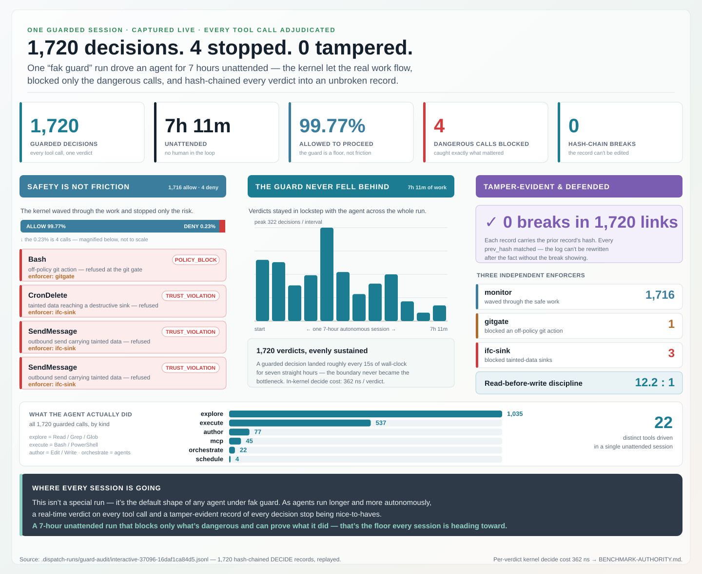

<p align="center">
  <picture><source media="(prefers-color-scheme: dark)" srcset="visuals/brand/fak-logo.svg"></picture>
</p>

# fak — the Fused Agent Kernel

**Same agent, smaller bill. Wrap Claude Code, Codex, or Cursor in one command — cheaper, self-resuming, and checked on every tool call.**

[](LICENSE) [](https://pkg.go.dev/github.com/anthony-chaudhary/fak) [](https://github.com/anthony-chaudhary/fak/releases/latest) [](go.mod) [](https://deepwiki.com/anthony-chaudhary/fak)

<!-- readme-verified: 2026-07-15 vs VERSION 0.41.0 + BENCHMARK-AUTHORITY · process: tools/readme_freshness_audit.py + /refresh-readme -->

fak is one small program you run in front of the agent you already use. Your model, IDE, and keys don't change.

```bash
fak guard -- claude   # run it in front of your agent: your Pro/Max plan, no API key, every tool call gets a verdict
```

**Pick your path:** [wrap your agent](#start-in-one-command) · [run it at the level you need](#run-it-at-the-level-you-need) · [15-min tutorial — no key, no GPU](docs/fak/tutorial.md) · [see it on video](visuals/hero-video.mp4) · [install](#install)

## Why people run it

- 💸 **Pay less for the same run** — **~4.1× less work than a tuned warm-cache stack** (up to **6.95×** on bigger models). Every agent shares one cached setup instead of rebuilding it each turn, on top of your provider's cache discount.
- 🛟 **Sessions that don't die.** Long runs trim their own history (**~107K tokens** per trim at the high end) and restart themselves after a crash — you never babysit the context window.
- 🔒 **You stay in control.** Every tool call gets an ALLOW / DENY verdict against a reviewable allow-list before it runs: **362 ns**, in-process, no model in the loop, no network hop.
- 🔌 **Nothing to rewrite.** Drop it in front of Claude Code, Codex, Cursor, or any OpenAI / Anthropic / MCP client. Your model, IDE, and keys stay exactly as they are.

Every number here traces to [BENCHMARK-AUTHORITY.md](BENCHMARK-AUTHORITY.md), and every claim in [CLAIMS.md](CLAIMS.md) carries exactly one tag — `[SHIPPED]`, `[SIMULATED]`, or `[STUB]`.

## Same agent, a fraction of the bill

<p align="center">
  
</p>

The savings aren't "fak randomly drops turns." fak's core job is to make several **caching layers work together safely** instead of fighting each other, all on by default: it keeps the cached prompt prefix **byte-identical** so the provider's prompt-cache discount never busts, sheds stale mid-session history before you pay to re-send it, and — when fak runs the model itself — owns the KV cache directly for exact prefix reuse. One coordinated system, and it never changes your model's answers. Across **495 real guarded sessions** that added up to **74.8%** of the API cost avoided (OBSERVED, versus a no-cache / no-compaction counterfactual priced at list); the card keeps each source's saving side by side, never blended — the provider's own rebate and fak's own compaction-shed (686M context tokens dropped). Against the *best already-shipped* alternative, a **tuned warm-cache stack**, the reuse win is **~4.1×**.

Every dollar traces to `fak cachevalue report` and its WITNESSED / OBSERVED ledgers; the reuse multipliers trace to [BENCHMARK-AUTHORITY.md](BENCHMARK-AUTHORITY.md). Plain-English tour of the defaults: [what "managed cache" is](docs/explainers/what-is-managed-cache.md).

## Start in one command

Wrap the agent you already run — no rewrite, no config file, no second terminal:

```bash
fak guard -- claude                                   # your Claude Code on your Pro/Max plan — no API key needed
fak guard --api-key-env ANTHROPIC_API_KEY -- claude   # bill the Anthropic API instead
fak guard --provider openai --api-key-env OPENAI_API_KEY -- opencode   # any OpenAI-compatible agent
```

Your credential passes through untouched; every tool call on that boundary gets a verdict, and on exit you get a savings-and-decisions summary. Proof a real `/v1/messages` turn crossed the gateway: [docs/integrations/claude.md](docs/integrations/claude.md).

**Try it now — no key, no GPU** (install is one line, [below](#install)):

```bash
fak routebench                                    # -> COST / LATENCY / QUALITY vs a one-model baseline
fak preflight --tool refund_payment --args "{}"   # -> DENY (DEFAULT_DENY): not on the allow-list, fail-closed
```

## Run it at the level you need

fak isn't only a wrapper. The same kernel scales up — from a drop-in in front of your agent, to running a model itself, to an always-on service that comes up on its own — carrying the same policy floor and cache coordination at every level.

| Level | Run | What you get |
|---|---|---|
| **Wrap your agent** *(start here)* | `fak guard -- claude` | your Pro/Max plan, no API key, a verdict on every tool call |
| **A local model in the kernel** | `fak guard --gguf qwen2.5:7b -- claude` | **~120 tok/s** on a single RTX 4070, no key, no network — a quality ramp, not a frontier coder |
| **An always-on service** | `fak node` installs `fak serve` as a system service | the kernel comes up on its own; any OpenAI/Anthropic client or MCP host points at it |
| **Codex / Cursor / MCP hosts** | keep your normal model wire; ask the kernel for verdicts over MCP | the policy floor without touching your agent |

Tested live with Claude Code, opencode, and Codex; 41 of 47 surveyed harnesses connect with a single base-URL change. Deep links: [local head-to-head](docs/benchmarks/LLAMACPP-HEADTOHEAD-RESULTS.md) · [node setup](docs/fak/node-setup.md) · [the serving side](docs/serving/README.md) · [Codex](docs/integrations/openai-codex.md) · [Cursor](docs/integrations/cursor.md) · [the catalogue](docs/supported/README.md).

## Every tool call gets a verdict

The speed seam doubles as a safety floor at no extra cost. A tool call crosses the kernel before it runs and comes back ALLOW, DENY, TRANSFORM, or REQUIRE_WITNESS — logged with a fixed reason code you can test against (`POLICY_BLOCK`, `SECRET_EXFIL`, …). Untrusted result bytes are quarantined before they can become the model's next instruction. The floor is a JSON file you copy, trim, and test — no model in the loop; starter floors ship for coding, support, DevOps, trading, and clinical/PHI. Point at one with `fak guard --policy examples/<file>`. More: [POLICY.md](POLICY.md) · [examples/README.md](examples/README.md) · [the tool call is a syscall](docs/explainers/tool-call-is-a-syscall.md).

<p align="center">
  
</p>

One real `fak guard` run, replayed from its hash-chained decision journal: an agent worked **7 hours unattended** while the kernel put a verdict on **every one of 1,720 tool calls** — waving the work through, blocking only the four that were dangerous, and chaining every decision into a record that can't be edited after the fact. Nothing about it is special; it's the default shape of any agent behind the gate. Every number recomputes from the journal into a checkable [stats sidecar](visuals/74-session-effectiveness.stats.json); the per-verdict cost traces to [BENCHMARK-AUTHORITY.md](BENCHMARK-AUTHORITY.md).

## Install

```bash
go install github.com/anthony-chaudhary/fak/cmd/fak@latest
```

Go 1.26+ is required (as of 2026-07-15; source: [`go.mod`](go.mod)); no external Go dependencies, no `go.sum`. From a clone: `go build -o fak ./cmd/fak`. Prebuilt archives and containers: [INSTALL.md](INSTALL.md). Build/test/ship: [CONTRIBUTING.md](CONTRIBUTING.md).

## The honest fence

For raw token throughput, reach for vLLM or SGLang — fak is the agent kernel around them, not a replacement. Prompt-injection classifiers help, but tool authority comes from your policy file, not the model. Keep irreversible or data-exfiltrating tools off the allow-list. Full list: [what fak is not](docs/explainers/what-fak-is-not.md).

## Docs

Going deeper starts at the [front-page overflow](docs/README-legacy.md) — why now, the per-domain use-case catalogue, model routing, vCache, Slack sessions, and everything moved off this page.

| If you want... | Read |
|---|---|
| Guided first session (15 min) · absolute-beginner start | [docs/fak/tutorial.md](docs/fak/tutorial.md) · [START-HERE.md](START-HERE.md) |
| Which do I run — gateway, agent runtime, or client? | [docs/explainers/runtime-vs-client.md](docs/explainers/runtime-vs-client.md) |
| The serving side — run a model behind the gateway, ride vLLM/SGLang, scale out KV | [docs/serving/README.md](docs/serving/README.md) |
| Install + the four usage tiers | [GETTING-STARTED.md](GETTING-STARTED.md) · [LEARNING-PATH.md](LEARNING-PATH.md) |
| Long sessions / cache · you never manage context | [docs/explainers/long-sessions-keep-the-cache-hit.md](docs/explainers/long-sessions-keep-the-cache-hit.md) · [docs/explainers/you-never-manage-the-context-window.md](docs/explainers/you-never-manage-the-context-window.md) |
| What "managed cache" is, in plain English | [docs/explainers/what-is-managed-cache.md](docs/explainers/what-is-managed-cache.md) |
| Capability floor (policy) · security model | [POLICY.md](POLICY.md) · [docs/fak/security.md](docs/fak/security.md) |
| CLI verbs · supported models / engines / harnesses | [docs/cli-reference.md](docs/cli-reference.md) · [docs/supported/README.md](docs/supported/README.md) |
| Every feature, by subsystem, with honest status (shipped / simulated / stub) | [docs/supported/features.md](docs/supported/features.md) |
| Benchmark authority · gallery · honesty ledger | [BENCHMARK-AUTHORITY.md](BENCHMARK-AUTHORITY.md) · [BENCHMARK-GALLERY.md](BENCHMARK-GALLERY.md) · [CLAIMS.md](CLAIMS.md) |
| Machine-readable map | [llms.txt](llms.txt) |

---

<p align="center">
  <strong>When in doubt, <code>fak</code> it out.</strong><br>
  <sub><em>Once you go fak, you never go back · Give a fak — ship on trunk · Don't take our word for it, take a fak's</em></sub>
</p>

License: [Apache-2.0](LICENSE).
