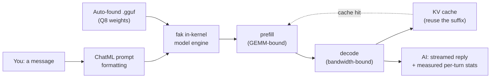

# 🤖 Simple Demo - Chat with a Local AI

The friendliest way to run an AI model on your own computer. **No API key, no cloud, no cost.**

By default it **samples** (temperature 0.5, time-seeded), so replies vary run to run;
pass `-temp 0` for **deterministic**, reproducible output (greedy/argmax — the same prompt
gives the same answer). A reply **completes in a few seconds** (model load ~5 s), then
streams at roughly 15–50 tokens/sec on a laptop CPU.



*Run flow per the page: your message is ChatML-formatted and run end to end inside fak's in-kernel engine; prefill is GEMM-bound and decode is bandwidth-bound, and a later turn reuses the prior turn straight out of the KV cache.*


## Quick Start

**If you have a .gguf model:**
```bash
go run ./cmd/simpledemo
```

The demo auto-finds models in these locations:
- `C:\Users\You\models\*.gguf` (Windows)
- `~/.cache/fak-models/gguf/*.gguf`
- `~/Downloads/*.gguf`

**First time? No model?**

The demo will show you exactly how to get one. Just run:
```bash
go run ./cmd/simpledemo
```

---

## What You'll See

```
🤖 Found model: Qwen2.5-1.5B-Instruct.Q8_0.gguf

📦 Loading model...
✅ Loaded qwen2 in 5.1s (tokenizer: embedded in model file)
🧠 qwen2 · 28 layers · d_model 1,536 · 12 heads / 2 KV (GQA 6×) · head_dim 128 · ffn 8,960 · vocab 151,936 · ctx 32,768
💾 weights 2.49 GiB resident (q8_0) · KV 84 KiB/token · decode stream 1.62 GiB/token
⚙️  device cpu (pure-Go Q8 reference) · 32 threads · backends available: [cpu-ref]
    └─ no GPU backend in this build — rebuild `-tags cuda` on an NVIDIA box (or `-tags fakmetal` on Apple) and pass `-backend cuda` to run on the GPU
🎯 sampling: greedy (argmax) · temp 0.00 · max 40 tok/reply · q8_0 weights
🧮 prefill @ P=512 ≈ 1364.7 GFLOP (counted, not timed) · heaviest ffn_gate 394.6 GFLOP · attention intensity 0.50 FLOP/B (memory-bound)

💬 Chat with your AI! Type a message and press Enter.
   Commands: /clear = new chat, /exit = quit

You: My name is Sam and I like astronomy.
AI: Great! Astronomy is a fascinating field. What areas interest you?
📊 turn 1 · cpu (pure-Go Q8 reference)
   prefill  34 tok in · 2.93s · 12 tok/s · cache cold (0%, 34 recomputed)
   decode   16 tok out · 1.27s · 12.6 tok/s · 22 GB/s of the 1.62 GiB/token stream
   compute  full 34-tok prefill ≈ 89.7 GFLOP · heaviest ffn_gate 26.2 GFLOP · this turn 89.7 GFLOP @ 30.6 GFLOP/s
   total    4.20s · TTFT 2.93s · KV 52 pos / 4.3 MiB · session cache hit 0%

You: What is my name?
AI: Your name is Sam.
📊 turn 2 · cpu (pure-Go Q8 reference)
   prefill  13 new tok · 1.55s · 8 tok/s · cache hit 80% (52/65 reused, 13 recomputed)
   decode   5 tok out · 0.35s · 14.4 tok/s · 25 GB/s of the 1.62 GiB/token stream
   compute  full 65-tok prefill ≈ 171.2 GFLOP · heaviest ffn_gate 50.1 GFLOP · this turn 34.2 GFLOP @ 22.1 GFLOP/s
   total    1.89s · TTFT 1.55s · KV 72 pos / 5.9 MiB · session cache hit 53%
```

Every number is either **measured this run** (the tok/s, the GB/s, the wall times) or
**counted from the model shape** (the GFLOP roofline, the KV bytes) — nothing is assumed.
Note how the second turn only re-prefills the **new** 13 tokens: the system prompt and the
first turn are reused straight out of the KV cache (an **80% cache hit**), so the kernel
recomputes a suffix instead of the whole conversation. Prefill and decode are reported
**separately** because they are different regimes — prefill is GEMM-bound (and the analytic
roofline shows where), decode is bandwidth-bound (the `GiB/token` stream sets its ceiling).

---

## Scope — what this demo does and does not claim

This demo shows one thing: **fak's in-kernel model engine** running a small GGUF model
end to end, with every speed and memory number measured this run or counted from the
model shape.

It does **not** claim:

- **It is not the security gate.** This binary only runs the model — it wires no policy,
  tool-calling, or capability enforcement. fak's agent permission gate is a separate,
  load-bearing layer ([the security model](../../docs/fak/security.md)); this demo neither
  exercises nor proves it. To see the gate, run the [adjudication demo](../../examples/adjudication-demo/README.md).
- **It is not a quality benchmark.** A 0.5B–3B model is the *point* (it runs on a laptop
  with no GPU), so answers are limited — expect simple-prompt competence, not deep
  reasoning, long-context recall, or reliable factual knowledge. The
  [model table](#model-recommendations) and [Tips for Small Models](#tips-for-small-models)
  below are the honest expectation-setters.
- **The numbers describe *this* run on *your* box.** tok/s and GB/s are measured live and
  vary with your CPU, threads, and model; they are not a portable performance claim.

For the limits of fak as a whole, see the [FAQ](../../docs/fak/faq.md).

---

## Commands

| Command | What It Does |
|---------|--------------|
| `/exit` or `/quit` | Quit the demo |
| `/clear` | Start a fresh conversation |

---

## Model Recommendations

| Model | Size | Quality | Speed | RAM |
|-------|------|---------|-------|-----|
| **0.5B Q8** | 500MB | Good | ⚡⚡⚡ | 2GB |
| **1.5B Q8** | 1.6GB | Better | ⚡⚡ | 3GB |
| **3B Q4_K_M** | 2GB | Best | ⚡ | 5GB |
| **27B Q4_K_M** | 16GB | Excellent | Needs GPU | 16GB+ |

**Download from:** [HuggingFace](https://huggingface.co/models?search=gguf qwen2.5 instruct)

Save to `C:\Users\You\models\` (Windows) or `~/models/` (Linux/Mac).

---

## Advanced Usage

```powershell
# Use a specific model
.\simpledemo.exe -gguf C:\path\to\model.gguf

# Adjust response length
.\simpledemo.exe -n 256

# Change creativity (temperature)
.\simpledemo.exe -temp 0.3  # Focused
.\simpledemo.exe -temp 0.9  # Creative

# Custom system prompt
.\simpledemo.exe -sys "You are a coding expert. Be concise."
```

---

## Tips for Small Models

1. **Keep prompts short** - One question at a time
2. **Be specific** - "Write a function to sort a list" beats "Help me code"
3. **Use `/clear`** - Start fresh if the model gets confused
4. **Lower temperature** - Use `-temp 0.3` for factual answers

---

## Troubleshooting

### "No model found"

Place a `.gguf` file in one of these locations:
- Windows: `C:\Users\You\models\`
- Linux/Mac: `~/models/`
- Or anywhere, then use: `-gguf /path/to/model.gguf`

### "Tokenizer not found"

Rare — the demo uses the tokenizer **embedded in the `.gguf`** by default, so most models
need no separate file. You only hit this if your GGUF embeds no usable tokenizer; then
download `tokenizer.json` from the same HuggingFace page as your model and save it next to
the `.gguf` file (or pass `-tok /path/to/dir`).

### Slow responses

- Try a smaller model (0.5B is fastest)
- Close other programs to free RAM
- First response is always slower (model "reads" your prompt)

### Garbled or repetitive output

Make sure you're on a build that includes the NEOX-rope GGUF fix: Qwen/Gemma/Phi GGUFs
used to decode as repetitive token-salad ("mand mand…") before it, and no temperature
setting fixes that. The same model/build mismatch makes the reply collapse into a loop
(`2 2 2 …` when sampling, `.assistant.assistant…` under greedy `-temp 0`) — issue #91.

The demo now **detects** that case and prints a `⚠️ That reply looks degenerate` warning
so a first run never silently hands you gibberish. On a fixed build the reply is coherent;
if output still looks off, try a lower temperature: `-temp 0.3`.

The greedy non-degeneracy guard is regression-tested. With a model on disk:

```bash
FAK_SIMPLEDEMO_GGUF="$HOME/.cache/fak-models/gguf/Qwen2.5-1.5B-Instruct.Q8_0.gguf" \
    go -C fak test ./cmd/simpledemo/ -run TestGreedyNonDegenerate -v
```

(The detector's own unit tests run with no model: `go -C fak test ./cmd/simpledemo/`.)

---

## Behind the Scenes

This demo uses **fak's in-kernel model engine**:

- Model runs inside the same process
- No external server needed
- Full ChatML prompt formatting
- Quantized (Q8) for speed while keeping quality

---

## What's Next?

- Explore the full fak system: [GETTING-STARTED.md](../../GETTING-STARTED.md)
- Learn about tool-calling agents (the gate this demo skips): [the CLI reference](../../docs/cli-reference.md)
- Try different models from [HuggingFace](https://huggingface.co/models?search=gguf qwen2.5 instruct)
