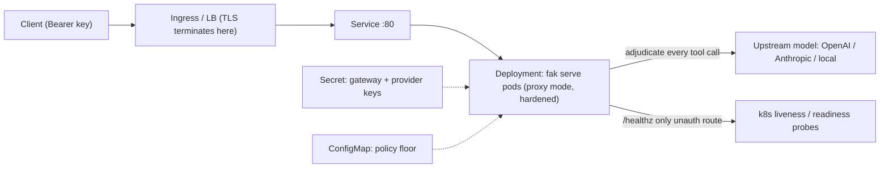

# fak on Kubernetes

A committed, apply-ready manifest for running `fak serve` — the kernel gateway that
adjudicates every proposed tool call — on Kubernetes in **proxy mode** (fak
adjudicates; an upstream OpenAI/Anthropic/local model generates). To run the model
**in-kernel on a rented GPU** instead, use the
[GPU (in-kernel) overlay](#gpu-in-kernel-overlay) below.

This is the artifact the deployment guide's
[Kubernetes section](../../docs/fak/deployment-guide.md#3-kubernetes) describes,
materialized as files you can `kubectl apply` directly instead of copying out of a
fenced block. **The [deployment guide](../../docs/fak/deployment-guide.md) is the
source of truth** for every flag, env var, route, and default — read it for the
production-readiness checklist before exposing the gateway beyond loopback.



## What's here

| File | What it is |
|---|---|
| [`fak.yaml`](fak.yaml) | The whole stack: a `Secret` (gateway + provider keys), a policy `ConfigMap`, a hardened `Deployment`, and a `Service`. |
| [`kustomization.yaml`](kustomization.yaml) | Wraps `fak.yaml` so `kubectl apply -k deploy/k8s` works and you can patch image / namespace / replicas without editing the manifest. |
| [`overlays/gpu/`](overlays/gpu/) | The **GPU (in-kernel)** stack: [`fak-gpu.yaml`](overlays/gpu/fak-gpu.yaml) (Secret, policy ConfigMap, weights PVC, one-GPU Deployment, Service) + its kustomization — `kubectl apply -k deploy/k8s/overlays/gpu`. |

The committed `Deployment` adds two hardenings on top of the guide's example —
`seccompProfile: RuntimeDefault` and `automountServiceAccountToken: false` (fak never
calls the Kubernetes API) — and otherwise matches it field-for-field.

## The one rule that bites first

A network-facing gateway **must** set `--require-key-env` and pin a policy floor.
`/healthz` is the only unauthenticated route (it drives the probes); every other
route requires `Authorization: Bearer <key>`. **TLS belongs at the edge** — terminate
it at your Ingress / load balancer and route cleartext HTTP to the `Service`; fak
speaks plain HTTP.

## Apply

1. **Image.** `fak.yaml` already pulls the published, public
   `ghcr.io/anthony-chaudhary/fak:0.36.0` image — no build or push needed. For an
   air-gapped cluster or a private-registry mirror, build the repo
   [`Dockerfile`](../../Dockerfile) yourself and point `image:` (or the kustomize
   `images:` override) at your own registry instead:

   ```bash
   docker build -t REGISTRY/fak:0.36.0 .
   docker push REGISTRY/fak:0.36.0
   ```

2. **Fill the Secret.** Replace the placeholders in `fak.yaml` (or, in production,
   prefer a real secret manager / `kubectl create secret generic fak-secrets ...`):

   ```bash
   openssl rand -hex 32   # use this for gateway-key
   ```

3. **Apply** (either form):

   ```bash
   kubectl apply -k deploy/k8s            # via kustomize
   kubectl apply -f deploy/k8s/fak.yaml   # the raw manifest
   kubectl rollout status deploy/fak
   ```

4. **Smoke test:**

   ```bash
   kubectl port-forward svc/fak 8080:80
   curl -s http://127.0.0.1:8080/healthz   # {"ok":true,...}  (no auth)
   ```

## GPU (in-kernel) overlay

[`overlays/gpu/`](overlays/gpu/) is the **in-kernel** sibling of the proxy stack for
neo-cloud clusters (CoreWeave CKS, Lambda Cloud k8s, GKE/EKS GPU pools): fak runs the
model itself from a mounted `.gguf` (`--engine inkernel --backend cuda`) instead of
proxying an upstream. The Deployment requests `nvidia.com/gpu: 1` (request **and**
limit), mounts weights read-only from a `fak-weights` PVC, and passes
`--gguf /weights/model.gguf`. Every resource is named `fak-gpu*`, so it applies
cleanly **alongside** the proxy stack — nothing is shared, and applying it never
overwrites a proxy Secret you already filled.

**Prerequisites** — fak installs neither:

1. The **NVIDIA device plugin** (or the full GPU Operator) is already installed on
   the cluster: `kubectl get nodes -o json | jq '.items[].status.allocatable'` must
   show `nvidia.com/gpu`. Some clusters additionally key GPU pods on a RuntimeClass;
   `runtimeClassName: nvidia` is a documented, commented-out knob in the manifest.
2. **Weights on the claim.** Load the `.gguf` once onto the `fak-weights` PVC at
   `/weights/model.gguf` (e.g. `kubectl cp` through a temporary pod that mounts the
   claim, an rsync Job, or your cloud's dataset tooling); every restart reuses it.

**Apply:**

```bash
kubectl apply -k deploy/k8s/overlays/gpu                    # via kustomize
kubectl apply -f deploy/k8s/overlays/gpu/fak-gpu.yaml       # the raw manifest
kubectl rollout status deploy/fak-gpu                       # waits for model load
kubectl port-forward svc/fak-gpu 8080:80
curl -s http://127.0.0.1:8080/healthz   # 200 only AFTER the model is loaded
```

**Image tag.** The manifest pulls `ghcr.io/anthony-chaudhary/fak:cuda-latest` — the
CUDA variant built from [`Dockerfile.cuda`](../../Dockerfile.cuda) (#2661) that the
release workflow publishes as `<version>-cuda` + `cuda-latest`. Pin the versioned tag
(the `images:` example in the overlay's kustomization) for reproducible deploys. Two
caveats: the first versioned `-cuda` tag ships with the first release cut **after**
`Dockerfile.cuda` landed (it is not in the v0.37.0 tree) — until then build and push
your own; and the published image compiles kernels for **one** compute capability
(default `sm_89`, Ada/L4) — for A100 (`sm_80`), H100/H200 (`sm_90`), or B200
(`sm_100`), build with `--build-arg CUDA_ARCH=...`.

**Probes.** `/healthz` still drives liveness **and** readiness — it answers 200 only
once the model is loaded. The overlay raises `initialDelaySeconds` (600 s liveness,
30 s readiness) as the model-load budget: a large `.gguf` takes minutes to load, and
an early liveness kill would restart-loop the pod. Tune to your model.

**Hardening.** The container keeps the base's hardened `securityContext`, including
`readOnlyRootFilesystem: true` — the weights come from the mounted PVC, not a
writable root. One GPU-image-specific addition: the pod pins `runAsUser: 999`,
because `Dockerfile.cuda` declares its user by **name** (`USER fak`) and the kubelet
refuses `runAsNonRoot` containers whose non-root-ness it cannot verify from a
non-numeric user.

**Why self-contained, not a patch-overlay?** kustomize's root-containment rule
refuses `deploy/k8s` as a base of its own subdirectory, and restructuring into
`base/` + `overlays/` would break the documented `kubectl apply -k deploy/k8s` path.
So `overlays/gpu/` carries its own full manifest and the proxy base stays untouched.

## Notes

- **Proxy vs in-kernel.** `fak.yaml` is proxy mode. For **in-kernel** mode (`--gguf`)
  on a GPU cluster, use the committed
  [GPU (in-kernel) overlay](#gpu-in-kernel-overlay) above — it mounts the weights
  from a PVC, sizes memory (and GPU) to the model, raises
  `FAK_HTTP_WRITE_TIMEOUT_S` / `FAK_PLANNER_TIMEOUT_S` (write ≥ planner), and uses a
  longer `initialDelaySeconds`. See the guide for the underlying knobs.
- **Reload policy without a restart.** Edit the `fak-policy` ConfigMap, let the mount
  refresh, then `POST /v1/fak/policy/reload` (with the bearer token) to each pod.
- **No Helm chart yet.** This raw manifest (+ kustomize) is the supported path; a Helm
  chart is not shipped.

## See also

- [deployment-guide.md](../../docs/fak/deployment-guide.md) — Docker, Compose, k8s, bare metal, and the readiness checklist
- [server-config.md](../../docs/fak/server-config.md) — every flag, env var, route, and default
- [security.md](../../docs/fak/security.md) — threat model and hardening for a network deploy
