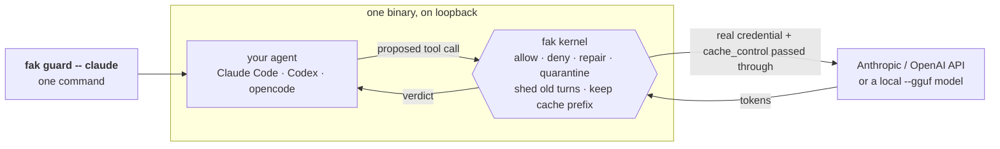
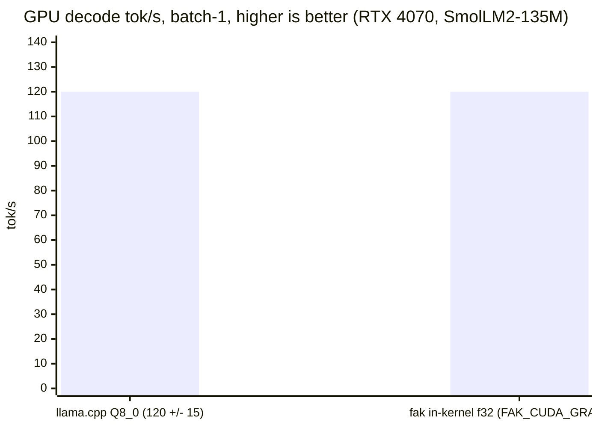
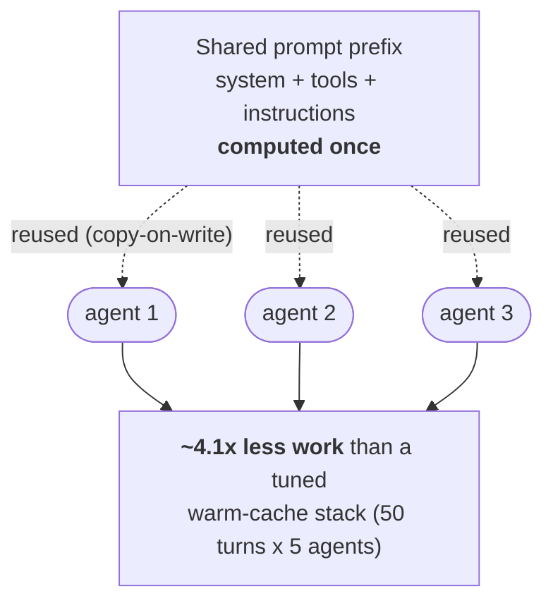
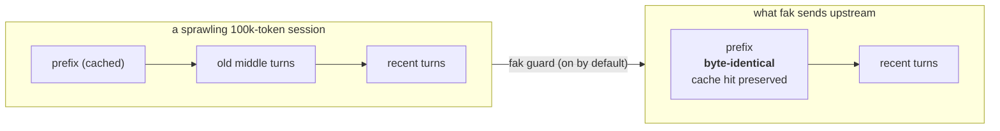

# fak — front-page overflow (moved off README.md)

These sections used to live on the front page. They were moved here on
2026-06-28 (and a second batch on 2026-07-01, when the front page was halved)
to keep `README.md` focused on what the lowest-common-denominator reader needs
first — performance and cost, the no-key demo, and the one-command wrap.
Nothing here is deprecated; it is narrower-audience or deep-dive material that
earns a link from the front page rather than a place on it. The pre-restructure
front page is archived at
[README-2026-06-25-before-fresh-start.md](archive/README-2026-06-25-before-fresh-start.md).

Each claim still carries the same authority it did on the front page — every
number traces to [BENCHMARK-AUTHORITY.md](../BENCHMARK-AUTHORITY.md), and every
tagged claim to [CLAIMS.md](../CLAIMS.md).

---

## Why Now

The agent stack has moved from demos into operations. Coding agents now have
plugins and background agents. They also have MCP servers, prompt caches, long
sessions, and live tool permissions.

Recent public tooling points in the same direction. MCP reliability, auth, and
observability work is active. Claude Code is shipping MCP and sandbox permission
fixes. Security writing has moved toward runtime tool poisoning alongside prompt
wording.

That changes the useful first screen for `fak`. The value is:

- Make prompt-cache and routing decisions explicit enough to test — and keep the
  cache discount alive across a long session instead of busting it.
- Preserve a traceable, privacy-conscious audit trail of every tool call.
- Put a default-deny floor under the tools your agent already has.
- Keep poisoned tool output and secret-shaped results out of model context.

Relevant external signals: [Claude Code changelog](https://code.claude.com/docs/en/changelog),
[MCP stateless/auth discussion](https://dev.to/alexmercedcoder/ai-weekly-codex-goes-long-mcp-goes-stateless-584d),
and [MCP tool-poisoning/security analysis](https://www.cybedefend.com/en/blog/mcp-security-tool-poisoning).

## Use Cases By Domain

Each row is a starter policy floor: a reviewable allow-list you copy, trim, and run
`fak preflight` against to watch the floor bite. Point your agent at one with
`fak guard --policy examples/<file>` (or `fak serve --policy …` for a gateway). The
full catalogue, with a witness command per floor, is in
[examples/README.md](../examples/README.md).

| Domain | Starter floor | The dangerous action it denies |
|---|---|---|
| Coding agent | [`presets/coding-agent-safe.json`](../examples/presets/coding-agent-safe.json) | force-push, `git add -A`, out-of-tree writes, destructive shell |
| Coding agent (push feature branches) | [`protected-push-floor-policy.json`](../examples/protected-push-floor-policy.json) | a `git_push` whose ref is `main`/`release/*`, by argument value |
| PR-review bot | [`code-review-bot-policy.json`](../examples/code-review-bot-policy.json) | `merge_pull_request`, `git_push`, `workflow_dispatch` |
| Customer support | [`customer-support-readonly-policy.json`](../examples/customer-support-readonly-policy.json) | `refund_payment`, direct account or email action |
| Open-web research | [`research-agent-policy.json`](../examples/research-agent-policy.json) | `send_email`, shell, upload, arbitrary note path |
| Browsing / scraping | [`browser-web-agent-policy.json`](../examples/browser-web-agent-policy.json) | `submit_form`, `execute_script`, a `file:`/`javascript:` URL |
| Email / calendar | [`email-calendar-assistant-policy.json`](../examples/email-calendar-assistant-policy.json) | `send_email`, `forward_email`, `invite_external_guest` |
| Infra / DevOps review | [`devops-dryrun-policy.json`](../examples/devops-dryrun-policy.json) | `terraform_apply`, exec, delete, production deploy |
| Flight booking | [`flight-booking-agent-policy.json`](../examples/flight-booking-agent-policy.json) | `refund_payment`, `export_pnr`, a `$10k+` fare |
| Trading / brokerage | [`finance-trading-agent-policy.json`](../examples/finance-trading-agent-policy.json) | `withdraw_funds`, a six-figure order, a `short` side |
| Clinical / PHI | [`healthcare-phi-policy.json`](../examples/healthcare-phi-policy.json) | `export_patient_data`, `email_phi`, record delete |
| BI / SQL analyst | [`sql-analyst-policy.json`](../examples/sql-analyst-policy.json) | a `DROP`/`INSERT` inside an allowed read-query tool |

Each denied action escalates to that floor's human safe sink instead of failing
silently. Every refusal cites a closed reason code you can assert on, such as
`POLICY_BLOCK`, `OVERSIZE`, or `SECRET_EXFIL`.

## vCache: Provider Cache As A Budget Signal

A provider's prompt cache is not memory you control. You cannot ask it to evict a span
or prove a prefix is resident. You just get telemetry after the request. So `fak vcache`
treats a cache hit as a realized rebate, never something the answer depends on. It
proves or refutes each saving from the provider's own usage counters.

```bash
./fak vcache status
./fak vcache prove
```

Evidence from two live traces:

- Claude Code prefix probe: **13,141.5 input-token equivalents saved** over four
  sibling turns, **4.73%**.
- Codex/OpenAI session telemetry: **9,147,340.8 token equivalents saved** over
  68 token-count events, **85.98%**.

Those are provider-cache accounting proofs on those traces: `fak` supplies the
accounting and control plane. The design contract, the full command set, and the
causality fences are on the
[vCache page](notes/VCACHE-VIRTUAL-API-CACHE-2026-06-24.md); the Codex/OpenAI
probe is written up in
[the probe note](../experiments/agent-live/VCACHE-CODEX-OPENAI-PROBE-2026-06-25.md).

## Model Routing And Router Fusion

Most routers pick one model for a whole request. `fak route` routes an aspect
instead. The unit can be the request or one tool call. It can also be a
sub-query, reasoning step, or tagged stage.

An ensemble is a first-class plan. Supported reductions include `vote` and
`best_of`. They also include `first`, `concat`, and scalar `all_reduce`.

Try it offline:

```bash
./fak route --aspect tool_call --tool write_file --simulate "approve,deny,deny"
./fak route --aspect step --complexity high
./fak routebench
```

The router is useful because it sits at the same point as the security floor. A
write-shaped call can route to a guard ensemble. An easy read can route to a
cheap model. A tenant-sensitive payload bound for a remote route is denied by
the residency floor.

Read [docs/model-routing.md](model-routing.md) and
[docs/integrations/litellm.md](integrations/litellm.md).

## Three axes of the same kernel

`fak`'s invariants repeat along three dimensions:

- **Scale axis** (vertical): tool call → turn → session → fleet → RSI. How much of
  the stack lives in one address space. The same observe → decide → act → verify
  shape and trust invariant recur at every ring.
- **Depth axis** (downward): CPU reference → CUDA → Vulkan → Metal. Which silicon
  runs the matmul. New backends plug in via registration against the compute HAL.
- **Deployment-substrate axis** (across): IoT → edge → laptop → hyperscaler.
  What *kind of box* and how big. The same workload shape (agent loop proposing
  tool calls) and the same invariants (default-deny, quarantine, bit-exact reuse,
  tamper-evident audit) do not change with the box.

The crossing point is one kernel present at the most scales, depths, and substrate
targets, carrying the same invariants through all of them — the way Linux runs on
the phone in your pocket and the rack training the model on it. See [the
cross-platform spine](explainers/cross-platform-spine.md).

## What the kernel does

The at-a-glance surface table (moved off the front page 2026-07-01):

| Surface | What it gives you | Status |
|---|---|---|
| `fak guard` | Drop-in guard around an existing CLI agent | shipped |
| `fak node` | Install/connect an always-on `fak serve` gateway as a system service | shipped |
| `fak console` | Native operator/client panes for issues, live sessions, guard artifacts | shipped |
| `fak serve` | OpenAI, Anthropic, fak-native HTTP, plus MCP over HTTP/stdio | shipped |
| Capability floor | JSON allow/deny manifest with closed refusal reasons | shipped |
| Result quarantine | Secret, poison, oversize, and pollution results held out of context | shipped |
| Audit/metrics | JSON logs, optional hash-chained journal, Prometheus, `/debug/vars` | shipped |
| Session control | Budgets, reset directives, cooperative MCP reset, live session state | shipped |
| Model routing | Per-aspect routing, ensembles, routebench, gateway seam | shipped spine |
| In-kernel model | Pure-Go reference model, kernel-owned KV cache, GPU/backend witnesses | correctness/reference path |
| Cross-platform spine | One kernel across the deployment substrate (IoT → edge → laptop → hyperscaler) | shipped |

Every claim in [CLAIMS.md](../CLAIMS.md) carries exactly one tag: `[SHIPPED]`,
`[SIMULATED]`, or `[STUB]`. The lint gate enforces that honesty ledger.

## Benchmarks, in one page

The rule is simple: every number traces to
[BENCHMARK-AUTHORITY.md](../BENCHMARK-AUTHORITY.md). The ones worth remembering:

- 50-turn × 5-agent Qwen2.5-1.5B authority row: 4.1× vs a tuned warm-cache stack (prefix
  reuse climbs to 6.95× across the model ladder). Larger figures are fenced as vs-naive.
- GPU decode on the gated reusable-CUDA-graph path (`FAK_CUDA_GRAPH=1`): ~120 tok/s on an
  RTX 4070 (SmolLM2-135M, f32), inside llama.cpp's Q8_0 band of 120 ± 15 tok/s. Framing:
  [LLAMACPP-HEADTOHEAD-RESULTS.md](benchmarks/LLAMACPP-HEADTOHEAD-RESULTS.md).
- Native in-kernel continuous batching: 1.54× req/s at 8-way batch (synthetic CPU witness)
  vs the legacy per-request lifecycle.
- WebVoyager geometry model: 8-worker fleet prefill is 1.10× less work than tuned per-agent
  KV (9.7× less than the naive re-prefill floor). Modeled prefill-token work, not wall-clock.
- Pure-kernel decide latency: 362 ns per allow decision; the read-path floor is ~0.55 ns/op,
  flat from 1 to 1000 registered drivers.

Use vLLM or SGLang for raw token serving. Put `fak` on the agent boundary for reuse, routing,
audit, and the capability floor.

## The front-page diagrams

How `fak guard -- claude` sits in the loop:



In-kernel f32 GPU decode versus a quantized llama.cpp (both land at ~120 tok/s; fak's
119–120 sits inside llama.cpp's Q8_0 band of 120 ± 15):



The shared prompt prefix, computed once and reused across a fleet:



Shedding old turns while keeping the provider cache prefix byte-identical:



## `fak serve` in front of any compatible client

The gateway recipe that used to sit on the front page. Put `fak serve` in front of a model
endpoint and point the client at it:

```bash
fak serve --addr 127.0.0.1:8080 \
  --base-url http://localhost:11434/v1 --model qwen2.5:1.5b \
  --policy examples/dev-agent-policy.json
```

OpenAI traffic goes to `http://127.0.0.1:8080/v1`, Anthropic Messages to the bare host.
Harden with `--require-key-env FAK_TOKEN` and scrape `/metrics`. For MCP hosts,
`fak serve --stdio --policy examples/dev-agent-policy.json` exposes five kernel tools
(`fak_adjudicate` / `fak_syscall` / `fak_admit` / `fak_context_change` plus a session
reset). See [GETTING-STARTED.md](../GETTING-STARTED.md),
[fak/api-reference.md](fak/api-reference.md), and [../examples/mcp](../examples/mcp).

The kernel also reports live prefill vs decode tok/s on `/metrics`, so a slow first request
gets an answer instead of a shrug. The operating board that keeps the multi-agent reuse,
O(1) context/query, provider-cache, and KV-deletion work on the product path:
[CACHE-FRONTIER-OPERATING-PLAN.md](CACHE-FRONTIER-OPERATING-PLAN.md).

## Build, test, and ship (the front-page detail)

The badges on the front page mirror the local loop: `go build ./cmd/fak`, `make test-fast`,
`make ci`. On native Windows, `go build` and `go vet` work normally, but native `go test`
can be blocked by OS Application Control on freshly compiled test binaries — use
`./test.ps1` under WSL for the full suite on that host.

Run the cheapest witness that covers your change first: `make test-fast` for code,
`python tools/readme_freshness_audit.py --json` for the front page, or the relevant
`--dry-run`/`--check` command. Then use `make ci` as the green bar before delivery.

Shipping is continuous but path-scoped. Preview the exact subject and files with
`fak commit --preview -m "<subject>" --path <p>`, commit only those paths, and push after
the gate is green. Each pushed commit should be a self-building snapshot; do not rely on a
later commit in the same push to repair a broken intermediate. No side branch, no
`git add -A`, no force-push.

---

The current front page is [README.md](../README.md).
