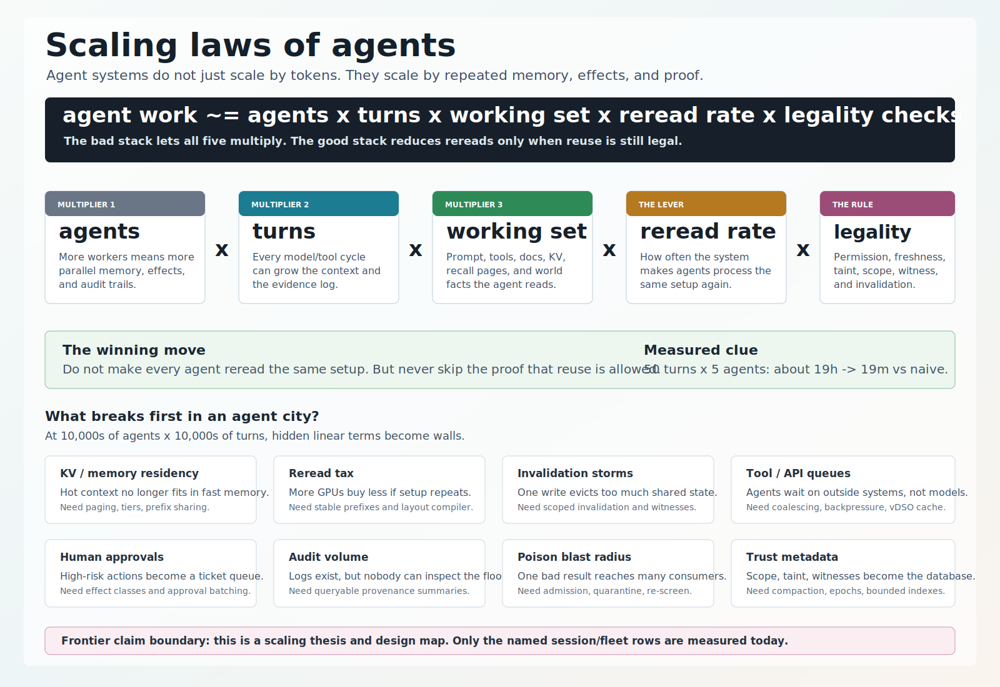
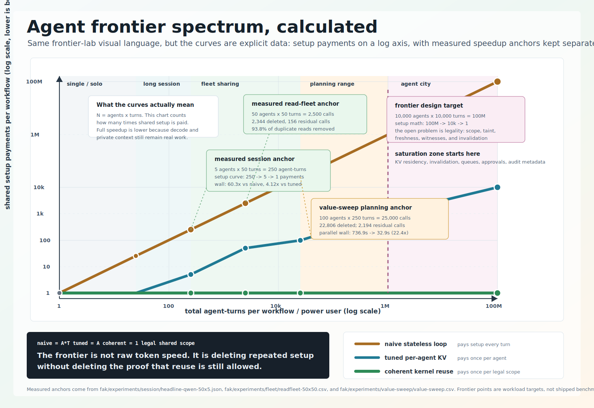

# Scaling laws of agents - thesis

Date: 2026-06-19

Scope: a plain-language thesis for why agent systems stop scaling like ordinary
chat or token-serving systems. This is a framing document, not a new benchmark.
Measured claims are separated from frontier hypotheses.

Use with:

- [README](../README.md)
- [Performance spectrum visual](../visuals/41-performance-spectrum.svg)
- Session value-stack deck — `SESSION-VALUE-STACK-DECK.md` (private companion — not published)
- Fleet value projection — `FLEET-VALUE-PROJECTION.md` (private companion — not published)
- Implications memo — `IMPLICATIONS-fak-agentic-os-2026-06-18.md` (private companion — not published)

---

## 0. Thesis

The scaling law of agents is not only "more tokens need more compute."

The better first-order law is:

```text
agent work ~= agents x turns x working-set size x reread rate x legality checks
```





Where:

- **agents** = how many independent workers are active;
- **turns** = how many model/tool cycles each worker runs;
- **working-set size** = shared prompt, tool schemas, recalled pages, tool results,
  repo/docs state, and KV spans the agent must attend to;
- **reread rate** = how often the system makes the model reprocess bytes it already
  processed;
- **legality checks** = permission, freshness, taint, scope, witness, and
  invalidation work needed before reuse is safe.

The naive agent stack lets all five multiply. A scalable stack attacks the only
safe term: **reread rate**, but only when legality checks say reuse is still valid.

Short version:

> Agents scale by deleting repeated work without deleting the proof that the work
> is still allowed.

---

## 1. Why agents scale differently from chat

A chat request is mostly:

```text
prompt in -> tokens out
```

An agent turn is closer to:

```text
memory view -> model proposal -> tool/effect check -> world read/write ->
result admission -> memory update -> cache/invalidation update -> audit trail
```

That changes the bottleneck. Raw model speed still matters, but the system also
has to answer:

- may this tool call happen?
- did this result enter context or get quarantined?
- who else can reuse this result?
- what write invalidates it?
- what did the final answer depend on?
- what evidence survives if the process exits?
- can a future agent page this memory back in without laundering poison?

At small scale, these look like overhead. At frontier scale, they become the
system.

---

## 2. Three regimes

| Regime | Plain description | Main bottleneck | FAK relevance |
|---|---|---|---|
| **Single chat** | One model call, little or no tool use. | Raw model latency and quality. | Small or no performance win; safety boundary still useful if tools exist. |
| **Long agent session** | One or a few agents run many turns over a stable setup. | Reprocessing the same prefix and growing transcript. | Persistent KV, prefix reuse, context admission, recall. |
| **Agent city** | Many agents run many turns over shared tools, memory, repos, docs, tickets, APIs, and world state. | Legal reuse, invalidation, scheduling, audit, and tool/API pressure. | Trust/coherence kernel becomes the scaling layer. |

The project’s measured 50-turn x 5-agent result sits in the second regime. The
10,000 x 10,000 "agent city" is a frontier design target in the third regime, not
a shipped measurement.

---

## 3. The core law: duplicate setup is the hidden tax

If every agent rereads a shared setup every turn, setup work scales like:

```text
duplicate setup work ~= agents x turns x shared setup
```

That is why a 5-agent, 50-turn session already creates 250 chances to reread the
same shared prompt/tool setup.

The measured session result demonstrates the shape:

- naive stateless loop: about 19 hours;
- fused reuse path: about 19 minutes;
- measured ratio: 60.3x vs the naive pattern;
- tuned comparison: about 1.5-4x, because a competent baseline already removes
  some duplicate rereads.

The important interpretation is not "the model got 60x faster." It did not. The
system stopped making the model reread the same shared setup.

### Data used for the frontier-spectrum curves

The chart's main curves count **shared setup payments**, not total wall-clock.
This keeps the units honest:

```text
N = agents x turns
naive setup payments = N
tuned per-agent KV setup payments = agents
coherent shared-kernel setup payments = 1 per legal shared scope
```

Measured wall-clock and tool-read projections are then annotated as separate
anchors:

| Workload | Agent-turns | Naive setup payments | Tuned setup payments | Coherent setup payments | Evidence anchor |
|---|---:|---:|---:|---:|---|
| 1 agent x 1 turn | 1 | 1 | 1 | 1 | Reference point. |
| 1 agent x 25 turns | 25 | 25 | 1 | 1 | Solo long session shape. |
| 5 agents x 50 turns | 250 | 250 | 5 | 1 | Session JSON: 60.3x wall vs naive, 4.12x wall vs tuned, 62.0x token floor. |
| 50 agents x 50 turns | 2,500 | 2,500 | 50 | 1 | Fleet CSV: 2,344/2,500 duplicate reads deleted; 156 residual calls. |
| 100 agents x 250 turns | 25,000 | 25,000 | 100 | 1 | Value sweep: 22,806/25,000 turns deleted; 736.9s -> 32.9s parallel wall projection. |
| 1,000 agents x 1,000 turns | 1,000,000 | 1,000,000 | 1,000 | 1 | Frontier workload target, not measured. |
| 10,000 agents x 10,000 turns | 100,000,000 | 100,000,000 | 10,000 | 1 | Frontier workload target, not measured. |

So the line shape is calculated, while the callouts say which points are measured,
measured-supported projections, or future workload targets.

### The exact work floor at the >100k-token regime

The setup-payment counts above are now backed by an **exact, contention-free work floor** at the
ultra-long-context regime this thesis is really about (per-agent context ≥ 100k tokens) — the regime
no *live* bench reaches, because the naive arm's O(T²) re-prefill is intractable to run there. The
floor is closed-form arithmetic from the session shape and the model geometry (no model, no
wall-clock), with a token floor identical to `sessionbench`'s `prefillTokens` (its anchor row
reproduces the **62.0× token floor** in the table above) and an O(L²)-aware FLOP floor. It quantifies
the §2 regimes directly: a **single >100k session ≈ 10× vs naive** (the turn-tax; B/C ≡ 1, no peer to
share with), a **5-agent fleet each >100k ≈ 40×+ vs naive and ≈ 4× vs a warm cache**, and it proves
the cross-agent win **B/C rises monotonically with the shared-prefix fraction toward the agent
count** — why the standing ~2–4× bound (small prefix) and the larger agent-city win are the same law
at different prefix fractions. See `internal/turnbench/longcontext.go`, `cmd/longctxbench`, and
[`docs/benchmarks/ULTRA-LONG-CONTEXT-RESULTS.md`](benchmarks/ULTRA-LONG-CONTEXT-RESULTS.md);
the levels, levers, and naming are worked out in
[`docs/notes/RESEARCH-ultra-long-context-levels-and-naming-2026-06-22.md`](notes/RESEARCH-ultra-long-context-levels-and-naming-2026-06-22.md).

---

## 4. The coherence law: reuse is only a win while it is legal

Shared reads create leverage. Writes create invalidation.

That gives the second law:

```text
net reuse value ~= shared read hits - invalidation cost - stale-read risk
```

This is where agents differ from ordinary prompt caching. A prompt cache can ask
"are these tokens the same?" An agent cache has to ask:

- same bytes?
- same model/tokenizer/position?
- same tenant/user/scope?
- same world version?
- same taint status?
- same policy?
- no later write refuted it?
- can every consumer be found if it must be revoked?

At small scale, you can dodge this with TTLs and manual cache busting. At agent-city
scale, TTL-only coherence becomes guesswork. The runtime needs consumer graphs,
world witnesses, scoped invalidation, and miss reasons.

Short version:

> The next scaling wall is not cache existence. It is cache legality.

---

## 5. The "frontier city" saturation points

If one power user or one enterprise workflow eventually fans out to 10,000s of
agents doing 10,000s of turns, the system does not break in one place. It breaks
wherever a hidden linear or quadratic term was left in the loop.

| Saturation point | What breaks first | What it feels like | Needed control |
|---|---|---|---|
| **KV / memory residency** | Hot KV cannot all stay in HBM/DRAM. | Agents pause or recompute old context constantly. | Paging, residency tiers, prefix sharing, recompute policy. |
| **Prefill / reread tax** | Shared setup is reprocessed too often. | More GPUs buy less than expected. | Stable prefixes, shared KV, prompt-layout compiler. |
| **Invalidation storms** | One write evicts too much shared state. | Read cache flips from win to loss. | Scoped invalidation, resource-level witnesses, consumer graph. |
| **Tool/API rate limits** | External systems cannot serve every agent read/write. | Agents wait on APIs, not models. | vDSO/read cache, request coalescing, backpressure, leases. |
| **Scheduler queues** | Model capacity is idle while agents wait on tools, or tools are idle while decode dominates. | Low utilization despite high spend. | Blocked-time-aware scheduler and tier routing. |
| **Human approval queues** | High-risk actions all require people. | The agent city becomes a ticket queue. | Effect classes, approval batching, policy that removes unnecessary approvals. |
| **Audit/log volume** | Every action is logged, but nobody can inspect the flood. | Compliance data becomes dark data. | Summaries with raw evidence, retention tiers, queryable provenance. |
| **Policy surface area** | Tool-name allow-lists are too coarse. | Safe tools become unsafe on specific objects/accounts/amounts. | Argument/object capabilities and reviewable manifests. |
| **Trust metadata size** | Taint/scope/witness/consumer metadata grows with reuse. | The cache index becomes the new database. | Compaction, epochs, aggregated witnesses, bounded consumer graphs. |
| **Poison propagation** | One admitted bad result is reused by many agents. | A small miss becomes a fleet incident. | Result admission, quarantine, re-screen on page-in, blast-radius report. |
| **World-state drift** | Cached facts age out faster than agents notice. | Agents act on stale inventory, tickets, files, or deploy state. | External witnesses: git SHA, etag, lease, row version, approval id. |
| **Cost observability** | Token cost, tool cost, cache cost, and retry cost are split across systems. | Nobody knows why the agent city is expensive. | Per-task cost ledger and miss reasons. |

These are not all model problems. Many are operating-system, database, queueing,
and governance problems.

---

## 6. Scaling law table

| Law | Formula-shaped intuition | Practical read |
|---|---|---|
| **Turn law** | work grows with `turns`, and naive prefill can grow faster than linear as context grows | Long sessions punish stateless loops. |
| **Fan-out law** | duplicated setup grows with `agents x shared setup` | More agents amplify shared-prefix wins. |
| **Coherence law** | reuse value falls when writes invalidate too broadly | Read-heavy wins; write-heavy needs scoped invalidation. |
| **Residency law** | active KV grows with `agents x context` | Memory tiers matter before FLOPs are exhausted. |
| **Tool-wait law** | wall time includes model time plus external IO wait | Scheduler must route around blocked agents. |
| **Approval law** | human approvals grow with risky effects, not tokens | Policy design determines whether humans become the bottleneck. |
| **Audit law** | evidence volume grows with effects and reuse | Logs must become queryable provenance, not infinite transcripts. |
| **Trust law** | metadata grows with every shared result and consumer | The coherence graph becomes a first-class data structure. |

The naive way scales the bad terms. The kernel way tries to turn them into
bounded, queryable, revocable state.

---

## 7. What should be measured next

The frontier-city thesis becomes credible only when each saturation point has a
meter.

Suggested metrics:

- **reread rate:** what fraction of input tokens were repeated setup?
- **legal cache-hit rate:** cache hits that passed scope/freshness/taint checks;
- **stale-prevention count:** hits refused because a witness was refuted;
- **invalidation blast radius:** consumers evicted per write;
- **KV residency pressure:** bytes in HBM/DRAM/disk/recompute by agent state;
- **blocked-time mix:** model time vs tool wait vs approval wait;
- **approval queue depth:** pending high-risk actions by effect class;
- **audit compression ratio:** raw event bytes to queryable incident summary;
- **poison blast radius:** number of consumers a quarantined/refuted result would
  have reached;
- **cost per resolved task:** tokens + tool calls + retries + cache misses.

If a system cannot emit these, it cannot honestly claim to scale an agent city.

---

## 8. What FAK should claim

Say:

- `fak` is testing the layer where agent scaling becomes a trust/coherence problem.
- The measured session result shows repeated setup work can dominate practical
  wall time.
- The read-heavy fleet results show reuse has value, and write invalidation can
  erase that value if it is too broad.
- The frontier-city concept is a design target for what needs to be measured and
  controlled next.

Do not say:

- 10,000 x 10,000 is measured.
- 60x is raw model throughput.
- Every workload gets the 60x result.
- SOTA means a weak baseline.
- Cache reuse is safe because the bytes match.

---

## 9. Robustness: does the thesis survive a change in workload shape?

A fair objection: what if agent harnesses change the workload so the duplicate-setup
tax disappears on its own — for example by **batching tool calls** (one turn emitting
many tool calls at once, already shipping in major APIs)? Would that not delete the very
tax `fak` attacks?

It is worth taking seriously. But it **relocates** the work; it does not remove it.

- Batching tool calls **reduces branch points** (fewer separate sub-agent contexts to
  fork) but **fattens the shared context** (many tool results concatenated into one
  growing turn). The pressure moves from "many forked prefixes" to "one large working
  set with removable spans." The control that matters shifts from prefix-sharing to
  **scoped admission and removal of tool-result spans** — still a coherence-kernel job,
  not a free win.
- It does **not** flatten *recursive* fan-out. A sub-agent can itself fan out; a flat
  batch of tool calls cannot. The agent-city regime (§2) is hierarchical, and hierarchy
  does not collapse into one wide turn.

Where the objection is **correct**: for flat, short, shallow sessions — few turns, small
results, no real fan-out — there is little duplicate-setup tax to attack, and ordinary
prefix caching already captures most of the win. That is the same honest boundary as the
single-chat row in §2: the kernel earns its keep in the long-session and agent-city
regimes, not the flat one.

Short version:

> Changing *how* agents call tools moves *where* the reread and coherence tax lands. It
> does not change *whether* a coherence layer has to account for it.

This is also why the §7 meters matter. If the workload shape shifts, the reread-rate and
residency meters show the tax **moving** (e.g. from forked-prefix payments to working-set
growth) before it surprises anyone — the thesis is falsifiable, not assumed.

---

## 10. The near-term window: scaling under hardware scarcity

The laws above are structural, but their *near-term* weight depends on one external fact:
for roughly the next two years, frontier agent deployment is **hardware-constrained**, not
hardware-abundant.

That scarcity sharpens the first-order law rather than softening it:

- When accelerators and HBM are the binding constraint, **deleting reread work converts
  directly into served capacity** — every reread removed is a turn you did not have to buy
  silicon for. The reread-rate and residency wins (§3, §5) are most valuable precisely
  when supply is tight.
- It also front-loads the residency law (§6): hot KV that cannot all fit in HBM forces
  paging and recompute *today*, not at some hypothetical frontier.

So the thesis is naturally time-phased:

| Horizon | What pays off first | Why |
|---|---|---|
| **Near term (hardware-scarce)** | reread-rate deletion, prefix/KV residency, scheduling around tool-wait | scarcity turns every deleted reread into a capacity gain |
| **Long term** | the legality/coherence layer: legal reuse, scoped invalidation, admission, replayable evidence | it is a correctness capability, not an efficiency constant, so it outlives cheaper hardware |

The efficiency wins are what make the case **now**; the coherence layer is what the case
rests on **after** hardware stops being the bottleneck. Both terms are in the same first
law — `reread rate` bounded by `legality checks` — just weighted differently as supply
loosens.

---

## 11. One-page version

> The scaling law of agents is agents x turns x working set x reread rate, bounded
> by legality. Raw token speed matters, but the first catastrophic waste is making
> every agent reread the same setup and re-fetch the same world facts. The first
> catastrophic correctness failure is reusing a fact after the caller, scope,
> witness, taint, or world state changed. At frontier scale, the product is not
> just a faster model server. It is an agent coherence kernel: permissions for
> effects, admission for memory writes, legal cache reuse, scoped invalidation,
> residency management, and replayable evidence.

That is the thesis.
