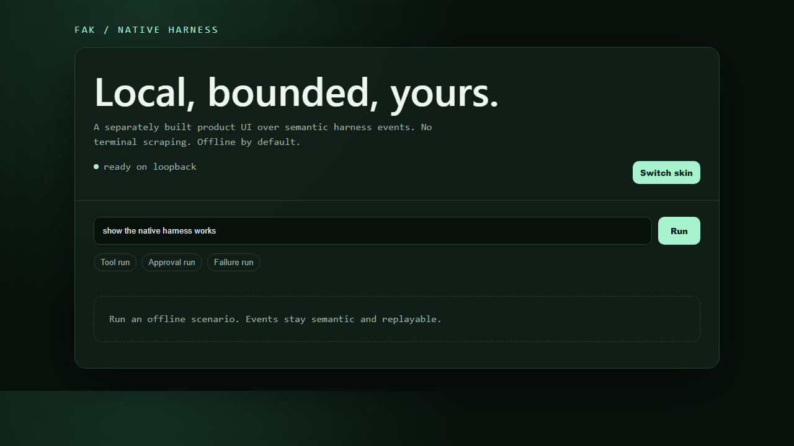

# Live native coding browser witness — 2026-08-15

Issue: #6968, completing the live render leaf of #6962.

## Verdict

A real `gpt-5.6-sol` turn, submitted through the loopback browser product to
`fak serve --native --native-code-workspace`, changed the seeded fixture, ran its focused
test, inspected the Git diff, persisted 34 semantic events, and replayed after the browser
process restarted. This is a witnessed coding run, not an offline/example scenario.



## Reproduction

```text
fak serve --addr 127.0.0.1:18084 --native \
  --native-code-workspace %TEMP%\fak-harnessweb-6962-fixture \
  --provider openai --base-url http://127.0.0.1:59384/v1 \
  --api-key-env OPENAI_API_KEY --model gpt-5.6-sol

fak harness web -addr 127.0.0.1:18788 \
  -fak-url http://127.0.0.1:18084 \
  -workspace %TEMP%\fak-harnessweb-6962-fixture \
  -state %TEMP%\fak-6962-sessions.json
```

Prompt:

```text
Fix fixture.go so TestValue passes. You must use Read, Edit, Bash go test,
then Bash git diff before answering.
```

Captured URL after restart:

```text
http://127.0.0.1:18788/?run=live-1
```

Capture command:

```text
playwright screenshot --device="Desktop Chrome" --full-page \
  "http://127.0.0.1:18788/?run=live-1" \
  docs/_witnesses/harness-web-demo/live-coding-gpt-5.6-sol-2026-08-15.png
```

## Observed evidence

- Run: `live-1`; model: `gpt-5.6-sol`; 34 persisted envelopes.
- Native lifecycle: Read, Glob, Grep, Edit, Bash focused test, Bash Git diff.
- Patch artifact emitted after Edit.
- Fixture change: `func Value() int { return 1 }` → `return 2`.
- Independent focused check: `go test ./... -run TestValue -count=1` passed.
- Restart replay: `after=30` returned sequences `31,32,33,34`.
- Workspace identity before/after restart: `ws-f5d6aba21966`; root was not exposed.
- Screenshot: 1280×720 RGB, SHA-256
  `b120012fb93392beb2d43bacfec50079b270db6566816ab5b3fd66331e44058c`.
- Raw API response SHA-256:
  `0e7d97a457b2920810e65247fbf162ae7ab95a88f25e1fac26a9e90a86cb2572`.
- Private state-file SHA-256 (file is intentionally not committed):
  `5b87fa5a9a8cf50d67f684e12a0b6e2c18410a69e5f93d9aa4f7dfb70ea60983`.

## Approval boundary and rollback

The operator explicitly pre-authorized the bounded catalog by launching the gateway with
`--native-code-workspace`; Read/Edit and the focused command allowlist therefore do not
raise per-call approval prompts. Typed denials still render for calls outside that policy.
The separate approval scenario remains captured and selfchecked for products that choose
a prompt-per-call policy.

Rollback: stop both loopback processes. Restart `fak harness web` without `-fak-url` and
`-workspace` to return to its deterministic offline mode. Delete the temporary fixture and
state file after auditing the hashes above.
