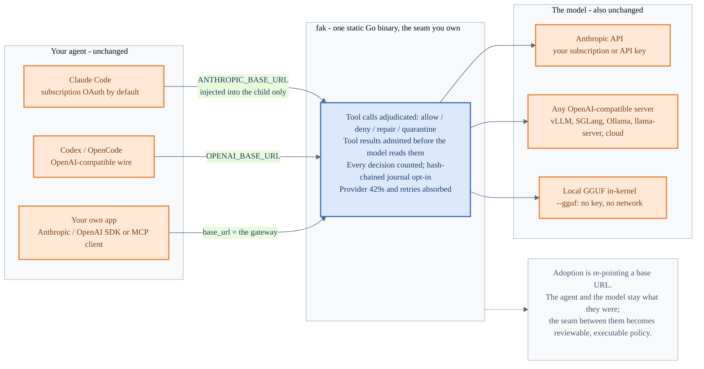
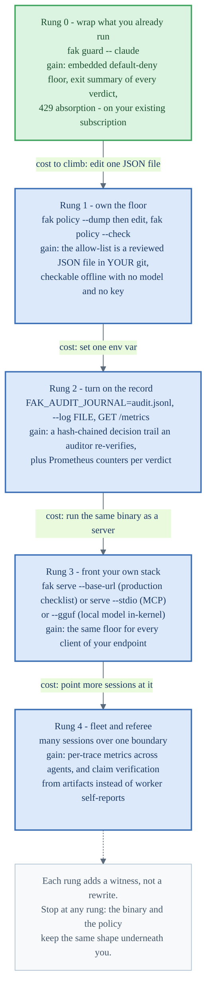
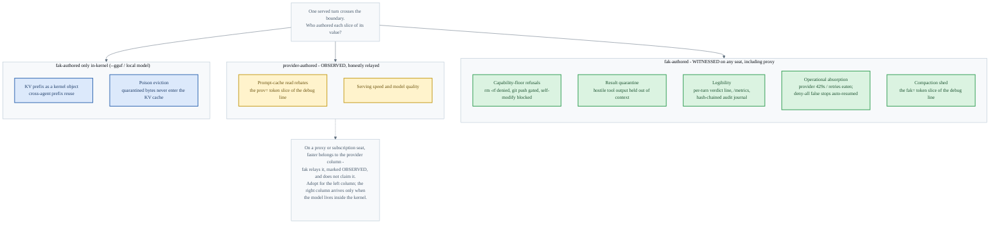
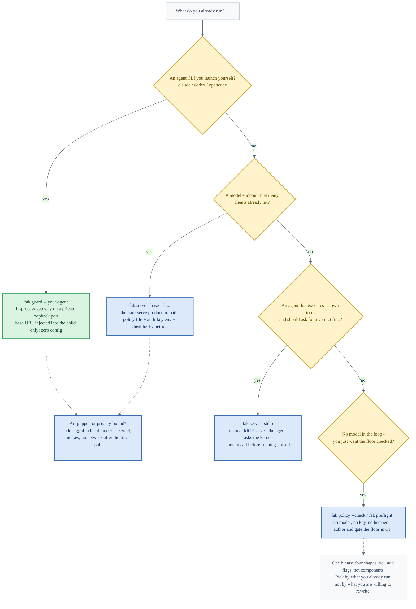
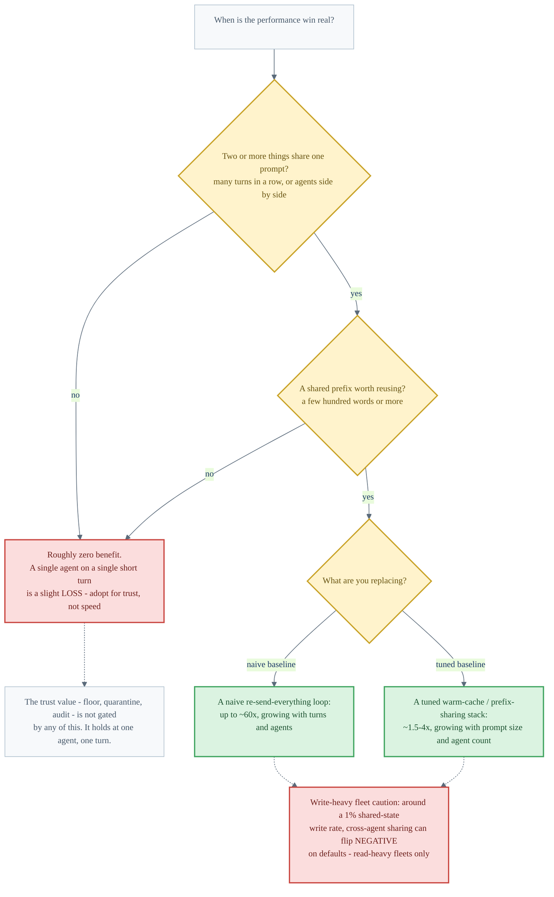

# Adoption Visuals — How to Think About Using fak

These five figures are the mental model for adopting `fak`. They are for someone
deciding whether to put it in front of an agent they already run. Figure 68 shows
where the binary sits and why nothing else changes. Figure 69 shows the adoption
ladder, one rung at a time. Figure 70 splits the value fak authors from the value it
relays. Figure 71 picks an integration shape from what you already run. Figure 72
gives the two conditions that gate the performance claim. Numbers trace to
[`CLAIMS.md`](https://github.com/anthony-chaudhary/fak/blob/main/CLAIMS.md) and the
result docs it links. The figures repeat the honest fences instead of smoothing them
over.

Sources:

- [`docs/integrations/adopter-playbook.md`](integrations/adopter-playbook.md): the
  external-adopter playbook, with shapes A/B/C and the production checklist.
- [`docs/integrations/CLAUDE.md`](integrations/CLAUDE.md): the `fak guard` front door,
  the per-turn debug line, and the gateway-transit proof.
- [`docs/concepts-and-story.md`](concepts-and-story.md): the two-gate trust model and
  the "when does the win kick in" tables.
- [`fak/GETTING-STARTED.md`](https://github.com/anthony-chaudhary/fak/blob/main/GETTING-STARTED.md):
  install and first run.

| # | Figure | Point |
|---|---|---|
| 68 | Adoption seat map | Adopting fak is re-pointing a base URL: the agent and the model stay what they were; the seam between them becomes reviewable policy. |
| 69 | The on-ramp ladder | Each rung adds a witness instead of a rewrite. You can stop at any rung. |
| 70 | The honest value split | fak authors the floor, the quarantine, and the audit trail on any seat; prompt-cache speed on a proxy seat is the provider's win, relayed as OBSERVED. |
| 71 | Which shape fits | One binary, four integration shapes: pick by what you already run. |
| 72 | When the perf win is real | Two gates (multiple sharers, a real shared prefix), then ~60× only versus a naive loop and ~1.5–4× versus a tuned stack. |

---

## 68 - Adoption seat map

Killer line: adopting fak means re-pointing one base URL. The agent and the model
stay what they were. The seam between them becomes policy you can review, version,
and audit.

[SVG](https://raw.githubusercontent.com/anthony-chaudhary/fak/main/visuals/68-adoption-seat-map.svg) - [PNG](https://raw.githubusercontent.com/anthony-chaudhary/fak/main/visuals/68-adoption-seat-map.png) - [source](https://github.com/anthony-chaudhary/fak/blob/main/visuals/68-adoption-seat-map.mmd)

**Terms used:**

- "injected into the child only": `fak guard` sets the base URL in the wrapped
  process's environment. Your shell, your `settings.json`, and any other agent in
  another terminal are untouched.
- "hash-chained journal opt-in": the durable audit trail exists when
  `FAK_AUDIT_JOURNAL` is set. The in-memory exit summary is always on.

---

## 69 - The on-ramp ladder

Killer line: each rung adds a witness rather than a rewrite. Stop at any rung and
keep everything the previous rung proved.

[SVG](https://raw.githubusercontent.com/anthony-chaudhary/fak/main/visuals/69-adoption-onramp.svg) - [PNG](https://raw.githubusercontent.com/anthony-chaudhary/fak/main/visuals/69-adoption-onramp.png) - [source](https://github.com/anthony-chaudhary/fak/blob/main/visuals/69-adoption-onramp.mmd)

**Terms used:**

- "witness": an artifact a third party can re-check, as opposed to a self-report.
  Examples: a policy file in git, a hash-chained journal row, a metrics counter.
- "claim verification": at rung 4, commit and task claims are checked against git
  evidence rather than taken from the worker's own summary.

---

## 70 - The honest value split

Killer line: adopt fak for the left column, which holds on any seat. On a proxy
seat, "faster" belongs to the provider column. fak relays that slice marked OBSERVED
instead of claiming it.

[SVG](https://raw.githubusercontent.com/anthony-chaudhary/fak/main/visuals/70-adoption-value-split.svg) - [PNG](https://raw.githubusercontent.com/anthony-chaudhary/fak/main/visuals/70-adoption-value-split.png) - [source](https://github.com/anthony-chaudhary/fak/blob/main/visuals/70-adoption-value-split.mmd)

**Terms used:**

- "prov= / fak=": the two token-saving slices on the per-turn debug line `fak guard`
  prints. `prov=` is the provider prompt-cache net saving, read rebate minus write
  premium, relayed from provider counters. `fak=` is the slice fak itself authored:
  compaction shed, plus in-kernel KV-prefix reuse on a local model.
- "OBSERVED": a value fak reports but did not produce. Provider counters pass
  through with their origin labeled and are never folded into fak's own claim.
- "deny-all false stops auto-resumed": when the floor refuses every tool call in a
  turn, the harness would otherwise stop early. Guard blocks that spurious stop and
  re-prompts the agent to pick an allowed alternative. The retry is bounded and on
  by default.

---

## 71 - Which shape fits

Killer line: one binary, four shapes. You add flags rather than components. Pick by
what you already run.

[SVG](https://raw.githubusercontent.com/anthony-chaudhary/fak/main/visuals/71-adoption-shape-picker.svg) - [PNG](https://raw.githubusercontent.com/anthony-chaudhary/fak/main/visuals/71-adoption-shape-picker.png) - [source](https://github.com/anthony-chaudhary/fak/blob/main/visuals/71-adoption-shape-picker.mmd)

**Terms used:**

- "shape": one of the four integration forms from the
  [adopter playbook](integrations/adopter-playbook.md). Wrap an agent CLI with
  `fak guard`. Front a model endpoint with `serve --base-url`. Advise a
  self-executing agent over `serve --stdio` MCP. Or check the policy floor in CI
  with no model at all.

---

## 72 - When the perf win is real

Killer line: the performance claim is gated, never ambient. It needs two sharers and
a real shared prefix, or the honest answer is "roughly zero". The trust value is
what holds at one agent, one turn.

[SVG](https://raw.githubusercontent.com/anthony-chaudhary/fak/main/visuals/72-adoption-perf-gate.svg) - [PNG](https://raw.githubusercontent.com/anthony-chaudhary/fak/main/visuals/72-adoption-perf-gate.png) - [source](https://github.com/anthony-chaudhary/fak/blob/main/visuals/72-adoption-perf-gate.mmd)

**Terms used:**

- "~60× / ~1.5–4×": the two honest baselines from
  [concepts-and-story](concepts-and-story.md). The large figure is only versus a
  naive loop that re-sends the whole growing conversation every turn. Versus a tuned
  warm-cache stack the gain is a few-fold.
- "read-heavy fleets only": measured on the fleet sweep. Global invalidation turns
  the cross-agent benefit negative at roughly a 1% shared-state write rate on
  default settings. Scoped invalidation recovers most of it, but the caution stands.

---

## The honest scope, in one place

- The figures describe mechanisms that exist today: `fak guard`, `fak serve`,
  `serve --stdio`, `policy --check`, `--gguf`, the audit journal, and `/metrics`.
  None of this claims market adoption. The on-ramp is what an adopter *would* climb,
  and never a report that anyone has.
- On a proxy or subscription seat there is no local KV cache, so KV poison-eviction
  is a structural no-op there. That row of value is real only on the in-kernel
  (`--gguf` / local model) path.
- The perf figures are geometry- and sweep-derived ratios, and no substitute for an
  independent benchmark of your workload. Read figure 72's gates before quoting any
  of them.
