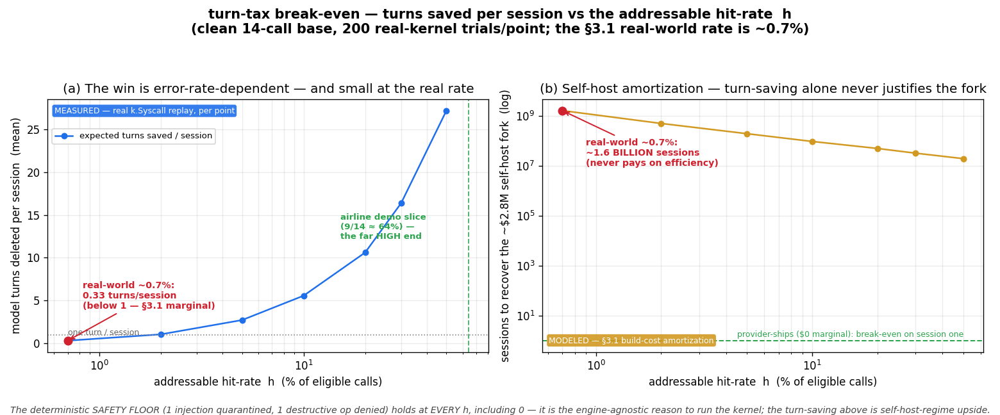

# TURN-TAX-RESULTS — the deterministic safety floor, plus the error-code turn measured and ablated

> The microsecond bench (`fak bench`, `internal/bench`) answers *"how cheap is one
> in-process adjudication vs a spawned hook?"* — a sub-µs **transport** question.
> It deliberately does **not** price the cost that actually dominates an agent
> loop. This document measures two distinct things, and keeps them **structurally
> apart** because they are not the same kind of claim:
>
> 1. **The Measured Safety Floor (§1) — the moat.** A poisoned result kept out of
>    context, a destructive op never dispatched — a deterministic
>    completion/integrity delta that holds **on any backend**, including a frontier
>    API you do not own. This is the engine-agnostic trust floor and it is not
>    optional.
> 2. **The efficiency upside (§3) — self-host regime only.** When a SOTA
>    tool-calling loop hands the model a tool that came back as an **error code**
>    (malformed args, a duplicate read, a result that needs repair), the documented
>    recovery is to feed the error back and **re-prompt**: one *extra turn*. fak's
>    **1-shot** path can resolve the same condition *inside the syscall the call
>    arrived on*. That is real, but it is an **upside you collect only when you own
>    the fused binary** — never the headline (see the guardrails in §3.1).
>
> **The fak side is not modeled — it is the live kernel.** Every number is a
> replay of a frozen, class-labeled trace through the real `k.Syscall`, read from
> the kernel's **own** counters (`Transforms`, `VDSOHits`, `Quarantines`,
> `Denies`). The report carries a `consistency_check: "ok"` — a *consistency
> guard* that the bench's per-call bucketing agrees with those counters (it
> catches a wiring/bucketing drift; it is **not** an independent oracle, since the
> classification reads the same verdicts the counters came from — the grounding is
> that the **kernel** emits the events, not that two correlated tallies match).
> The **only** modeled half is the efficiency baseline, and its saved turns split
> into two honestly-different kinds (§3).
>
> Reproduce: `fak turntax --suite turntax-airline` and `--suite turntax-happy`.
> Code: `internal/turnbench/`, fixtures `testdata/turntax/`, artifacts under
> `experiments/turn-tax/`.
>
> **Watch it live.** `go run ./cmd/turntaxdemo` (open `http://127.0.0.1:8150`)
> replays a trace through the **real kernel** call-by-call and shows three lanes — a
> **naive** SOTA loop's counter ticking up on every aliased / duplicate / elidable call
> (+9), a **tuned** framework that elides the optional calls but still pays the forced
> error-recovery turns (+5), and the **fak** lane staying flat (0) — with the §1 safety
> floor on a deliberately separate strip. It needs **no model weights** (the trace runs
> through `k.Syscall`, not a model), so it reproduces identically on any box; add
> `-selfcheck` to assert those numbers **headless** (no browser — the CI / cross-platform
> dog-food). Flip the suite to `turntax-happy` and every counter stays at **0** — the §4
> anti-inflation control, made watchable.

## §1 — The Measured Safety Floor (the moat; read this first)

On the 14-call `turntax-airline` slice — one realistic airline-support session —
the kernel produces a **deterministic** integrity delta that the SOTA baseline
does not:

| axis | metric | baseline (SOTA loop) | fak | delta |
|---|---|---:|---:|---|
| **safety floor** | injections admitted to context | **1** | **0** | quarantined |
| **safety floor** | destructive ops executed | **1** | **0** | denied |

This is a **completion/integrity** delta, not a turn count. A poisoned document
is paged out of context before it can derail the session (`Quarantines`); a
destructive operation (`delete_account`) is refused as a deny-as-value
(`Denies`). Both are verdicts the model **did not author**.

**Why this is the moat — and why it is engine-agnostic.** The safety floor is the
part of the kernel that needs no fused runtime and no ownership of the serving
stack. It sits *in front of* whatever engine answers the call — a local 3B or a
frontier API — and adjudicates the syscall from non-authored evidence. It is
**reproducible on any backend**: the same admission gate and capability floor fire
whether the tool result came from a model you host or one you merely call over an
API. This is the deterministic external floor; it is non-optional and it does not
depend on the efficiency story below. (The complementary live A/B — `fak agent`,
`LIVE-RESULTS.md` — shows the operational shape of the same fact: 0% vs 100% task
completion under poison, while the happy-path turn-saving is ≈0.)

### §1.1 — Caveat: the quarantine demo is isolated by call ordering, for test clarity

`fetch_policy` carries the substring "fetch", so the IFC sink-gate classifies it
as an egress sink. The slice runs it **first**, while the session is still
untrusted, so it reaches the engine and ctx-MMU quarantines the poisoned doc — the
lever this row demonstrates. In a *realistic* session a read like
`get_user_details` would taint the session first, and IFC's sink-gate (rank-30,
pre-call) would then **refuse** the `fetch_policy` egress call *before* ctx-MMU
ever saw a result — so end-to-end, the **IFC sink-gate, not ctx-MMU quarantine, is
the primary injection defense**. The quarantine lever is real and sound; this
fixture isolates it artificially to show it in isolation. `delete_account` is the
converse: a destructive sink we *want* refused — policy **and** IFC both deny it.

## §2 — Why a separate benchmark (and what each one is for)

| benchmark | question | unit | gate |
|---|---|---|---|
| `internal/bench` | cost of one adjudication vs a process spawn | **nanoseconds** | by-construction (in-proc < spawn) |
| **`internal/turnbench`** (this) | safety floor (§1) + model turns deleted per lever (§3) | **integrity delta + turns → tokens/$/s** | consistency guard + happy-path=0 |

A frontier turn is ~10⁹× an in-process Decide (here: **1.5 s vs ≈2 µs** — the
re-measured `local_serve_ns` in the artifact). The safety floor (§1) is the
non-optional reason to run the kernel at all; the turn-count below (§3) is what
the same construction additionally buys you *in the self-host regime*.

## §3 — Efficiency upside (self-host regime only)

> **Read §3.1 before quoting any number here.** The turn-savings below are a
> *cache-favorable slice in a regime where you own the fused binary*. They are
> **not** a general agent speedup, and they are **not** available at all if you
> call a frontier API (you still get the §1 safety floor in that case). The moat is
> §1; everything in §3 is optional upside collected only when you self-host.

On the same 14-call `turntax-airline` slice — exercising every kernel lever —
native run on this box:

| axis | metric | baseline (SOTA loop) | fak (1-shot) | delta |
|---|---|---:|---:|---:|
| **turn-tax** | extra model turns fired | **9** | **0** | **−9 turns** |
| turn-tax | — of which *forced* (re-issued read + aliased retry) | 5 | 0 | −5 |
| turn-tax | — of which *elision* (pure/static the model could omit) | 4 | 0 | −4 |
| turn-tax | tokens (@1200+120/turn) | 11,880 | 0 | −11,880 |
| turn-tax | $ (@ $3/$15 per Mtok) | $0.0486 | 0 | −$0.0486 |
| turn-tax | added latency (@1.5s/turn) | 13.5 s | ~0 (≈2 µs serve) | −13.5 s |

**The honest decomposition of the 9.** Five are **forced** — the model already
issued the call and the baseline demonstrably pays the round-trip: a re-issued
duplicate read (3) and an aliased call that errors and must be re-prompted (2,
the documented ReAct retry). Four are **elision** — tool calls the model made
(`calculate`, `list_all_airports`) whose results need no engine; the baseline
pays a round-trip only because the model *chose* to call a tool a stronger agent
could elide (compute inline, recall the list). fak serves those locally either
way, so it is a capability win, counted toward the total but reported apart so
the claim isn't overstated. The 9 is exact *for this trace*: the kernel counts
only calls actually present, so a model that never aliases (Transforms→0) or
never calls a pure tool simply yields fewer — the cost model cannot over-count a
turn the workload didn't contain.

### §3.1 — Guardrails (read before quoting the 9)

**Not a general speedup — this is a cache-favorable slice.** The 14-call slice is
*deliberately* error/dup/pure-rich so every lever fires at least once. On **real**
tau2-airline the measured addressable vDSO purity is **~0.7%** — far below a useful
threshold, which is exactly why CLAIMS.md scopes the vDSO as an *"UPSIDE
secondary, never the headline."* The "9 on this trace" must **not** be
extrapolated to "agents save 9 turns": this slice is to the real-world hit-rate
what a cache-hit microbenchmark is to a cold workload.

**Regime trifurcation — the fleet-scale formula does not apply uniformly.** The
in-process turn-saving depends on *who owns the serving stack* (see
`frontier_sensitivity.py`, the build-cost interrogation):

| regime | turn-savings available? | marginal build cost |
|---|---|---|
| **API consumer** (you call a frontier API) | **N/A** — the in-process win is unavailable; you still get the §1 safety floor | not for sale (provider must expose in-tensor tool calling) |
| **provider ships it in-process** | yes | **≈ $0 marginal** |
| **self-host fork** | yes | **≈ $2.8M / 3yr TCO** — *not* the $200k "knob" |

The frequently-quoted **$200k** is the model's only un-anchored number and is a
bare knob; the honest self-host total — a divergent KV-splice fork (~3 eng-yr,
"out of reach" on OSS vLLM) plus recurring format re-train and fork-maintenance —
is **~$2.8M over 3 years (~14× the knob)**. The turn-savings in this section
therefore apply only to the self-host / provider-ships regime; an API consumer
gets the safety floor and **none** of this.

**Prior-art honesty — no single lever is novel.** Each mechanism the 9 is built
from is **established**:

- **grammar-repair** — constrained decoding / grammar-coerced tool args is
  established practice (GBNF, XGrammar, SGLang structured output).
- **vDSO tier-2 dedup** — content-addressed tool-result caching with a
  provably-unchanged check is established (TVCache, arXiv:2602.10986;
  tool-result-cache over canonical JSON).
- **prompt / KV prefix caching** — established across the serving field.

The **only** defensible novelty is the *integrated assembly at the syscall
boundary* — resolving the condition in-syscall across grammar + vDSO + the
adjudicator as one fast path — **not** any single lever. No reader should infer a
novel mechanism here; the claim is the assembly, not the parts.

**Right baseline — ~2–2.5×, not 5–15×.** Against a **tuned SGLang + harness**
(already batching across requests, prompt-caching on), the serving win is
**~2–2.5×** (resident KV avoiding re-prefill under eviction pressure +
fleet-owned bubble-filling + vDSO/pre-flight token savings) — see
`BRAINSTORM-fused-agent-kernel-2026-06-16-NUMBERS-AND-HURDLES.md`. The large
**5–15×** multiples apply only against a **naive single-agent-per-GPU** baseline
(almost all of which is just *having continuous batching at all*) or to the vDSO
subset. A number benchmarked against naive single-tenant will not survive contact
with a real serving baseline.

## §3.2 — The modeled baseline — two honestly-different kinds of saved turn

The fak side is real kernel events; the efficiency baseline is a transparent cost
model. Its saved turns are **not** one uniform thing, and conflating them would
overstate the claim. They split in two:

**Forced** — the model already issued the call, and the baseline demonstrably
pays the round-trip. This is the sound, documented case (ReAct / function-calling
/ tool-use): on a tool **error code** the loop feeds it back and re-prompts (**+1
turn**; we charge the conservative 1, not a flail loop).

> **This +1 is now witnessed, not just modeled.** A live error-injecting A/B
> (`internal/agent/inject.go` over the `fak agent` loop, model
> `gemini-2.5-flash`) corrupts one canonical `convert_currency` arg to a grammar
> alias per arm: the fak arm repairs it in-syscall (0 retries, 1 `Repair`); the
> baseline tool rejects it and the live model spends **exactly one** extra turn
> recovering (**7 vs 6** turns), with both arms still completing the booking.
> Measured **retry-turns-per-error = 1.00** across 3/3 trials (distinct
> transcript SHAs → genuine re-planning). Artifact:
> `experiments/agent-live/turntax-injection-live.json`. Caveat: n=3, one strong
> model, one alias shape — a weaker model could need >1 retry or derail, which the
> harness's `both_completed` gate flags **not comparable** (a recorded negative
> control: re-corrupting *every* retry spins the baseline to the turn cap, task
> failed). So +1 is the *clean-recovery floor*, confirmed live for this model.

| class | what the baseline pays | fak's 1-shot | kernel event |
|---|---|---|---|
| **grammar** | tool errors on aliased args → reparse turn | `from`→`from_currency` repaired in-syscall (TRANSFORM) | `Transforms` |
| **vdso dedup** (t2) | re-issues a duplicate read it already made | served from content-cache | `VDSOHits` (tier 2) |

**Elision** — the model **called** a tool whose result needs no engine. The
baseline pays a round-trip only because the model chose to make a call a stronger
agent could have elided. This is a capability/optimization win, **not** a forced
error-recovery turn — so it is counted toward the total but reported separately.

| class | what the baseline pays | fak's 1-shot | kernel event |
|---|---|---|---|
| **vdso pure** (t1) | round-trips for a pure fn the model *could* inline | computed locally, no engine | `VDSOHits` (tier 1) |
| **vdso static** (t3) | round-trips for a canned answer the model *could* recall | served from static table | `VDSOHits` (tier 3) |

| *pass* (control) | one engine turn | one engine turn | — (**0 saved**) |
| quarantine | admits poison → derail | result paged out of context | `Quarantines` (safety, §1) |
| deny | executes destructive op | refused as deny-as-value | `Denies` (safety, §1) |

`turns_saved = Transforms + VDSOHits` (forced 5 + elision 4 = 9) — nothing else.
Quarantine/deny are **not** in the turn-tax (their value is the §1 safety floor),
so there is no double count.

### §3.2.1 — From a point to a distribution (stochastic grounding)

The 9 is one trace, and a single point can be cherry-picked. A deterministic
stochastic harness (`internal/turnbench/stochastic.go`) addresses that: it starts
from a clean 14-call base that saves **0**, injects the four happy-path classes
(alias / dup / pure / static) at per-call rates over **200 seeded trials**, and
replays each through the real kernel. The turns-saved distribution is monotone in
the error rate, and a zero-rate profile collapses the whole distribution to 0 (the
anti-inflation control holds under stochastic sampling too):

| error-mix profile | rates (alias/dup/pure/static) | p10 | p50 | p90 |
|---|---|---:|---:|---:|
| low (careful loop) | .10/.10/.10/.05 | 2 | **5** | 7 |
| mid (typical loop) | .30/.30/.25/.20 | 10 | **14** | 18 |
| high (under-grounded) | .55/.55/.50/.40 | 22 | **27** | 31 |
| zero (control) | 0/0/0/0 | 0 | **0** | 0 |

So the per-session win is **error-rate-dependent**, not a constant: "9" is a
mid-ish point, it bottoms out at **0** for a clean loop (the §4 calibration slice),
and it only grows where the workload is genuinely error/dup-rich (which §3.1's
~0.7% real vDSO hit-rate says is the exception, not the rule). Artifact:
`experiments/turn-tax/turntax-stochastic.json`.

### §3.2.2 — From a distribution to a break-even (the ~0.7% question, answered)

The distribution above is indexed by a four-class error *mix*; the one number
everyone quotes against — §3.1's **~0.7% real-world addressable rate** — deserves
its own axis. The break-even sweep collapses the mix to a single scalar **hit-rate
`h`** (the fraction of eligible calls that are turn-tax-addressable, all four class
rates set to `h`) and replays the clean 14-call base through the **real kernel** at
each `h` over 200 seeded trials. For each point it prices the per-session net and
the **§3.1 self-host amortization**: at the honest **~$2.8M / 3yr** self-host build
cost, how many sessions must run before the efficiency saving alone recovers it.
(`fak turntax --breakeven`; artifact `experiments/turn-tax/turntax-breakeven.json`.)

| hit-rate `h` | mean turns saved / session | p50 | p90 | $ saved / session | self-host break-even (sessions) |
|---:|---:|---:|---:|---:|---:|
| 0 (control) | **0.00** | 0 | 0 | $0 | **never** |
| **0.7% (real-world)** | **0.33** | 0 | 1 | $0.0018 | **~1.6 billion** |
| 2% | 1.06 | 1 | 2 | $0.0057 | ~489 million |
| 5% | 2.73 | 3 | 5 | $0.0147 | ~190 million |
| 10% | 5.58 | 5 | 8 | $0.0301 | ~93 million |
| 20% | 10.61 | 11 | 14 | $0.0573 | ~49 million |
| 50% | 27.18 | 28 | 32 | $0.1468 | ~19 million |



*(Regenerate: `fak turntax --breakeven` then `python tools/turntax_plot.py`. Panel
(a) is the MEASURED per-session win — real-kernel replay per point; panel (b) is the
MODELED §3.1 self-host amortization. The red marker is the real ~0.7% rate; the green
dashed line in (a) is where the airline demo slice sits.)*

**The takeaway — and it strengthens the honesty, not the headline.** At the real
~0.7% rate the efficiency win is **0.33 turns per session** — *less than one turn*,
and the self-host fork would need ~1.6 **billion** sessions to pay for itself on the
turn-saving alone. That is the quantitative form of §3.1's "marginal, never the
headline": **at the real rate, the efficiency axis does not justify the kernel — the
§1 safety floor does** (it is engine-agnostic, non-optional, and present at every
`h`, including 0). The turn-saving only becomes a first-order economic lever above
~10% addressable, a regime that is the exception. The `provider-ships` regime is the
mirror image: its marginal build cost is ≈$0, so it breaks even on **session one** at
any positive `h` — the upside is free exactly where the binary is already yours. And
the airline demo slice (9 of 14 calls ≈ 64% addressable) sits at the **far high end**
of this curve by construction — it is the cache-hit microbenchmark, not the workload.
The `h=0` row is the same anti-inflation control as everywhere else: zero saving, and
a positive build cost that **never** amortizes — the floor survives the projection.

## §3.3 — The ablation — which lever drives the win

| lever | mechanism | turns saved | how it's proven |
|---|---|---:|---|
| grammar-repair | TRANSFORM in-syscall (alias→canonical) | **2** | `Counters.Transforms` == grammar-classified calls |
| **vDSO** (3 tiers) | local serve (pure / content-cache / static) | **7** | **real ON/OFF path swap** (below) |
| quarantine | context-MMU result admission | 0 *(safety, §1)* | `Counters.Quarantines`; injection kept out of context |
| deny | capability-floor adjudication | 0 *(safety, §1)* | `Counters.Denies`; destructive op never dispatched |
| **NET (1-shot)** | all turn-tax levers | **9** | grammar + vDSO |

The vDSO lever is **not** asserted by arithmetic — it is a real path swap. Re-run
the identical trace with the fast path disabled (`SetVDSO(false)`): the
vDSO-served calls fall through to the engine, so the only turns saved are the
grammar repairs, and the difference is exactly the live `VDSOHits`:

```
turns saved  vDSO ON  : 9
turns saved  vDSO OFF : 2     (grammar only)
vDSO contribution     : 7  ==  Counters.VDSOHits (7)   ✓ asserted in TestRun_VDSOAblationIsARealPathSwap
```

vDSO breaks down as tier-1 pure **2**, tier-2 dedup **3**, tier-3 static **2** —
read from each result's `tier` tag, which the kernel now stamps on tier-1/tier-3
serves (it already did for tier-2), so the per-tier split is kernel-witnessed, not
inferred. (Reminder from §3.1: these multiples are this cache-favorable slice, not
the ~0.7% real-world rate.)

## §3.4 — Net results under different stacks (the turns are fixed; the price is not)

The kernel fixes the **turns**; the per-turn price is a knob. Sensitivity over the
two that move the net (round-trip latency and prompt size):

| scenario | tokens saved | $ saved | latency saved |
|---|---:|---:|---:|
| local-fast (400 ms, 600 tok) | 6,480 | $0.0324 | 3.6 s |
| hosted-flash (1.5 s, 1200 tok) | 11,880 | $0.0486 | 13.5 s |
| frontier (4 s, 4000 tok) | 37,080 | $0.1242 | 36.0 s |

These are **per session** (14 calls), and only in the self-host / provider regime
(§3.1). The win is linear in the error/dup/pure mix and in fleet size — see the
fleet-scale projection below, read against the regime trifurcation.

## §4 — The calibration slice — the headline cannot be inflated

`turntax-happy` is a clean 3-call path: first-occurrence reads + a booking, no
alias, no duplicate, no poison, no deny. The kernel saves **nothing**, and the
benchmark says so:

```
== fak turntax: turntax-happy (3 calls) ==
turns saved : 0  (forced 0; elision 0)   tokens : 0   $ : 0   latency : 0.00 s
quarantine  : 0   deny : 0   pass : 3
consistency guard : ok
```

This is the anti-inflation control (`TestRun_HappyPathSavesNothing`): it proves
the turn-tax reflects **real avoided errors**, not a fixed discount applied to
every call. A benchmark that reported a saving here would be measuring its own
bookkeeping, not the kernel. (It is also the live-A/B story in miniature: on a
clean path the efficiency delta is ≈0; the §1 safety floor is what remains.)

## §5 — Verification (what the construction guarantees, and the caveats)

- **Consistency guard, honestly scoped** (`consistency_check: "ok"`). The bench's
  per-call classification is checked against the kernel's aggregate counters, and
  the report refuses to pass if they disagree — this catches a bucketing/wiring
  drift in the bench. It is **not** an independent oracle: `classify()` reads the
  same live verdicts the counters were incremented from, so the two are correlated
  by construction. The grounding that the numbers are *real events* is that the
  **kernel emits them** (the fak arm is a live `k.Syscall`, not a model), not that
  these two correlated tallies agree.
- **The vDSO win is a measured path swap**, not arithmetic (ON−OFF == VDSOHits).
- **The fixture is self-checking**: each call carries its EXPECTED class; the test
  asserts the live kernel produces exactly that mix (grammar 2 / pure 2 / dedup 3
  / static 2 / quarantine 1 / deny 1 / pass 3). A mislabel or a rung regression
  fails the test, not the reader.
- **The efficiency baseline is a cost model — but the +1 is now witnessed (§3.2),
  the point is now a distribution (§3.2.1), and the distribution is now a break-even
  curve (§3.2.2).** Whether a *specific* live model fires the retry turn was the
  load-bearing assumption; a live A/B (`internal/agent/inject.go`,
  `gemini-2.5-flash`) measured it at **1.00 retry-turn/error** (3/3, both arms
  completed); the stochastic harness shows the per-session win is a monotone
  error-rate-dependent distribution (p50 5/14/27, zero-rate → 0), not a fixed
  discount; and the break-even sweep prices the real ~0.7% rate at **0.33
  turns/session** (self-host build cost never amortized on efficiency alone), which
  is the quantitative form of "the safety floor is the reason to run the kernel, not
  the turn-saving." The remaining honesty: n=3 on one strong
  model; a weaker model could need >1 or derail (flagged not-comparable). The live
  A/B (`fak agent`, `LIVE-RESULTS.md`) is the broader complement: on a *happy* path
  the turn-saving is ≈0, and the security floor (0% vs 100% task completion under
  poison) is the absolute, model-independent win — the §1 axis holds independent of
  the regime caveats in §3.1.
- **Caveat — per-arm isolation is by world-versioning, not a cache wipe.** Each
  replay bumps the vDSO world version (making prior tier-2 entries unreachable) and
  resets the IFC ledger for the default trace, so a run is reproducible regardless
  of prior runs in the process. The world version is a monotonic `uint64`, so a
  stale entry can never be re-served (it would take 2⁶⁴ bumps to collide); the LRU
  map is not explicitly cleared, which is harmless (negligible memory, unreachable
  keys).

## §6 — Relationship to the fleet-scale ROI (the floor vs the ceiling)

The repo's `inline_tool_roi.py` / `frontier_sensitivity.py` model the **GPU-side
re-prefill tax** of two-pass loops at fleet scale — the *ceiling* ("what if it
saves 250 turns instead of 2?", thousands of agents, cold-KV re-prefill). This
benchmark is the **grounded floor**: the turns the kernel **verifiably** deletes
on a concrete trace, per lever, with a cost model a reader can re-knob. The two
compose — multiply the per-session net here by the fleet/run multipliers there:

```
fleet_$ saved/run ≈ (this slice's $/session) × (sessions/run) × (error-mix scale)
```

…but **only within the self-host / provider regime** (§3.1): an API consumer's
multiplier on the efficiency axis is zero, and the per-session $ here is a
cache-favorable slice, not the ~0.7% real-world rate. Same thesis from both ends:
a two-pass loop pays for every recoverable error with another model turn; the
1-shot kernel resolves it in the syscall and pays once — when you own the binary.

## §7 — Bottom line

- **The moat is the safety floor, and it is engine-agnostic** (§1): 1 injection
  quarantined, 1 destructive op denied — a deterministic completion/integrity
  delta, reproducible on **any** backend including a frontier API you do not own.
  It is non-optional and does not depend on the efficiency story. Every verdict is
  a real kernel event the model did not author (`Quarantines`, `Denies`).
- **The efficiency upside is real but self-host-only** (§3): **9 of 14 calls** on
  this slice were resolved in **one shot** (≈13.5 s / 11,880 tok / $0.049 at a
  hosted-flash rate; 36 s at frontier rates) — read honestly as **5 forced + 4
  elision**, proven by real kernel events (`Transforms` + `VDSOHits`) and a real
  vDSO ON/OFF path swap (dominant lever, 7 turns).
- **Quote the upside with its guardrails** (§3.1): it is a **cache-favorable
  slice**, not the ~0.7% real-world vDSO rate; it is **N/A for API consumers** and
  costs **~$2.8M/3yr** (not the $200k knob) to self-host; **no single lever is
  novel** (grammar repair, TVCache-style dedup, prompt caching are established —
  the only novelty is the in-syscall assembly); and the right serving baseline is
  **~2–2.5× vs tuned SGLang**, not 5–15× (that multiple is vs naive single-agent /
  the vDSO subset only).
- **The headline cannot be inflated** (§4): the happy-path slice saves exactly 0,
  by construction and by test. The efficiency win is bought entirely from *real
  avoided errors*; what remains on a clean path is the §1 floor.
