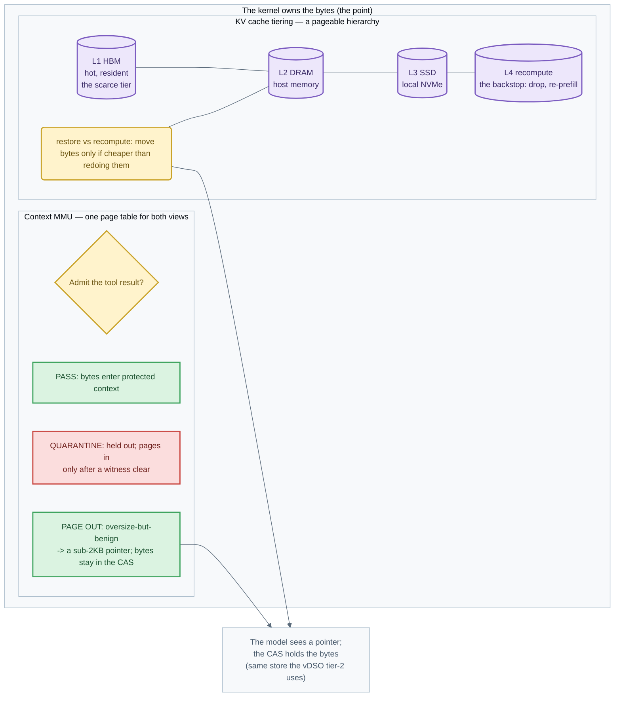
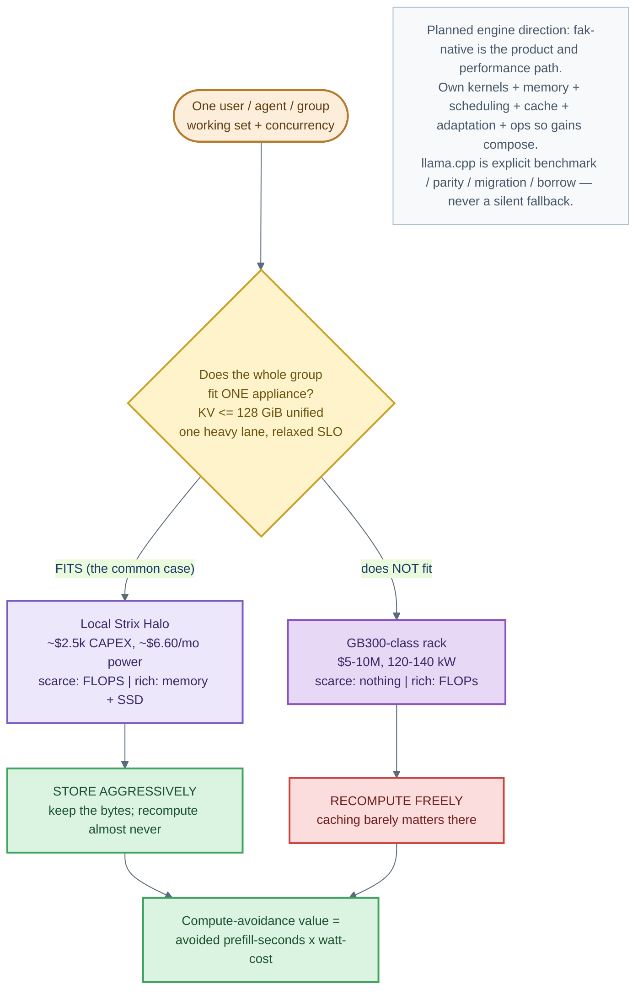
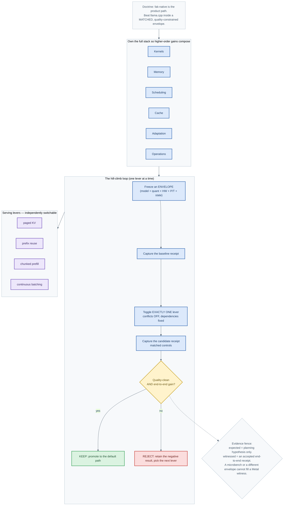
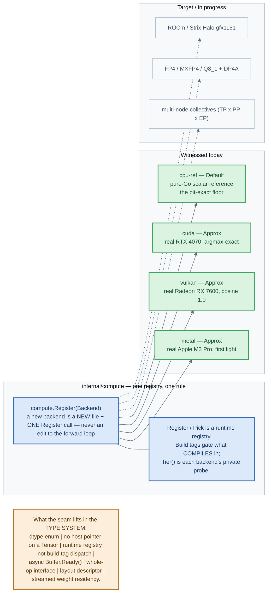

# Fak core engine visuals

Read this if you need the shape of the **fak core engine** at a glance — what it
does today and where the native path is going. Six figures: three describe the
engine as it is wired now, three describe the planned direction. Every figure is
GitHub-renderable Mermaid and also ships as a standalone `.mmd` + `.svg` + `.png`
under [`visuals/`](https://github.com/anthony-chaudhary/fak/tree/main/visuals).

**Color vocabulary** (shared with the [permission-systems
deck](notes/VISUALS-permission-systems-2026-06-18.md)): 🟠 amber = the untrusted
model, 🔵 blue = the kernel, 🟡 gold = a gate/decision, 🟢 green = a passed outcome,
🔴 red = a refused outcome, 🟣 violet = a memory/KV tier, 🟤 tan = the world or an
external runtime, ⚪ slate = a note/annotation.

> **Honesty fence.** The "today" figures describe wiring that exists on the
> current path (`[SHIPPED]`, per [`CLAIMS.md`](https://github.com/anthony-chaudhary/fak/blob/main/CLAIMS.md));
> the "planned" figures describe the committed direction and target levers, not
> measured results. No performance number here is a new claim — each one cites its
> existing authority.

---

## Part I — how the engine works today

### 80 — The engine is a frozen-ABI layered package graph

`fak` is one Go binary whose safety and modularity rest on a small number of
machine-checked structural invariants, enforced by
[`internal/architest`](https://github.com/anthony-chaudhary/fak/tree/main/internal/architest)
rather than trusted to prose. Every internal package declares a **tier 0–5**, and a
package may import only from tiers at or below its own — the layering that keeps the
"two fleet workers editing two leaves cannot collide" guarantee real.

```mermaid
%%{init: {'theme':'base','themeVariables':{'fontFamily':'Segoe UI, Helvetica, Arial, sans-serif','fontSize':'14px','lineColor':'#5B6B7B','primaryColor':'#DCE9FB','primaryTextColor':'#1B3A66','primaryBorderColor':'#3B6FB5','clusterBkg':'#F7F9FB','clusterBorder':'#AFC0CE'}}}%%
flowchart TB
  subgraph T5["tier 5 — integrator (top-level wiring)"]
    direction LR
    ag["internal/agent<br/>managed loop + the one OpenAI HTTP client"]
    gw["internal/gateway<br/>fak serve: OpenAI + MCP endpoint"]
  end
  subgraph T4["tier 4 — composer"]
    direction LR
    eng2["internal/modelengine<br/>fused in-kernel engine (id in-kernel)"]
    rkv["internal/radixkv<br/>automatic prefix discovery"]
    kmmu["internal/kvmmu<br/>verdict -> mechanical span evict"]
    hr["internal/headroom<br/>page-in compression"]
  end
  subgraph T3["tier 3 — mechanism"]
    direction LR
    adj["internal/adjudicator<br/>call-side capability floor"]
    cmmu["internal/ctxmmu<br/>result-side admission gate"]
    pf["internal/preflight<br/>cheapest-refutation ladder"]
    vdso["internal/vdso<br/>local fast path for repeat calls"]
    e1["internal/engine<br/>driven-engine seam"]
  end
  subgraph T2["tier 2 — foundation"]
    direction LR
    mo["internal/model<br/>pure-Go forward pass; KV cache is a Go object"]
    co["internal/compute<br/>HAL: cpu-ref / cuda / vulkan / metal"]
  end
  subgraph T1["tier 1 — primitive"]
    direction LR
    kv1["internal/kv<br/>KV pages, LRU/FIFO, block store"]
    bl["internal/blob<br/>content-addressed store (the CAS)"]
  end
  subgraph T0["tier 0 — root (frozen)"]
    direction LR
    abi["internal/abi<br/>frozen ABI + Register* seams<br/>the one tree every leaf imports"]
  end

  note["Import rule: a package may import only from tiers at or below its own<br/>(internal/architest, enforced every run). A new idea is a NEW directory +<br/>ONE Register* call + one blank-import in internal/registrations — no spine edit."]
  e1 -.->|"explicitly selected, reference only — never a silent fallback"| ext[["vLLM / SGLang / llm-d / Dynamo / llama.cpp"]]

  classDef kernel fill:#DCE9FB,stroke:#3B6FB5,stroke-width:2px,color:#1B3A66;
  classDef mem fill:#EDE7FB,stroke:#7B5BC0,stroke-width:2px,color:#3A2A66;
  classDef gate fill:#FFF3CC,stroke:#C9A227,stroke-width:2px,color:#6B5410;
  classDef note fill:#F7F9FB,stroke:#AFC0CE,stroke-width:1px,color:#46586A;
  classDef world fill:#FCEEDB,stroke:#B5792B,stroke-width:2px,color:#5E3D12;

  class abi gate;
  class mo,co,eng2 kernel;
  class adj,cmmu,pf,vdso,e1 gate;
  class kv1,bl,rkv,kmmu,hr mem;
  class note note;
  class ext world;
```

**Authorities:** [`ARCHITECTURE.md`](https://github.com/anthony-chaudhary/fak/blob/main/ARCHITECTURE.md)
(frozen ABI, the additive `Register*` seams, the O(1) hot-path scaling contract) and
`internal/architest/doc.go` (the layered-DAG rule). The five tiers are named in
`internal/architest/architest_test.go:36-41`.

### 81 — The token journey: one request through the fused kernel

A single request crosses one checkpoint. The point of fusion is that the model runs
**inside** the kernel address space, so the KV cache is a plain Go data structure the
kernel owns and the "context MMU" is a real operation on real attention state, not a
metaphor over HTTP.

```mermaid
%%{init: {'theme':'base','themeVariables':{'fontFamily':'Segoe UI, Helvetica, Arial, sans-serif','fontSize':'14px','lineColor':'#5B6B7B','primaryColor':'#DCE9FB','primaryTextColor':'#1B3A66','primaryBorderColor':'#3B6FB5','clusterBkg':'#F7F9FB','clusterBorder':'#AFC0CE'}}}%%
flowchart TD
  req["A request arrives at fak<br/>(prompt + tools + prior turns)"]
  tok["Tokenize: render the prompt to token ids"]
  radix{"Longest cached prefix<br/>already in the radix tree?"}
  reuse["Reuse it: CLONE the cached K/V prefix<br/>(internal/radixkv finds it for you)"]
  prefill["Prefill ONLY the uncached suffix<br/>F0 forward, rows -> weight bytes"]
  decide{"Next token is a<br/>tool call?"}
  call["Adjudicate the proposed tool call<br/>allow / deny / require-witness<br/>(evidence the model did NOT author)"]
  ptr["Local fast path: answer a repeat in-syscall,<br/>no model round-trip"]
  effect[["Run the tool: the effect reaches the world"]]
  admit{"Result admission<br/>at the context MMU"}
  denyres["Structured refusal becomes the result —<br/>a denied call never reaches the tool"]
  contok["Admitted result bytes + generated tokens<br/>continue the run"]
  kvgrow["Append new K/V to the kernel-owned cache;<br/>the radix tree records the new prefix"]
  classDef untrusted fill:#FFE9D6,stroke:#E8833A,stroke-width:2px,color:#7A3E12;
  classDef kernel fill:#DCE9FB,stroke:#3B6FB5,stroke-width:2px,color:#1B3A66;
  classDef gate fill:#FFF3CC,stroke:#C9A227,stroke-width:2px,color:#6B5410;
  classDef pass fill:#DBF3E1,stroke:#3FA45F,stroke-width:2px,color:#1C5230;
  classDef deny fill:#FBDDDD,stroke:#C9453F,stroke-width:2px,color:#6E1F1B;
  classDef mem fill:#EDE7FB,stroke:#7B5BC0,stroke-width:2px,color:#3A2A66;
  classDef world fill:#FCEEDB,stroke:#B5792B,stroke-width:2px,color:#5E3D12;
  class req,tok untrusted;
  class radix,decide,admit gate;
  class reuse,kvgrow,ptr pass;
  class prefill,call,contok kernel;
  class effect world;
  class denyres deny;
```

**Authorities:** [`docs/architecture.md`](architecture.md#end-to-end-request-flow)
(the six-step request flow), the [`tool-call-is-a-syscall`
explainer](explainers/tool-call-is-a-syscall.md), and the
[addressable-KV-cache explainer](explainers/addressable-kv-cache.md) for the prefix-reuse /
bit-exact-eviction half.

### 82 — The KV cache is pageable; context is protected memory

The KV cache is a **four-tier pageable hierarchy** (L1 HBM → L2 DRAM → L3 SSD → L4
recompute), and the same context MMU that decides whether a tool result may enter
context also maps each context segment to where its K/V lives. `kvmmu` is the bridge
that turns a logical quarantine/elision verdict into a mechanical, bit-exact span
evict.

**Authorities:** [`docs/explainers/kv-cache-agentic-context.md`](explainers/kv-cache-agentic-context.md),
[`internal/model`](https://github.com/anthony-chaudhary/fak/tree/main/internal/model) (the KV
cache as a kernel-owned Go structure), `internal/ctxmmu` (the write-time result
admission gate), and `internal/kvmmu` (verdict → mechanical span evict).

---

## Part II — how the engine is planned to work

### 83 — The cost fork: appliance-shaped vs rack-shaped

The planned engine direction starts from a physical fork. The
[deployment-selection model](notes/2026-09-09-SELLING-ALWAYS-ON-INFERENCE-ON-OPENROUTER.md)
shapes the whole roadmap: on a **Strix Halo** appliance FLOPS are the scarce resource
and memory is rich, so compute-avoidance (storing KV aggressively) pays; on a
**GB300-class rack** FLOPs are abundant, so the same caching works matters far less.

**Authorities:** [`docs/native-inference-goal.md`](native-inference-goal.md) (the
fak-native doctrine and matched-envelope rule), [`docs/explainers/hardware-limits-and-capacity.md`](explainers/hardware-limits-and-capacity.md)
(the capacity/placement frame), and [`docs/serving/hardware-aware-cache.md`](serving/hardware-aware-cache.md)
(where a KV span lives across memory tiers). Figures **80–85** here are the
engine-specific refresh of the visual set.

### 84 — The native hill-climb loop: one lever at a time

The planned native path is climbed as a disciplined **keep-or-reject lever graph**,
not as a pile of flags. Each lever names an expected (planning-hypothesis) effect and
a separate witnessed (receipt-backed) effect; the graph validates fail-closed on
cycles, conflicts, and any expected-vs-witnessed conflation.

**Authorities:** [`docs/benchmarks/NATIVE-PERFORMANCE-HILLCLIMB.md`](benchmarks/NATIVE-PERFORMANCE-HILLCLIMB.md)
(the pinned envelopes, the individually-attributable levers, the evidence fence and
update procedure) and [`docs/benchmarks/NATIVE-PERFORMANCE-CURRENT.md`](benchmarks/NATIVE-PERFORMANCE-CURRENT.md)
(the live constraint portfolio the loop consumes).

### 85 — Compute backends: one registry, one rule

Device compute is a **separate registry from the frozen ABI** — deliberately, because
device compute is internal to the model, not a cross-worker contract. It obeys the same
discipline: a new backend is a new file plus one `Register` call, never a forward-loop
edit.

**Authorities:** `internal/compute/compute.go` (the HAL package doc — the seven
baked-in assumptions it lifts and the known-open ledger), [`CLAIMS.md`](https://github.com/anthony-chaudhary/fak/blob/main/CLAIMS.md)
(engine backend claims), and [`docs/serving/native-device-mesh-collectives.md`](serving/native-device-mesh-collectives.md)
(the R3+ DP × TP × PP × EP design gate).

---

## Where to go deeper

| For… | Read |
|---|---|
| The contributor-facing seam catalog and `Register*` contract | [`ARCHITECTURE.md`](https://github.com/anthony-chaudhary/fak/blob/main/ARCHITECTURE.md) |
| The external system view and trust boundaries | [`docs/architecture.md`](architecture.md) |
| The native product/performance doctrine | [`docs/native-inference-goal.md`](native-inference-goal.md) |
| Current native constraints and the next lever | [`docs/benchmarks/NATIVE-PERFORMANCE-CURRENT.md`](benchmarks/NATIVE-PERFORMANCE-CURRENT.md) |
| The serving side (ride engines + scale out KV) | [`docs/serving/README.md`](serving/README.md) |
| The addressable (bit-exact, mid-run evictable) KV cache | [`docs/explainers/addressable-kv-cache.md`](explainers/addressable-kv-cache.md) |
| The first public product milestone | [`docs/local-agent-milestone.md`](local-agent-milestone.md) |
