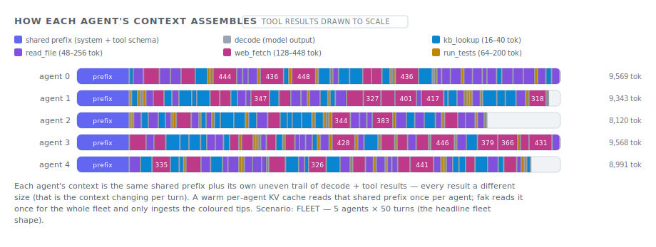
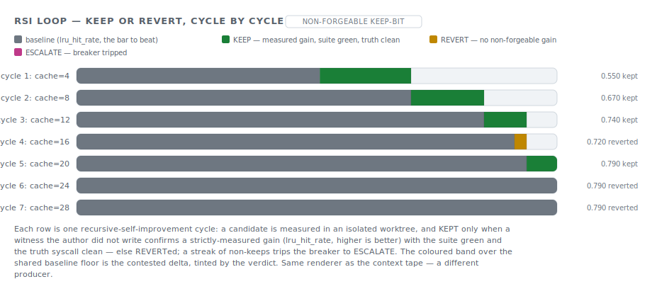

# The context tape

Read this if you need to teach, debug, or audit where an agent's context budget
actually went. You'll be able to render the same tape from a canned scenario, a
real trajectory, or an RSI journal, then compare the reused prefix against fresh
input and decode without hand-drawing a new chart.

fak's most-shared picture is one panel of the live demo (`cmd/ctxdemo`): a row per agent,
each row a horizontal bar whose coloured segments are drawn **to scale** — the shared
prefix, the model's decode, and every tool result a different size. You can see the context
grow unevenly, and you can see how little of it is new each step. That single image explains,
in one glance, why a multi-agent fleet stresses the KV cache and where fak's reuse win comes
from.



The trouble was that this picture lived **only** inside one running Go HTTP demo, drawn in
browser JavaScript, fed by five synthetic scenarios. You could not point it at a real
session, you could not emit it from another part of the system, and you could not drop it
into a doc. This note is about the small tool that fixes all three —
[`tools/context_tape.py`](../../tools/context_tape.py) — and the program it opens up:
**more of this kind of visual, everywhere a human reads.**

## One renderer, many sources

The move is to make the *data* portable, not the demo. Every producer emits the same tiny,
source-agnostic **Tape** JSON, and one renderer turns any Tape into the picture above:

```json
{
  "title": "How each agent's context assembles",
  "tag": "tool results drawn to scale",
  "legend": [{"key": "prefix", "label": "shared prefix"}, {"key": "read_file", "label": "read_file (48–256 tok)"}],
  "rows": [
    {"label": "agent 0", "total_label": "9,569 tok",
     "segments": [{"key": "prefix", "value": 1024}, {"key": "read_file", "value": 201}]}
  ],
  "caption": "…"
}
```

That `Tape` is the whole interface. The renderer knows nothing about agents, turns, or
caches — it draws labelled rows of coloured, to-scale segments and a legend. So **any** data
source that can describe itself as rows-of-segments gets the same picture for free. The tool
ships three such adapters today, and the schema is the seam where the fourth plugs in. Each
adapter writes a standalone SVG (no server, no JS), an HTML page, an ASCII twin for a
terminal or a Jekyll-served doc, or the raw Tape JSON:

```sh
python tools/context_tape.py scenario   fleet-5x50            --svg fleet.svg
python tools/context_tape.py trajectory  session.jsonl        --svg session.svg
python tools/context_tape.py rsi         rsiloop-journal.jsonl --ascii
python tools/context_tape.py render      tape.json             --html out.html
```

## Application 1 — live for any trajectory

Point the `trajectory` adapter at a real Claude Code session transcript — the same `.jsonl`
[`tools/session_audit.py`](../../tools/session_audit.py) reads — and it renders **that
session's** context tape. Each row is one billed turn; the bands are **exact provider token
counts** from `message.usage`: the big faded band is the prefix the model **reused** from
cache that turn (`cache_read`), the small coloured tip is the fresh input that turn
(`input + cache_creation`), and the grey tail is decode (`output`). Billed turns are de-duped
on `message.id` exactly the way `session_audit.py` folds them (Claude Code writes several
transcript lines per billed turn).

```text
HOW THIS SESSION'S CONTEXT ASSEMBLES   [real trajectory · drawn to scale]
legend: ▒ reused prefix (KV cache hit · cache_read)  ░ decode  a Read  b Grep  c Edit  d Bash

turn 1 │aaaaaaaaaaaaaaaaaaaaaaaaaaaaaaa░                                    │ 5,400 in
turn 2 │▒▒▒▒▒▒▒▒▒▒▒▒▒▒▒▒▒▒▒▒▒▒▒▒▒▒bbbbbbb░                                  │ 5,560 in
turn 3 │▒▒▒▒▒▒▒▒▒▒▒▒▒▒▒▒▒▒▒▒▒▒▒▒▒▒▒▒▒▒▒▒▒aaa░                               │ 6,140 in
turn 4 │▒▒▒▒▒▒▒▒▒▒▒▒▒▒▒▒▒▒▒▒▒▒▒▒▒▒▒▒▒▒▒▒▒▒▒▒ccccccccccc░░░                  │ 8,130 in
turn 5 │▒▒▒▒▒▒▒▒▒▒▒▒▒▒▒▒▒▒▒▒▒▒▒▒▒▒▒▒▒▒▒▒▒▒▒▒▒▒▒▒▒▒▒▒▒▒▒▒ddddd░░             │ 9,025 in
turn 8 │▒▒▒▒▒▒▒▒▒▒▒▒▒▒▒▒▒▒▒▒▒▒▒▒▒▒▒▒▒▒▒▒▒▒▒▒▒▒▒▒▒▒▒▒▒▒▒▒▒▒▒▒▒▒▒▒▒▒cccccccc░░│ 11,312 in
```

The reused band dwarfing the fresh tip **is** the frozen-trajectory cache win — but now on
*your* session, not a synthetic one. It is the per-turn, drawn-to-scale companion to the
aggregate numbers in [`session_audit.py`](../../tools/session_audit.py) and the survival
curves in [`cache_curve.py`](../../tools/cache_curve.py): the
[frozen-trajectory cache cliff](frozen-trajectory-cache-cliff.md) made visible turn by turn.

```sh
python tools/session_audit.py discover --since-days 7        # find a real session .jsonl
python tools/context_tape.py trajectory <that-session>.jsonl --svg my-session.svg
```

## Application 2 — RSI loops, and similar, modularly

Because the renderer only knows about rows-of-segments, a producer that is **not** a context
trace at all gets the same picture. The RSI loop ([`internal/rsiloop`](../../internal/rsiloop))
writes an append-only keep/revert journal; the `rsi` adapter renders it as a **verdict
ladder** — one row per cycle, the bar the candidate metric over a shared baseline floor, the
contested delta tinted by the verdict (keep / revert / escalate).



```text
RSI LOOP — KEEP OR REVERT, CYCLE BY CYCLE   [non-forgeable keep-bit]
legend: ░ baseline (the bar to beat)  █ KEEP  ▓ REVERT  ▚ ESCALATE

 cycle 1: cache=4 │░░░░░░░░░░░░░░░░░░░░░░░░░░░░░███████████                 │ 0.550 kept
 cycle 2: cache=8 │░░░░░░░░░░░░░░░░░░░░░░░░░░░░░░░░░░░░░░░░█████████        │ 0.670 kept
cycle 3: cache=12 │░░░░░░░░░░░░░░░░░░░░░░░░░░░░░░░░░░░░░░░░░░░░░░░░█████    │ 0.740 kept
cycle 4: cache=16 │░░░░░░░░░░░░░░░░░░░░░░░░░░░░░░░░░░░░░░░░░░░░░░░░░░░░▓    │ 0.720 reverted
cycle 5: cache=20 │░░░░░░░░░░░░░░░░░░░░░░░░░░░░░░░░░░░░░░░░░░░░░░░░░░░░░████│ 0.790 kept
```

This is the "more modular" point made concrete: the loop did not learn to draw, and the
renderer did not learn about RSI — they meet at the Tape schema. A loop run can emit a ladder
SVG as a build artifact the way it already emits a `dos improve --observe` receipt
(the [`Observer`](../../internal/rsiloop/rsiloop.go) seam), so a human reviewing a self-
improvement run sees the keeps and reverts at a glance instead of reading a JSONL. The next
producer — a fleet's per-agent token budget, a benchmark's arm-by-arm cost, a policy's
allow/deny mix — is one `Tape`-emitting function away, with no renderer change.

## Application 3 — education and course material

Because every adapter emits a **standalone** SVG and an ASCII twin, the same explanatory
visual can live wherever a human reads — not only on a running demo:

- **A README or GitHub page** embeds the SVG directly (``).
- **A Jekyll-served `docs/` page** uses the ASCII fence (renders identically everywhere, no
  mermaid plugin needed) or embeds the SVG image.
- **The [learning path](../../LEARNING-PATH.md)** can illustrate the cache courses with a real
  picture: [FAK 201](../../LEARNING-PATH.md) (what a KV cache is), [FAK 401](../../LEARNING-PATH.md)
  (how agents stress it), and [FAK 402](../../LEARNING-PATH.md) (the A/B/C cost arms) are exactly
  the concepts the tape draws. A course lab becomes "render your own session and read the reused
  band," which is a far better checkpoint than a paragraph.

The teaching value is that the picture is **honest and reproducible**: a student can run the
exact command, get the exact figure, and change one input (more agents, a longer trajectory,
a flexible vs append-only harness) to watch the reuse move. That is the difference between a
diagram a human drew and a diagram the data drew.

## The visuals-everywhere program

The tape is the first instance of a general principle worth pursuing across the repo:

> **Every fak data source that has a shape should be able to draw that shape, in the same
> visual language, with no custom rendering code.**

The repo already has two visual families: the hand-authored mermaid deck in
[`visuals/`](../../visuals/) (architecture diagrams, edited via `_meta.json`) and the
generated charts from `tools/*_gen.py` and `cache_curve.py`. The context tape adds a third,
more reusable kind: a **renderer keyed on a portable data model**, so the work of making a
new visual is the work of describing the data, not drawing it. Concrete next steps that
follow this principle:

1. **Unify the live demo and the static export.** Teach `cmd/ctxdemo` to emit a `Tape` JSON
   (a ~20-line addition next to its existing `-print -json`), so the interactive panel and
   the checked-in SVG render from one schema and can never drift.
2. **Turn the trajectory tape into a meter.** The bands are already exact; folding a
   per-turn longest-common-prefix divergence (the flexibility survival factor from
   [FAK 401](../../LEARNING-PATH.md)) onto each row would make the
   [cache cliff](frozen-trajectory-cache-cliff.md) falsifiable on a live workload, exactly
   the meter that note asks for.
3. **More producers.** A fleet budget tape, a benchmark cost-arm tape, a policy
   allow/deny tape — each a small `Tape`-emitting function reusing this renderer.
4. **A gallery.** A short generated page that renders one example per producer, so the
   visual language is discoverable in one place.

## Honest fences

- **Exact where it can be, attributed where it can't.** A trajectory's band *sizes* are exact
  provider token counts (`cache_read`, `input + cache_creation`, `output`). The *colour* of
  the fresh band is the turn's dominant tool name — an attribution of an exact-size band, not
  a per-tool token re-measurement. The legend says `fresh input · <tool>` to keep that honest.
- **The scenario is synthetic.** The `scenario` shapes are a faithful Python mirror of the Go
  catalog in [`cmd/ctxdemo/scenario.go`](../../cmd/ctxdemo/scenario.go) (same seeded LCG). The
  mirror is cross-checked byte-for-byte against `go run ./cmd/ctxdemo -print -json` (all five
  scenarios, results and tool names) and the parity is locked by a test; pass
  `--from-json <(go run ./cmd/ctxdemo -print -json)` to render from the authoritative numbers
  directly.
- **Drawn to scale means within one tape.** Segment widths are proportional to token counts
  inside a single figure; two different figures are not necessarily on the same scale.
- **The committed SVGs are examples.** `visuals/66` is the synthetic headline scenario;
  `visuals/67` is an *illustrative* RSI journal (a representative shape, not a recorded run).
  Render the real ones from your own session / journal with the commands above. A real
  session's SVG is not committed — it is yours to generate, and it may carry tool names from
  your work, so treat it like any session artifact.

## Reproduce it

```sh
python tools/context_tape.py list                              # the scenario catalog
python tools/context_tape.py scenario fleet-5x50 --ascii       # the headline panel, in your terminal
python tools/context_tape.py scenario fleet-5x50 --svg fleet.svg
python tools/context_tape.py trajectory <session>.jsonl --svg session.svg   # YOUR session
python tools/context_tape.py rsi <rsiloop-journal>.jsonl --svg ladder.svg
python -m pytest tools/context_tape_test.py -q                 # parity + exact-band tests
```

---

**Related:** [`frozen-trajectory-cache-cliff.md`](frozen-trajectory-cache-cliff.md) (why the
reused band is so big, and the scaling laws that shrink it) ·
[`kv-cache-agentic-context.md`](kv-cache-agentic-context.md) (the prefix mechanics) ·
[`tools/session_audit.py`](../../tools/session_audit.py) (the exact token accounting the
trajectory tape reads) · [`cmd/ctxdemo`](../../cmd/ctxdemo) (the live, interactive sibling).
