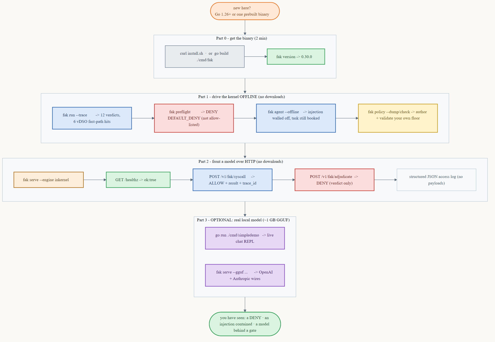

# fak documentation index

The `docs/fak/` directory holds the **operator and integrator** docs for `fak serve` (the
gateway) and for putting `fak` in front of a model. The conceptual docs (the two flips, the
scaling laws, the explainers) live one level up in [`docs/`](../) and at the
[repo root](../../README.md).

## Start here

| If you want to… | Read |
|---|---|
| **Run `fak` for the first time** (guided, real output at every step) | [**tutorial.md**](tutorial.md) ⭐ |
| Install the binary (Docker / prebuilt / source) | [`INSTALL.md`](../../INSTALL.md) · [`fak/GETTING-STARTED.md`](../../fak/GETTING-STARTED.md) |
| Just chat with a local model | [Simple Demo](../../fak/cmd/simpledemo/README.md) |
| Quick answers — what it is, how it differs, threat model | [faq.md](faq.md) |

## Run the server

| Topic | Doc |
|---|---|
| Fast path to a running gateway | [server-quickstart.md](server-quickstart.md) |
| Every flag and env var | [server-config.md](server-config.md) |
| Every endpoint, request, and response | [api-reference.md](api-reference.md) |
| When something breaks | [server-troubleshooting.md](server-troubleshooting.md) |
| Metrics, logs, and traces | [observability.md](observability.md) |
| Performance, scaling, multi-region, and HA | [advanced-topics.md](advanced-topics.md) |
| Production deployment | [deployment-guide.md](deployment-guide.md) |

## Author and harden the policy

| Topic | Doc |
|---|---|
| Build a capability floor (worked examples) | [policy-guide.md](policy-guide.md) |
| The manifest schema + refusal vocabulary | [`fak/POLICY.md`](../../fak/POLICY.md) |
| Hardening a deployment (auth, network, threat model) | [security.md](security.md) |

## Integrate

| Topic | Doc |
|---|---|
| Architecture of agent ↔ kernel integration | [agent-integration-architecture.md](agent-integration-architecture.md) |
| Put `fak` in front of a framework (LangChain/LangGraph, LlamaIndex, AutoGen, CrewAI, …) | [agent-framework-integration.md](agent-framework-integration.md) |
| Client code in Python, JavaScript, Go, and Rust | [multi-language-examples.md](multi-language-examples.md) |
| Migrate an existing stack (OpenAI API, LangChain, AutoGen, llama.cpp) onto `fak` | [migration-guide.md](migration-guide.md) |
| Claude Code + Anthropic API setup | [`docs/integrations/claude.md`](../integrations/claude.md) |
| OpenAI Codex / OpenAI-compatible clients | [`docs/integrations/openai-codex.md`](../integrations/openai-codex.md) |
| Related work + prior art | [related-items.md](related-items.md) |

## Status

The operator/integrator documentation set above is complete — multi-language examples,
framework integration, API reference, and FAQ have all shipped. The per-page status and
any remaining polish is tracked in [documentation-roadmap.md](documentation-roadmap.md).

---

> Every command and output block in [tutorial.md](tutorial.md), [policy-guide.md](policy-guide.md),
> [observability.md](observability.md), and [security.md](security.md) was captured from a
> clean build of `fak` v0.30.0. If a command prints something different for you, that's a
> doc bug — please [open an issue](https://github.com/anthony-chaudhary/fleet/issues).
