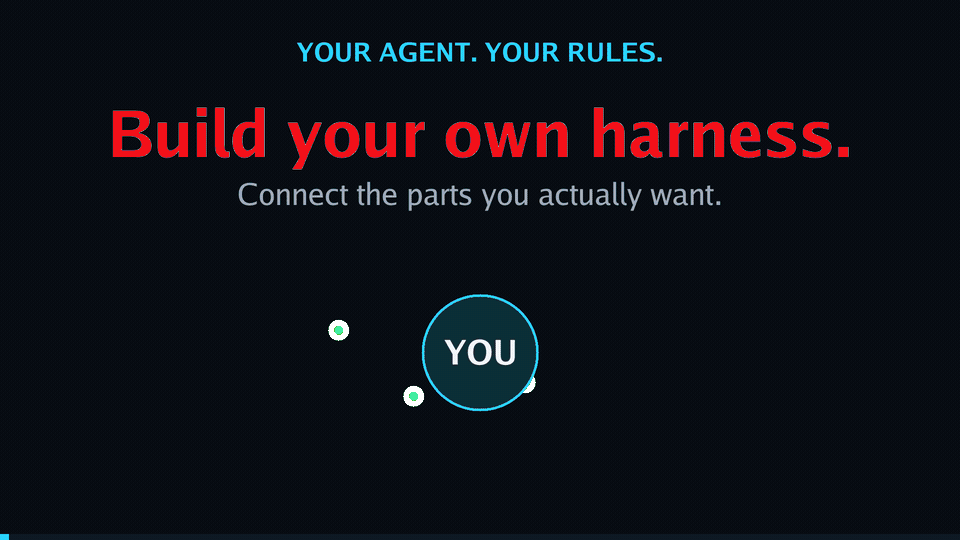

# fak harness init

`fak harness init` creates the smallest runnable fak-based product outside the fak checkout. The generated program imports only the public `pkg/harnesskit` contract, pins an immutable Go module version, and performs one deterministic offline turn with semantic JSON events.

[](../visuals/build-your-own-harness.mp4)

**[Watch the 18-second build-your-own-harness video (MP4)](../visuals/build-your-own-harness.mp4)** · [reproduce the render](../tools/videogen/projects/build-your-own-harness/)

```text
fak harness init --dir ./my-product --module example.com/my-product
cd ./my-product
go build -o product-bin ./cmd/product
go run ./cmd/product --selfcheck
```

To start from one of fak's first-party host adapters, select it explicitly:

```text
fak harness init --dir ./my-codex-product --module example.com/my-codex-product --host codex
fak harness init --dir ./my-claude-product --module example.com/my-claude-product --host claude
```

Host initialization adds `product.json` and `product.lock.json`. The manifest projects the
same `internal/harnessprofile` descriptor used by guard into versioned host, wire, and repoint
components; the generated product verifies that lock and emits the resolved component identities
in its `harness.locked` launch receipt. The no-`--host` path remains the generic nine-file product.

The host component version belongs to fak's adapter contract, not to the installed Codex or
Claude CLI. Its digest covers the descriptor semantics, and a committed snapshot forces a
deliberate version decision whenever those semantics change. Upstream executable versions are
runtime observations: init neither installs nor silently pins them. This split lets a stable fak
adapter tolerate compatible upstream releases while leaving incompatible drift visible for a
pre-launch check.

## Cross-dogfood conformance

Run the complete host-artifact matrix from the fak checkout with one offline command:

```text
fak harness cross-dogfood --selfcheck --json
```

The selfcheck resolves Codex, Claude, and a config-declared third harness, then derives the
guard binding, component graph, product lock, and external generated-product receipt from each
descriptor. Exact host, wire, repoint, adapter-version, and digest identities must agree at every
seam. Each row also mutates its resolved descriptor and requires the prior graph and lock to fail
closed as stale. Generated external products use a local module replacement with `GOPROXY=off`,
so the command needs no key, model, network, or GPU and does not require the three host CLIs.

The same command is supported natively on Windows and through WSL. The checked-in machine
readout, including both platform witnesses, is
[`issue-8227-harness-cross-dogfood.json`](_witnesses/issue-8227-harness-cross-dogfood.json).

Ownership is explicit in `harness.lock.json`: `product/config.go` and `README.md` are user-owned and never overwritten. Generated Go/module files carry generator provenance or are listed in the lock. Re-running the command updates only recognized generated files and leaves user-owned files byte-for-byte intact.

The default pin is `github.com/anthony-chaudhary/fak` pseudo-version `v0.43.1-0.20260814184635-613a82b762e2`, the Go proxy's immutable pseudo-version for commit `613a82b762e2` where public contract `v1alpha1` shipped. Override it explicitly with `--fak-version` when upgrading. Windows and Linux clean-room transcripts are archived under `docs/_witnesses/harness-init/`.

# Contextual harness selection spine — 2026-08-15

## Verdict

A useful “many harnesses” model is not one chosen profile per engineer. It is a deterministic **effective harness** assembled from the layers that match the work now: company, team, person, repository, project, domain, and task. The operator should normally choose the work, not hand-compose the harness. The system must answer both **what loaded?** and **why?** before launch.

This spine adds `fak harness select`, a pure pre-launch resolver and explanation trace. It intentionally stops before issue #6792’s full capability dependency solver: selection decides *which contextual layers participate*; composition decides *whether their typed assets can safely form a runnable product*.

## Value frame and problem checks

- **Centrality:** Core. Context-managed work is the product seam; this decides which context, tools, policy, memory, routing, and UI defaults reach it.
- **For:** an engineer who moves among coding, legal, integrated operations, and company work without wanting to rebuild or remember a harness before every task.
- **Problem:** today’s user/repo/project settings and skills overlap, but precedence is host-specific, largely path-based, and weakly explainable. More options increase setup and “which config won?” work.
- **Today:** manually switch profiles, copy settings into a repo, or accept whichever host’s implicit hierarchy happens to apply.
- **Better because:** one context selects stable layers deterministically, preserves non-removable organizational floors, excludes unrelated domain capabilities, and emits provenance for every result.
- **Witness:** `fak harness select --manifest <file> --path C:/matters/7/briefs --tag legal` selects company + person + project + legal layers, skips coding, and explains every action as JSON.

Problem checklist:

- **P1 managed context:** only matched layers enter the effective capability set; unrelated coding context does not leak into legal work.
- **P2 net-true efficiency:** the plausible gain is fewer manual switches and less duplicated config. It remains **not yet measured** against tuned host-native profiles; no efficiency claim is made.
- **P3 bounded adaptation:** selection uses declared path/tag predicates. Locked floors fail closed when a narrower layer tries to remove them.
- **P4 integrated operations:** the result is deterministic machine-readable JSON, suitable for composition, launch preview, audit, and support tooling.

## Model: identities are axes, not a single inheritance tree

The scopes describe different reasons a layer exists:

| Scope | Typical owner | Examples | Default order |
|---|---|---|---:|
| company | security/platform | audit, data boundary, approved providers | 10 |
| team | practice/team | review workflow, shared tools | 20 |
| person | engineer | response style, accessibility, personal shortcuts | 30 |
| repo | maintainers | build/test commands, contribution rules | 40 |
| project | project lead | matter memory, customer systems, deliverables | 50 |
| domain | specialist | legal citations, coding shell, incident procedure | 60 |
| task | current work | temporary objective/eval/tool subset | 70 |

This is a stable conflict order, not a claim that “domain belongs under project.” A legal domain can cross many repositories and projects; a person can belong to many teams; a company floor applies to all. Match predicates make the axes overlap, and the resolver linearizes only the selected instance.

Within one scope, explicit priority then stable ID order make selection independent of manifest file order. Lower/specific layers may add, replace, or remove ordinary capabilities. Any layer may lock a capability; later layers cannot remove that floor. Full typed conflict, dependency, budget, signature, and permission-widening checks remain the composition resolver’s job (#6792).

## “Don’t make me think” operating contract

The normal launch path should infer context from durable facts:

1. discover company/team/person declarations from managed installation and identity;
2. discover repo/project declarations from the current path and project registry;
3. classify domain from an explicit project declaration first, then an explainable task classifier;
4. add a short-lived task layer;
5. preview only novelty, conflict, privilege widening, or low-confidence classification;
6. compile through #6792, lock provenance, then launch.

The operator should not see a setup wizard on every turn. Explicit `--tag` in this spine is a witness/control seam, not the final UX. Remembered choices must be scoped and reversible; policy floors are never learned away. “Automatic” without an explanation trace is hidden configuration, not lower cognitive load.

## Current ecosystem evidence

Checked 2026-08-15 against current public documentation:

- OpenAI Codex config documents user/project configuration, profiles, precedence, overrides, and scope.
- Claude Code settings document user/project/local and managed organization settings with precedence/override behavior.
- GitHub Copilot custom-instruction documentation covers repository and organization/enterprise instruction surfaces and precedence.

These systems validate the demand for layered configuration. The missing general seam is cross-host contextual selection across orthogonal person/project/domain identities, followed by one portable provenance/explanation contract. fak should project the result into hosts rather than invent another silent host-specific pile of files.

Sources:

- https://developers.openai.com/codex/config-reference
- https://docs.anthropic.com/en/docs/claude-code/settings
- https://docs.github.com/en/copilot/customizing-copilot/adding-repository-custom-instructions-for-github-copilot
- `docs/notes/agent-skill-portability-2026-08-14.md`
- `docs/notes/UNIVERSAL-HARNESS-PROFILES-2026-07-01.md`

## Spine contract and honest boundaries

Manifest schema: `fak.harness-selection/v1alpha1`. Unknown fields/scopes and duplicate IDs fail before selection. Results include normalized context, ordered selected layers, effective named capabilities with source and lock state, and select/skip/add/remove/override trace entries.

This spine proves selection semantics, not a complete user-facing harness manager:

- capability names are opaque handles, not executable assets;
- tags are supplied explicitly; no domain classifier is shipped;
- company/team/person discovery and signatures are not shipped;
- selected output is not yet wired into `pkg/harnesskit` launch;
- secrets, memory namespaces, tools, policy, model routing, and UI each need typed merge semantics;
- quantitative “less setup” evidence is not yet available.

Those are follow-on contracts, not reasons to blur selection into the larger composition problem.
