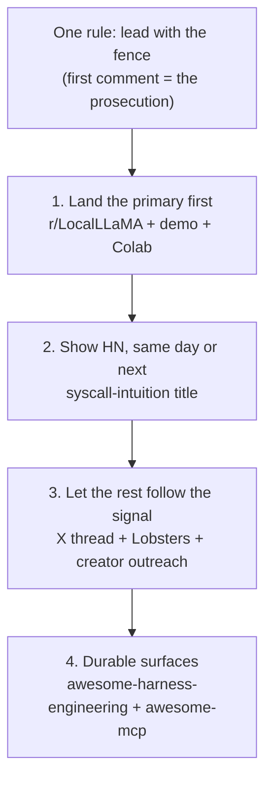

# Launch kit — getting fak organically discovered

Paste-ready assets for the channels where an AI-agent-security / self-hosted-LLM-infra
project actually gets discovered organically. Every number in every asset traces to the
honesty ledger ([`CLAIMS.md`](../../CLAIMS.md)); every CLI command was re-verified against
the live binary. Nothing here is a substitute for the work being good — it's the
distribution layer on top of work that already survives a skeptic reading the code.

*The launch sequence from "The sequence that actually works," governed by the one rule above.*

## The one rule that governs all of it

**Lead with the fence — it's the hook, not the caveat.** Every audience targeted here
(r/LocalLLaMA, Hacker News, r/netsec, Lobsters, the prompt-injection crowd around Simon
Willison) is reflexively hostile to AI launch-speak and rewards self-skepticism. fak's
credibility *is* its fences and its zeros:

- the injection detector is **~100% evadable by design** — explicitly *not* the floor;
- the perf headline is **~1.5–4.1× vs a tuned warm-cache stack**, never the naive 8.8–9.7×
  alone (the naive number is the strawman a perf-literate reader divides away);
- the prior-art audit scored **0/29 novel** — the contribution is the *assembly*;
- power/energy/$ figures are **simulated**; the ~60× / "agent city" numbers are **design
  targets**, labeled as such;
- fak is **not a faster token engine** — the contrast is operational surface, not tok/s.

The single move that disarms the AI-slop, naive-benchmark, and security-overclaim reflexes
at once: **make your own first comment the prosecution.** Name your weaknesses before the
top commenter does.

## What's here

| File | Use it for |
|---|---|
| [`positioning-brief.md`](positioning-brief.md) | **Read first.** The sharpest hook + backups (each fenced), the 3 most showable moments, the per-platform angle, and the 3 framings to avoid. |
| [`landscape-research.md`](landscape-research.md) | Where each channel's discovery actually happens in 2026, the rules that get you removed, and the one highest-ROI move per channel. |
| [`show-hn.md`](show-hn.md) | Show HN title, the author's first comment, and a paste-from objections list. |
| [`reddit-localllama.md`](reddit-localllama.md) | The **primary** post — r/LocalLLaMA, the only sub that grades all three differentiators on merit. |
| [`reddit-other-subs.md`](reddit-other-subs.md) | Tuned variants for r/programming, r/golang, r/selfhosted, r/netsec, r/LLMDevs, r/AI_Agents — each with that sub's self-promo rule. |
| [`youtube-demo-script.md`](youtube-demo-script.md) | A 60–90s shot-by-shot script (VO + on-screen text) tied to the live demos, for a short or a creator hand-off. |
| [`x-thread.md`](x-thread.md) | An X/Twitter thread + a standalone Bluesky variant, each post paired with an existing visual. |
| [`lobsters-and-blog.md`](lobsters-and-blog.md) | A Lobsters submission + a dev.to/Hashnode cross-post outline (the long-tail SEO + newsletter-pickup asset). |
| [`untrusted-program-talk.md`](untrusted-program-talk.md) | **The long-form spine.** A talk outline (the syscall framing → the two flips → the 0/29 posture → the `max|Δ|=0` slide → the modeled WebVoyager 8.8×–9.7× vs the naive floor, with fences), a 4-post blog-series outline each mapped to a sourced explainer, and a conference/meetup submission-target list. Extends this kit; every number traces to `BENCHMARK-AUTHORITY.md` or a named doc. |

Each post file ends with a **Provenance & fact-check** appendix — the adversarial review
that produced it. Keep it for your own reference; strip it before pasting.

## The sequence that actually works

Discovery is upstream-driven: creators and newsletters mine the Show HN front page and
r/LocalLLaMA for topics. So:

1. **Land the primary first.** One r/LocalLLaMA post (mechanism-titled around the bit-exact
   mid-run KV eviction) with the demo embedded and the Colab one click away — you as first
   commenter posting the oracle-parity table *and* the honest tuned-baseline number.
2. **Show HN, same day or next.** Title is the syscall intuition, not "security." Post your
   prosecution-first comment immediately; answer every technical reply fast for two hours.
3. **Let the rest follow the signal.** The X thread (tag the *vocabulary*, not the product),
   the Lobsters essay (idea-first, needs an aged account — see the landscape doc), and direct,
   *specific* creator outreach using the per-channel move in the positioning brief.
4. **Durable surfaces:** get listed on `awesome-harness-engineering` and the `awesome-mcp`
   lists — low effort, keeps delivering for months.

## Before you post anything

- **Re-run the proof.** The 60-second command must reproduce on a clean checkout:
  `go run ./cmd/fak preflight --policy examples/customer-support-readonly-policy.json --tool refund_payment --args "{}"`
  → `DENY (POLICY_BLOCK)`; `--tool search_kb` → `ALLOW`. (Verified 2026-06-22.)
- **Check the live demos load:** <https://anthony-chaudhary.github.io/fak/demos.html>
- **Disclose authorship** in the first line on every channel — "disclosure: I built this"
  *raises* trust in these venues.
- **Never ask for upvotes.** Vote-ring detection silently zeroes them and it's a flag magnet.
