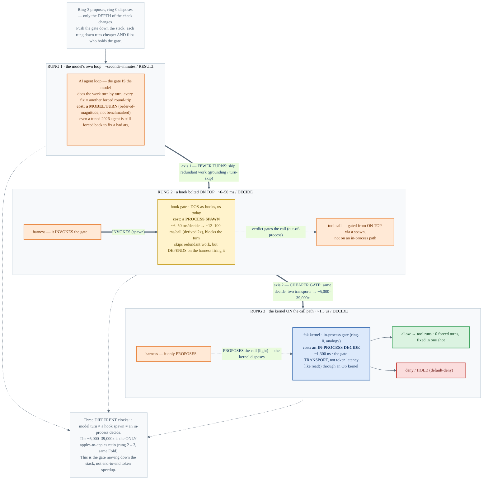

# Push the gate down the stack: seconds → ms → µs, and the inversion

> An agent can *ask* for an action. It can't *authorize* one. The only real
> engineering choice is how far down the stack the check lives: the model's own
> loop, a hook spawned on top, or the kernel on the call path. Each rung down
> moves the per-check cost down by orders of magnitude and flips who holds the
> gate. They are three different clocks, though, so they never multiply into one
> end-to-end number.

This is the picture behind the "naive loop → DOS → fak" progression. It is one
ladder, read by *where the check sits relative to the call*.

## The ladder

On **rung 1** the model is the gate. It runs its own loop, turn by turn, and a
bad argument or a repeated read only surfaces as another forced round-trip.
That gets there in seconds to minutes. Even a tuned 2026 framework that skips
the calls it didn't need is still forced back through the model to fix a wrong
argument (`cmd/turntaxdemo/page.html:101-103`).

On **rung 2** the gate is a hook bolted on top. The harness *invokes* it,
faulting out to a separate process that decides and returns. It genuinely skips
redundant work — grounding refuses a false "done," and a matcher can skip the
read-only calls. But a process-per-decide costs about 6–50 ms, and a tool call
pays one hook on the way in and one on the way out, so the floor is roughly
12–100 ms, synchronous, blocking the turn (`docs/cli-reference.md:118-120`).
This is DOS as the fleet ships it today, stated honestly: the baseline the
inversion improves on.

On **rung 3** the gate is a bead threaded onto the call wire. The harness no
longer invokes anything. It *proposes* a call that passes *through* the kernel
in-process, the same `Fold`/`Decide` logic rung 2 spawns a process for, at about
1.3 µs per adjudication (`internal/bench/bench.go`, reported in
`docs/cli-reference.md:118-120`). The tool call passes through the gate the way
`read()` passes through an OS kernel. That is the inversion: the harness
proposes, the kernel disposes.

The unifying move is *push the gate down the stack*. The descent and the
inversion are the same downward step.

## The figure

> **The gate sinks onto the wire.** Orange commands a hook on top (heavy solid
> arrow), then merely proposes to a blue kernel the call threads through (light
> dotted arrow). The latency drop and the control flip are the same downward
> move. Source: [`visuals/gate-down-the-stack.mmd`](../../visuals/gate-down-the-stack.mmd).

## The three rungs

| Rung | Who holds the gate | Honest cost (measured + source) | One-liner |
|---|---|---|---|
| **1 — the model's own loop** | The agent. No enforced gate; it does the work turn by turn, and errors surface only as *more turns*. | **~seconds–minutes per result** = a model turn (order-of-magnitude, not benchmarked). Turn anchor: `cmd/turntaxdemo/page.html:101-103` — a naive agent round-trips for every little thing; a tuned 2026 agent skips needless calls but is still forced back to fix a bad arg. | The naive loop gets there eventually; every wrong arg or repeated read costs another full round-trip to the model. |
| **2 — a hook bolted ON TOP** | The harness. It *invokes* a hook around the loop, and the gate depends on the harness firing it. | **~6–50 ms per decide** = a process spawn (process-per-decide); **~12–100 ms per tool call** (derived 2×: pretool + posttool), synchronous. Transport anchor: `docs/cli-reference.md:118-120` (spawned-hook p50 ~6M–50M ns). | DOS today, honestly: a spawned hook skips redundant work (grounding refuses a false done; turn-skip) but pays a whole process per decide. |
| **3 — the kernel ON the call path** | The kernel. The harness merely *proposes* a call; the kernel adjudicates it in-process and disposes — admit or deny. | **~1,300 ns (~1.3 µs) per adjudication** = an in-process decide, the gate *transport*, not token latency. Same `Fold`/`Decide` as rung 2 over two transports: `docs/cli-reference.md:118-120` → **~5,000–39,000×**. | fak inverts it: the call passes through the gate in-process like `read()` through an OS kernel, and a bad arg is fixed in one shot inside the call, with 0 forced turns. |

## Two axes ride one ladder

The descent carries two distinct wins, and they should not blur into one.
**Fewer turns** is the rung 1 → 2 step: skip the redundant round-trips
(grounding, turn-skip), which the turn-tax demo measures as forced round-trips
avoided. **Cheaper gate** is the rung 2 → 3 step: keep the same decide but
change where it runs, from a spawned process to an in-process fold. The hard
multiplier lives only on the second step, because it is the same `Fold` over two
transports. The first step has no measured wall-clock anchor, so the figure
never puts a number on it.

## What this picture is not

The analogy does the teaching, so it can overreach if the figure travels without
this fence. Three reads to head off:

1. **Three clocks, one move.** The rung costs are three different clocks: a model
   turn, a hook spawn, an in-process decide. They never multiply into "fak makes
   the agent a million times faster." The µs measures the adjudication transport,
   the gate itself, which is a separate quantity from token latency. fak does not
   serve tokens faster.
2. **One ratio, one edge.** The only hard cross-rung ratio is ~5,000–39,000×, and
   it sits only on the rung 2 → 3 edge, where the same `Fold`/`Decide` runs over
   two transports. The rung 1 → 2 gap has no measured anchor, so the figure leaves
   it unnumbered.
3. **An analogy, held loosely.** "ring-0 / `read()` through an OS kernel" stands
   for depth-of-check. fak's gate is an in-process software fold on the call path
   rather than hardware-enforced rings, and no single primitive is novel; the
   contribution is the in-process assembly at the adjudication boundary. Rung 2 is
   the fleet's own current setup, which the ladder improves on rather than mocks.

## Sources

- **Transport ladder** (rungs 2 and 3): `docs/cli-reference.md:118-120`. In-process adjudication sits at p50 ~1,300 ns; a spawned hook at p50 ~6–50 ms per decide. That gap is the ~5,000–39,000× fusion speedup, witnessed by `internal/bench/bench.go` over the same `Fold`/`Decide` and two transports.
- **Turn ladder** (rung 1): `cmd/turntaxdemo/page.html:101-103` — naive agent round-trips per little thing; tuned agent skips needless calls but is still forced into round-trips to fix a bad argument or a repeated read; fak fixes it in one shot, inside the call.
- **The DOS-as-hooks cost diagnosis** and the in-process / matcher-scope / TTL-cache fixes: [`docs/perf-dos-hook-cost.md`](../perf-dos-hook-cost.md).
- **The ring-3 inversion in fuller form** (the model as untrusted ring-3 userspace, the harness as kernel): [`docs/notes/EXPLAINER-trust-floor-two-lenses-2026-06-17.md`](EXPLAINER-trust-floor-two-lenses-2026-06-17.md).
- **Figure source:** [`visuals/gate-down-the-stack.mmd`](../../visuals/gate-down-the-stack.mmd). Inline render is canonical; to produce a standalone SVG/PNG see [`visuals/RENDERING-NOTE.md`](../../visuals/RENDERING-NOTE.md).
