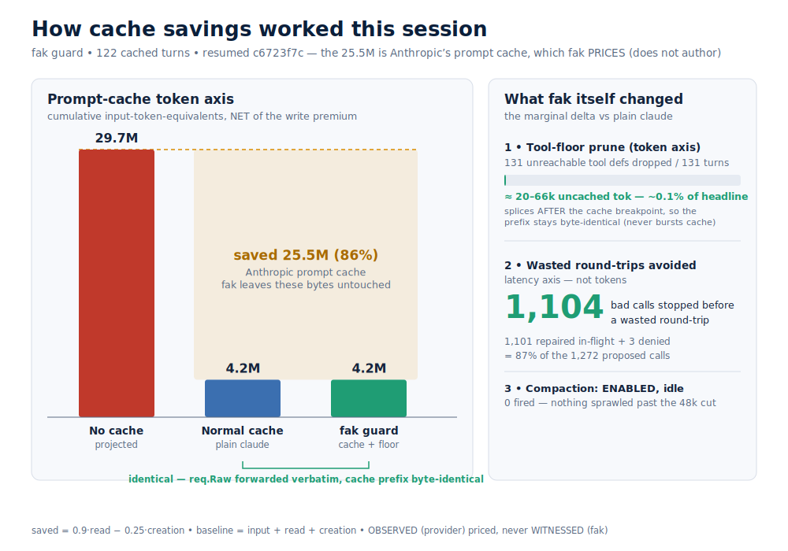

# Cache savings in one session: what fak did, and what it didn't

*2026-06-29 — a read of the `fak guard` exit summary for resumed session `c6723f7c`.*

The guard printed a big number on the way out:

```
fak guard: cache saving — saved ~25.5M input-token-equiv across 122 turn(s)
           (NET of the write premium, 86% of the uncached cost)
```

It is a real saving and it is honestly labelled, but it is easy to read it as
*"fak saved 25.5M tokens."* It didn't. **Anthropic's prompt cache saved them; fak
measured and priced the saving.** This note ablates the session three ways so the
attribution is clear, then shows the small set of things fak actually changed.



## The three-way ablation

| Scenario | Prompt-cache cost (input-token-equiv) | vs no cache |
|---|---|---|
| **No cache** — projected, every prompt token billed cold at 1× | **~29.65M** | baseline |
| **Normal cache** — plain `claude`, Anthropic prompt cache on | **~4.15M** | **−86%** |
| **fak guard** — the same cache, plus fak's floor | **~4.15M** on the token axis | **−86%, identical** + 1,104 round-trips saved |

The first two columns are the whole story on the token axis. fak's column is the
interesting one *because it is the same as the column to its left* — by design.

ASCII, for a terminal:

```
No cache    (projected)  ████████████████████████████████  29.65M
Normal cache (claude)    ████▌                              4.15M   ── 86% saved
fak guard   (cache+floor)████▌                              4.15M   ── identical
                              └─ req.Raw forwarded verbatim, prefix byte-identical
```

## Where the 25.5M actually comes from

The number is computed in [`internal/gateway/cache_pricing.go`](../../internal/gateway/cache_pricing.go)
(via `vcachegov.ProveTelemetrySavings`) from three counters the upstream reports on
every turn:

```
saved    = 0.9·cache_read  −  0.25·cache_creation      (read rebate − write premium)
baseline = input + cache_read + cache_creation          (the uncached counterfactual)
savedPct = saved / baseline = 0.86   (printed)
```

Working backwards from the two printed figures:

- `baseline = 25.5M / 0.86 ≈ 29.65M` — what the prompt would have cost with no cache.
- `actual   = baseline − saved ≈ 4.15M` — what it actually cost.

A cache read is billed at `0.1×` and a 5-minute cache write at `1.25×` of the base
input price. The session is heavily **read-dominated**: if cache-creation is small,
`cache_read ≈ 28.3M`, meaning roughly 96% of all prompt tokens across the 122 turns
were served from the warm prefix instead of re-billed. That is what a long,
stable-context agent session looks like when the cache works.

The split of `cache_read` vs `cache_creation` is not recoverable from the summary
line alone; it lives on `/metrics` (`fak_vcache_saved_token_equiv` and the raw
`cache_read_input_tokens` / `cache_creation_input_tokens`). The two printed numbers
pin `baseline` and `actual`, which is what the ablation needs.

### OBSERVED, not WITNESSED

This is the load-bearing distinction. The token counts are **OBSERVED** — relayed
verbatim from Anthropic. fak prices them with the published multipliers and reports
the dollars/tokens as *cost evidence*, never as a fak trust claim. The provenance
comment in `cache_pricing.go` is explicit: *"fak relays the provider's token counts;
it does not author them."* So "fak saved 25.5M" is the wrong sentence. The right one
is **"the provider cache saved 25.5M; fak made it legible."**

## Why "normal cache" and "fak guard" are identical on the token axis

`fak guard -- claude` runs in **passthrough**: it forwards `req.Raw` byte-for-byte to
the real Anthropic API (`internal/gateway/messages.go:512`). The client's
`cache_control` breakpoint — and every byte before it — is unchanged through the
kernel hop. So the prefix the provider hashes for its cache is identical to what
plain `claude` would send, and the cache read/write the provider performs is exactly
the same. **fak cannot, and does not, move the 25.5M.** Remove fak entirely and the
cache saving is the same. (This is the same passthrough fact that keeps outbound
context rewrites inert on the live route today.)

## What fak itself changed this session

Three levers, none of which touch the headline number:

1. **Tool-floor prune (token axis, real but small).** fak dropped **131 unreachable
   tool definitions** from `tools[]` across 131 turns — tools the floor would
   `DEFAULT_DENY` anyway, so removing the advertisement never shrinks the reachable
   action set. The pruner splices *after* the cache breakpoint and re-proves the
   protected prefix is byte-identical, so it never bursts the cache. This saves
   *uncached* tokens: order ~tens of thousands total (≈ 20–66k depending on def
   size), which is **~0.1% of the 25.5M headline.** It is the only fak token saving
   the *summary* lets us see fire, and it is a rounding error next to the provider
   cache. (fak ships more outbound reducers — see the enablement audit below — but
   they emit no exit-summary line.)

2. **Floor effect (latency axis — the real win).** fak stopped **1,104 bad tool
   calls before they cost a wasted round-trip**: 1,101 repaired in-flight and 3
   denied outright. That is 87% of the 1,272 proposed calls. This saves *round-trips
   and wall-clock*, not prompt-cache tokens — a different axis from the chart's left
   panel, and the place fak earned its keep this session. (Three calls were also
   blocked on policy: `POLICY_BLOCK` ×1, `SELF_MODIFY` ×2.)

3. **Compaction (idle, correctly).** Enabled with a 48k budget, it **fired 0 times**
   (136 bailed, almost all `under_budget`). Compaction only sheds tokens when context
   sprawls past the cut; nothing did, so it shed 0. "0 fired" here means *working and
   idle*, not disabled.

Plus the audit journal: 171 hash-chained rows appended (3,195 total). Observability,
not savings.

## The honest one-liner

> The provider's prompt cache did ~99.9% of the *visible* token saving and would have
> done it without fak. fak's contribution this session was to **price that saving
> honestly**, trim a sliver of uncached tool-def tokens, and — its real job — **catch
> 1,104 bad tool calls before they wasted a round-trip.**

## Does this mean fak's features aren't turned on? (enablement audit, verified at HEAD)

No. The natural follow-up to "fak didn't move the 25.5M" is *"so are its features
off?"* They are not. Re-derived from the entrypoint source (`cmd/fak/token_defaults.go`,
which locks the defaults against regression), **all six token-savers are default-on**
on the `fak guard -- claude` route:


| Lever | Default | Operates on | This session | Why it's quiet here |
|---|---|---|---|---|
| Provider prompt cache | **ON** (structural) | provider prefix | the 25.5M | Anthropic's; fak keeps it byte-identical |
| Tool-floor prune | **ON** (structural) | `req.Raw` | fired 131× | ~0.1% of headline |
| History compaction | **ON** (48k) | `req.Raw` | idle, shed 0 | uncached tail never passed budget |
| Result elision | **ON** (16k, since 06-26) | `req.Raw` | unmeasured | no exit-summary line |
| ctxview planned view | **ON** (8k, since 06-28, #927) | `req.Raw` | unmeasured | stubs elided middle turns; cached prefix intact |
| vDSO dedup | **ON** | tool-side | N/A on proxy | in-kernel amplification axis doesn't apply here |
| Adjudication floor | **ON** | every call | 1,104 fixed | the real work |
| Audit journal | **ON** | observe | 171 rows | tamper-evident, not a saver |
| In-kernel KV / paged-KV / evict | **N/A** | fak's own engine | not in path | only when fak *serves* the model |

Two honest caveats this audit surfaces:

- **My earlier "fak's only token saving is the tool-prune sliver" was the summary's-eye
  view, not the whole truth.** `ctxview` (the ctxplan O(1) planned view, #927/#555) and
  oversized-`result` elision are *also* default-on, *also* rewrite `req.Raw`, and *also*
  cut **uncached** tokens (ctxview even stubs elided middle turns while keeping the cached
  prefix byte-identical). Neither prints an exit-summary line, so their effect this
  session is **unmeasured from the summary alone** — it lives only on `/metrics`. They
  flipped default-on on **2026-06-28** and **2026-06-26**, days before this session; a
  binary built earlier had them off. (This corrects the older note that outbound rewrites
  were dead on passthrough — #555 was closed by #927.)

- **Why all these on-by-default reducers still find little to do here is structural, not a
  misconfiguration.** Claude Code places its cache breakpoint near the *end* of the
  request, so the cached prefix is almost the entire prompt. fak deliberately refuses to
  rewrite that prefix — doing so would burst Anthropic's cache and cost *more* — so every
  fak byte-lever is confined to the small uncached tail. The provider cache already
  captured the big win; fak stays out of its way. That is the design (a disinterested
  referee), not a dark switch.

If you *want* fak to reclaim more on this route, the knob is to tighten the budgets, e.g.
`fak guard --compact-history-budget 8000 -- claude` (vs the ~48k default), at the cost of
a larger blast radius on the uncached tail. The defaults are deliberately conservative.

## Reproduce / verify

```sh
# the tamper-evident decision trail behind the summary
fak audit verify "$APPDATA/fak/guard-audit.jsonl"

# the same saved-token-equiv engine, offline, over telemetry
fak vcache observe   # → fak_vcache_saved_token_equiv, matches the live gateway

# raw provider counters live on the gateway
curl -s localhost:<port>/metrics | grep -E 'cache_read|cache_creation|saved_token_equiv'

# which token-savers are actually default-on (re-derived from the entrypoint source)
fak token-defaults-scorecard          # all six locked on; ctxview/elide effect on /metrics
```

## See also

- [`internal/gateway/cache_pricing.go`](../../internal/gateway/cache_pricing.go) — the pricing model and its OBSERVED-vs-WITNESSED provenance.
- [`internal/vcachegov/proof.go`](../../internal/vcachegov/proof.go) — `ProveTelemetrySavings`, the engine shared by the live summary and `fak vcache observe`.
- [O(1)-context-window economics](../explainers/o1-context-window-economics.md) — the broader cost model this sits inside.
