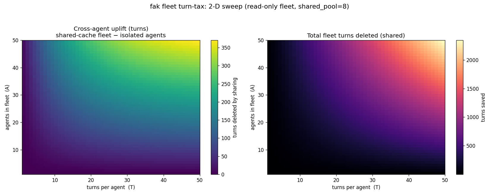
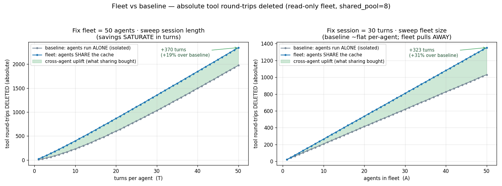
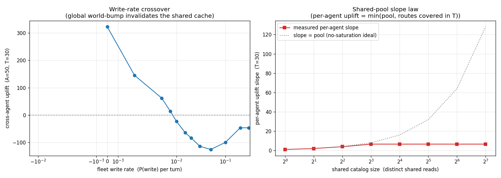
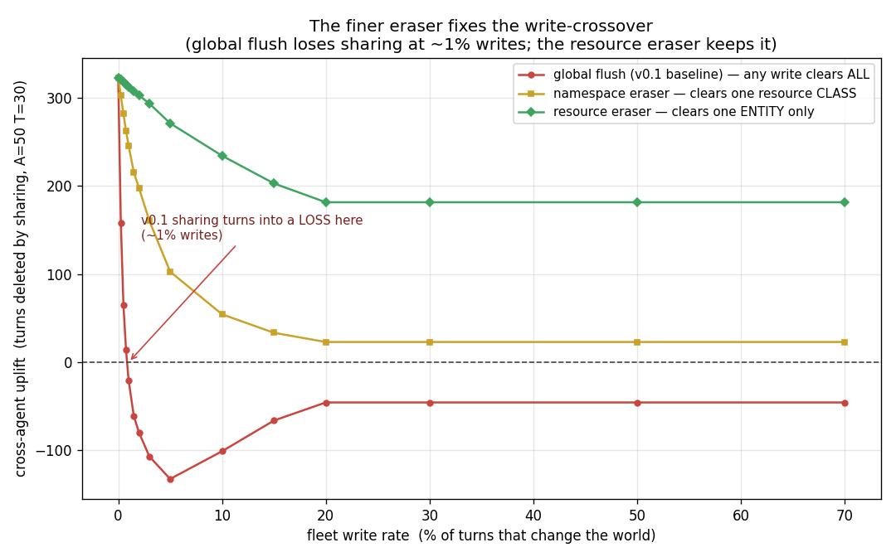

# Benchmarking Visuals and Overall Status (2026-06-18)

> One front door for the current benchmark evidence. The plots below are tracked
> PNGs regenerated from the checked-in CSV/JSON artifacts on 2026-06-18; the
> executive value-sweep charts are also exported as SVG/PDF/JPG for decks and print.
> The measurement claims stay in the per-benchmark result docs linked from each row.

## Current Status

| Area | Evidence | Status |
|---|---|---|
| Syscall subsystem check | [`fak/STATUS.md`](../../STATUS.md), `fak/report.json`, `fak/baseline.json` | **Green, but narrow.** The current report records in-process adjudication at 2,365 ns p50 / 3,451 ns p99 vs a spawned-hook baseline of 13.203 ms p50, `gate_primary=pass` (~5,583x p50). This proves the syscall/adjudicator path is not paying a per-call process boundary; it is not a production-readiness or serving-throughput headline. |
| Fleet sweep | [`fak/FLEET-SWEEP-RESULTS.md`](../benchmarks/FLEET-SWEEP-RESULTS.md), `fak/experiments/fleet/*.csv` | **Measured on the real kernel.** The 50x50 read-fleet corner deletes 2,344/2,500 calls; the cross-agent bonus is +370 turns vs isolated agents. No-share controls are exactly zero. |
| Write invalidation fix | `FLEET-ERASER-RESULTS.md` (private companion — not published), `fak/experiments/fleet/eraser/eraser-summary.csv` | **Built and measured.** Global invalidation turns negative around 1% writes; resource-scoped invalidation keeps +313 uplift at 1% writes and +235 at 10% writes. |
| Single-goal fan-out | [`fak/FANOUT-BENCH-RESULTS.md`](../benchmarks/FANOUT-BENCH-RESULTS.md), `fak/experiments/fanout/fanbench-research.csv`, `fak/experiments/fanout/pscale/p1048576.json` | **Measured plus modeled.** At N=1024, the real shared-world path deletes +1,005 sibling-only tool-result calls; at fixed N=256, the prefix-scale ladder now reaches P=1,048,576 and the model claws back 89.8% of the prefix tax. Caveat: this is token-economics geometry, not yet a real 1M-token model wall-clock. |
| Realistic workload | `REALISTIC-WORKLOAD-RESULTS.md` (private companion — not published), `fak/experiments/agent-live/realistic-workload/profile.json` (private companion — not published) | **Transcript-derived.** The current regenerated profile is 96 sessions / 1,126 logical turns, median prefix 4,671 tokens, median decode 130 tokens, and 92.7% tool-call turns. |
| Executive value projection | `FLEET-VALUE-PROJECTION.md` (private companion — not published), the `fak/experiments/value-sweep/` directory (private companion — not published) | **Measured plus theory, explicitly split.** Sweeps 1 agent / 25 turns / 20k context to 100 agents / 250 turns / 500k context. Top-end read-heavy projection deletes 22,806/25,000 tool round-trips, with $123/run measured-turn value plus a theoretical $2.2k/run API-equivalent long-context residual. |
| Permission/API-host proof | [`VISUALS-permission-systems-2026-06-18.md`](VISUALS-permission-systems-2026-06-18.md), `fak/experiments/permission-systems/`, `fak/experiments/api-host-bridge/` | **Scope-bounded proof.** FAK/DOS covers the six hard-risk scenarios in the benchmark and the API-host bridge proof closes 16/16 declared requirements, while explicitly leaving internet-wide host behavior out of scope. |

## Fleet Sweep

The 2-D surface separates total fleet savings from the part that only appears when
agents share one world epoch.



The plain-language companion shows the shared-cache fleet against the same agents
run in isolated worlds; the shaded gap is the measured cross-agent uplift.



The write axis is the caution. Global invalidation is sound but too coarse; the
resource eraser keeps the read-sharing benefit under realistic write rates.





## Fan-Out

`fanbench` is the missing topology between one agent and a fleet of independent
agents: one master goal decomposed into N sub-agents.

*(figure not published)*

The model-scaling view keeps N fixed and varies the shared master-goal prefix. It
shows why larger shared context makes prefix reuse more valuable, while still
labeling this as a reuse-vs-reprefill ablation rather than a win over tuned
shared-prefix serving engines.

The checked-in pscale artifacts now extend the ladder from 1K through 1M prefix
tokens. The top row (`p1048576.json`) reports `prefix_tokens_saved=267,386,880`,
`tax_clawed_back_frac=0.898`, and `$721/run` modeled value at N=256. The PNG below
was regenerated against those artifacts on 2026-06-19 (matplotlib 3.10.9) and now
shows the full ladder through 1024K — the #107 plotting lag is resolved.

*(figure not published)*

## Executive Value Sweep

The value projection is the executive roll-up. The chart is deliberately simple:
one takeaway, plain labels, and the assumptions printed on the image. The detailed
audit table stays in `fak/FLEET-VALUE-PROJECTION.md`.

*(figure not published)*

Exports (private companion — not published): `value-sweep-headline.png` /
`value-sweep-headline.svg` / `value-sweep-headline.pdf` /
`value-sweep-headline.jpg`; data `value-sweep.csv` / `value-sweep.json`.

The hardware sheet is an assumptions explainer for the self-host cold-prefill math:
workload inputs, hardware inputs, and the three quoted outputs. Hardware affects the
self-host dollars, GPU-hours, and kWh rows, not the measured turn counts.

*(figure not published)*

Exports (private companion — not published): `value-sweep-hardware.png` /
`value-sweep-hardware.svg` / `value-sweep-hardware.pdf` /
`value-sweep-hardware.jpg`.

## Overall Read

The benchmark picture is now sharper than the original thesis:

- The structural security floor remains the durable claim: deny-by-policy and
  result containment do not depend on model judgment.
- The efficiency wins are real in their regimes, but bounded: read-heavy fleets
  benefit from shared tool-result cache; write-heavy fleets need scoped
  invalidation; fan-out claws back prefix tax but hits a fold-bound latency knee.
- The serving comparison is intentionally conservative. The **fanout** numbers
  (`FANOUT-BENCH-RESULTS.md`, value-sweep visuals) are FAK-vs-FAK ablations over
  reuse, **not** head-to-head claims against tuned SGLang/vLLM/llama.cpp
  prefix-sharing servers. The one exception is the **session value-stack** headline:
  it carries a committed *tuned* arm (per-agent warm-cache KV) and the measured
  head-to-head there is **4.1× vs tuned** (60.3× vs naive), commit `2bbda6f` —
  see `fak/BENCHMARK-AUTHORITY.md`. Don't read "FAK-vs-FAK" as "no vs-tuned number
  anywhere"; it scopes the fanout bench, not the value-stack.
- The long-prefix fanbench result aligns with the live/real-model evidence as a
  reuse ceiling, not a safety proof or quality proof: `LIVE-RESULTS.md` proves the
  real-model containment floor, while fanbench prices repeated-work deletion after
  a valid trajectory exists. Real 256K-1M model wall-clock and quality curves are
  tracked separately (#104, #106).
- The unbuilt residues are unchanged: external-engine zero-copy KV co-residence,
  GPU/token-per-watt telemetry, and a fine-tuned syscall/adjudication model remain
  outside the shipped critical path.

## Regeneration

```powershell
python tools\fanout_plot.py
python tools\fleet_heatmap.py
python tools\fleet_compare.py
python tools\fleet_eraser.py
python tools\fleet_value_projection.py
```

These scripts read the checked-in artifacts under `fak/experiments/fanout/` and
`fak/experiments/fleet/` plus the value-sweep projection inputs and write only the
dashboard PNG/CSV/JSON artifacts shown above. `fleet_value_projection.py` also writes
the value-sweep charts as SVG, PDF, and JPG.
