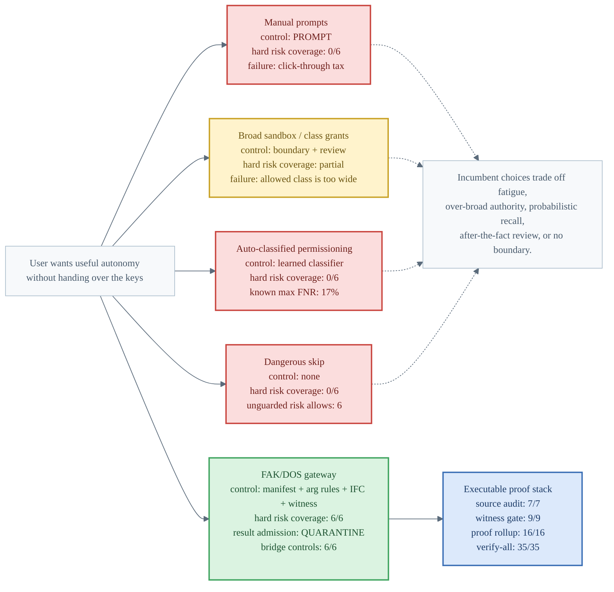
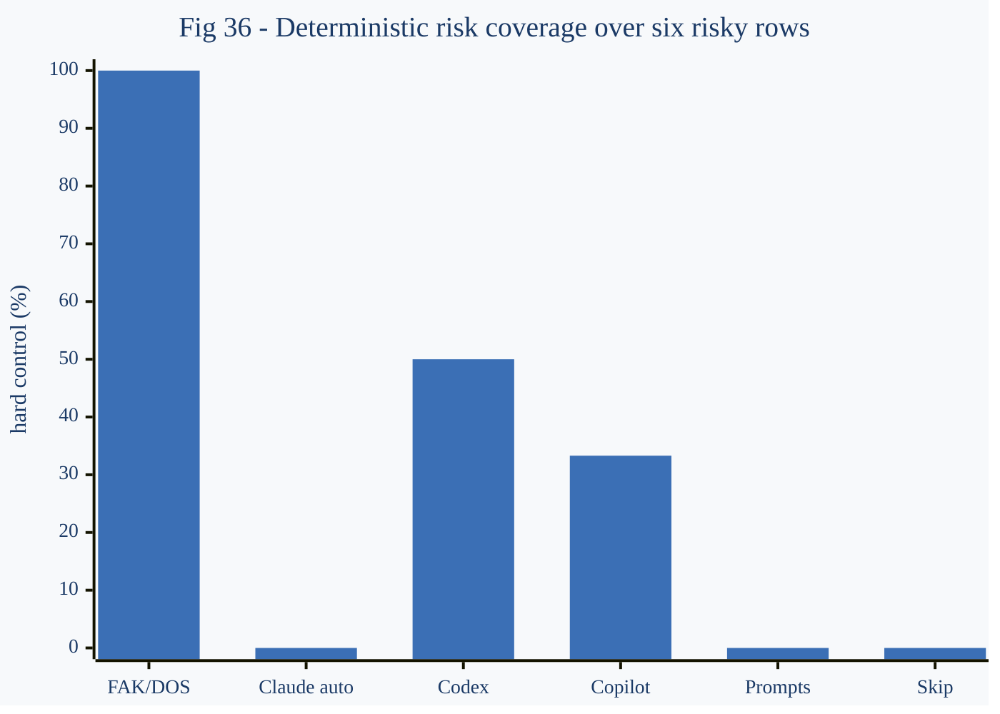
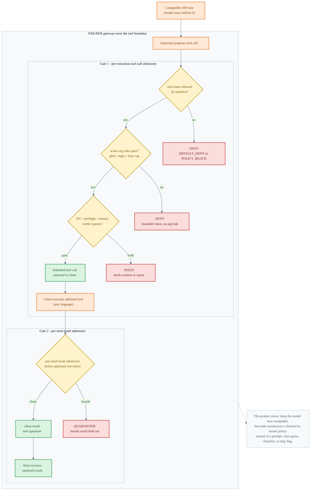
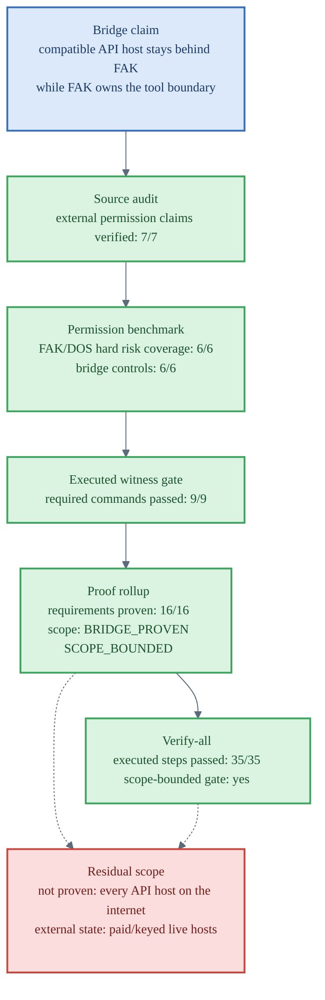

# Permission Systems Visual Companion

> Visual companion for the permission-system benchmark and API-host bridge proof.
> These figures draw the current claim: users should not have to choose between
> repeated prompts, broad class grants, auto-classified permissions, or dangerous
> bypass. FAK/DOS makes the tool boundary a checked-in, executable kernel policy.

Sources:

- [`docs/permission-system-benchmark-methodology.md`](../permission-system-benchmark-methodology.md)
- [`fak/experiments/permission-systems/permission-system-benchmark.md`](https://github.com/anthony-chaudhary/fak/blob/main/experiments/permission-systems/permission-system-benchmark.md)
- [`fak/experiments/permission-systems/permission-source-audit.md`](https://github.com/anthony-chaudhary/fak/blob/main/experiments/permission-systems/permission-source-audit.md)
- [`fak/experiments/api-host-bridge/api-host-bridge-gate.md`](https://github.com/anthony-chaudhary/fak/blob/main/experiments/api-host-bridge/api-host-bridge-gate.md)
- [`fak/experiments/api-host-bridge/api-host-bridge-proof.md`](https://github.com/anthony-chaudhary/fak/blob/main/experiments/api-host-bridge/api-host-bridge-proof.md)
- [`fak/experiments/api-host-bridge/api-host-bridge-verify-all.md`](https://github.com/anthony-chaudhary/fak/blob/main/experiments/api-host-bridge/api-host-bridge-verify-all.md)

| # | Figure | Point |
|---|---|---|
| 35 | Permission options map | The bad alternatives are fatigue, broad authority, classifier miss risk, or no boundary; FAK/DOS is the executable floor. |
| 36 | Deterministic risk coverage | FAK/DOS is 6/6 hard coverage; the next highest rows are Codex sandboxing at 3/6 (50.0%) and GitHub Copilot cloud agent at 2/6 (33.3%). |
| 37 | Two-gate permission path | Tool calls and tool results are both admitted at the gateway boundary before the model host sees them. |
| 38 | API-host bridge proof stack | The bridge is scope-bounded, executable proof: 7/7 source audit, 9/9 witness commands, 16/16 proof rollup, 35/35 verify-all. |

---

## 35 - Permission options map

Killer line: the incumbent choices trade between fatigue, over-broad authority,
probabilistic recall, after-the-fact review, or no boundary.

[SVG](https://raw.githubusercontent.com/anthony-chaudhary/fak/main/visuals/35-permission-options-map.svg) - [PNG](https://raw.githubusercontent.com/anthony-chaudhary/fak/main/visuals/35-permission-options-map.png) - [source](https://github.com/anthony-chaudhary/fak/blob/main/visuals/35-permission-options-map.mmd)

**Terms used:**
- "unguarded risk allows": The count of risky tool-call scenarios (from the six benchmark rows) that are permitted without any guard, review, or control mechanism.
- "known max FNR": The worst-case False Negative Rate of the auto-classifier—the probability it incorrectly permits a dangerous tool call—measured against the benchmark dataset.

---

## 36 - Deterministic risk coverage

Killer line: FAK/DOS is the only row with hard control over all six risky
scenarios in the benchmark.

[SVG](https://raw.githubusercontent.com/anthony-chaudhary/fak/main/visuals/36-permission-risk-coverage.svg) - [PNG](https://raw.githubusercontent.com/anthony-chaudhary/fak/main/visuals/36-permission-risk-coverage.png) - [source](https://github.com/anthony-chaudhary/fak/blob/main/visuals/36-permission-risk-coverage.mmd)

---

## 37 - Two-gate permission path

Killer line: the host stays swappable, but the tool boundary becomes executable
policy owned by the gateway.

[SVG](https://raw.githubusercontent.com/anthony-chaudhary/fak/main/visuals/37-permission-two-gate-path.svg) - [PNG](https://raw.githubusercontent.com/anthony-chaudhary/fak/main/visuals/37-permission-two-gate-path.png) - [source](https://github.com/anthony-chaudhary/fak/blob/main/visuals/37-permission-two-gate-path.mmd)

---

## 38 - API-host bridge proof stack

Killer line: the bridge proof is green and scope-bounded; it does not claim every
API host on the internet or external paid/keyed state.

[SVG](https://raw.githubusercontent.com/anthony-chaudhary/fak/main/visuals/38-api-host-bridge-proof-stack.svg) - [PNG](https://raw.githubusercontent.com/anthony-chaudhary/fak/main/visuals/38-api-host-bridge-proof-stack.png) - [source](https://github.com/anthony-chaudhary/fak/blob/main/visuals/38-api-host-bridge-proof-stack.mmd)

