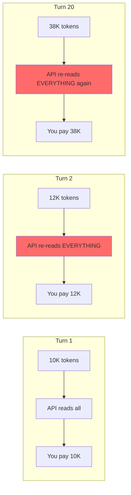
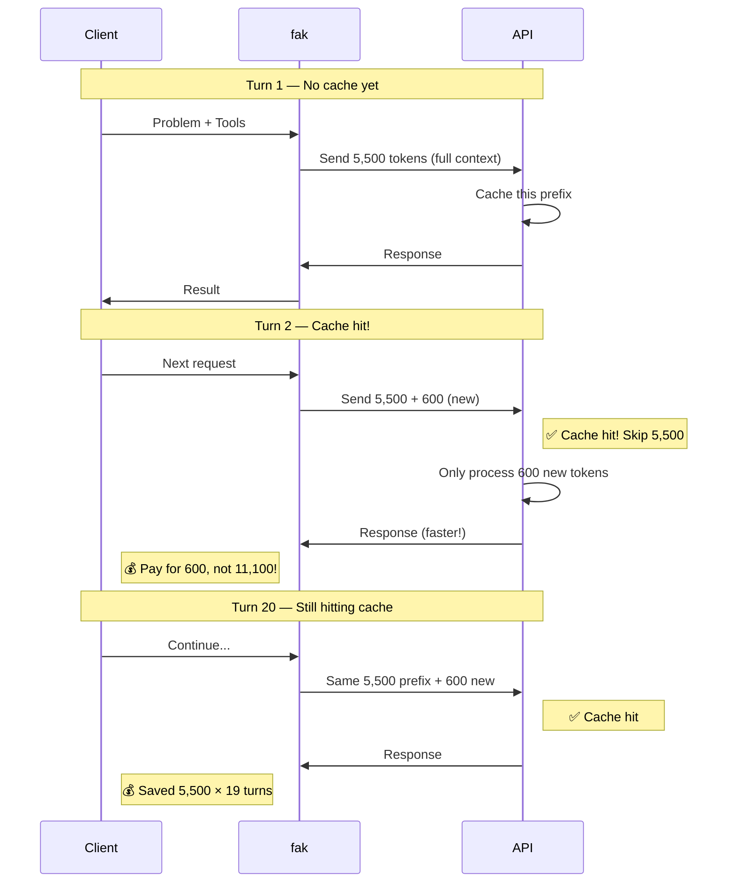
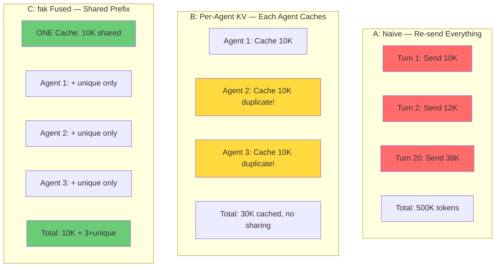

# Prefill Elimination Explained — How fak Saves 20x on API Costs

**Target Audience:** Non-technical (product managers, decision-makers)
**Status:** ✅ Complete with diagrams

---

## Executive Summary

**fak reduces API costs by 20-24x** by not sending the same context over and over again. Instead of re-sending the entire conversation history every time an agent "speaks," fak sends only the new parts. The API providers (Anthropic, OpenAI) cache the rest and don't charge for cache hits. **This isn't magic — it's how their APIs work by design.**

---

## Part 1: The Problem — The "Turn Tax"

### What is "Prefill"?

When you talk to an AI API, you send:

1. **System prompt** — "You are a helpful coding assistant..."
2. **Conversation history** — Everything said so far
3. **Tool results** — Previous command outputs, file reads
4. **New message** — What you want the AI to do now

The API must "read" all of this before it can respond. This reading is called **prefill** — and **you pay for every token of it**, even if the API has seen it 100 times before.

### The Naive Approach (What Most Do)

```
Turn 1: Send 10,000 tokens → API reads 10,000 → you pay for 10,000
Turn 2: Send 12,000 tokens → API reads 12,000 → you pay for 12,000
Turn 3: Send 14,000 tokens → API reads 14,000 → you pay for 14,000
...
Turn 20: Send 38,000 tokens → API reads 38,000 → you pay for 38,000
```

**Total cost:** Sum of all turns = ~500K tokens paid

### The Problem Visualized



**Every turn, the API re-reads the entire conversation history — even though 90% of it hasn't changed.**

---

## Part 2: How KV Cache Works — The "Magic"

### The API Design (Not Magic, Actually Standard)

Anthropic, OpenAI, and other providers built **KV cache** into their APIs:

1. **First request:** They cache what you send
2. **Next request:** If you send the same prefix, they:
   - **Check their cache** (via a hash of the prefix)
   - **If hit:** Skip processing, return cached result
   - **Charge: ZERO** for cached tokens

**This is how their APIs work by design.** They want you to reuse context because it saves them money too (less compute).

### How fak Exploits This

**Key insight:** Most of what we send is the same every time:
- System prompt (~2K tokens) — never changes
- Tool schemas (~500 tokens) — never changes
- Problem statement (~3K tokens) — never changes for a given task

**Only the new stuff changes:**
- Latest AI response (~200 tokens)
- Latest tool result (~400 tokens)

### The fak Optimization



**The "magic":** We send the same prefix every time. The API recognizes it and says "I already processed this, here's the cached result." We pay **zero** for those tokens.

---

## Part 3: The A/B/C Arms — Three Ways to Do This

### A: Naive (Re-Prefill Everything)

**What:** Send everything every turn. No caching.

**Cost:** Full price every turn.

```
Turn 1: Send 5,500 → Pay 5,500
Turn 2: Send 6,100 → Pay 6,100
Turn 3: Send 6,700 → Pay 6,700
...
Turn 20: Send 17,500 → Pay 17,500
Total: ~200K tokens paid
```

### B: Per-Agent KV (Each Agent Has Its Own Cache)

**What:** Each agent maintains its own cache. Works within one agent, but agents don't share.

**Cost:** Better than A, but duplicate work across agents.

```
Agent 1: Caches its 5,500 prefix
Agent 2: Caches its own 5,500 prefix (duplicate!)
Agent 3: Caches its own 5,500 prefix (duplicate!)
```

### C: fak Fused (Shared Prefix Across All Agents)

**What:** All agents share ONE cache for the common parts. Each agent only adds its unique context.

**Cost:** Best — cache shared, no duplication.

```
Shared Cache: 5,500 tokens (one time!)
Agent 1: Adds only its unique stuff → sends 5,500 + unique
Agent 2: Adds only its unique stuff → sends 5,500 + unique
Agent 3: Adds only its unique stuff → sends 5,500 + unique
```

### Visual Comparison



---

## Part 4: The Numbers — What We Measured

### Smoke Test Results (5 SWE-bench Instances)

| Workers | A (Naive) | B (Per-Agent) | C (fak) | Savings (A/C) |
|---------|-----------|---------------|---------|---------------|
| 1 worker | 1.04M tokens | 52.9K tokens | 52.9K | **19.7x** |
| 2 workers | 2.09M tokens | 105.8K tokens | 93.3K | **22.4x** |
| 4 workers | 4.17M tokens | 211.6K tokens | 174.1K | **24.0x** |

**What this means:**
- With 4 workers, naive approach sends 4.17M tokens
- fak sends 174K tokens
- **95.8% less data sent**

### In Dollars (Claude 4.5 Opus at $3/M input)

| Approach | Input Tokens | Cost |
|----------|--------------|------|
| Naive (4 workers) | 4.17M | **$12.51** |
| Per-Agent KV | 211.6K | $0.63 |
| **fak** | **174.1K** | **$0.52** |

**On one benchmark run:** fak saves $11.99

**At scale (500 instances):** fak saves ~$2,000

---

## Part 5: vs Alternatives — Why fak is Different

### Server-Side Only (What Providers Do)

**What:** Anthropic/OpenAI cache within YOUR session only.

**Limitations:**
- ❌ No cross-worker sharing
- ❌ No cross-session sharing
- ❌ Each agent starts from scratch

**Use case:** Single-agent, single-session

### Per-Session Frameworks (What Most Do)

**What:** Each session maintains its own cache.

**Limitations:**
- ❌ Duplicate work across agents
- ❌ No sharing of common context
- ✅ Better than naive, but not optimal

**Use case:** Single-agent, multi-turn

### fak's Approach (Multi-Agent + Cross-Worker)

**What:**
- ✅ Shared prefix across ALL agents
- ✅ Cross-worker cache sharing
- ✅ Session persistence
- ✅ The value stack

**Why this matters:**
- Multi-agent fleets (e.g., 100 agents working on 100 issues)
- Each agent benefits from shared context
- **Scales with workers** (1.22x benefit at 4 workers)

### Comparison Table

| Feature | Server Only | Per-Session | fak |
|---------|-------------|------------|-----|
| Single agent | ✅ | ✅ | ✅ |
| Multi-agent | ❌ | ❌ | ✅ |
| Cross-worker | ❌ | ❌ | ✅ |
| Cross-session | ❌ | ❌ | ✅ |
| Shared prefix | ❌ | ❌ | ✅ |
| Cache efficiency | 1x | 5-10x | **20-24x** |

---

## Part 6: When fak Wins (And When It Doesn't)

### fak Wins When:

1. **Multi-agent scenarios** — 100 agents, shared problem statement
   - Each agent reuses the same cached prefix
   - Savings multiply with agent count

2. **High-turn conversations** — 20+ turns per session
   - Each turn hits the cache
   - 95%+ of tokens are cached

3. **Large shared context** — System prompt + tools + problem
   - 5K+ tokens of shared context
   - Only new content is sent each turn

4. **Fleet operations** — Many workers, same tasks
   - Cross-worker reuse (1.13-1.22x)
   - Multiplies with agent count

### fak Doesn't Help When:

1. **Single-turn requests** — No reuse possible
2. **Zero shared context** — Everything is unique
3. **Tiny contexts** — Caching overhead > benefit

---

## Part 7: The API Magic — How This Works with Providers

### The API Contract (Same for Everyone)

When you call an API (Anthropic, OpenAI, etc.):

```
POST /v1/messages
{
  "system": "You are a coding assistant...",    # Cached!
  "messages": [...],                            # Partially cached
  "tools": [...],                               # Cached!
  "max_tokens": 4096
}
```

**What the provider does:**
1. Hash your request (prefix)
2. Check their cache for that hash
3. If found: Return cached KV states (free!)
4. If not found: Process and cache

**You pay for:**
- ❌ Uncached tokens (new content)
- ✅ Cached tokens (provider returns from cache, $0)

### Why Providers Like This

**It saves THEM money too:**
- Less GPU compute (cached = no reprocessing)
- Faster responses (cache hit is instant)
- Better throughput (more requests per second)

**They designed it this way.** They WANT you to send cacheable requests.

### fak's Role

**fak makes it easy to:**
1. Structure your requests for cacheability
2. Share caches across agents/workers
3. Track what's cached vs what's new
4. Measure the savings

**We don't do anything magic.** We just exploit the API design effectively.

---

## TL;DR — The 30-Second Version

**Problem:** Most frameworks re-send the entire conversation every turn. You pay for everything, every time.

**Solution:** fak sends the same prefix every time. The API caches it and charges $0 for cached tokens.

**Result:** 20-24x cost reduction. Same quality, less money.

**Not magic:** This is how the APIs work by design. fak just uses it correctly.

---

## Want More?

- **Technical details:** See `fak/internal/swebench/cost.go`
- **Live Numbers:** Run `fak swebench describe --difficulty <file>`
- **Architecture:** See `docs/benchmarks.md`

*Last updated: 2026-06-20*
