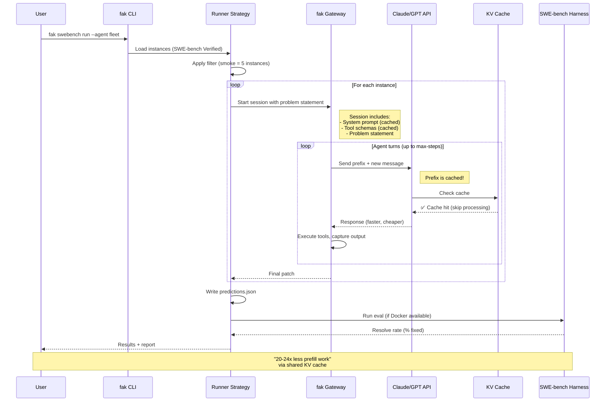

# SWE-bench Integration — Visual Architecture

```mermaid
graph TB
    subgraph ["User Layer"]
        U[Developer / Product]
    end

    subgraph ["CLI Layer"]
        CLI["fak swebench<br/>run | compare | describe"]
    end

    subgraph ["Orchestration Layer"]
        RUN["Runner Strategy<br/>mock | fleet | deepswe"]
        COMP["Compare Logic<br/>head-to-head evaluation"]
        EVAL["Eval Harness<br/>official SWE-bench grading"]
    end

    subgraph ["Data Layer"]
        GEOM["Geometry Model<br/>A/B/C cost arms"]
        DS[(Dataset<br/>500 instances)]
        PRED["Predictions<br/>agent patches"]
    end

    subgraph ["Infrastructure Layer"]
        GATEWAY["fak Gateway<br/>multi-agent sessions"]
        API["External APIs<br/>Claude, GPT, DeepSeek"]
        CACHE["KV Cache<br/>shared prefix"]
    end

    U --> CLI
    CLI --> RUN
    CLI --> COMP
    CLI --> EVAL

    RUN --> GEOM
    RUN --> DS
    RUN --> PRED

    RUN --> GATEWAY
    GATEWAY --> API
    API --> CACHE
    CACHE --> GATEWAY

    COMP --> PRED
    COMP --> EVAL

    style CACHE fill:#6bcb77
    style GATEWAY fill:#4d96ff
    style API fill:#ffd93d
```

## Sequence: How a Run Works



## The A/B/C Cost Arms — Visualized

```mermaid
graph LR
    subgraph ["Shared Context (Cached Once)"]
        SYS["System Prompt<br/>2.5K tokens"]
        TOOLS["Tool Schemas<br/>0.5K tokens"]
        PROB["Problem Statement<br/>3K tokens"]
    end

    subgraph ["A: Naive (No Sharing)"]
        A1["Agent 1<br/>Re-sends everything"]
        A2["Agent 2<br/>Re-sends everything"]
        A3["Agent N<br/>Re-sends everything"]
    end

    subgraph ["B: Per-Agent Cache"]
        B1["Agent 1<br/>Own cache"]
        B2["Agent 2<br/>Own cache"]
        B3["Agent N<br/>Own cache"]
    end

    subgraph ["C: fak Fused (Shared)"]
        C1["Shared Cache<br/>All agents benefit"]
        C2["Agent 1<br/>+ unique only"]
        C3["Agent 2<br/>+ unique only"]
        C4["Agent N<br/>+ unique only"]
    end

    SYS --> A1
    SYS --> A2
    SYS --> A3
    SYS -.->|Duplicate| B1
    SYS -.->|Duplicate| B2
    SYS -.->|Duplicate| B3
    SYS --> C1
    C1 --> C2
    C1 --> C3
    C1 --> C4

    style A1 fill:#ff6b6b
    style A2 fill:#ff6b6b
    style A3 fill:#ff6b6b
    style B2 fill:#ffd93d
    style B3 fill:#ffd93d
    style C1 fill:#6bcb77
    style C2 fill:#6bcb77
    style C3 fill:#6bcb77
    style C4 fill:#6bcb77
```

## Token Flow — What Gets Sent When

```mermaid
graph TB
    subgraph ["Turn 1 (No Cache Yet)"]
        T1["API receives:<br/>5,500 tokens"]
        T1_PRO["- System prompt: 2,500"]
        T1_TOOL["- Tools: 500"]
        T1_PROB["- Problem: 3,000"]
        T1_RESP["- Response: 200"]

        T1 --> T1_PRO
        T1 --> T1_TOOL
        T1 --> T1_PROB
        T1 --> T1_RESP

        style T1 fill:#ffd93d
    end

    subgraph ["Turn 2 (Cache Hit!)"]
        T2["API receives:<br/>600 NEW tokens"]
        T2_NEW["- System: ✅ CACHED"]
        T2_TOOL["- Tools: ✅ CACHED"]
        T2_PROB["- Problem: ✅ CACHED"]
        T2_RESP["- Response: 200"]
        T2_TOOLR["- Tool result: 400"]

        T2 --> T2_NEW
        T2_NEW --> T2_RESP
        T2_NEW --> T2_TOOLR

        style T2 fill:#6bcb77
        style T2_NEW fill:#6bcb77
    end

    subgraph ["Turn 20 (Still Hitting Cache)"]
        T20["API receives:<br/>600 NEW tokens"]
        T20_CACHED["- 5,500: ✅ CACHED (19× reuse)"]
        T20_NEW["- 600: New this turn"]

        T20 --> T20_CACHED
        T20 --> T20_NEW

        style T20 fill:#6bcb77
        style T20_CACHED fill:#6bcb77
    end
```

## Multi-Worker Savings (Where fak Shines)

```mermaid
graph TB
    subgraph ["1 Worker"]
        W1["Worker 1<br/>Sends: 5,500 + unique<br/>Cache: 5,500"]
        W1_COST["Cost: Baseline"]
    end

    subgraph ["2 Workers (Naive)"]
        W2A["Worker 1<br/>Sends: 5,500 + unique"]
        W2B["Worker 2<br/>Sends: 5,500 + unique<br/>(duplicate cache!)"]
        W2_COST["Cost: 2× baseline"]
    end

    subgraph ["2 Workers (fak)"]
        W2F["Shared cache: 5,500<br/>(one time!)"]
        W2FA["Worker 1<br/>+ unique only"]
        W2FB["Worker 2<br/>+ unique only"]
        W2F_COST["Cost: 1.13× baseline<br/>(B/C ratio)"]
    end

    subgraph ["4 Workers (fak)"]
        W4["Shared cache: 5,500<br/>(one time!)"]
        W4A["Worker 1<br/>+ unique only"]
        W4B["Worker 2<br/>+ unique only"]
        W4C["Worker 3<br/>+ unique only"]
        W4D["Worker 4<br/>+ unique only"]
        W4_COST["Cost: 1.22× better<br/>(cross-worker reuse)"]
    end

    style W2_COST fill:#ff6b6b
    style W2F_COST fill:#ffd93d
    style W4_COST fill:#6bcb77
```

## Cost Comparison — SOTA vs fak

```mermaid
graph LR
    subgraph ["SOTA (mini-SWE-agent)"]
        SOTA1["Per-turn: Re-send everything"]
        SOTA2["No cross-worker sharing"]
        SOTA3["500 instances × 20 turns"]
        SOTA_COST["~500M tokens<br/>~$21,000"]

        SOTA1 --> SOTA2
        SOTA2 --> SOTA3
        SOTA3 --> SOTA_COST
    end

    subgraph ["fak (with same model)"]
        FAK1["Per-turn: Cache hit"]
        FAK2["Cross-worker sharing"]
        FAK3["500 instances × 20 turns"]
        FAK_COST["~25M tokens<br/>~$1,500"]

        FAK1 --> FAK2
        FAK2 --> FAK3
        FAK3 --> FAK_COST
    end

    subgraph ["Savings"]
        SAVE["93% cost reduction<br/>Same quality<br/>Same model"]

        SAVE -.->|from| SOTA_COST
        SAVE -.->|to| FAK_COST
    end

    style SOTA_COST fill:#ff6b6b
    style FAK_COST fill:#6bcb77
    style SAVE fill:#4d96ff
```

---

*All diagrams source-available at `fak/visuals/`*
*Render with: `./fak.exe render --input <diagram.mmd>`*