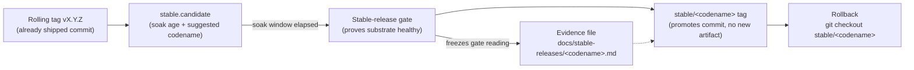

# Stable releases

This directory holds one committed evidence file per `stable/*` tag.



*Promotion path: a rolling tag becomes a candidate, the gate proves the substrate healthy and freezes that reading into the evidence file, then the `stable/<codename>` tag promotes the same commit as a rollback anchor.*


Rolling releases (`vX.Y.Z`) move quickly. Stable releases are sparse rollback
anchors: a stable codename promotes an existing rolling tag only after the
stable-release gate records why that tag is known good.

## Why two channels

`/release` cuts a rolling `vX.Y.Z` whenever a coherent change lands — it promises
"this commit merged," not "the release substrate was provably healthy here."
`/stable-release` is the slower trust channel that does make that promise: it
*promotes an already-shipped commit* (no new version, no new artifact) after a gate
proves the substrate is healthy, and freezes that gate reading into the evidence
file beside this README. Rolling moves fast *because* stable exists to absorb the
trust question; stable can afford its soak window *because* rolling carries the
urgency. The concept, its gate rows, and the anti-patterns live in
`.claude/skills/stable-release/SKILL.md`; the existence-proof that the gate refuses
bad candidates with typed reasons is in `PROOF-2026-06-10.md`.

## Invariant

Every `stable/<codename>` tag must have a committed file at:

```text
docs/stable-releases/<codename>.md
```

The file frontmatter must include:

- `codename`
- `underlying_version`
- `candidate_sha`

`candidate_sha` must match the peeled `stable/*` tag commit, and
`underlying_version` must be a `vX.Y.Z` tag pointing at the same commit.
`tools/release_status.py` checks this invariant and reports
`repair_stable_evidence` if it drifts.

## Promotion preflight

`tools/release_status.py` also reports `stable.candidate` without mutating the
repo. That object names the latest reachable rolling tag, its soak age, a
non-colliding suggested codename, and a dry-run command for the real promotion
helper once the soak window has elapsed.

## Rollback

```bash
git checkout stable/<codename>
```

Do not edit shipped evidence files or re-point stable tags. If a promotion was
wrong, promote a new codename and explain the supersession in the new evidence.
