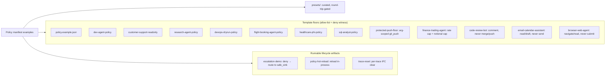

# Policy Manifest Examples

These files are starter floors for the gateway-first adoption path. They are not
universal security policies; each one is a reviewable allow-list with a concrete
deny witness an adopter can run before putting it in front of an agent.



*Index map: the runnable policy examples, grouped into security template floors and operational lifecycle artifacts, plus the curated presets pack.*

> **Looking for a vetted starting point?** [`presets/`](presets/README.md) is the
> **curated, documented, round-trip-gated** preset pack — each manifest carries a
> README describing what it allows, what it refuses, and the threat it encodes,
> and a CI test asserts every preset round-trips exactly through
> `fak policy --check`. It includes [`presets/coding-agent-safe.json`](presets/coding-agent-safe.json),
> the hardened coding-agent floor built on the `gitgate` refusals (issue #578).

## Runnable Example Tracks

The top-level demo front door is now the lowest-common-denominator set in
[`docs/run-the-demos.md`](../docs/run-the-demos.md): no key, no model, no GPU, no network.
The rest of `examples/` is intentionally specialized and grouped by job:

| Track | Directories | Purpose |
|---|---|---|
| **Security and policy** | [`adjudication-demo/`](adjudication-demo/README.md), [`agentdojo-redteam/`](agentdojo-redteam/README.md), [`wire-proof/`](wire-proof/README.md), [`wire-quarantine-demo/`](wire-quarantine-demo/README.md), [`auth-hardening/`](auth-hardening/README.md), [`presets/`](presets/README.md) | default-deny, tool poisoning, attack-corpus, wire-level proof, quarantine, auth-boundary witnesses, and curated policy floors |
| **Policy lifecycle** | [`escalation-demo/`](escalation-demo/README.md), [`policy-hot-reload/`](policy-hot-reload/README.md), [`trace-reset/`](trace-reset/README.md), [`observability/`](observability/README.md) | safe-sink routing, reloads, per-trace reset, and operator visibility |
| **Adoption and integrations** | [`mcp/`](mcp/README.md), [`mcp-client/`](mcp-client/README.md), [`openai-agents-guardrail/`](openai-agents-guardrail/README.md), [`autogen-groupchat/`](autogen-groupchat/README.md), [`crewai-crew/`](crewai-crew/README.md), [`extdriver/`](extdriver/README.md) | framework-specific ways to put fak in front of existing agents |
| **Research/science fixtures** | [`routing-bench/`](routing-bench/), [`routing-presets/`](routing-presets/), [`trajectory/`](trajectory/) | recorded corpora and manifests for routing, trajectory scoring, and reproducible analysis |
| **Shared task records** | [`shared-task-record/`](shared-task-record/README.md), [`shared-task-record-verdicts/`](shared-task-record-verdicts/README.md) | task-record interchange and verdict fixtures |

That split keeps the first-run path small while preserving the heavier research,
security, and framework demos for readers who came for those tracks.

Run checks from `fak/`:

```bash
go run ./cmd/fak policy --check examples/customer-support-readonly-policy.json
go run ./cmd/fak policy --check examples/research-agent-policy.json
go run ./cmd/fak policy --check examples/devops-dryrun-policy.json
go run ./cmd/fak policy --check examples/dev-agent-policy.json
go run ./cmd/fak policy --check examples/flight-booking-agent-policy.json
go run ./cmd/fak policy --check examples/healthcare-phi-policy.json
go run ./cmd/fak policy --check examples/sql-analyst-policy.json
go run ./cmd/fak policy --check examples/protected-push-floor-policy.json
go run ./cmd/fak policy --check examples/finance-trading-agent-policy.json
go run ./cmd/fak policy --check examples/code-review-bot-policy.json
go run ./cmd/fak policy --check examples/email-calendar-assistant-policy.json
go run ./cmd/fak policy --check examples/browser-web-agent-policy.json
```

## Templates

| File | Intended use | Main boundary | Witness command |
|---|---|---|---|
| `policy.example.json` | General manifest shape | explicit destructive denies + provenance/IFC fields | `go run ./cmd/fak preflight --policy examples/policy.example.json --tool delete_account --args "{}"` |
| `dev-agent-policy.json` | Coding agent in this repo | no shared-history mutations without release discipline | `go run ./cmd/fak preflight --policy examples/dev-agent-policy.json --tool git_push --args "{}"` |
| `customer-support-readonly-policy.json` | Support lookup + ticket handoff | read/customer-ticket workflow; no direct account, refund, or email action | `go run ./cmd/fak preflight --policy examples/customer-support-readonly-policy.json --tool refund_payment --args "{}"` |
| `research-agent-policy.json` | Open-web research and note taking | read/search/summarize; no posting, shell, upload, or arbitrary note path | `go run ./cmd/fak preflight --policy examples/research-agent-policy.json --tool send_email --args "{}"` |
| `devops-dryrun-policy.json` | Infra review without execution | plan/diff/template only; no apply, exec, delete, or production deploy | `go run ./cmd/fak preflight --policy examples/devops-dryrun-policy.json --tool terraform_apply --args "{}"` |
| `flight-booking-agent-policy.json` | The README's canonical SFO→JFK booking agent (the [live A/B](../docs/benchmarks/LIVE-RESULTS.md) task) | search/book/read; refund, cancel, PNR-export, and fund transfer need a human; `read_policy` is `untrusted` (the booby-trap vector) | `go run ./cmd/fak preflight --policy examples/flight-booking-agent-policy.json --tool refund_payment --args "{}"` |
| `healthcare-phi-policy.json` | HIPAA-style clinical agent — the heavy-PHI `redact_fields` + EHR/inbox provenance showcase | read EHR / search ICD / drug-interaction / note / appointment; export, email-PHI, and record-delete need a human; `read_patient_record` is `trusted_local` while `fetch_medical_literature` and `read_patient_message` are `untrusted` (the prompt-injection vector) | `go run ./cmd/fak preflight --policy examples/healthcare-phi-policy.json --tool export_patient_data --args "{}"` |
| `sql-analyst-policy.json` | Internal-data / BI analyst — the heavy `arg_rules` showcase (SELECT-only SQL, row caps, schema allow-list) | read-only query / list / describe / chart / sanitized-CSV; write-query, DDL (`drop`/`alter`/`create_table`), `copy_to`/`pg_dump`, `shell`, and fund transfer are denied; the `run_read_query.sql` text is constrained to reject DDL/DML even when the tool name clears the allow-list | `go run ./cmd/fak preflight --policy examples/sql-analyst-policy.json --tool run_read_query --args '{"sql":"DROP TABLE customers"}'` |
| `protected-push-floor-policy.json` | Coding agent that may push **feature** branches via a structured `git_push` MCP tool | argument-scoped (issue #449): `git_push` is allowed, but a push whose `ref`/`branch` is a protected ref (`main`/`master`/`trunk`/`release/*`/…) or a force-push is denied **by argument value** — the structured route a Bash `git push` deny_regex never sees. Finer than dogfood's command-string regex and dev-agent's blunt name-level `git_push` deny | `go run ./cmd/fak preflight --policy examples/protected-push-floor-policy.json --tool git_push --args '{"ref":"main"}'` |
| `finance-trading-agent-policy.json` | Brokerage / trading agent — the `rate_limit` + notional-cap showcase | quote / position / balance / analyze read freely; `place_order` and `cancel_order` are allowed but bounded (a 6-or-more-digit `notional_usd` is `OVERSIZE`, a `short`/`naked` side is `POLICY_BLOCK`); `withdraw_funds`, `transfer_funds`, `wire_transfer`, `close_account`, `margin_borrow` need a human; a declared `rate_limit` caps order-tool throughput at 20 calls per tool (over-cap → `RATE_LIMITED`) | `go run ./cmd/fak preflight --policy examples/finance-trading-agent-policy.json --tool place_order --args '{"notional_usd":250000}'` |
| `code-review-bot-policy.json` | PR-review bot — read the diff, post a review, never change the repo | read diff / file / PR + `post_review_comment` / `request_changes` / `approve_review` (the two comment tools `authorize` an `EGRESS` sink); `merge_pull_request`, `git_push`, `force_push`, `delete_branch`, `workflow_dispatch`, `rerun_workflow`, `publish_release`, `shell` are denied; the diff and PR body are `untrusted` (the injection vector); `.github/workflows/` is a self-modify glob | `go run ./cmd/fak preflight --policy examples/code-review-bot-policy.json --tool merge_pull_request --args "{}"` |
| `email-calendar-assistant-policy.json` | Inbox / calendar assistant — the `secret_posture: fail_closed` + untrusted-inbox showcase | read / search mail, `draft_reply`, read calendar, `propose_event`; `send_email`, `forward_email`, `delete_email`, `empty_trash`, `create_filter`, `create_calendar_event`, `invite_external_guest`, `share_calendar` need a human; `read_email`/`search_email` are `untrusted` (the prompt-injection vector); `secret_posture: fail_closed` makes a credential found in a mail body fail the call closed rather than quarantine-and-continue | `go run ./cmd/fak preflight --policy examples/email-calendar-assistant-policy.json --tool send_email --args "{}"` |
| `browser-web-agent-policy.json` | Browsing / scraping agent — navigate and read, never act on the page | `navigate` / `read_page` / `get_page_text` / `extract_links` / `screenshot` / `scroll` + a sandboxed `download_file`; `submit_form`, `fill_credentials`, `execute_script`, `run_downloaded_file`, `http_post`, `set_cookie` are denied; page content is `untrusted`; a `navigate` to a `file:`/`ftp:`/`data:`/`javascript:` URL is `POLICY_BLOCK`, a `download_file` whose `dest` escapes `./downloads/**` is `POLICY_BLOCK`; `secret_patterns` extend the secret floor with AWS-key and GitHub-token shapes scraped from a page | `go run ./cmd/fak preflight --policy examples/browser-web-agent-policy.json --tool navigate --args '{"url":"file:///etc/passwd"}'` |

`refund_payment` returns **`DENY (POLICY_BLOCK)`** — the denied refund is meant to
escalate to the `transfer_to_human_agents` safe sink, not silently fail.
[`escalation-demo/`](escalation-demo/README.md) is the runnable artifact that exercises
that path end-to-end (deny → catch → route to the declared `safe_sink` → redacted human
ticket), so the `safe_sinks` field every template declares is no longer decorative. The
ALLOW side of the same floor:

```bash
go run ./cmd/fak preflight --policy examples/flight-booking-agent-policy.json --tool search_flights --args "{}"
```

returns **`ALLOW`**. [`policy-hot-reload/`](policy-hot-reload/README.md) is the other
runnable lifecycle artifact: it walks the served-gateway operator loop — edit the
floor → `policy --check` → `POST /v1/fak/policy/reload` → re-test — and proves the
verdict swaps **in-process** (same `start_time_unix`, IFC ledger intact, no restart).
[`trace-reset/`](trace-reset/README.md) is the IFC-ledger surface on that same
served lifecycle: at an operator-approved session boundary it clears one trace's
taint high-water mark (`POST /v1/fak/trace/reset`) and proves the reset is
per-trace — a neighbouring trace and the global forensic counters are untouched.

A `book_flight` whose `fare_amount` is `$10,000` or more is also
refused (`deny_regex ^[0-9]{5,}` — the manifest's argument matchers are
`allow_glob` / `deny_regex` / `max_bytes`, so the price cap is expressed as a regex
rather than a numeric `max_value`):

```bash
go run ./cmd/fak preflight --policy examples/flight-booking-agent-policy.json --tool book_flight --args '{"fare_amount": 50000}'
```

### `healthcare-phi-policy.json` — PHI redaction + provenance

The witness above returns **`DENY (SECRET_EXFIL)`** for `export_patient_data`. The
ALLOW side and the second deny:

```bash
go run ./cmd/fak preflight --policy examples/healthcare-phi-policy.json --tool read_patient_record --args "{}"
go run ./cmd/fak preflight --policy examples/healthcare-phi-policy.json --tool email_phi --args "{}"
```

return **`ALLOW`** and **`DENY (POLICY_BLOCK)`** respectively — every denied action is
meant to escalate to the `transfer_to_human_clinician` safe sink, not fail silently.
The `schedule_appointment` provider allow-list is an `allow_glob`, so an out-of-network
booking is refused while an in-network one clears:

```bash
go run ./cmd/fak preflight --policy examples/healthcare-phi-policy.json --tool schedule_appointment --args '{"provider":"random-clinic"}'
go run ./cmd/fak preflight --policy examples/healthcare-phi-policy.json --tool schedule_appointment --args '{"provider":"in-network-cardiology"}'
```

> **This is an example allow-list, not HIPAA compliance.** fak is a capability floor,
> not a certification: this manifest demonstrates the *posture* (heavy `redact_fields`,
> trusted-EHR vs untrusted-inbox provenance, fail-closed denies) but a real deployment
> must still own its BAAs, audit logging, encryption, and access controls. Note also
> that `redact_fields` matches arg keys **exactly** (no wildcard), so a PHI vocabulary
> is enumerated explicitly — `phi_notes`, `phi_address`, … — rather than as a `phi_*`
> glob.

### `sql-analyst-policy.json` — the `arg_rules` showcase

This is the heaviest `arg_rules` template: it constrains the **SQL text itself**, not
just the tool name. `run_read_query` clears the name-level allow-list, but four
argument predicates then narrow it — SELECT-only (DDL/DML keywords are denied), a body
size cap, a row cap, and a schema allow-list:

```bash
go run ./cmd/fak preflight --policy examples/sql-analyst-policy.json --tool run_read_query --args '{"sql":"SELECT 1","schema":"public.users","limit":50}'
go run ./cmd/fak preflight --policy examples/sql-analyst-policy.json --tool run_read_query --args '{"sql":"DROP TABLE customers"}'
go run ./cmd/fak preflight --policy examples/sql-analyst-policy.json --tool run_write_query --args '{}'
```

return **`ALLOW`**, **`DENY (POLICY_BLOCK)`** (the `run_read_query.sql` arg-rule fires
on `DROP` even though `run_read_query` itself is allowed), and **`DENY (POLICY_BLOCK)`**
(`run_write_query` is an explicit deny — the tool an `allow run_query` mistake would
have admitted). The row cap and schema allow-list also fire:

```bash
go run ./cmd/fak preflight --policy examples/sql-analyst-policy.json --tool run_read_query --args '{"sql":"SELECT 1","limit":100000}'
go run ./cmd/fak preflight --policy examples/sql-analyst-policy.json --tool run_read_query --args '{"sql":"SELECT 1","schema":"secrets.creds"}'
```

return **`DENY (OVERSIZE)`** and **`DENY (POLICY_BLOCK)`**.

> **The SQL `deny_regex` is a best-effort keyword guard, not a SQL parser.** It is the
> regex-shaped analogue of a structural check: like `adjudication-demo/README.md` is
> honest that `POLICY_BLOCK` regexes are softer than the structural `DEFAULT_DENY`
> floor, this manifest's SELECT-only rule can be defeated by an attacker who hides a
> keyword from the pattern (comments, casing tricks, `/**/` splitting, dialect quoting).
> The load-bearing floor here is the **structural** layer — `run_write_query`,
> `drop_table`, `alter_table`, `create_table`, `copy_to`, and `pg_dump` are denied as
> whole tools, so the dangerous operations have no admitted tool to ride on at all. The
> arg-rule is defense-in-depth on the one tool (`run_read_query`) that *must* take
> free-form SQL. Two of the issue's idealized rules are expressed in the matchers the
> engine actually has (`allow_glob` / `deny_regex` / `max_bytes`): the row cap is a
> `deny_regex ^[0-9]{6,}` on `limit` (denies a six-or-more-digit limit) rather than a
> numeric `max_value`, and the schema allow-list is a single `allow_glob public.*`
> rather than a comma list — `allow_glob` is one `path.Match` glob, so list one schema
> prefix per deployment.

### `finance-trading-agent-policy.json` — the `rate_limit` + notional-cap showcase

This floor lets a trading agent read quotes and analyze a portfolio without limit,
but bounds the two tools that move money. `place_order` clears the name-level
allow-list, then two argument predicates narrow it — a notional cap and a side
guard:

```bash
go run ./cmd/fak preflight --policy examples/finance-trading-agent-policy.json --tool place_order --args '{"notional_usd":500,"side":"buy"}'
go run ./cmd/fak preflight --policy examples/finance-trading-agent-policy.json --tool place_order --args '{"notional_usd":250000}'
go run ./cmd/fak preflight --policy examples/finance-trading-agent-policy.json --tool place_order --args '{"notional_usd":500,"side":"short"}'
```

return **`ALLOW`**, **`DENY (OVERSIZE)`** (the `notional_usd` deny_regex
`^[0-9]{6,}` fires on a six-or-more-digit order — the regex form of a price cap, the
same idiom the flight-booking fare cap uses), and **`DENY (POLICY_BLOCK)`** (the
`side` deny_regex rejects a `short`/`naked`/`sell_to_open` order). The fund-movement
tools are denied as whole tools:

```bash
go run ./cmd/fak preflight --policy examples/finance-trading-agent-policy.json --tool withdraw_funds --args "{}"
```

returns **`DENY (POLICY_BLOCK)`** and escalates to the `transfer_to_human_broker`
safe sink. This manifest also carries the only `rate_limit` block in the template
set — `{"max_calls": 20, "key": "tool"}` — so the order tools are throughput-capped
per tool (the 21st call in a window is the `RATE_LIMITED` deny). `policy --check`
prints the resolved cap in its summary; the cap is a served-gateway runtime control,
so a single `preflight` does not exercise it (it fires across a burst, not on one
call).

### `email-calendar-assistant-policy.json` — untrusted inbox + `secret_posture: fail_closed`

A mail assistant is a textbook prompt-injection target: the email body it reads is
attacker-controlled. This floor marks `read_email` / `search_email` as `untrusted`
and lets the agent draft but never send. The allowed-to-denied boundary:

```bash
go run ./cmd/fak preflight --policy examples/email-calendar-assistant-policy.json --tool read_email --args "{}"
go run ./cmd/fak preflight --policy examples/email-calendar-assistant-policy.json --tool send_email --args "{}"
go run ./cmd/fak preflight --policy examples/email-calendar-assistant-policy.json --tool invite_external_guest --args "{}"
```

return **`ALLOW`**, **`DENY (POLICY_BLOCK)`**, and **`DENY (POLICY_BLOCK)`** —
every denied action escalates to the `transfer_to_human_user` safe sink, so a
"forward this thread to …" instruction smuggled into a mail body has no admitted
egress tool to ride on. The `secret_posture: fail_closed` field is the second half:
when a tool result carries a credential (an OTP, an API key pasted into an email),
the default posture quarantines the result and continues, but `fail_closed` refuses
the call outright — the right default when the agent is reading untrusted mail and a
leaked secret is worse than a dropped turn.

The useful adoption pattern is: copy the closest template, delete what you do not
need, run `policy --check`, then run one or two `preflight` calls that prove the
most important dangerous actions are denied with closed reason codes.
