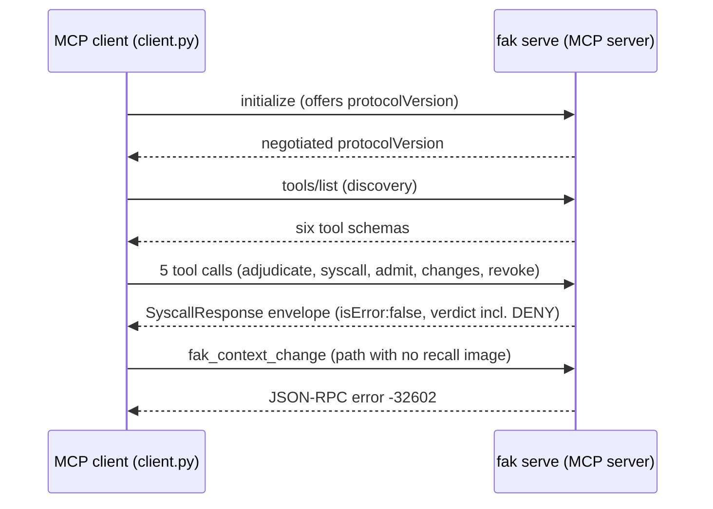

# Drive fak from your own MCP client (protocol-level walkthrough)

`fak serve` is a [Model Context Protocol](https://modelcontextprotocol.io) (MCP)
server. It speaks **JSON-RPC 2.0** — so *any* compliant MCP client drives it, not
just Claude Code. This directory is the adoption-shaped proof: a stdlib-only
Python client ([`client.py`](client.py)) that connects to fak, does the
`initialize` handshake, and calls **all six tools** end to end, printing each
response shape so you can see exactly what comes back before you wire fak into
your own (any-language) agent.



*The protocol exchange over stdio (default) or HTTP: handshake, discovery, then all six tools — five returning a deny-as-value `SyscallResponse`, `fak_context_change` returning the error channel.*

> Already use Claude Code / Cursor and just want the one-paste `.mcp.json` setup?
> That's the sibling [`../mcp`](../mcp/README.md). A CI-grade pass/fail gate that
> asserts a *verdict* over MCP stdio lives in that same [`../mcp/`](../mcp/README.md) demo.
> **This** example is the protocol-level walkthrough: any client, all six verbs.

## Run it

```bash
examples/mcp-client/run.sh            # spawns `fak serve --stdio`, drives all six tools
# or directly:
python3 examples/mcp-client/client.py
```

Needs only Python 3 (standard library — no `mcp` SDK, no `requests`) and the
`fak` binary (or a Go toolchain to build it). No model, key, or GPU. It **runs in a
few seconds** and is **deterministic** — the same six responses on every run. A
captured run is in [`EXAMPLE-OUTPUT.md`](EXAMPLE-OUTPUT.md).

Windows users: run the `.sh` launcher from WSL or Git Bash, or call
`python3 examples/mcp-client/client.py` directly if `fak` is already built; there is no
native `.ps1` wrapper yet.

## What you see

The client prints each step of the protocol exchange in order: the `initialize` handshake
(with the negotiated `protocolVersion`), the `tools/list` discovery response, then one block
per tool call showing the **response shape** that comes back. Five tools return a
`SyscallResponse` envelope (`isError:false`, the verdict embedded — including a deny-as-value
`DENY`); `fak_context_change` returns a JSON-RPC **error** (`-32602`) for a path with no
recall image. The same six responses print on every run, so you can read the exact wire shape
before porting the client into your own agent.

## The two transports

fak exposes the **same** JSON-RPC dispatch over two transports — `client.py`
speaks both:

| Transport | How | Client flag |
|---|---|---|
| **stdio** | newline-delimited JSON-RPC frames on stdin/stdout (one message per line, no `Content-Length` headers — the MCP stdio convention; no listener, no auth surface) | *(default)* — `client.py` spawns `fak serve --stdio` |
| **HTTP** | one request/response per `POST /mcp` | `--http http://127.0.0.1:8080/mcp` against a running `fak serve --addr 127.0.0.1:8080` |

## Protocol-version negotiation

In `initialize` the client offers a `protocolVersion`. fak echoes it **iff it
supports it**, otherwise it answers with its own default — it never claims an
unknown/future revision. The supported set lives in one place,
`mcpProtocolVersions` in [`../../internal/gateway/mcp.go`](../../internal/gateway/mcp.go)
(currently `2024-11-05`, `2025-03-26`, `2025-06-18`).

## The six tools

| Tool | One-line meaning | Walkthrough payload |
|---|---|---|
| `fak_adjudicate` | Verdict only (ALLOW / DENY / TRANSFORM / REQUIRE_WITNESS), no execution — the production path when your client runs its own tools. | `{tool: git_status}` → ALLOW |
| `fak_syscall` | Adjudicate **and** execute through the kernel; returns verdict + admitted result. | `{tool: git_status, read_only}` |
| `fak_admit` | Screen a result **you** executed through the result-side stack (context-MMU quarantine + IFC taint ledger) before it enters context. | `{tool: web_fetch, result}` |
| `fak_changes` | Drain the cross-agent "what changed" feed (typed mutations + revocations since a cursor). | `{since: 0}` |
| `fak_revoke` | Refute a world-state witness (commit / blob hash / lease epoch); entries admitted under it are evicted fleet-wide. | `{witness: sha256:…}` |
| `fak_context_change` | Negative-only mutation against a persisted recall core image (records a tombstone). | `{image_dir, step, reason}` |

The full input schemas are returned by `tools/list` (the MCP discovery call).

## The two response channels (deny-as-value vs the error channel)

Every tool returns through the **same** MCP tool-result envelope — a single text
content block carrying a `SyscallResponse`, with `isError` **always false**:

```json
{ "content": [{ "type": "text", "text": "<SyscallResponse JSON>" }], "isError": false }
```

A refusal is **deny-as-value**: a normal, successful result whose embedded
`verdict.kind` is `DENY`. The JSON-RPC `error` object is reserved for
protocol/build faults (bad params, unknown tool) — never a policy refusal.

The walkthrough shows both channels honestly: five tools return a
`SyscallResponse`; `fak_context_change`, given a path with no recall image,
returns a JSON-RPC **error** (`-32602`) — the exact result-vs-error split
specified in [`../../docs/mcp-tool-result.md`](../../docs/mcp-tool-result.md).
To see it succeed, point `image_dir` at a real persisted recall image.

## Where this fits

- **Wire shape (every field):** [`../../docs/mcp-tool-result.md`](../../docs/mcp-tool-result.md)
- **The serving path / transports:** [`../../GETTING-STARTED.md`](../../GETTING-STARTED.md) §3 (Tier 1)
- **Editor setup (`.mcp.json`) + a CI gate:** [`../mcp`](../mcp/README.md)
- **Server implementation:** [`../../internal/gateway/mcp.go`](../../internal/gateway/mcp.go)

## Honest scope

`client.py` is a **reference** client meant to be read and ported, not a
production MCP SDK: no reconnect/retry, no request batching, no streaming. It
proves the protocol contract — handshake, discovery, and all six verbs over both
transports — so an adopter can wire fak into any compliant MCP client.
