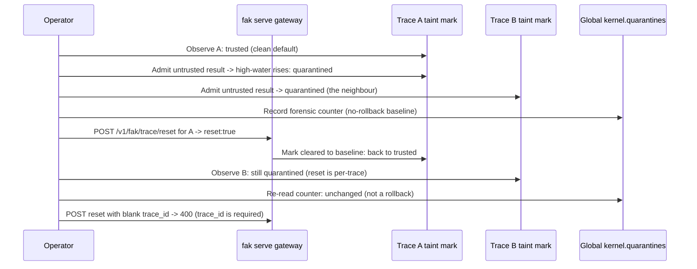

# Reset one trace's IFC taint at a session boundary (`POST /v1/fak/trace/reset`)

A long-lived `fak serve` gateway keeps a **per-trace IFC taint ledger**: as
untrusted tool results are admitted onto a session, that session's taint
high-water mark rises and stays risen (it is a high-water mark — it never falls on
its own). At an **operator-approved session boundary** the operator clears one
trace's mark, so a fresh session that reuses the same trace id starts clean
instead of inheriting stale taint. This example is the runnable proof of that
operator loop — and of its scope: the reset clears exactly one trace and touches
nothing else.

It is the IFC-ledger companion to [`../../POLICY.md`](../../POLICY.md) (the
`curl … /v1/fak/trace/reset` block under "The workflow"), which describes the
motion; this directory *runs* it and asserts each step. The sibling
[`../policy-hot-reload/`](../policy-hot-reload/) example is the *other* operator
surface on the same served lifecycle — that one swaps the capability *floor*; this
one clears the *taint ledger*.



*The 11-step operator loop: trace A's high-water mark rises then resets to trusted, while neighbour trace B and the global forensic counter stay put.*

## Run it

```bash
examples/trace-reset/run.sh
```

Needs only Go (to build `fak`) and `curl` — **no model, key, or GPU**. It **runs in a
few seconds** once `fak` is built — no model, no network. The admit,
observe, and reset routes do not touch an upstream, so the result is
**deterministic** on every run. A captured run is in
[`EXAMPLE-OUTPUT.md`](EXAMPLE-OUTPUT.md).

## What you see

The run prints the 11 witness checks in order: trace A starts trusted, rises to
quarantined after an untrusted admit, resets to trusted after the operator call, while
trace B stays quarantined and the global quarantine counter stays unchanged. The final
blank-`trace_id` request returns `400`, proving the route fails closed on malformed input.

Windows users: run the `.sh` launcher from WSL or Git Bash; the demo itself is
plain `fak serve` plus `curl`, and there is no native `.ps1` wrapper yet.

## The operator loop the script walks

| # | Step | Witness |
|---|---|---|
| 1 | Observe a fresh trace **A** | `trusted` (the clean default) |
| 2 | Admit an **untrusted** result onto **A** | — (ledger raised) |
| 3 | Observe **A** | `quarantined` — high-water mark rose above Trusted |
| 4 | Admit an untrusted result onto a **different** trace **B** | — |
| 5 | Observe **B** | `quarantined` — the neighbour we will protect |
| 6 | Record the **global** forensic quarantine counter | the no-rollback baseline |
| 7 | `POST /v1/fak/trace/reset` for **A** | `reset:true` |
| 8 | Observe **A** | back to `trusted` — mark cleared to baseline |
| 9 | Observe **B** | **still** `quarantined` — reset is per-trace |
| 10 | Re-read the global quarantine counter | **unchanged** — reset is not a counter rollback |
| 11 | `POST` a reset with a **blank** `trace_id` | `400` (`trace_id is required`) |

## Where the high-water mark lives (and why it is *not* `/debug/vars`)

The per-trace mark is read from **`GET /v1/fak/trace/{trace_id}`**, which returns
`{"trace_id":…,"taint":"trusted|tainted|quarantined","dangerous":bool}`. That is
the surface this example filters "to that trace".

`GET /debug/vars` carries only **global, process-wide** kernel counters
(`kernel.quarantines`, `kernel.denies`, …) — it has **no** per-trace field. That
is deliberate, and it is exactly why step 10 is a witness: the reset clears one
trace's mark while the global forensic tally `kernel.quarantines` stays put. A
reset that rewound forensics would be the wrong primitive — the operator is
ending a session, not erasing the record that the session was tainted.

## The two ledgers — what reset touches, and what it does **not**

These are separate subsystems with separate lifecycles. Conflating them is the
trap this example exists to close.

- **The IFC taint ledger — per *trace*, operator-resettable.** One taint
  high-water mark per trace id. `POST /v1/fak/trace/reset` clears exactly one
  trace's mark back to `trusted`. This is the ledger the walkthrough drives.
- **The recall per-page quarantine ledger — per *page*, survives reset.** When a
  poisoned result is paged out, recall holds a **per-page** quarantine that
  persists until that page is explicitly `Clear()`-ed **and rescreened** — it is
  keyed on the page, not the trace, and **`trace/reset` does not touch it.**
  Clearing a trace's taint mark says "this session is over"; it does **not**
  un-quarantine the bytes that were paged out during it. Re-admitting that page
  still re-screens it.

So a `trace/reset` does **not**:

- **clear any per-page quarantine** — that ledger lives in recall and has its own
  `Clear()` + rescreen lifecycle (above);
- **rewind global forensics** — `kernel.quarantines` on `/debug/vars` is
  append-only and untouched (step 10);
- **re-judge already-admitted results** — it only lowers the *trace's* mark; bytes
  already quarantined stay quarantined;
- **leak across traces** — resetting **A** leaves **B** exactly where it was
  (step 9).

## What "session boundary" means

The operator is asserting **the prior session ended** and a new one may reuse the
trace id with a clean slate. The reset does **not** assert the prior session ended
*cleanly* — whether the taint that accumulated was benign or hostile is the
**operator's** call, made out of band (a verified logout, a new user, a fresh
task). `fak` clears the mark when told to; it does not adjudicate whether clearing
it was *safe*. That judgement is the operator's, which is why this is an
operator-approved surface and not an automatic decay.

## The property the green tests cover

The route-level behaviour is pinned by the trace-reset tests in
[`../../internal/gateway/policy_reload_test.go`](../../internal/gateway/policy_reload_test.go)
(which houses both lifecycle surfaces):
`TestTraceResetRouteInvokesConfiguredResetter` (a well-formed reset reaches the
configured resetter with the trimmed trace id and returns `reset:true`),
`TestTraceResetRouteValidationAndDisabled` (a blank `trace_id` is a `400`, and the
route is `404` when `serve` wired no resetter), and the read-side complement
`TestTraceObserveRouteReturnsTaintLevel` / `TestTraceObserveRouteValidationAndDisabled`.
The end-to-end clearing (`ifc.Default.Reset` lowers the level back to Trusted) is
pinned by `TestResetTraceClearsIFCLedger` in
[`../../cmd/fak/main_test.go`](../../cmd/fak/main_test.go). This example is the
operator walkthrough those unit tests stand in for.

## The auth gate

This example serves on loopback with **no** authentication so it is a one-command
demo. In a real deployment you pass `--require-key-env VAR`, and then **the reset
route requires the same bearer token as every other `/v1/fak/*` route** — there is
no separate admin key, so locking the gateway locks its control plane too:

```bash
fak serve --addr 0.0.0.0:8080 --require-key-env FAK_TOKEN
curl -X POST http://host:8080/v1/fak/trace/reset \
  -H 'Content-Type: application/json' \
  -H "Authorization: Bearer $FAK_TOKEN" \
  -d '{"trace_id":"gw-123"}'              # or:  -H "x-api-key: $FAK_TOKEN"
```

Without the header the reset is `401`, same as a model request would be. The
operator-route auth contract — and both accepted header shapes — is proven
end-to-end in the sibling [`../auth-hardening/`](../auth-hardening/) example.

## Where this fits

- **The workflow, in context:** [`../../POLICY.md`](../../POLICY.md) — the
  `curl … /v1/fak/trace/reset` block ("The same served lifecycle surface can clear
  one trace's IFC high-water mark after an operator-approved session boundary").
- **The claim it demonstrates:** [`../../CLAIMS.md`](../../CLAIMS.md) — "Security
  substrate" → IFC source-stamp / taint ledger (`Ref.Taint` is source-stamped; the
  served result-side stack raises `ifc.Ledger.Level(trace)` above Trusted).
- **The route-level + clearing tests:**
  [`../../internal/gateway/policy_reload_test.go`](../../internal/gateway/policy_reload_test.go),
  [`../../cmd/fak/main_test.go`](../../cmd/fak/main_test.go).
- **The other operator surface on the same lifecycle:**
  [`../policy-hot-reload/`](../policy-hot-reload/).
- **The auth gate the reset route inherits:** [`../auth-hardening/`](../auth-hardening/).
