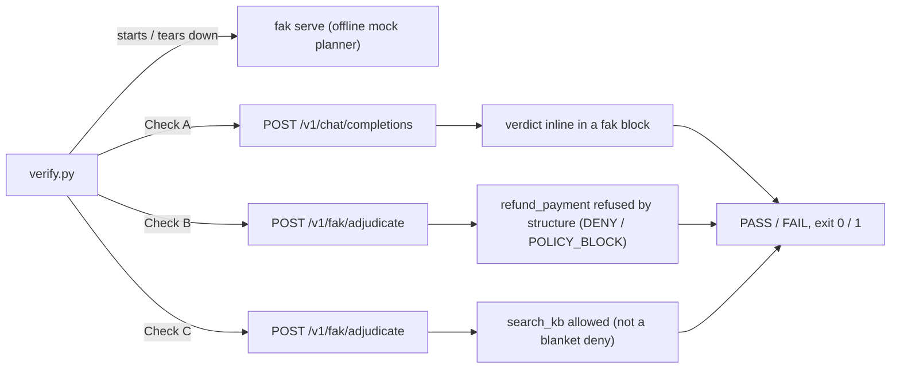

# fak — over-the-wire adjudication proof (zero dependencies)

One command proves the [integration index](../../docs/integrations/README.md)'s central
claim — *every tool call your agent proposes passes through the capability floor first* —
over real HTTP, with **no model, no API key, no GPU, no ollama**. Just the `fak` binary
(or a Go toolchain to build it) and the Python standard library. It **runs in a few
seconds** — no model, no network, and no build at all when a `fak` binary is present.



*verify.py drives `fak serve` through the three wire checks (A, B, C) against the capability floor, then reports PASS/FAIL.*

```bash
python3 examples/wire-proof/verify.py        # -> PASS / FAIL, exit 0 / 1  (CI-usable)
```

It starts `fak serve` with no `--base-url` (a deterministic **offline mock planner**),
runs three checks, and tears the server down:

| | Check | Endpoint |
|---|---|---|
| **A** | a normal OpenAI request comes back with the kernel's verdict **inline** in a `fak` block | `POST /v1/chat/completions` |
| **B** | a tool **not** on the allow-list is refused **by structure** (DENY / `POLICY_BLOCK`) | `POST /v1/fak/adjudicate` |
| **C** | an allow-listed tool is permitted (not a blanket deny) | `POST /v1/fak/adjudicate` |

Captured run: [`EXAMPLE-OUTPUT.md`](EXAMPLE-OUTPUT.md).

## What you see

The verifier prints the three checks as a compact PASS/FAIL transcript. A correct run shows
the OpenAI-compatible request carrying an inline `fak` verdict block, `refund_payment`
returning `DENY / POLICY_BLOCK`, and `search_kb` returning `ALLOW`; any missing or
different verdict flips the script to `FAIL` and a non-zero exit.

## Scope

This exercises the **call-side capability gate** only — the same layer as
[`../adjudication-demo/`](../adjudication-demo/README.md), but driven by the offline mock
planner instead of a real local model, so it needs nothing installed. It does **not**
demonstrate result-side containment or the (deliberately non-load-bearing) result
detector; see the [repo README](../../README.md) and [`CLAIMS.md`](../../CLAIMS.md) for
the full, honest scope.

The capability floor enforced here is
[`../customer-support-readonly-policy.json`](../customer-support-readonly-policy.json):
`refund_payment` is refused, `search_kb` is allowed.
