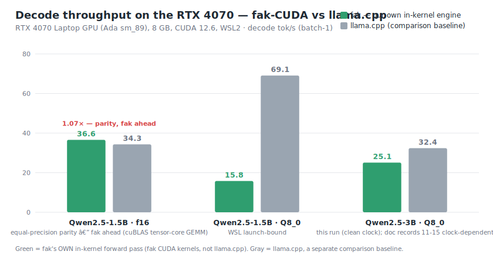
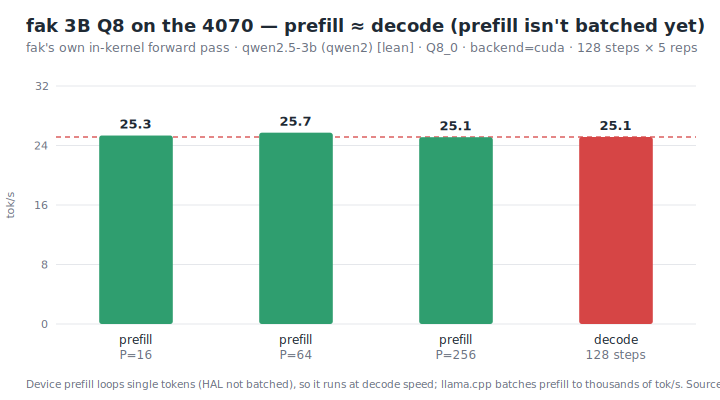

# GPU bench data — Qwen2.5-3B-Instruct Q8 on the RTX 4070 (fak in-kernel CUDA)

Captured benchmark data for the **kernel-core** forward pass — fak's own pure-Go model
running on the GPU through the `compute.Backend` CUDA path (`-tags cuda`, `FAK_CUDA_Q8=1`),
**not** a model fronted by `fak serve`. Companion to [`GPU-QWEN-RESULTS.md`](../../docs/benchmarks/GPU-QWEN-RESULTS.md)
(narrative + the launch-tax analysis) and `GPU-MODEL-PICK.md` (operator-specific note — not published).
Every number below is a real run captured in bench output — the JSON is the raw artifact.

> **Whose engine is this? fak's own — not llama.cpp.** The throughput, the argmax-exact witness,
> and the generated text are all produced by **fak's own kernel**: fak's pure-Go forward pass
> (`internal/model`) dispatching matmuls to fak's hand-written CUDA kernels
> (`internal/compute/cuda_kernels.cu` → `libfakcuda.a`, linked `-lfakcuda`; the Q8 path is fak's
> own `fcuda_matvec_q8` GEMV). It loads the **Qwen2.5-3B _weights_** (Alibaba's open model) but
> runs them on fak's engine — there is **no `libllama` / `libggml` / `gguf` anywhere in this path**.
> `llama.cpp` appears in `comparison.json` and the chart **only as a separately-measured baseline**
> (`internal/model/bench_llamacpp.py` / `llama-bench`), shown as the gray bars for context.

## Data
- [`qwen2.5-3b-q8-cuda-4070.json`](qwen2.5-3b-q8-cuda-4070.json) — `modelbench -out` report (this run).
- `comparison.json` (raw artifact — not committed to public) — cross-engine decode tok/s (fak vs llama.cpp), cited to [`GPU-QWEN-RESULTS.md`](../../docs/benchmarks/GPU-QWEN-RESULTS.md) §3.

## Charts
Dependency-free SVG, regenerated from the JSON above by `make_charts.py` (chart generator — not committed to public)
(`python make_charts.py`) so the figures can't drift from the data they show.



> At equal precision (f16) fak's cuBLAS tensor-core GEMM is at parity with — slightly ahead of —
> `llama.cpp` (36.6 vs 34.3 tok/s on Qwen2.5-1.5B). The Q8 gap is the WSL per-launch tax
> (~600 launches/token), not the kernel — see `../../GPU-QWEN-RESULTS.md` §4.



> Device prefill loops single tokens (the HAL prefill rewrite is the follow-up), so fak prefill
> runs at decode speed while `llama.cpp` batches prefill to thousands of tok/s.

## Conditions (this run)
- **Box:** RTX 4070 Laptop GPU (Ada sm_89), 8188 MiB / ~6.5 GiB free, driver 581.32, CUDA 12.6, WSL2.
- **Code:** `fak-v0.1` @ `17e6fbc` (v0.21.0), 2026-06-18. Toolchain `~/cudaenv` (no-sudo micromamba), Go 1.26.
- **Model:** `Qwen/Qwen2.5-3B-Instruct` (36 layers, 2 KV heads, tie-embeddings, bf16 source),
  loaded lean → **Q8_0** weight path (`LoadSafetensorsQuantDir`), ~3.5 GiB resident on the GPU.

## Correctness — argmax-exact (the gate, not a vibe)
`gpucheck -lean -n 12`: the CUDA Q8 device decode is **token-for-token identical** to the
CPU-Q8 reference (the Approx gate on a real 3B model):

```
ref(cpu-Q8):      [279 3840 315 279 7602 624 95456 0 576 3840 315 279]
dev(cuda approx): [279 3840 315 279 7602 624 95456 0 576 3840 315 279]
OK — greedy argmax-exact over 12 tokens vs cpu-Q8
```

Decoded (greedy), the kernel-core GPU model produces coherent English:
> **prompt** "Hello, I am a language model. Please tell me about"
> **generated** " the history of the internet.\nCertainly! The history of the"

## Throughput (from the JSON)
| phase | tok/s | detail |
|---|---:|---|
| decode | **25.1** | 39.8 ms/tok, 128 steps × 5 reps, prompt 16 |
| prefill P=16 / 64 / 256 | 25.3 / 25.7 / 25.1 | not batched on the device path yet (HAL loops single tokens) |
| load | — | ~49 s to load 5.8 GB safetensors + quantize to Q8 (off the timed path) |

Decode is **WSL-launch-bound** (~600 device ops/token × ~0.07 ms host launch tax), not
GEMV-compute-bound; `llama.cpp` Q8 reaches ~32 tok/s on the same box. The lever is a
capture-safe CUDA graph, not a faster kernel — see `GPU-QWEN-RESULTS.md` §4.

## Reproduce
```bash
# weights: huggingface_hub snapshot_download("Qwen/Qwen2.5-3B-Instruct") -> <dir>
bash internal/compute/build_cuda.sh build
FAK_CUDA_Q8=1 go run -tags cuda ./cmd/gpucheck  -hf <dir> -lean -backend cuda -n 12
FAK_CUDA_Q8=1 go run -tags cuda ./cmd/modelbench -hf <dir> -lean -backend cuda \
    -decode-steps 128 -decode-reps 5 -decode-prompt 16 -out experiments/gpu/qwen2.5-3b-q8-cuda-4070.json
```
