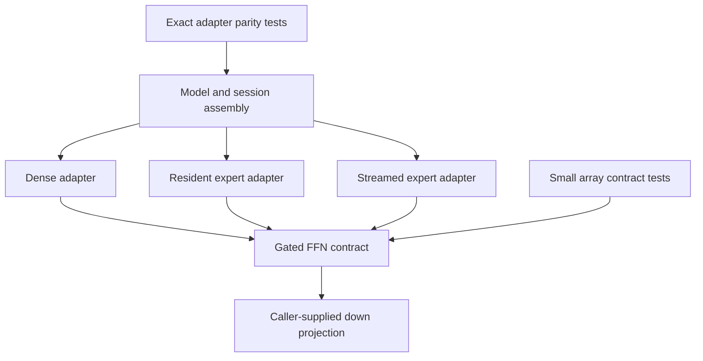

# Small model improvements through shared components

Native model work has three distinct responsibilities: mathematical components, model-specific adapters, and session/backend policy. Put arithmetic that can be checked with small arrays in a dependency-light package. Let adapters supply weights, projections, activation choice, and biases. Keep scheduling, retained state, device selection, and residency at their existing owners.

This package is the first production slice of that structure, tracked in [#13435](https://github.com/anthony-chaudhary/fak/issues/13435).

## One change, three adapters

`Gated` owns the ordered gated activation and down-projection sequence. Three previously duplicated tails use it:

| Adapter | Responsibility retained by the model |
| --- | --- |
| `denseSwiGLU.apply` in `moe.go` | Fused-device eligibility, grouped gate/up projection, input biases, prepared down input, output bias |
| `v41SwiGLU` in `v41_forward.go` | Resident expert weights, existing scalar matrix reductions, configured activation |
| `v41SharedExpertSwiGLU` in `v41_forward.go` | Streaming projection, weight residency and projection errors |

The existing full-sequence, single-position and grouped-expert callers of `v41SwiGLU` inherit the shared component through that adapter. Their existence is not counted as additional removed implementations. The single-position layer still has its own activation/qualification owner; this extraction does not establish production incremental decode.



## Buffer and failure contract

`Gated` receives already projected gate/up rows, an activation function and a down-projection function. The caller exclusively owns the gate row and permits mutation. Gate must not overlap up; that ownership precondition is documented rather than detected with unsafe pointer arithmetic. Up remains read-only.

Invalid lengths or nil callbacks fail before mutation. For valid inputs, activation/multiplication runs in increasing index order, then down is called once. A down error is returned unchanged; the gate remains activated after that error. This is an in-place operation, not a transaction. Adapters keep their existing error wrapping and bias order.

Preserve the caller's activation and projection kernels. Replacing a reduction with a mathematically equivalent loop can change floating-point bits; local component reuse must not silently change numerical contracts or device eligibility.

## Incremental validation ladder

1. Change the smallest component with an independent input/output contract. Run `go test ./internal/model/ffn -count=1` and its allocation/latency benchmark.
2. Prove the adapters still agree with their prior scalar arithmetic: `go test ./internal/model -run 'TestFFNGatedAdaptersBitExact|TestMoEDenseNoOpIdentical|TestV41LayerStepPlain' -count=1`. Confirm the selected tests exist and execute.
3. Run the owning package checks after the final edit. Backend or state changes also require the appropriate device or session witnesses; a tiny numerical fixture cannot qualify an accelerator.
4. Land the verified slice before starting another. Reuse the existing [model onboarding workflow](../../../docs/new-model-playbook.md) and block composition instead of adding another registry.

From an isolated public worktree, select that module with `GOWORK=off` and use the worktree's build cache/temp directories. Do not point tests at a workspace whose public module resolves to another checkout.

## Measure improvement honestly

The structural targets for this pilot are a component source/test surface at least ten times smaller than the parent model package, and one shared tail replacing three independent copies. Count actual selected Go files and actual production delegations, not names, wrappers, or test-only consumers.

These are measures of change isolation and reuse. They do not by themselves establish tenfold developer productivity, a general threefold composability score, or inference throughput. Compare the real migrated callback path with the prior inline tail, including allocations and projection work. Record source revision, command, workload and measured result before making a speed claim.

The intended next-model pattern is stable: a small contract and fixture, caller-owned adapters, then increasingly broad witnesses as the change reaches assembly, state, or hardware. Extract another component only when repeated production behavior and an independent witness justify it.

### Source-surface receipt

Baseline commit: `3754f38ed5b404023f8c28f9782a4738ae6219d2`.
A direct tree count found 443 production and 619 test Go files at the top level of `internal/model` (platform-tagged files included). On the Windows amd64 toolchain, `go list` selected 404 production files for the parent model package. The new FFN component has one production and one test file. Thus its production source surface is 404 times smaller on this host; this exceeds the tenfold isolation target and measures source surface only.

Reproduce the selected-file comparison from the isolated public module:

```text
go list -f '{{.ImportPath}} production={{len .GoFiles}} cgo={{len .CgoFiles}} tests={{len .TestGoFiles}} external_tests={{len .XTestGoFiles}}' ./internal/model ./internal/model/ffn
```

The three-to-one reuse count refers specifically to the tails formerly owned independently by `denseSwiGLU.apply`, `v41SwiGLU`, and `v41SharedExpertSwiGLU`. Broader caller counts and model support are separate facts.

### Software measurement receipt

Windows amd64, Ryzen 9 9950X, Go 1.26.7; five benchmark samples per case against the original adapter bodies from the baseline above:

| Workload | Shared adapter median | Original median | Allocations per call, shared / original |
| --- | ---: | ---: | ---: |
| Resident V4.1 expert, H=64 / I=128 | 12.328 us | 12.917 us | 3 / 4 |
| Dense non-fused synthetic fixture, GELU-erf | 5.939 us | 6.636 us | 14 / 14 |
| Streamed shared-expert correctness fixture | Not timed | Not timed | 6 / 7 |

These small CPU fixtures show no observed adapter regression; host timing was noisy and is not a throughput claim. The smaller resident correctness fixture has 3 / 3 allocations because compiler allocation decisions depend on shape. The adapter tests require no allocation regression rather than a fixed saving.

The deliberately cheap scalar-activation leaf benchmark exposes the abstraction cost: 6.009 us median through `Gated` versus 2.740 us inline for 4096 elements, with zero allocations in both. Per-element callbacks can therefore matter when projections and activation are cheap. Benchmark the actual adapter before expanding this contract to another hot path; the measured resident and dense adapters include their real projections and configured activations.

```text
go test ./internal/model/ffn -run '^$' -bench '^BenchmarkGatedMatchedInline$' -benchmem -count=5
go test ./internal/model -run '^$' -bench '^BenchmarkFFNGatedAdapters$' -benchmem -count=5
```

Exact float32-bit parity passes for all three adapters, including dense input/output biases. The package reachability index records a production import from `internal/model` to this leaf; execution evidence comes from the adapter tests, not merely the import.

A follow-up for the default SiLU path used `-cpu=1 -benchtime=500ms -count=6`, selecting `BenchmarkFFNGatedAdapters/(V41Routed|DenseNonFused)/SiLU`. Resident expert medians were 15.784 us shared versus 15.286 us original (+3.3%; respective ranges 13.913-16.151 and 13.762-16.274 us), with 3 versus 4 allocations. Dense medians were 7.678 versus 7.821 us (-1.8%), with 16 allocations in both. The overlapping timing ranges do not establish zero overhead or a speedup. Retain the modest possible resident-call cost as an explicit tradeoff for this composition seam; larger accelerator and serving workloads require their own evidence.
