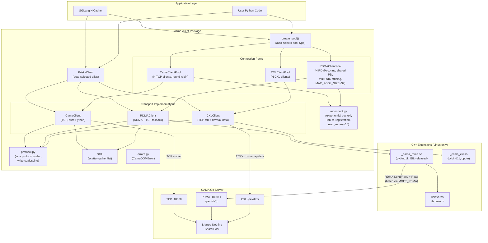
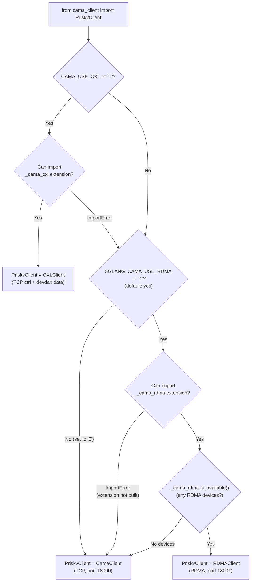

# Architecture

## Layer Diagram

## Why C++ (Not Go) for the RDMA Extension?

The CAMA **server** is written in Go. The **client** is Python. The only contract between them is the binary wire protocol — there is no shared code.

RDMA requires calling C libraries (`libibverbs` and `librdmacm`) for queue pair setup, memory registration, and posting work requests. There are three viable approaches for exposing RDMA to Python:

| Approach | Pros | Cons |
|---|---|---|
| **pybind11 C++ (chosen)** | Native `.so`, zero runtime deps, standard pattern (NumPy, PyTorch), clean type conversion, small footprint | Requires C++ compiler for RDMA install |
| **cgo shared library** | Could reuse Go server RDMA code | Embeds entire Go runtime (~30 MB), complex GC interaction with Python, non-standard for Python extensions |
| **ctypes/cffi wrapping C** | No compiler needed at install time | No type safety, manual struct packing for every ibverbs call, fragile and error-prone |

**Decision:** The C++ extension (~1350 lines) wraps RDMA CM connection setup, Send/Recv for control messages, RDMA Read for data transfer, and batch RDMA Read with linked WR lists. All I/O methods release the GIL for 10x multi-thread throughput. Go's concurrency primitives (goroutines, channels) are not needed on the client side, so embedding the Go runtime would add ~30 MB of overhead for no benefit. pybind11 is the standard way Python packages expose native code (NumPy, PyTorch, etc.) and provides automatic Python <-> C++ type conversion.

## Transport Selection

When you import `PriskvClient` from `cama_client`, the package auto-selects the best available transport at import time:

**Source:** `cama_client/__init__.py`

The selection happens once at import time. `PriskvClient` is bound to either `CamaClient` or `RDMAClient` for the lifetime of the process. Both classes implement the identical API surface, so calling code does not need to know which transport is active.

## Wire Protocol Summary

Both TCP and RDMA transports use the same binary wire protocol. Every message starts with a 13-byte header:

| Offset | Size | Field | Value |
|--------|------|-------|-------|
| 0 | 2 | Magic | `0xBE 0xEF` |
| 2 | 1 | Version | `0x01` |
| 3 | 1 | OpCode | Operation code (see below) |
| 4 | 1 | Flags | `0x00` = none, `0x01` = with TTL |
| 5 | 4 | RequestID | Client-assigned `uint32` (LE) |
| 9 | 4 | BodyLen | Body size in bytes (LE) |

All multi-byte integers are **little-endian**.

**Key opcodes:**

| Code | Name | Direction | Body Format |
|------|------|-----------|-------------|
| `0x01` | GET | Request | `keyLen(2) + key` |
| `0x02` | SET | Request | `keyLen(2) + key + valueLen(4) + value [+ ttlMs(8)]` |
| `0x03` | DELETE | Request | `keyLen(2) + key` |
| `0x04` | TEST | Request | `keyLen(2) + key` |
| `0x05` | LEASE | Request | `keyLen(2) + key + durationMs(8)` |
| `0x06` | PIN | Request | `keyLen(2) + key` |
| `0x07` | UNPIN | Request | `keyLen(2) + key` |
| `0x10` | MGET | Request | `count(4) + [keyLen(2) + key]*` — batch GET (TCP: single roundtrip; RDMA: per-key fallback) |
| `0x11` | MSET | Request | `count(4) + [keyLen(2) + key + valueLen(4) + value]*` — batch SET (auto-chunked if > send buffer) |
| `0x12` | MTEST | Request | `count(4) + [keyLen(2) + key]*` — batch EXISTS |
| `0x13` | MDEL | Request | `count(4) + [keyLen(2) + key]*` — batch DELETE |
| `0x22` | KEYS | Request | `patternLen(2) + pattern` |
| `0x24` | FLUSH | Request | (empty) |
| `0x25` | STATS | Request | (empty) |
| `0x26` | REPORT_STATS | Request | JSON stats payload |
| `0x27` | MAINTENANCE | Request | `action(1) [+ shardID(2)]` |
| `0x32` | RDMA_READ_READY | Response | `found(1) + rkey(4) + remoteAddr(8) + length(4)` |
| `0x33` | READ_ACK | Request | `wcStatus(1)` — client→server RDMA Read completion ack |
| `0x34` | MGET_RDMA | Request | `count(4) + [keyLen(2) + key]*` — batch GET requesting RDMA metadata |
| `0x35` | MGET_READ_READY | Response | `count(4) + [found(1) + rkey(4) + remoteAddr(8) + length(4)] × count` |
| `0x36` | BATCH_READ_ACK | Request | `count(4) + [wcStatus(1)] × count` — batch WC statuses |
| `0xF0` | OK | Response | `0x01` (1 byte) |
| `0xF1` | Error | Response | Error message string |
| `0xF2` | Value | Response | `found(1) [+ valueLen(4) + value]` |

**Source:** `cama_client/protocol.py`

The TCP client sends the header + body over a socket and reads the response header + body back. The RDMA client serializes the same header + body into the send buffer, posts an RDMA Send, and receives the response via RDMA Recv — the wire format is identical.

## Socket Write Coalescing

The TCP transport uses size-aware write coalescing in `protocol.write_message()`:

- **Body ≤ 4 KB:** Header and body are concatenated into a single `sendall()` call, avoiding a second syscall for small messages.
- **Body > 4 KB:** Header and body are sent as two separate `sendall()` calls, avoiding the creation of a large intermediate byte object (which would pressure the Python GC).

On the read side, the TCP socket uses a 64 KB buffered reader (`makefile("rb", buffering=65536)`) to reduce syscall overhead for response parsing.

**Source:** `cama_client/protocol.py:88-95`

## Protection Domains & Shared PD

A **Protection Domain (PD)** is an RDMA kernel object that groups Queue Pairs (QPs) and Memory Regions (MRs) into a security boundary. A QP can only access MRs that belong to the same PD. PDs are scoped to a single `ibv_context` — one physical HCA (Host Channel Adapter).

**Shared PD optimization:** When multiple pool connections use the same local HCA, they can share a single PD. This means MRs only need to be registered once (`ibv_reg_mr`) and any connection in the pool can access them. Fewer PDs = fewer kernel objects, faster MR setup.

**When shared PD works:**
- **Single-endpoint pool** (`pool_size > 1`, one server NIC) — all connections route through the same local HCA, so they all share the PD from connection 0
- **Multi-NIC server, single-HCA client** — all server endpoints are reachable from one local device (e.g., all on the same subnet)

**When shared PD cannot work (independent PD fallback):**
- **Multi-NIC server, multi-HCA client** — each server NIC is on a different subnet, routing through a different local HCA. A PD from `mlx5_0` cannot be used with a QP on `mlx5_1` because they are different physical devices with different kernel contexts. Each connection gets its own PD and registers MRs independently.

The fallback is automatic and transparent — `reg_memory()` handles per-connection MR registration for independent-PD connections. The only cost is additional `ibv_reg_mr` calls (one per connection instead of one shared).

**Source:** `cama_client/csrc/rdma_transport.cpp` (`connect_with_shared_pd`), `cama_client/rdma/_pool.py`

## Multi-NIC Striping

When the server has multiple RDMA NICs, `RDMAClientPool` can stripe `mget_rdma` across all NICs in parallel for N× read bandwidth:

1. **Discovery** — `client.rdma_endpoints()` returns `[{"ip", "port", "device"}, ...]`, one per server NIC
2. **Pool construction** — `create_pool(addr, port, endpoints=[(ip, port), ...])` creates one connection per NIC, auto-setting `pool_size` to `len(endpoints)`
3. **Striped reads** — `_mget_rdma_striped()` partitions keys round-robin across connections, submits parallel `_mget_rdma_on_conn` via a `ThreadPoolExecutor`, and merges results back to original key order
4. **Fast path** — When `pool_size=1`, `mget_rdma` dispatches directly without threading overhead
5. **Independent PD** — In multi-NIC topologies, each connection typically routes through a different local HCA, so each gets its own PD with separate MR registration (see [Protection Domains](#protection-domains--shared-pd) above)

**Per-NIC metrics** tracked in `get_transport_stats()`:
- `stripe_calls` / `stripe_avg_nics` — how often striping fires and average NIC fan-out
- `per_nic_reads` / `per_nic_bytes_gb` — read count and bytes per connection slot

**Source:** `cama_client/rdma_client.py` (`_mget_rdma_striped`, `_mget_rdma_on_conn`, `_stripe_executor`)

## Reconnection Engine

Both pool types (`RDMAClientPool`, `CamaClientPool`) support automatic reconnection with exponential backoff via `reconnect.py`.

**Reconnection scope depends on which connection fails:**

| Failure | Scope | Impact |
|---|---|---|
| Non-owner connection (conn 1..N-1) | Cheap reconnect — PD and MRs survive | Sub-second, other connections unaffected |
| PD-owner connection (conn[0]) | Full pool rebuild — all connections torn down, MRs re-registered | 1-3 seconds, all operations stall |

**Multi-endpoint awareness:** When reconnecting a non-owner connection in a multi-endpoint pool, the reconnect uses the correct NIC endpoint for that connection slot. Full rebuilds preserve the multi-endpoint distribution.

**MR re-registration:** Each registered buffer is tracked as an `_MREntry(lkey, mr_handle, buf_ref, ptr, size)`. On reconnect, the `ptr` and `size` fields enable automatic re-registration on the new PD. The `buf_ref` holds a Python reference to prevent GC during in-flight RDMA operations. For connections with independent PDs, MRs are registered separately on each connection's PD.

**Post-reconnect callbacks:** The connector registers a callback (`pool.on_reconnect(fn)`) to refresh server info and reset dedup state after reconnection.

**Source:** `cama_client/reconnect.py`, `cama_client/rdma_client.py:942-1210`

## Server-Side Sharding

The server splits its keyspace into **shards** — independent, lock-free slices each running on a dedicated goroutine. Keys are routed by `wyhash & (numShards - 1)`. Shards, NICs, and clients are fully independent axes: shards scale CPU parallelism, NICs scale network bandwidth, clients scale concurrent users.

See **[Sharding](sharding.md)** for the full explanation — key routing, concurrency model, the relationship diagram, and configuration.
