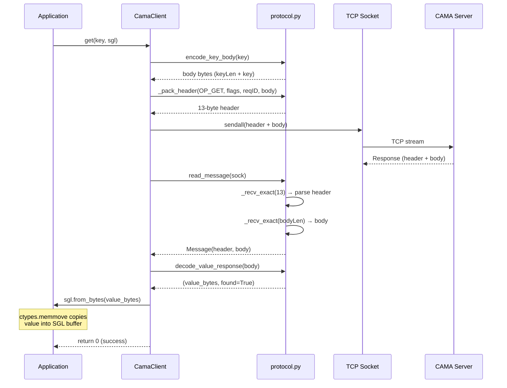
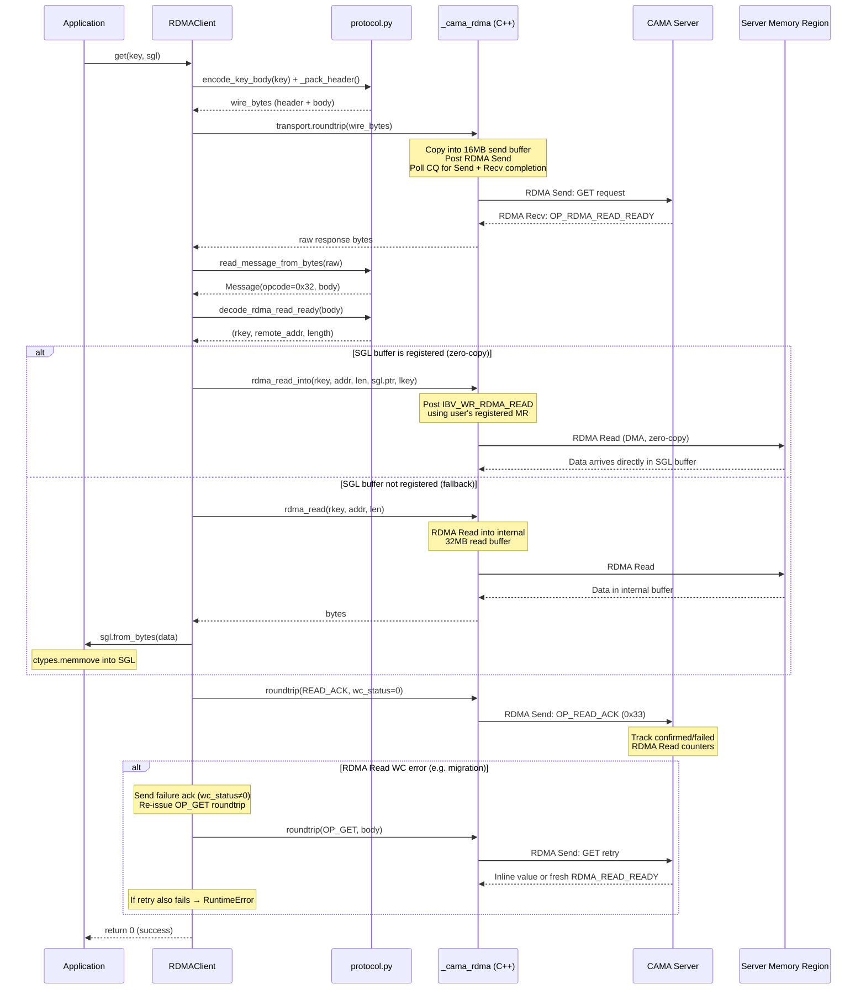
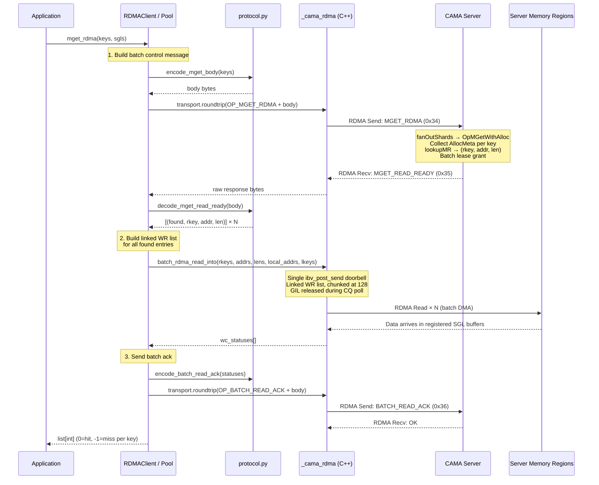

# End-to-End Data Flow

## TCP GET Flow



**Code path:**

1. `CamaClient.get()` -> `protocol.encode_key_body(key.encode())` — packs `keyLen(2) + key`
2. `CamaClient._roundtrip()` -> `protocol.write_message(sock, OP_GET, body)` — sends 13-byte header + body
3. Server processes the GET and responds
4. `protocol.read_message(sock)` — reads 13-byte header, then `bodyLen` bytes of body
5. `protocol.decode_value_response(body)` — parses `found(1) + valueLen(4) + value`
6. `sgl.from_bytes(value)` — `ctypes.memmove(sgl.ptr, data, len(data))` copies into the SGL buffer

**Source:** `cama_client/client.py:113-121`, `cama_client/protocol.py:75-99`

## RDMA GET Flow

RDMA uses a two-phase approach for large values. Control messages (request/response) use RDMA Send/Recv. Large value retrieval uses RDMA Read — a one-sided operation where the client DMA-reads directly from the server's memory without involving the server's CPU.



**Code path (zero-copy):**

1. `RDMAClient.get()` -> serialize request via `protocol._pack_header()` + body
2. `RDMAClient._roundtrip()` -> `transport.roundtrip(wire_bytes)` — C++ copies into send buffer, posts RDMA Send, polls CQ for Send + Recv completion
3. Response parsed via `protocol.read_message_from_bytes()` — no socket, just buffer parse
4. Server responds with `OP_RDMA_READ_READY` (opcode `0x32`) containing `rkey`, `remote_addr`, `length`
5. If SGL has a registered MR: `transport.rdma_read_into(rkey, addr, len, sgl.ptr, lkey)` — posts `IBV_WR_RDMA_READ` targeting the SGL buffer directly (true zero-copy)
6. If SGL is unregistered: `transport.rdma_read(rkey, addr, len)` — reads into internal 32 MB buffer, then `sgl.from_bytes()` copies via `ctypes.memmove`

**Source:** `cama_client/rdma_client.py:140-177`, `cama_client/csrc/rdma_transport.cpp:257-268`

## Batch RDMA GET Flow (mget_rdma)

When the server advertises the `mget_rdma` capability, batch GETs use a single control roundtrip followed by a batched RDMA Read — eliminating the per-key overhead that dominated small-page workloads.



**Key differences from individual GET:**

| Aspect | Individual GET × N | mget_rdma |
|---|---|---|
| TCP control roundtrips | N | 1 |
| RDMA doorbell posts | N | 1 (linked WR list) |
| ReadAck messages | N | 1 (batch) |
| Server shard ops | N channel sends | 1 fanOutShards |
| Python ThreadPoolExecutor | Yes (16 workers) | No (single call) |

**Fallback:** If the server doesn't advertise `mget_rdma` capability (old server), or if shards are migrating (non-ODP mode), the client falls back transparently to the individual GET path.

**Source:** `cama_client/rdma_client.py` (`mget_rdma` method), `cama_client/csrc/rdma_transport.cpp` (`batch_rdma_read_into`)

### Striped mget_rdma (Multi-NIC)

When the pool has multiple connections targeting different server NICs (via `endpoints` parameter), `mget_rdma` automatically stripes across all NICs for N× bandwidth:

```
mget_rdma(keys=[k0, k1, k2, k3, k4, k5], sgls=[...])
  │
  ├─ pool_size == 1?  → _mget_rdma_on_conn (fast path, no threading)
  │
  └─ pool_size > 1?   → _mget_rdma_striped:
       │
       ├─ Phase 1: Partition keys round-robin across connections
       │   conn 0: [k0, k2, k4]
       │   conn 1: [k1, k3, k5]
       │
       ├─ Phase 2: Submit _mget_rdma_on_conn per connection
       │   via ThreadPoolExecutor (parallel, GIL released during RDMA)
       │
       └─ Phase 3: Merge results back to original key order
            results[original_idx] = per_conn_result[local_idx]
```

Each `_mget_rdma_on_conn` runs the full mget_rdma protocol (control roundtrip + batch RDMA Read + ack) on its assigned connection. Per-NIC metrics (`per_nic_reads`, `per_nic_bytes`) are updated atomically under `_counter_lock`.

---

## SET Flow

Both transports handle SET identically at the Python layer:

1. `sgl.to_bytes()` — `ctypes.memmove` copies SGL buffer contents into Python `bytes`
2. `protocol.encode_kv_body(key, value, ttl_ms)` — packs `keyLen(2) + key + valueLen(4) + value [+ ttlMs(8)]`
3. Send via the transport's `_roundtrip()` method (TCP socket write or RDMA Send)

There is **no RDMA Write for SET** — data is always sent inline via the control path. RDMA Read is only used for GET (server -> client) because the server's slab-allocated memory regions are pre-registered and stable, while client-side data may be transient.

**Source:** `cama_client/client.py:106-111`, `cama_client/rdma_client.py:133-138`

## Batch SET Flow (mset with Sub-Batch Chunking)

When the full `mset` payload exceeds the send buffer (16 MB default − 13 B header), entries are automatically partitioned into sub-batches:

```
mset(["k1", "k2", ..., "k500"], [sgl1, sgl2, ..., sgl500])
  │
  ├─ entry_size(k_i) = 2 (keyLen) + len(key) + 4 (valueLen) + len(value)
  │
  ├─ Greedy packing: accumulate entries until next entry would exceed
  │   send_buf_size − HEADER_SIZE (13 bytes)
  │
  ├─ Sub-batch 1: keys[0..247]  → single OP_MSET roundtrip
  ├─ Sub-batch 2: keys[248..499] → single OP_MSET roundtrip
  │
  └─ Edge case: if a single entry exceeds the buffer → individual set() fallback
  │              (client logs WARNING with avg value size and buffer size)
```

Each sub-batch uses a single `OP_MSET` (0x11) wire-protocol roundtrip. The server dispatches batch operations concurrently across shards via `fanOutShards`.

**Degenerate batching detection:** When chunking produces as many batches as there are keys (i.e. ~1 key per roundtrip), the client emits a warning via the `cama_client` logger recommending you increase `send_buf_size`. This commonly happens when values are large relative to the buffer — e.g. 100 × 15 MB values with a 16 MB buffer produces 100 sequential roundtrips instead of ~7 batches.

**Source:** `cama_client/client.py:286-333` (TCP), `cama_client/rdma_client.py:575-621` (RDMA)

---

## "Zero-Copy" Explained

The term "zero-copy" has different meanings depending on the transport and buffer registration state:

| Level | Transport | Buffer State | What Happens | Copies |
|---|---|---|---|---|
| 1 | TCP | Any | `ctypes.memmove` between SGL buffer and Python `bytes`, then socket send/recv | 2+ copies |
| 2 | RDMA | **Unregistered** | RDMA Read into internal 32 MB buffer -> `ctypes.memmove` into SGL | 1 copy (DMA + memcpy) |
| 3 | RDMA | **Registered** | RDMA Read directly into SGL buffer via DMA | 0 copies (true zero-copy) |

To achieve true zero-copy (Level 3):

1. Call `client.reg_memory(ptr, size)` to register the buffer with the RDMA NIC
2. Pass the returned handle as `reg_handle` when creating the SGL
3. On GET, the RDMA NIC reads data directly from the server's memory region into the client's registered buffer — no CPU is involved on either side for the data transfer

**Internal buffer sizes** (from `rdma_transport.cpp`, defaults since v0.31.0):

| Buffer | Default Size | Purpose |
|---|---|---|
| Send buffer | 16 MB | Serialized request messages (determines max mset batch size) |
| Recv buffer | 16 MB | Serialized response messages |
| Read buffer | 32 MB | Fallback for unregistered RDMA Reads |

Send and Recv buffer sizes are configurable via `send_buf_size` / `recv_buf_size` kwargs on `RDMAClient`. See [Configuration](configuration.md#rdma-buffer-sizing) for details. The server's configured buffer sizes are visible in the `info()` response (`rdma_send_buf_mb`, `rdma_recv_buf_mb`).
