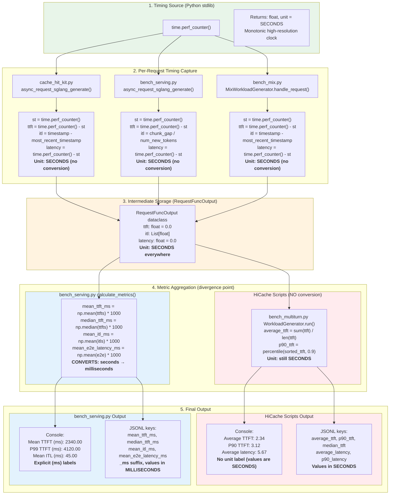
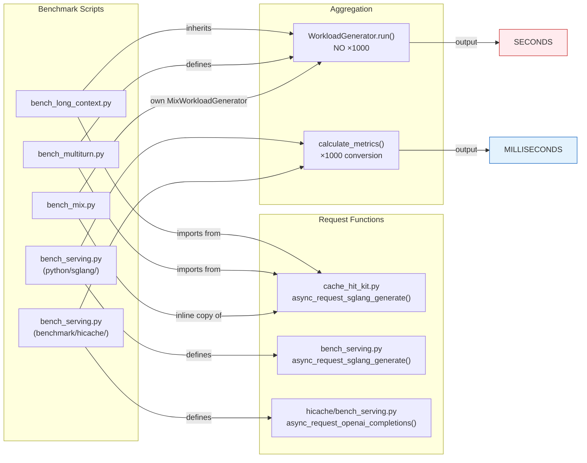
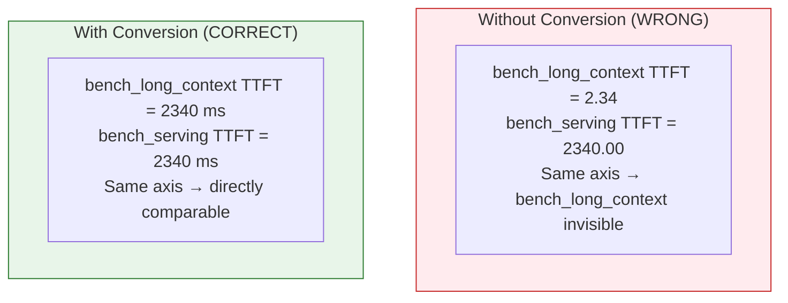
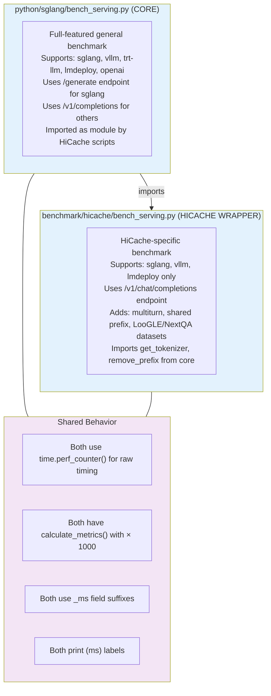

# SGLang Benchmark Time Units: Seconds vs Milliseconds

## The Problem

SGLang ships **two families** of benchmark scripts that report latency metrics
(TTFT, ITL, E2E latency) in **different units** with **no clear labels** in
most output. If you compare numbers across scripts without converting, your
results will be off by **1000x**.

```
bench_long_context.py  →  Average TTFT: 2.34        ← seconds
bench_serving.py       →  Mean TTFT (ms): 2340.00   ← milliseconds
```

This document traces the full data flow from timing capture to final output for
every benchmark script, verified line-by-line against source code.

---

## Quick Reference

| Script | Location | Output Unit | Conversion to ms | Labels unit? |
|--------|----------|-------------|------------------|--------------|
| `bench_long_context.py` | `benchmark/hicache/` | **seconds** | `× 1000` | No |
| `bench_multiturn.py` | `benchmark/hicache/` | **seconds** | `× 1000` | Partial (`s` in per-round only) |
| `bench_mix.py` | `benchmark/hicache/` | **seconds** | `× 1000` | No |
| `bench_serving.py` (core) | `python/sglang/` | **milliseconds** | already ms | Yes (`_ms` suffixes, `(ms)` labels) |
| `bench_serving.py` (hicache) | `benchmark/hicache/` | **milliseconds** | already ms | Yes (`_ms` suffixes, `(ms)` labels) |

---

## End-to-End Data Flow



---

## Detailed Source Code Evidence

### Step 1: `time.perf_counter()` returns seconds

All scripts use the same Python stdlib call. From the
[Python docs](https://docs.python.org/3/library/time.html#time.perf_counter):

> Return the value (in fractional **seconds**) of a performance counter.

### Step 2: Per-request timing capture (both paths identical)

#### `cache_hit_kit.py` (used by bench_long_context, bench_multiturn)

**File:** `python/sglang/test/kits/cache_hit_kit.py:32-78`

```python
st = time.perf_counter()                    # line 32 — start (seconds)
# ...
ttft = time.perf_counter() - st             # line 62 — SECONDS
output.ttft = ttft                          # line 63 — stored as SECONDS
# ...
output.itl.append(timestamp - most_recent_timestamp)  # line 71 — SECONDS
# ...
latency = time.perf_counter() - st          # line 48 — SECONDS
output.latency = latency                    # line 78 — stored as SECONDS
```

No `* 1000` anywhere. Values stay in seconds.

#### `bench_serving.py` core (used by bench_serving)

**File:** `python/sglang/bench_serving.py:626-669`

```python
st = time.perf_counter()                    # line 626 — start (seconds)
# ...
ttft = time.perf_counter() - st             # line 657 — SECONDS
output.ttft = ttft                          # line 658 — stored as SECONDS
# ...
output.itl.extend([adjust_itl] * num_new_tokens)  # line 667 — SECONDS
# ...
latency = time.perf_counter() - st          # line 641 — SECONDS
```

Same pattern, same unit. No conversion.

#### `bench_mix.py` (inline request handler)

**File:** `benchmark/hicache/bench_mix.py:313-359`

```python
st = time.perf_counter()                    # line 314 — start (seconds)
ttft = time.perf_counter() - st             # line 341 — SECONDS
output.ttft = ttft                          # line 342 — stored as SECONDS
output.itl.append(timestamp - most_recent_timestamp)  # line 352 — SECONDS
latency = time.perf_counter() - st          # line 331 — SECONDS
output.latency = latency                    # line 359 — stored as SECONDS
```

### Step 3: Intermediate storage (`RequestFuncOutput`)

**File:** `python/sglang/bench_serving.py:97-107`

```python
@dataclass
class RequestFuncOutput:
    generated_text: str = ""
    success: bool = False
    latency: float = 0.0        # ← no unit documented
    ttft: float = 0.0           # ← no unit documented
    itl: List[float] = field(default_factory=list)  # ← no unit documented
```

The dataclass has **no unit annotation** in its field names or docstring.
The actual unit depends entirely on what was stored (always seconds, from step 2).

### Step 4: Aggregation — WHERE THE DIVERGENCE HAPPENS

#### Path A: HiCache scripts (bench_long_context, bench_multiturn, bench_mix) — NO conversion

**File:** `benchmark/hicache/bench_multiturn.py:386-441`

```python
duration = self.finished_time - self.start_time             # seconds
sorted_ttft = sorted(self.performance_metrics["ttft"])      # list of seconds

performance_data = {
    "summary": {
        "average_ttft": sum(self.performance_metrics["ttft"])
            / len(self.performance_metrics["ttft"]),        # seconds / count = SECONDS
        "p90_ttft": percentile(sorted_ttft, 0.9),           # SECONDS
        "p99_ttft": percentile(sorted_ttft, 0.99),          # SECONDS
        "median_ttft": percentile(sorted_ttft, 0.5),        # SECONDS
        "max_ttft": max_or_zero(sorted_ttft),               # SECONDS
        "average_latency": sum(self.performance_metrics["latency"])
            / len(self.performance_metrics["latency"]),     # SECONDS
        # ... all in SECONDS
    },
}
```

`bench_long_context.py` and `bench_mix.py` inherit or replicate this same
aggregation with no `* 1000` multiplication.

#### Path B: bench_serving.py `calculate_metrics()` — CONVERTS to ms

**File (core):** `python/sglang/bench_serving.py:2233-2252`
**File (hicache):** `benchmark/hicache/bench_serving.py:346-366`

```python
metrics = BenchmarkMetrics(
    mean_ttft_ms=np.mean(ttfts or 0) * 1000,           # seconds × 1000 = ms
    median_ttft_ms=np.median(ttfts or 0) * 1000,        # ms
    std_ttft_ms=np.std(ttfts or 0) * 1000,              # ms
    p99_ttft_ms=np.percentile(ttfts or 0, 99) * 1000,   # ms
    mean_tpot_ms=np.mean(tpots or 0) * 1000,            # ms
    mean_itl_ms=np.mean(itls or 0) * 1000,              # ms
    mean_e2e_latency_ms=np.mean(e2e_latencies) * 1000,  # ms
    # ... every field × 1000
)
```

### Step 5: Output format comparison

#### HiCache scripts console output — unlabeled seconds

**File:** `benchmark/hicache/bench_multiturn.py:473-494`

```
  Average TTFT: 2.34          ← no unit label, value is SECONDS
  P90 TTFT: 3.12              ← no unit label
  P99 TTFT: 4.12              ← no unit label
  Median TTFT: 2.10           ← no unit label
  Max TTFT: 5.67              ← no unit label
  Average latency: 5.67       ← no unit label
  Cache Hit Rate: 0.456789    ← dimensionless ratio
```

Exception: per-round output in bench_multiturn (line 508) appends `s`:
```
  Round 0: Average TTFT = 2.34s, Cache Hit Rate = 0.456789
```

#### bench_serving.py console output — labeled milliseconds

**File (core):** `python/sglang/bench_serving.py:2646-2660`
**File (hicache):** `benchmark/hicache/bench_serving.py:561-576`

```
  Mean TTFT (ms):                          2340.00     ← explicit (ms) label
  Median TTFT (ms):                        2100.00
  P99 TTFT (ms):                           4120.00
  Mean ITL (ms):                           45.00
  Mean E2E Latency (ms):                   5670.00
```

#### JSONL output key comparison

| HiCache JSONL key | bench_serving JSONL key | Unit |
|---|---|---|
| `average_ttft` | `mean_ttft_ms` | seconds vs ms |
| `p90_ttft` | `p90_ttft_ms` | seconds vs ms |
| `p99_ttft` | `p99_ttft_ms` | seconds vs ms |
| `median_ttft` | `median_ttft_ms` | seconds vs ms |
| `average_latency` | `mean_e2e_latency_ms` | seconds vs ms |
| `p90_latency` | `p90_e2e_latency_ms` | seconds vs ms |

The `_ms` suffix in bench_serving keys is the **only** reliable indicator.
HiCache keys have no suffix — they are in seconds.

---

## Which Script Uses Which Request Function



---

## Conversion Recipes

### Reading HiCache JSONL → comparable to bench_serving

```python
import json

with open("performance_metrics.jsonl") as f:
    for line in f:
        data = json.loads(line)
        s = data["summary"]

        # Convert seconds → milliseconds to match bench_serving output
        print(f"Mean TTFT (ms): {s['average_ttft'] * 1000:.2f}")
        print(f"P90 TTFT (ms):  {s['p90_ttft'] * 1000:.2f}")
        print(f"P99 TTFT (ms):  {s['p99_ttft'] * 1000:.2f}")
        print(f"Mean E2E (ms):  {s['average_latency'] * 1000:.2f}")
```

### Sanity check: is a value in seconds or milliseconds?

```
If TTFT value is 0.5 - 30.0  → almost certainly SECONDS (500ms - 30s)
If TTFT value is 50 - 30000  → almost certainly MILLISECONDS
If TTFT value is < 0.001     → something is wrong (sub-microsecond TTFT is impossible)
If TTFT value is > 100000    → something is wrong (>100s TTFT means timeout)
```

For a typical LLM serving scenario with 24K-token context:
- TTFT in seconds: **0.5 to 15** (depending on model size, cache hits)
- TTFT in milliseconds: **500 to 15000**
- ITL in seconds: **0.01 to 0.1**
- ITL in milliseconds: **10 to 100**

---

## Why This Matters

### Scenario: Comparing HiCache benefit across benchmarks

You run `bench_long_context.py` (L3 tier) and get:
```
Average TTFT: 1.23
```

Then you run `bench_serving.py --enable-shared-prefix` and get:
```
Mean TTFT (ms): 4560.00
```

**Without knowing the unit difference**, you might conclude that
bench_long_context is 3700x faster. In reality:
- bench_long_context TTFT = **1230 ms** (1.23 s × 1000)
- bench_serving TTFT = **4560 ms**
- Actual difference = **3.7x** (not 3700x)

### Scenario: Automated dashboards / Grafana

If your pipeline ingests JSONL from both script families and plots them on the
same axis without conversion, the HiCache data points will appear as flat lines
near zero while bench_serving data shows realistic values.



---

## Per-Script Detailed Breakdown

### `bench_long_context.py`

| Aspect | Detail |
|--------|--------|
| **File** | `benchmark/hicache/bench_long_context.py` |
| **Request function** | `cache_hit_kit.async_request_sglang_generate()` |
| **Aggregation** | Inherits `WorkloadGenerator.run()` from `bench_multiturn.py` |
| **Timing source** | `time.perf_counter()` (line 32 of cache_hit_kit.py) |
| **Conversion** | None — raw seconds throughout |
| **Console labels** | No unit label (e.g., `Average TTFT: 2.34`) |
| **JSONL keys** | `average_ttft`, `p90_ttft`, `median_ttft`, `max_ttft`, `average_latency`, `p90_latency`, `median_latency`, `max_latency` |
| **JSONL unit** | Seconds |

### `bench_multiturn.py`

| Aspect | Detail |
|--------|--------|
| **File** | `benchmark/hicache/bench_multiturn.py` |
| **Request function** | `cache_hit_kit.async_request_sglang_generate()` |
| **Aggregation** | `WorkloadGenerator.run()` defined here (lines 386-515) |
| **Timing source** | `time.perf_counter()` (line 32 of cache_hit_kit.py) |
| **Conversion** | None — raw seconds throughout |
| **Console labels** | No unit label in summary; `s` suffix in per-round output only (line 508) |
| **JSONL keys** | Same as bench_long_context |
| **JSONL unit** | Seconds |
| **Extra note** | Per-round metrics (when `--enable-round-barrier`) also in seconds |

### `bench_mix.py`

| Aspect | Detail |
|--------|--------|
| **File** | `benchmark/hicache/bench_mix.py` |
| **Request function** | Inline `handle_request()` (duplicates cache_hit_kit logic, lines 313-359) |
| **Aggregation** | Own `MixWorkloadGenerator.run()` — same no-conversion pattern |
| **Timing source** | `time.perf_counter()` (line 314) |
| **Conversion** | None — raw seconds throughout |
| **Console labels** | No unit label (e.g., `Average TTFT: 2.34`, line 521) |
| **JSONL keys** | `average_ttft`, `p90_ttft`, `median_ttft`, `average_latency`, `p90_latency`, `median_latency` |
| **JSONL unit** | Seconds |

### `bench_serving.py` (core — `python/sglang/`)

| Aspect | Detail |
|--------|--------|
| **File** | `python/sglang/bench_serving.py` |
| **Request function** | `async_request_sglang_generate()` (line 590) |
| **Aggregation** | `calculate_metrics()` — applies `× 1000` (lines 2233-2252) |
| **Timing source** | `time.perf_counter()` (line 626) |
| **Conversion** | `× 1000` on all TTFT, TPOT, ITL, and E2E latency metrics |
| **Console labels** | Explicit `(ms)` label (e.g., `Mean TTFT (ms): 2340.00`) |
| **JSONL keys** | `mean_ttft_ms`, `median_ttft_ms`, `p99_ttft_ms`, `mean_tpot_ms`, `mean_itl_ms`, `mean_e2e_latency_ms`, etc. |
| **JSONL unit** | Milliseconds |
| **Extra metrics** | TPOT (time per output token) — not present in HiCache scripts |

### `bench_serving.py` (hicache — `benchmark/hicache/`)

| Aspect | Detail |
|--------|--------|
| **File** | `benchmark/hicache/bench_serving.py` |
| **Request function** | `async_request_openai_completions()` (line 69) — uses chat completions API |
| **Aggregation** | Own `calculate_metrics()` — applies `× 1000` (lines 346-366) |
| **Timing source** | `time.perf_counter()` (line 121) |
| **Conversion** | `× 1000` on all metrics, identical pattern to core |
| **Console labels** | Explicit `(ms)` label |
| **JSONL keys** | Same `_ms` suffix pattern as core bench_serving |
| **JSONL unit** | Milliseconds |

---

## Relationship Between the Two `bench_serving.py` Files



---

## Complete Metric Field Name Mapping

### HiCache scripts → bench_serving equivalents

| HiCache Field (seconds) | bench_serving Field (ms) | Conversion |
|---|---|---|
| `average_ttft` | `mean_ttft_ms` | `× 1000` |
| `p90_ttft` | `p90_ttft_ms` | `× 1000` |
| `p99_ttft` | `p99_ttft_ms` | `× 1000` |
| `median_ttft` | `median_ttft_ms` | `× 1000` |
| `max_ttft` | *(not in bench_serving)* | — |
| `average_latency` | `mean_e2e_latency_ms` | `× 1000` |
| `p90_latency` | `p90_e2e_latency_ms` | `× 1000` |
| `p99_latency` | `p99_e2e_latency_ms` | `× 1000` |
| `median_latency` | `median_e2e_latency_ms` | `× 1000` |
| `max_latency` | *(not in bench_serving)* | — |
| *(not computed)* | `mean_tpot_ms` | — |
| *(raw list in itl)* | `mean_itl_ms` | `× 1000` |
| `cache_hit_rate` | *(not in bench_serving)* | — |
| `input_token_throughput` | `input_throughput` | same (tok/s) |
| `output_token_throughput` | `output_throughput` | same (tok/s) |
| `throughput` | `request_throughput` | same (req/s) |

### Fields unique to each

**HiCache only:** `cache_hit_rate`, `max_ttft`, `max_latency`, per-round breakdowns

**bench_serving only:** `mean_tpot_ms` (time per output token), `std_*` (standard deviations), `concurrency`, `total_throughput`, retokenized metrics

---

## Source Files Referenced

All paths relative to the SGLang repository root:

| File | Key Lines | Role |
|------|-----------|------|
| `python/sglang/test/kits/cache_hit_kit.py` | 32, 48, 62, 71, 78 | Request-level timing (seconds) for HiCache benchmarks |
| `python/sglang/bench_serving.py` | 97-107, 626-669, 966-1000, 2233-2252, 2646-2660 | Core bench_serving: RequestFuncOutput, request timing, BenchmarkMetrics, `×1000`, print |
| `benchmark/hicache/bench_long_context.py` | 55-62, 76-81, 89-101 | Long context benchmark — stores raw seconds, inherits WorkloadGenerator |
| `benchmark/hicache/bench_multiturn.py` | 243-249, 323-327, 386-441, 462-515 | Multi-turn benchmark — defines WorkloadGenerator, raw seconds aggregation, print |
| `benchmark/hicache/bench_mix.py` | 313-359, 411-412, 464-465, 491-528 | Mixed workload — inline timing, raw seconds aggregation, print |
| `benchmark/hicache/bench_serving.py` | 56-65, 120-168, 228-258, 334-366, 551-577 | HiCache bench_serving — own RequestFuncOutput, `×1000` conversion, print |
