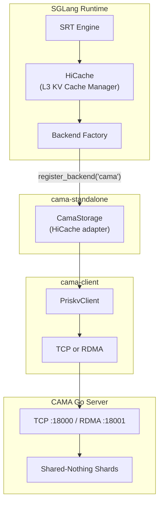

# SGLang Integration

## How CAMA Connects to SGLang

CAMA integrates with SGLang through the **HiCache storage backend** interface — the same pluggable L3 (remote/host-memory) KV cache layer that `mooncake_store` uses. A storage adapter wraps `PriskvClient` and implements the HiCache API contract.



The adapter (`CamaStorage`) wraps `PriskvClient` and translates HiCache operations into CAMA protocol calls:

| HiCache Method | CAMA Operations |
|---|---|
| `put(keys, values)` | `mset(keys, sgls)` — store KV cache pages |
| `get(keys)` | `lease(keys)` then `mget(keys, sgls)` — retrieve with eviction protection |
| `batch_exists(keys)` | `mexists(keys)` -> count consecutive hits from start |
| `remove(keys)` | `mdel(keys)` — delete KV cache pages |

## Launch Sequence

**Step 1 — Start the CAMA server:**

```bash
./cama-server server -config cama.toml
```

**Step 2 — Install the client library:**

```bash
cd cama-client && pip install -e .
```

**Step 3 — Launch SGLang with the CAMA backend:**

```bash
python -m sglang.launch_server \
    --model meta-llama/Llama-3.1-70B-Instruct \
    --tp 8 \
    --hicache-storage-backend cama \
    --trust-remote-code
```

## SGLang Environment Variables

| Variable | Default | Description |
|---|---|---|
| `SGLANG_CAMA_CONFIG_PATH` | — | Path to CAMA config file |
| `SGLANG_TURBOKV_HOST` | `127.0.0.1` | CAMA server host |
| `SGLANG_TURBOKV_PORT` | `18000` | CAMA server port |
| `SGLANG_TURBOKV_LEASE_MS` | `10000` | Lease duration for GET operations (ms) |
| `SGLANG_TURBOKV_USE_RDMA` | `0` | `1` to enable RDMA transport |

## Data Flow Summary

When SGLang processes a request with HiCache enabled:

1. **Prefix check:** HiCache calls `batch_exists(keys)` -> adapter calls `mexists()` -> returns count of consecutive cache hits
2. **Restore cached blocks:** HiCache calls `get(keys)` -> adapter grants leases (eviction protection), then calls `mget()` to retrieve KV cache pages into registered SGL buffers
3. **Store new blocks:** After computing new tokens, HiCache calls `put(keys, values)` -> adapter calls `mset()` to store the newly computed KV cache pages
