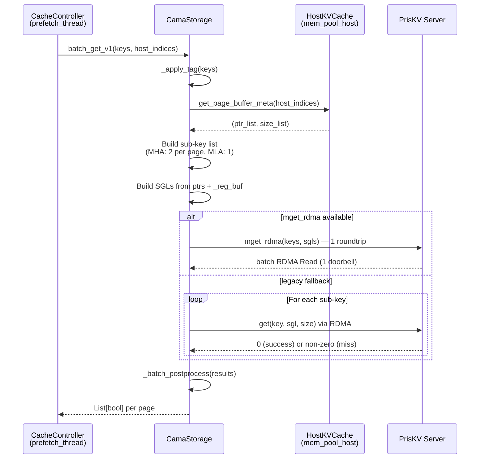

# CAMA Storage Connector — Overview & Architecture

> Executive overview for engineers encountering CAMA for the first time.

---

## What is CAMA

CAMA (Cache Adapter for Memory Access) is a direct PrisKV connector for SGLang's HiCache hierarchical KV cache system. It serves as an L3 (cold/distributed) storage backend that transfers KV cache pages between SGLang's host memory pool and PrisKV using zero-copy RDMA, bypassing any intermediate Python-level data copies. CAMA occupies the same architectural slot as Mooncake, AIBrix, nixl, and other `HiCacheStorage` implementations, but is purpose-built for direct PrisKV integration with minimal indirection.

Within HiCache's three-tier hierarchy, CAMA provides the L3 layer:

- **L1 (GPU VRAM)** — Hot KV cache, actively used during inference
- **L2 (CPU Host DRAM)** — Warm KV cache, evicted from GPU but still local
- **L3 (Distributed Storage via CAMA/PrisKV)** — Cold KV cache, shared across instances, persisted over RDMA

---

## Why CAMA Exists

The previous `AibrixKVCacheStorage` connector suffered from 5 critical architectural problems that made it unsuitable for production workloads:

1. **Triple memcpy** — Every read/write went through `BaseKVCacheManager` → `handle.to_tensors()` → `tensor.copy_()`, adding three Python-level memory copies per page. For a 70B model with 80 layers, each page is ~40 MB — this overhead is measurable.

2. **No MLA support** — Raised `NotImplementedError` for Multi-Head Latent Attention models (DeepSeek-V3, Qwen-MLA), blocking an entire model family.

3. **No pipeline parallelism** — Ignored `pp_rank`/`pp_size`, causing key collisions and data corruption when `pp_size > 1`.

4. **No write deduplication** — Always wrote without checking existence, wasting RDMA bandwidth on pages that already exist in storage.

5. **No V1 API** — `batch_get_v1`/`batch_set_v1` were not implemented, forcing SGLang to fall back to the legacy `_generic_page_get` path that copies data through Python tensors — completely defeating the purpose of RDMA.

CAMA solves all five by talking directly to `PriskvClient` (no `aibrix_kvcache` library), adopting Mooncake's proven patterns for zero-copy RDMA, key naming, metrics, and configuration.

---

## Architecture Diagrams

### HiCache Three-Tier with CAMA as L3

```
┌──────────────────────────────────────────────────────────────┐
│                    HiCache Three-Tier                         │
│                                                               │
│  ┌─────────────┐         ┌──────────────────┐                │
│  │ L1: GPU VRAM │──evict─▶│ L2: Host DRAM    │               │
│  │ (Hot cache)  │◀─load──│ (Warm cache)      │               │
│  └─────────────┘         └────────┬─────────┘                │
│                                    │                          │
│                        write-through / write-back             │
│                                    │                          │
│                                    ▼                          │
│  ┌─────────────────────────────────────────────────────────┐ │
│  │                  L3: Distributed Storage                  │ │
│  │                  (Cold cache — shared across instances)   │ │
│  │                                                           │ │
│  │   ┌──────────┐  ┌──────────┐  ┌──────────┐  ┌────────┐ │ │
│  │   │ CAMA     │  │ Mooncake │  │ AIBrix   │  │ Others │ │ │
│  │   │ (PrisKV) │  │          │  │ (PrisKV) │  │ (nixl, │ │ │
│  │   │ Direct   │  │ Transfer │  │ via      │  │  hf3fs,│ │ │
│  │   │ RDMA     │  │ Engine   │  │ Manager) │  │  file) │ │ │
│  │   └──────────┘  └──────────┘  └──────────┘  └────────┘ │ │
│  └─────────────────────────────────────────────────────────┘ │
└──────────────────────────────────────────────────────────────┘
```

### Side-by-Side Stack Comparison: CAMA vs AIBrix vs Mooncake

```
┌──────────────────┐  ┌──────────────────┐  ┌──────────────────┐
│      CAMA        │  │     AIBRIX       │  │    MOONCAKE      │
│   (3 layers)     │  │   (6 layers)     │  │   (5 layers)     │
│                  │  │                  │  │                  │
│  HiCacheStorage  │  │  HiCacheStorage  │  │  HiCacheStorage  │
│       │          │  │       │          │  │       │          │
│       ▼          │  │       ▼          │  │       ▼          │
│  CamaStorage     │  │  AibrixKVCache   │  │  MooncakeStore   │
│  (cama_storage   │  │  Storage         │  │  (mooncake_      │
│   .py, 1238 ln)  │  │       │          │  │   store.py)      │
│       │          │  │       ▼          │  │       │          │
│       ▼          │  │  BaseKVCache     │  │       ▼          │
│  PriskvClient    │  │  Manager         │  │  MooncakeDist    │
│  (priskv pkg)    │  │       │          │  │  Store           │
│       │          │  │       ▼          │  │       │     │    │
│       ▼          │  │  PrisKV          │  │       ▼     ▼    │
│  PrisKV Server   │  │  Connector       │  │  Master  Transfer│
│  (RDMA)          │  │       │          │  │  (gRPC)  Engine  │
│                  │  │       ▼          │  │       │   (RDMA) │
│                  │  │  PrisKV Server   │  │       ▼     ▼    │
│                  │  │  (RDMA)          │  │  Metadata Remote │
│                  │  │                  │  │  +Replicas Segs  │
└──────────────────┘  └──────────────────┘  └──────────────────┘
  Direct, 3 layers     Indirect, 6 layers    Feature-rich, 5 layers
  Zero-copy RDMA       3x memcpy in Python   Zero-copy RDMA
```

### batch_get_v1 Call Sequence



---

## Component Inventory

Every file in the CAMA module and its purpose:

| File | Path | Lines | Purpose |
|------|------|-------|---------|
| `__init__.py` | `sglang/srt/mem_cache/storage/cama/` | 0 | Package marker |
| `cama_storage.py` | `sglang/srt/mem_cache/storage/cama/` | 1,238 | Core connector: config, connection, RDMA registration, key naming, zero-copy read/write, dedup, metrics, phased init logging |
| `preflight.py` | `sglang/srt/mem_cache/storage/cama/` | 89 | Fail-fast connectivity check before model loading |
| `profiling.py` | `sglang/srt/mem_cache/storage/cama/` | 124 | Conditional Pyroscope + NVTX profiling (zero-cost when disabled) |
| `test_cama_storage.py` | `sglang/srt/mem_cache/storage/cama/` | 691 | Progressive test suite: layers 0-7 covering server alive, RDMA, batch ops, config, page round-trip, dedup, metrics |

---

## Integration Points

CAMA integrates with SGLang through 5 patched files:

### 1. `environ.py` (lines 284-295)

Defines 11 environment variables for CAMA configuration and profiling:

```python
# Core configuration
SGLANG_CAMA_CONFIG_PATH = EnvStr(None)
SGLANG_CAMA_REMOTE_ADDR = EnvStr("127.0.0.1")
SGLANG_CAMA_REMOTE_PORT = EnvInt(6379)
SGLANG_CAMA_PASSWORD = EnvStr("")
SGLANG_CAMA_USE_MPUT_MGET = EnvBool(True)
SGLANG_CAMA_CHECK_SERVER = EnvBool(False)
SGLANG_CAMA_OP_TIMEOUT_S = EnvFloat(10.0)
SGLANG_CAMA_IO_WORKERS = EnvInt(16)

# Profiling
SGLANG_CAMA_PROFILING_ENABLED = EnvBool(False)
SGLANG_CAMA_PROFILING_SERVER_ADDRESS = EnvStr("http://0.0.0.0:4040")
SGLANG_CAMA_PROFILING_SERVICE_NAME = EnvStr("cama-connector")
```

### 2. `server_args.py`

Adds `"cama"` to the `--hicache-storage-backend` CLI choices and calls `check_cama_preflight()` during argument validation to fail fast before model loading.

### 3. `backend_factory.py` (lines 186-232)

Registers CAMA in the storage backend factory:

```python
# Line 186-188: Creation branch
elif backend_name == "cama":
    backend = backend_class(storage_config, mem_pool_host)
    return backend

# Lines 228-232: Registration
StorageBackendFactory.register_backend(
    "cama",
    "sglang.srt.mem_cache.storage.cama.cama_storage",
    "CamaStorage",
)
```

### 4. `cache_controller.py` (line 329)

Adds `"cama"` to the zero-copy backend list — **the most critical single-line change**:

```python
if (self.storage_backend_type in ["hf3fs", "mooncake", "eic", "cama"]) or (
    ...
):
    self.page_get_func = self._page_get_zero_copy
    self.page_set_func = self._page_set_zero_copy
```

Without this, SGLang falls back to `_generic_page_get`/`_generic_page_set` which copies data through Python tensors, negating all RDMA zero-copy benefits.

### 5. `metrics/collector.py` — Storage metrics logging

Adds debug logging for storage metrics when prefetch/backup data is present, enabling observability of CAMA storage operations through SGLang's metrics pipeline.

---

## CAMA vs Mooncake vs AIBrix Comparison

| Feature | CAMA (PrisKV Direct) | Mooncake | AIBrix (PrisKV via Manager) |
|---------|---------------------|----------|---------------------------|
| **Transport** | RDMA via PrisKV protocol | RDMA via Mooncake Transfer Engine | RDMA via PrisKV protocol |
| **Zero-copy** | Yes (SGL → registered host buffer) | Yes (Transfer Engine → registered segments) | No (3x memcpy through Python tensors) |
| **MLA support** | Yes (auto-detected, 1 sub-key/page) | Yes | No (raises NotImplementedError) |
| **Pipeline parallel** | Yes (pp_rank in key suffix) | Yes (pp_rank in key suffix) | No (ignores pp_rank) |
| **Write dedup** | Yes (exists check before write) | Yes (exists check before write) | No (always writes) |
| **Replication** | None (single-copy per key) | Multi-replica with lease protection | None |
| **Multi-NIC** | Yes (nic_striping: pool-level striping across all NICs via mget_rdma, N× bandwidth) | Yes (stripes across all NICs) | No (single connection) |
| **Topology awareness** | None | Master-coordinated placement | CRC16 client-side sharding |
| **Batch ops** | Native batch: `mget_rdma` (1 roundtrip + batch RDMA Read), `mset`, `mexists` | Native batch via Transfer Engine | mput/mget via PrisKV |
| **V1 API** | Yes | Yes | No |
| **Configuration** | Triple-source (extra_config, file, env) | Triple-source | Limited |
| **Health check** | Yes (poll with 600s timeout) | Yes (HTTP + RDMA) | None |
| **Warmup** | Full RDMA round-trip validation | Connection-level | None |
| **Profiling** | Pyroscope + NVTX | Pyroscope | Pyroscope |
| **Lines of code** | 1,238 | ~707 | ~158 |
| **Dependencies** | `priskv` only | `mooncake` library + Master service | `aibrix_kvcache` library |
| **Operational complexity** | Low (just PrisKV server) | High (Master + etcd + TE) | Medium (aibrix lib + PrisKV) |

---

## Known Limitations

1. **~~pybind11 batch operations bug~~** *(resolved)* — CAMA now implements native batch wire-protocol ops that bypass PrisKV's pybind11 wrappers entirely. For reads, `mget_rdma` sends all keys in one control roundtrip, posts all RDMA Reads with a single doorbell, and sends one batch ack — making performance bandwidth-limited and page-size-independent. For writes, `mset` uses a single `OP_MSET` roundtrip. For existence checks, `mexists` uses `OP_MTEST`.

2. **No replication** — PrisKV stores a single copy of each key. If the PrisKV server goes down, cached data is lost and must be recomputed. Mooncake provides multi-replica protection.

3. **Server must advertise RDMA endpoints** — Multi-NIC striping is automatic when the PrisKV server advertises multiple RDMA endpoints via `rdma_endpoints()` and `nic_striping=True` (default). The pool creates one connection per NIC and stripes `mget_rdma` across all NICs in parallel. If the server does not advertise endpoints (old server version or TCP-only), CAMA falls back to the original single connection.

---

## Related Documents

- [02_ARCHITECTURE_DEEP_DIVE.md](02_ARCHITECTURE_DEEP_DIVE.md) — Code internals, data flow, RDMA registration
- [03_CONFIGURATION_REFERENCE.md](03_CONFIGURATION_REFERENCE.md) — Complete parameter reference
- [04_DEPLOYMENT_GUIDE.md](04_DEPLOYMENT_GUIDE.md) — Step-by-step deployment recipes
- [05_TROUBLESHOOTING.md](05_TROUBLESHOOTING.md) — Error reference, debugging, known issues
- [06_DESIGN_DECISIONS.md](06_DESIGN_DECISIONS.md) — Rationale and trade-offs
- `mooncake_vs_aibrix_priskv_l3_comparison.md` (reference archive) — Full L3 backend comparison
- `cama-connector-plan.md` (reference archive) — Original design plan
