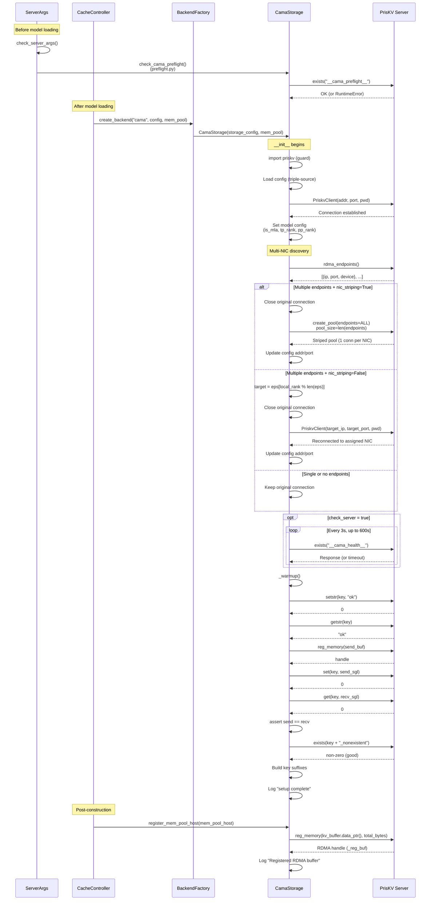
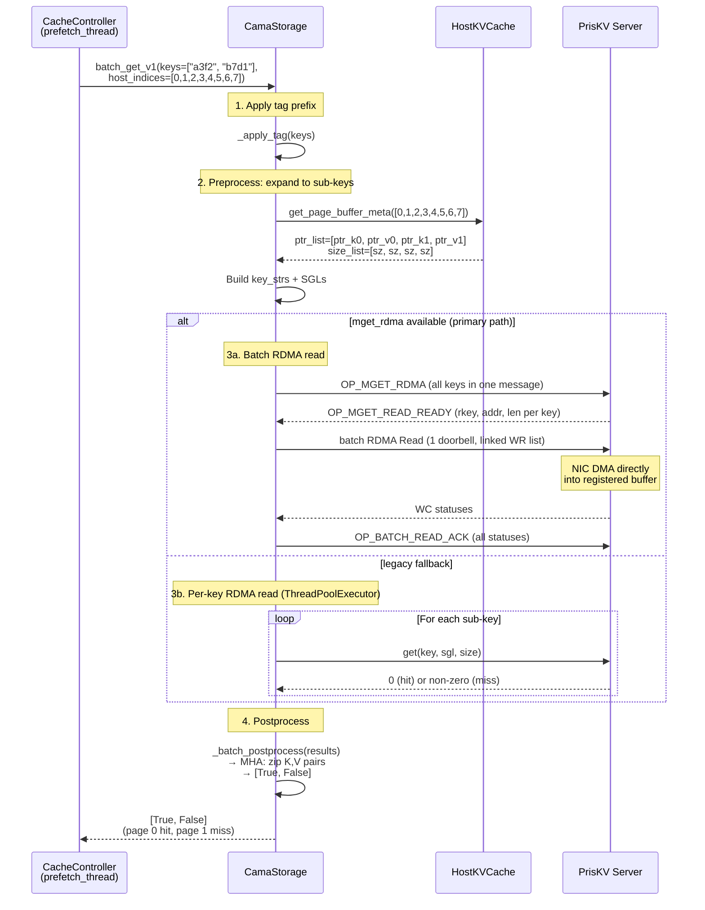
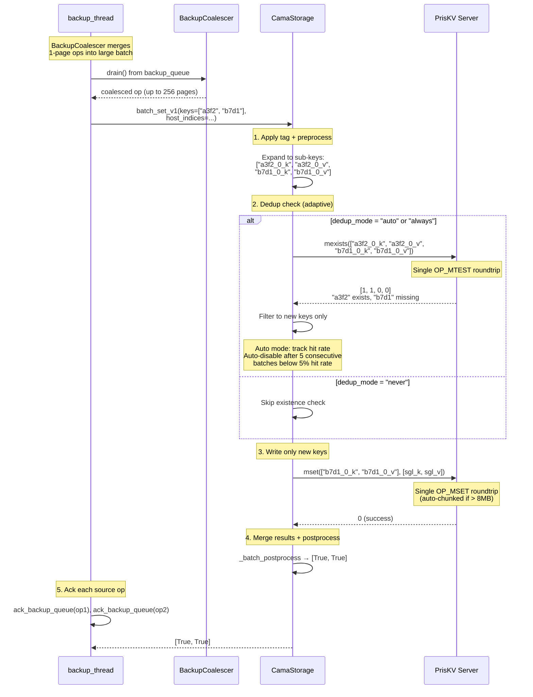

# CAMA Architecture Deep Dive

> Internals, data flow, and code organization for engineers modifying CAMA or debugging data path issues.

---

## Code Organization

`cama_storage.py` (~2,500 lines) is organized into labeled sections:

| Section | Lines | Content |
|---------|-------|---------|
| A: Configuration | 30-107 | `CamaConfig` dataclass with three static constructors (extra_config, file, env), including reconnect params and `nic_striping` |
| B: `__init__` | 111-330 | Import guard, config loading, connection (with ReconnectConfig), model config, Multi-NIC discovery with NIC striping (pool-level endpoint distribution), pre-warm adoption, health check, warmup, key suffixes, extra tag, metrics init, RDMA handle placeholder, thread pool |
| Health check & warmup | 332-408 | `_check_server()` polling loop, `_warmup()` with 6-phase validation (string, RDMA register, SGL, batch) |
| C: Buffer registration | 410-442 | `register_mem_pool_host()` — layout assertion, RDMA `reg_memory`, `gb_per_page`, eager `model_page_bytes` hint to server |
| D: Key naming | 444-477 | `_get_mha_buffer_meta`, `_get_mla_buffer_meta`, `_batch_preprocess`, `_apply_tag` |
| E: Transfer primitives | 479-576 | `_put_batch_zero_copy` (native `mset`), `_get_batch_zero_copy` (native `mget_rdma`), `_batch_exist` (native `mexists`) — SGL construction + batch PrisKV calls; fallback to thread pool |
| F: Postprocessing | 578-595 | `_batch_postprocess` — converts per-sub-key ints to per-page booleans |
| G: V1 API | 597-699 | `batch_get_v1`, `batch_set_v1` (with adaptive dedup) — the primary interface SGLang calls |
| H: Legacy API | 701-815 | `get`, `set`, `batch_get`, `batch_set` — old interface for base class compatibility |
| I: Existence & cleanup | 817-930 | `exists`, `batch_exists`, `close`, `clear`, `get_stats`, `report_stats` (phase-level latency + Prometheus metrics) |

Supporting modules:

| Module | Lines | Purpose |
|--------|-------|---------|
| `warmup.py` | ~370 | Data-driven warmup state machine (INIT → COLD → STEADY), server readiness poller |
| `prewarm.py` | ~520 | 3-phase background pre-warming (connect → discover → multi-NIC pool), PrewarmRegistry |
| `codec.py` | ~380 | Compression codec framework (Int8, ShuffleZstd, ChainCodec), per-value headers |
| `preflight.py` | ~150 | Fail-fast connectivity check, prewarm daemon start, env-var signaling for mp.spawn |
| `profiling.py` | ~120 | Conditional Pyroscope + NVTX profiling (zero-cost when disabled) |

---

## Initialization Sequence

Step-by-step from `StorageBackendFactory.create_backend("cama")` through "setup complete":



### Multi-NIC Endpoint Discovery and NIC Striping

After model config is set (providing `local_rank`), CAMA queries the PrisKV server for available RDMA endpoints:

1. **Discovery** — `self.conn.rdma_endpoints()` returns a list of `{"ip", "port", "device"}` dicts, one per RDMA NIC on the server.
2. **NIC striping (default)** — When `nic_striping=True` (default) and multiple endpoints are found, CAMA passes ALL endpoints to `create_pool()`. The pool creates one connection per NIC (`pool_size` auto-set to `len(endpoints)`) and stripes `mget_rdma` across all NICs in parallel for N× read bandwidth. The original connection is closed and replaced with the striped pool.
3. **Legacy single-NIC assignment** — When `nic_striping=False`, each rank picks one NIC via `endpoints[local_rank % len(endpoints)]` (round-robin) and reconnects to it. This is the pre-striping behavior.
4. **Graceful fallback** — If the server returns a single endpoint, no reconnect is needed. If it returns no endpoints (TCP mode or old server), CAMA continues on the original connection. If `rdma_endpoints()` raises an exception, CAMA logs a warning and keeps the original connection.

This ensures warmup and health check validate the **final** (potentially reconnected) connection, not the initial one.

**Configuration:** `nic_striping` is controlled via `SGLANG_CAMA_NIC_STRIPING` env var, JSON config, or extra_config. Default is `True`.

---

## RDMA Buffer Registration

### What `register_mem_pool_host` Does

When SGLang's `CacheController` calls `register_mem_pool_host(mem_pool_host)`, CAMA performs a single O(1) registration of the entire host KV buffer:

```python
# cama_storage.py lines 412-442
def register_mem_pool_host(self, mem_pool_host):
    super().register_mem_pool_host(mem_pool_host)           # stores self.mem_pool_host
    assert layout in ["page_first", "page_first_direct", "page_head"]

    buffer = self.mem_pool_host.kv_buffer                    # the contiguous host tensor
    buffer_ptr = buffer.data_ptr()                           # absolute memory address
    buffer_size = buffer.numel() * buffer.element_size()     # total bytes
    self._reg_buf = self.conn.reg_memory(buffer_ptr, buffer_size)  # RDMA registration
```

The returned `_reg_buf` handle is used in every subsequent SGL construction. PrisKV's RDMA engine verifies that each SGL's `iova` falls within the registered `[buffer_ptr, buffer_ptr + buffer_size)` range.

### Buffer Layout and Sub-Region SGLs

The host KV buffer is one contiguous tensor. `get_page_buffer_meta(indices)` returns absolute pointers into sub-regions of this buffer:

```
┌──────────────────────────────────────────────────────────────────┐
│              Registered RDMA Buffer (single reg_memory call)     │
│  _reg_buf covers entire range: [data_ptr, data_ptr + total_size) │
│                                                                   │
│  ┌──────────┐┌──────────┐┌──────────┐┌──────────┐   ┌─────────┐│
│  │  Page 0   ││  Page 1   ││  Page 2   ││  Page 3   │...│ Page N  ││
│  │           ││           ││           ││           │   │         ││
│  │ K region  ││ K region  ││ K region  ││ K region  │   │ K region││
│  │ ptr_k ────┤│ ptr_k ────┤│           ││           │   │         ││
│  └──────────┘└──────────┘└──────────┘└──────────┘   └─────────┘│
│  ┌──────────┐┌──────────┐┌──────────┐┌──────────┐   ┌─────────┐│
│  │  Page 0   ││  Page 1   ││  Page 2   ││  Page 3   │...│ Page N  ││
│  │           ││           ││           ││           │   │         ││
│  │ V region  ││ V region  ││ V region  ││ V region  │   │ V region││
│  │ ptr_v ────┤│ ptr_v ────┤│           ││           │   │         ││
│  └──────────┘└──────────┘└──────────┘└──────────┘   └─────────┘│
└──────────────────────────────────────────────────────────────────┘
  kv_buffer[0] = K half                kv_buffer[1] = V half
  (page_first layout: [2, total_tokens, layer_num, head_num, head_dim])

  For each page, an SGL is constructed:
    priskv.SGL(ptr_k, page_k_size, _reg_buf)   ← points into K half
    priskv.SGL(ptr_v, page_v_size, _reg_buf)   ← points into V half

  For MLA models: only K region (fused KV), 1 SGL per page
```

### Layout Assertions

CAMA requires `page_first`, `page_first_direct`, or `page_head` layout because these organize data contiguously by page, enabling a single buffer registration. Other layouts may scatter page data non-contiguously.

The assertion at line 296-300 catches incompatible layouts before any RDMA operations.

---

## Key Naming Scheme

Every KV cache page is identified by a SHA256 hash of its token sequence. CAMA appends suffixes to isolate data across TP ranks, PP ranks, and K/V components.

### MHA Key Format (Multi-Head Attention)

Each page produces **2 sub-keys** (K and V):

| PP Disabled (pp_size=1) | PP Enabled (pp_size>1) |
|------------------------|----------------------|
| `{tag}_{hash}_{tp_rank}_k` | `{tag}_{hash}_{tp_rank}_{pp_rank}_k` |
| `{tag}_{hash}_{tp_rank}_v` | `{tag}_{hash}_{tp_rank}_{pp_rank}_v` |

### MLA Key Format (Multi-Head Latent Attention)

Each page produces **1 sub-key** (fused KV):

| PP Disabled (pp_size=1) | PP Enabled (pp_size>1) |
|------------------------|----------------------|
| `{tag}_{hash}__k` | `{tag}_{hash}_{pp_rank}_k` |

(Note: when PP is disabled and no extra_backend_tag, MLA suffix is empty, producing `{hash}__k` — the double underscore is a known cosmetic artifact.)

### Complete Key Examples

| Model Type | TP | PP | extra_tag | Hash | Full Key(s) |
|-----------|----|----|-----------|------|-------------|
| MHA | 0 | - | None | `a3f2c8` | `a3f2c8_0_k`, `a3f2c8_0_v` |
| MHA | 2 | - | None | `a3f2c8` | `a3f2c8_2_k`, `a3f2c8_2_v` |
| MHA | 1 | 0 | None | `a3f2c8` | `a3f2c8_1_0_k`, `a3f2c8_1_0_v` |
| MHA | 0 | 1 | `prod` | `a3f2c8` | `prod_a3f2c8_0_1_k`, `prod_a3f2c8_0_1_v` |
| MLA | 0 | - | None | `a3f2c8` | `a3f2c8__k` |
| MLA | 0 | 1 | None | `a3f2c8` | `a3f2c8_1_k` |
| MLA | 0 | 0 | `dev` | `a3f2c8` | `dev_a3f2c8_0_k` |

**Source:** `cama_storage.py` lines 184-197 (suffix construction), lines 328-357 (key building)

---

## Threading Topology (Per Rank)

Each GPU rank runs one `HiCacheController` (created via `HiRadixCache.__init__`), which owns one `CamaStorage` instance. All thread pools and connections are **per-rank** — there is no sharing across GPU ranks.

### Full Thread Fan-Out

```
GPU Rank N
 └─ HiCacheController (tp_rank=N)
     │
     ├─ prefetch_thread  (1 daemon thread)
     │   Pops operations from prefetch_queue, runs batch_exists RPCs
     │   (hit-query), optionally all_reduce across TP ranks, then
     │   dispatches I/O to the executor.
     │   │
     │   └─ ThreadPoolExecutor "prefetch_io"  (prefetch_io_workers threads, default 2)
     │       Each worker runs _prefetch_io_task(operation):
     │       │
     │       └─ _page_transfer → batch_get_v1 → _get_batch_zero_copy
     │           │
     │           ├─ [primary] conn.mget_rdma(keys, sgls)
     │           │   1 control roundtrip + batch RDMA Read (1 doorbell)
     │           │   No ThreadPoolExecutor needed.
     │           │
     │           └─ [fallback] CamaStorage._io_pool  (io_workers threads, default 16)
     │               Per-key RDMA reads via conn.get(key, sgl, size)
     │               Used when mget_rdma unavailable or on error.
     │
     ├─ backup_thread  (1 daemon thread)
     │   │
     │   ├─ BackupCoalescer  (drains backup_queue, merges 1-page ops into large batches)
     │   │   Phase 1: blocking get(timeout=1s) for first op
     │   │   Phase 2: timed drain until max_pages or coalesce_deadline_ms (default 20ms)
     │   │   Merge: torch.cat host_indices, concatenate hash_value + token_ids
     │   │   Result: one large StorageOperation (up to storage_batch_size pages)
     │   │
     │   └─ ThreadPoolExecutor "backup_io"  (backup_io_workers threads, default 2)
     │       Each worker runs _backup_io_task(coalesced_operation):
     │       │
     │       ├─ _jitter_sleep()  (random [0, backup_jitter_ms] ms between sub-batches)
     │       │   Spreads TP rank submissions to reduce thundering herd.
     │       │   First sub-batch is never delayed.
     │       │
     │       └─ batch_set_v1 → _batch_exist (dedup) + _put_batch_zero_copy
     │           │
     │           ├─ [primary] conn.mset(keys, sgls)  ← native batch wire opcode
     │           │   Auto-chunks if payload > send_buf_size (16 MB default)
     │           │
     │           └─ [fallback] CamaStorage._io_pool  (io_workers threads, default 16)
     │               Per-key RDMA writes via conn.set(key, sgl)
     │
     └─ CamaStorage (1 instance)
         ├─ self.conn         — PriskvClient pool (RDMA/TCP, pool_size connections)
         │                      With nic_striping: pool_size=len(endpoints),
         │                      _stripe_executor for parallel mget_rdma across NICs
         ├─ self._io_pool     — ThreadPoolExecutor, io_workers threads
         ├─ self._reg_buf     — single RDMA buffer registration handle
         └─ reconnect         — ReconnectConfig (exponential backoff, MR re-registration)
```

### Multi-Level Executor Design

There are **three thread pools** with different purposes:

| Pool | Location | Default | Controls | Shared? |
|------|----------|---------|----------|---------|
| `prefetch_io` | `cache_controller.py` `prefetch_thread_func` | 2 workers | # of prefetch **requests** doing I/O concurrently | No — exclusive to prefetch path |
| `backup_io` | `cache_controller.py` `backup_thread_func` | 2 workers | # of coalesced backup **operations** executing concurrently | No — exclusive to backup path |
| `_io_pool` | `cama_storage.py` `CamaStorage.__init__` | 16 workers | # of individual **keys** fetched/written concurrently (fallback path) | Yes — shared between prefetch and backup |

With `mget_rdma` (primary read path), `_io_pool` is bypassed for reads — a single `mget_rdma` call replaces all N concurrent `get()` futures. With native `mset` (primary write path), `_io_pool` is also bypassed — a single `mset` call handles all keys. The pool is used only as a fallback when native batch ops are unavailable.

### Why `prefetch_io_workers` Defaults to 2

The `prefetch_thread` alternates between two phases:

1. **Hit-query** — `_storage_hit_query` calls `batch_exists` (cheap exists RPCs) to determine how many pages are cached.
2. **I/O dispatch** — submits `_prefetch_io_task` to the executor, which calls `batch_get_v1` (expensive RDMA bulk reads).

With `prefetch_io_workers=1`, these phases are serial — the thread blocks on page transfer before it can query the next request. With `prefetch_io_workers=2`, the next hit-query overlaps with the previous transfer, roughly doubling throughput when the prefetch queue has multiple pending requests.

Higher values (3+) yield diminishing returns because:
- All workers share one RDMA connection and one `_io_pool` — more workers mostly adds contention
- The backup thread also shares `_io_pool`; too many prefetch workers can starve backup I/O
- RDMA NIC bandwidth saturates before CPU thread count becomes the bottleneck

### Why `io_workers` Defaults to 16

Individual PrisKV key operations (get/set/exists) take O(microseconds) for the RPC + O(milliseconds) for RDMA data transfer. With batch sizes of 50–200 sub-keys, 16 workers hide per-key latency effectively (16 keys in flight × ms per key ≈ full pipeline). Beyond ~16, the single RDMA connection becomes the bottleneck and per-op latency increases from transport contention.

**Note:** With `mget_rdma` enabled (default when server supports it), the `_io_pool` is not used for reads at all — a single `mget_rdma` call handles all keys in one control roundtrip + batch RDMA Read. With NIC striping (default), `mget_rdma` stripes keys across multiple server NICs in parallel via the pool's `_stripe_executor`, multiplying read bandwidth. The `io_workers` setting only affects write operations and the legacy GET fallback path.

### Thread Count Summary Per Rank

| Component | Threads | Purpose |
|-----------|---------|---------|
| prefetch_thread | 1 | Hit-query + dispatch |
| prefetch_io executor | 2 (default) | Parallel page transfers |
| backup_thread | 1 | Backup queue drain + coalescing |
| backup_io executor | 2 (default) | Parallel backup writes |
| CamaStorage._io_pool | 16 (default) | Parallel per-key RDMA ops (fallback path) |
| **Total** | **~22** | Per GPU rank |

### Tuning Guidance

Monitor these signals to decide if tuning is needed:

| Signal | Where to find it | What it means |
|--------|-----------------|---------------|
| `prefetch_thread_func: shutdown complete — io_completed=N, io_failed=M` | Log at shutdown | If `io_failed > 0`, page transfers are crashing |
| `CAMA I/O stats: ... avg_latency=Xms` | Periodic log from `get_stats()` | If latency rises when increasing `prefetch_io_workers`, the RDMA link is saturated |
| `CAMA error counters: get_errors=N ...` | Periodic log from `get_stats()` | Non-zero = backend errors; see Troubleshooting |
| `_get_batch_zero_copy: N/M keys timed out` | ERROR log | `op_timeout_s` too low, or PrisKV is hung |

---

## Backup Queue Coalescing

SGLang's radix tree evicts pages one at a time, producing `StorageOperation` objects with 1 page each. Without coalescing, the backup thread submits these individually — yielding `avg_batch=2.0` for MHA (1 page = 2 sub-keys K+V), which means hundreds of tiny wire roundtrips.

### BackupCoalescer

The `BackupCoalescer` (in `cache_controller.py`) drains and merges multiple operations before submitting:

```
backup_queue ──▶ BackupCoalescer.drain() ──▶ one large StorageOperation
                     │
                     ├─ Phase 1: blocking get(timeout=1s) — first op
                     │
                     ├─ Phase 2: timed drain (coalesce_deadline_ms, default 20ms)
                     │   Accumulates up to storage_batch_size pages (default 2048)
                     │   Stops early on stop_event (graceful shutdown)
                     │
                     └─ _merge_ops(): torch.cat host_indices,
                        concatenate hash_value + token_ids lists
                        First op's prefix_keys win (first-op-wins rule)
```

**Ack handling:** Each merged op stores `_source_ops` — the list of original operations. On completion, each source op is individually acked via `ack_backup_queue`, preserving correct operation-ID ordering in `drain_storage_control_queues()`.

**Impact:** `avg_batch` jumps from ~2.0 (MHA, no coalescing) to 256+ (depends on queue depth), eliminating hundreds of roundtrips per second.

**Observability:** `coalesce_avg_ops` in the 60s health log and `backup_coalesce_avg_ops` in Prometheus.

### Backup Write Jitter

With multiple TP ranks, all ranks enqueue backup `mset` simultaneously after each forward pass — a thundering herd that inflates latency from ~15ms to 60-87ms.

`_jitter_sleep()` adds a random `[0, backup_jitter_ms]` delay between sub-batches (never before the first). Uses `stop_event.wait()` instead of `time.sleep()` so shutdown is not delayed.

### Adaptive Batch Sizing

When `batch_size_auto=true`, `storage_batch_size` is auto-adjusted every 60s:

- `avg_latency > target` → halve (floor: 32)
- `avg_latency < target × 0.5` → double (ceiling: max(configured, 4096))
- Otherwise → no change

Requires ≥ 3 latency samples per window to act.

### Backup IO Parallelization

The backup thread dispatches coalesced operations to a `ThreadPoolExecutor("backup_io")` with `backup_io_workers` threads (default 2). Each worker calls `_page_backup()` independently. Futures are tracked and reaped; stats are accumulated across all workers.

---

## Reconnection Architecture

The connector builds a `ReconnectConfig` from its config fields and passes it to the client pool constructor. On transport failure:

1. **Non-owner connection** (conn 1..N-1): PD and MRs survive. Transport is replaced with `connect_with_shared_pd()`. Sub-second recovery.
2. **PD-owner connection** (conn[0]): Full pool rebuild — all connections torn down, MRs re-registered on new PD. Takes 1-3 seconds.

**Post-reconnect callback** (`_on_reconnect()`): Refreshes server info, resets dedup state (`_dedup_low_hit_streak`), increments `_reconnect_count`.

**Pre-warm adoption:** At init, `claim_prewarmed_connection()` checks for a pre-warmed connection in the `PrewarmRegistry`. If available and config fingerprint matches, it is adopted instead of creating a new connection. Reconnect config is re-applied to the adopted connection.

---

## Error Counters and Observability

CamaStorage maintains **cumulative** (never-reset) error counters that are reported via `get_stats()`:

| Counter | Incremented when | Indicates |
|---------|-----------------|-----------|
| `_get_errors` | `conn.get()` raises or returns non-GET_OK, or times out | Read failures (network, PrisKV crash, timeout) |
| `_get_successes` | `conn.get()` returns GET_OK | Successful reads |
| `_set_errors` | `conn.set()` raises or returns non-zero, or times out | Write failures |
| `_exists_errors` | `conn.exists()` raises or times out | Existence-check failures |
| `_exists_timeouts` | `as_completed()` exceeds `op_timeout_s` in `_batch_exist` | Batch-level timeout |

These counters are attached to the `StorageMetrics` object and logged at WARNING level when any counter is non-zero:

```
CAMA error counters: get_errors=42, get_ok=10000, set_errors=0, exists_errors=3, exists_timeouts=1
```

**Interpretation:**
- `get_errors` growing while `get_successes` stays flat → backend is broken, not recovering
- `exists_errors` only → exists RPCs failing but reads/writes work → possible timeout tuning issue
- All counters at 0 → healthy

### Error Sentinel: `EXISTS_ERROR`

When `conn.exists()` raises an exception, `_batch_exist` returns `_RC.EXISTS_ERROR` (-99) instead of `_RC.EXISTS_MISSING`. Downstream code (batch_exists, batch_set_v1 dedup) treats `EXISTS_ERROR` the same as `EXISTS_MISSING` for safe degradation, but the error counter captures the distinction.

---

## Zero-Copy Read Path

### `batch_get_v1` Step-by-Step



**Key code path:** `cama_storage.py` lines 600-618

```python
def batch_get_v1(self, keys, host_indices, extra_info=None):
    keys = self._apply_tag(keys)                              # prefix with tag
    key_strs, ptrs, sizes = self._batch_preprocess(keys, host_indices)  # expand to sub-keys
    results = self._get_batch_zero_copy(key_strs, ptrs, sizes)          # RDMA read
    return self._batch_postprocess(results, is_set_operate=False)       # per-page bools
```

With `mget_rdma` (primary path), data flows directly from the server's slab memory into the registered host buffer via batch RDMA Read — one control roundtrip, one doorbell, zero Python-level copies. The legacy per-key fallback is used only when the server doesn't support `mget_rdma`.

---

## Zero-Copy Write Path

### `batch_set_v1` Step-by-Step (with Deduplication)



**Key code path:** `cama_storage.py` lines 628-699, `cache_controller.py` `BackupCoalescer`

The write path combines three optimizations:
1. **Coalescing** — merges many 1-page `StorageOperation`s into one large batch (avg_batch 2.0 → 256+)
2. **Adaptive dedup** — trades one `mexists` roundtrip to skip redundant writes (auto-disables when hit rate < 5%)
3. **Native batch ops** — `mexists` and `mset` each use a single wire-protocol roundtrip instead of per-key loops

---

## Result Postprocessing

### PrisKV Semantics

PrisKV uses `0 = success` for all operations (get, set, exists). This is simpler than Mooncake's mixed conventions where get success = `bytes > 0`.

### MHA vs MLA Postprocessing

```python
# cama_storage.py lines 582-595
def _batch_postprocess(self, results, is_set_operate=False):
    if self.is_mla_backend:
        # MLA: 1 result per page (fused KV)
        return [r == 0 for r in results]
    else:
        # MHA: 2 results (K, V) per page — both must succeed
        kv_pairs = zip(results[::2], results[1::2])
        return [(k == 0 and v == 0) for k, v in kv_pairs]
```

For MHA, a page is only considered successful if both its K and V sub-keys succeed. If K succeeds but V fails, the page is marked as failed.

---

## Legacy API vs V1 API

Both APIs exist because SGLang's `HiCacheStorage` base class requires the legacy interface, but the V1 API is the optimized path.

| Aspect | Legacy API | V1 API |
|--------|-----------|--------|
| Methods | `get`, `set`, `batch_get`, `batch_set` | `batch_get_v1`, `batch_set_v1` |
| Parameters | Pre-expanded sub-keys, raw pointers/sizes | Page-level hashes, host_indices tensor |
| Key expansion | Caller's responsibility | Done internally by `_batch_preprocess` |
| Activation | `_generic_page_get` path (copies through Python) | `_page_get_zero_copy` path (direct RDMA) |
| Bandwidth metrics | Tracked in `batch_get`/`batch_set` | Not tracked (done at CacheController level) |
| When used | If `"cama"` is NOT in zero-copy list (line 329) | Normal operation (line 329 includes `"cama"`) |

The V1 API is always preferred. The legacy API exists for completeness and backward compatibility with the abstract base class.

---

## Warmup Sequence

The `_warmup()` method (lines 356-408) validates the full data path in three phases:

### Phase 1: String Round-Trip (Basic Connectivity)

```python
ret = self.conn.setstr(key + "_str", "ok")     # Write a string value
assert ret == 0                                  # Verify write succeeded
got = self.conn.getstr(key + "_str")             # Read it back
assert got == "ok"                               # Verify data integrity
self.conn.delete(key + "_str")                   # Clean up
```

This catches: authentication failures, permission issues, basic connectivity problems.

### Phase 2: SGL/RDMA Round-Trip (The Real Data Path)

```python
pattern = np.arange(256, dtype=np.float32)       # 1 KB deterministic pattern
send_buf = pattern.copy()
recv_buf = np.zeros_like(pattern)

send_reg = self.conn.reg_memory(send_buf.ctypes.data, send_buf.nbytes)
recv_reg = self.conn.reg_memory(recv_buf.ctypes.data, recv_buf.nbytes)

send_sgl = priskv.SGL(send_buf.ctypes.data, send_buf.nbytes, send_reg)
recv_sgl = priskv.SGL(recv_buf.ctypes.data, recv_buf.nbytes, recv_reg)

self.conn.set(key, send_sgl)                     # RDMA write
self.conn.get(key, recv_sgl, recv_buf.nbytes)     # RDMA read
assert np.array_equal(send_buf, recv_buf)          # Bitwise comparison
```

This catches: RDMA registration failures, data corruption in RDMA path, SGL construction errors, buffer alignment issues.

### Phase 3: Missing-Key Assertion (pybind11 Bug Detection)

```python
missing_ret = self.conn.exists(key + "_nonexistent")
assert missing_ret != 0    # Must return non-zero for missing keys
```

This catches the pybind11 vector-copy bug early. If `exists()` returns 0 for a non-existent key, the dedup logic in `batch_set_v1` would skip all writes (treating every key as already existing). The warmup assertion surfaces this immediately instead of silently corrupting cache behavior.

---

## Profiling Subsystem

### Architecture

`profiling.py` provides two instrumentation mechanisms, both conditional on `SGLANG_CAMA_PROFILING_ENABLED`:

| Mechanism | Package | Purpose | Usage in cama_storage.py |
|-----------|---------|---------|-------------------------|
| `@nvtx_range(msg, domain)` | `nvtx` | GPU timeline markers for Nsight Systems | Decorates `batch_get_v1`, `batch_set_v1`, `batch_get`, `batch_set`, `batch_exists`, and transfer primitives |
| `tag_wrapper({"op": "..."})` | `pyroscope` | CPU profiling tags for flame graphs | Wraps operations within V1 and legacy API methods |

### Zero-Cost When Disabled

When `SGLANG_CAMA_PROFILING_ENABLED=false` (default), both `nvtx_range` and `tag_wrapper` are replaced with no-op implementations:

```python
# profiling.py lines 106-116 (disabled path)
@contextmanager
def tag_wrapper(tags):
    yield                          # no-op context manager

def nvtx_range(msg, domain):
    def decorator(func):
        return func                # no-op decorator — returns original function
    return decorator
```

The decorated functions are not wrapped at all — zero overhead.

### Enabling Profiling

```bash
export SGLANG_CAMA_PROFILING_ENABLED=1
export SGLANG_CAMA_PROFILING_SERVER_ADDRESS=http://pyroscope.internal:4040
export SGLANG_CAMA_PROFILING_SERVICE_NAME=sglang.cama.prod
```

When enabled, Pyroscope samples at 100 Hz with `gil_only=False` — capturing both Python and native C/C++ frames (pybind11 RDMA extension, PrisKV). NVTX ranges use deterministic color assignment based on SHA256 of the marker name.

---

## Preflight Check

`preflight.py` implements a fail-fast connectivity probe that runs during `ServerArgs.check_server_args()` — **before model loading begins**. This is critical because model loading can take 5-10 minutes; discovering a PrisKV misconfiguration after that is costly.

### Flow

1. **Import guard** — Verify `priskv` package is installed
2. **Config resolution** — Same triple-source priority as `CamaStorage.__init__`
3. **Skip if `check_server=true`** — User expects PrisKV to start later; polling will happen during backend init
4. **Lightweight probe** — `conn.exists("__cama_preflight__")` — if this fails, raise immediately with actionable error message

### When It's Skipped

The preflight check is skipped when `check_server=true` because the user has explicitly opted into delayed connectivity (e.g., Kubernetes where PrisKV starts after SGLang). In this case, the health check in `__init__` handles polling.

---

## Related Documents

- [01_OVERVIEW.md](01_OVERVIEW.md) — Executive overview and component inventory
- [03_CONFIGURATION_REFERENCE.md](03_CONFIGURATION_REFERENCE.md) — All configuration parameters
- [05_TROUBLESHOOTING.md](05_TROUBLESHOOTING.md) — Error messages and debugging
- [06_DESIGN_DECISIONS.md](06_DESIGN_DECISIONS.md) — Why these design choices were made
- `cama-connector-plan.md` (reference archive) — Original design plan with PrisKV API signatures
