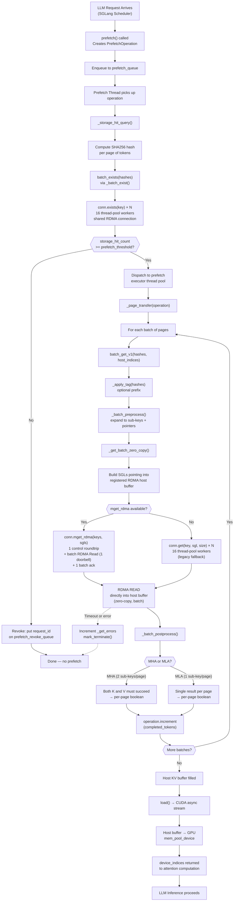

# GET (Prefetch) Flow Diagram

## Key Points

- **No HTTP GET** — this is an internal prefetch pull, not a web request
- **Batch RDMA path (primary)**: `mget_rdma` sends all keys in one control roundtrip, posts all RDMA Reads with a single doorbell, and sends one batch ack. No ThreadPoolExecutor needed. Performance is bandwidth-limited and page-size-independent.
- **Legacy fallback**: If the server doesn't support `mget_rdma` (old version), falls back to per-key `get()` via ThreadPoolExecutor (16 workers)
- **Zero-copy RDMA**: NIC DMA-reads directly into the pre-registered host memory buffer — no CPU copies on either side
- **Existence check first** (`batch_exists`) avoids wasting RDMA bandwidth on missing keys
- **Threshold gate**: if too few pages hit in storage, the prefetch is revoked entirely
- **MHA vs MLA**: MHA stores separate K/V sub-keys (both must succeed), MLA uses a single fused sub-key per page
