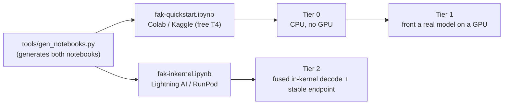

# Notebooks — try `fak` in a hosted cloud notebook

Lowest-friction way to see the agent kernel work: no local Go toolchain, no clone on your
machine, a free GPU on demand. These are a hosted re-skin of [`GETTING-STARTED.md`](../GETTING-STARTED.md)'s
tier ladder — every command already ships; the notebook just wraps it.



*The tier ladder and which generated notebook covers each rung.*

| Notebook | Host | Tiers | Status |
|---|---|---|---|
| [`fak-quickstart.ipynb`](fak-quickstart.ipynb) | **Google Colab** / Kaggle (free T4) | 0 (CPU) + 1 (front a real model on a GPU) | runnable |
| [`fak-inkernel.ipynb`](fak-inkernel.ipynb) | Lightning AI / RunPod Jupyter (neocloud) | 2 — fused in-kernel decode + a stable endpoint | runnable |

Open the quickstart directly:
[](https://colab.research.google.com/github/anthony-chaudhary/fak/blob/main/notebooks/fak-quickstart.ipynb)

## Running `fak-quickstart.ipynb`

1. Open it in [Google Colab](https://colab.research.google.com/) (or Kaggle), or run
   locally with `jupyter lab`.
2. **No key, no token.** `fak` is a public repo, so the *Get the binary* cell clones and
   builds it anonymously (no `GITHUB_TOKEN` needed). The clone also brings the `examples/`
   the demos use.
3. **Tier 0 needs no GPU.** For **Tier 1**, set **Runtime → Change runtime type → T4 GPU**,
   then ▶ **Run all**.

The notebook is **Run-all idempotent** (re-builds the binary and re-pulls the model on a
fresh runtime) and degrades gracefully — with no GPU it runs Tier 0 only and tells you so.

> **Knobs** (environment / Colab secrets): `FAK_REPO`, `FAK_BRANCH` (pin a release tag
> here), `FAK_MODEL` (default `qwen2.5:7b`), `FAK_WORK`, and `FAK_LIVE` (optional — point at
> a remote `fak serve` endpoint you already run; unset by default).

## These notebooks are generated — don't hand-edit them

Both `.ipynb` files are **build artifacts** of [`../tools/gen_notebooks.py`](../tools/gen_notebooks.py).
The setup and *Get the binary* cells are identical across notebooks and live **once** in
that generator, so a change (a new flag, a pinned version, a clone tweak) updates every
notebook at the same time. The modular update path:

```bash
# edit a shared cell builder in tools/gen_notebooks.py, then:
python tools/gen_notebooks.py            # re-render notebooks/*.ipynb
python tools/gen_notebooks.py --check    # CI guard: fails on drift OR a stale repo reference
git commit -s -- tools/gen_notebooks.py notebooks/
```

`--check` is the anti-rot layer: it re-renders in memory and diffs against the committed
files (a "generated, do not edit" guard), **and** verifies every repo path/verb the cells
depend on still exists (`examples/…policy.json`, `scripts/fetch-model.sh`, the `preflight`
/ `serve` / `agent` / `policy` verbs) — so a refactor that removes one of those fails here
instead of failing a reader mid-notebook. Wire it into CI alongside the other lints.
