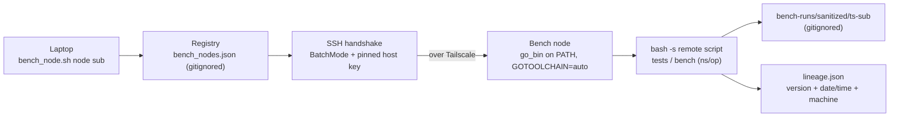

# `bench_node.sh` — repeatable bench-node runner

One command to run tests/benchmarks on a dedicated bench node over Tailscale. It folds in
every step that had to be done by hand the first time a node was used (a ~2-hour ordeal:
offline node, host-key trust, ssh user/key discovery, go-version mismatch, zsh-vs-bash,
picking the right checkout, benches silently absent at a commit).



*Flow: the laptop resolves the node from the gitignored registry, opens a pinned-host-key SSH handshake over Tailscale, runs the remote script via `bash -s`, and writes gitignored results plus a `lineage.json` witness.*

## Usage

```bash
tools/bench_node.sh <node> info            # resolved facts (sanitized name only)
tools/bench_node.sh <node> ping            # SSH-handshake reachability
tools/bench_node.sh <node> wait            # poll (backoff) until reachable
tools/bench_node.sh <node> tests           # go test ggufload+model (correctness)
tools/bench_node.sh <node> bench           # kernel-latency microbenches (ns/op)
tools/bench_node.sh <node> cmd <shell...>  # arbitrary command on the node
WAIT=1 tools/bench_node.sh <node> bench    # auto-wait if the node is asleep
```

`<node>` is a key in the registry (e.g. `macbook`). Results land in
`tools/_registry/bench-runs/<sanitized>/<ts>-<sub>/` — **gitignored**.

## Lineage / observability (every run)

Each run writes a `lineage.json` next to the result so any number is traceable to a
**version + date/time + machine** (the HARDWARE-CATALOG "scientific rigor" rule, enforced at
the runner):

```json
{
  "lineage_schema": "fleet-bench-lineage/1",
  "utc": "2026-06-21T08:45:00Z",
  "runner": "bench_node.sh", "runner_version": "0.2.0", "subcommand": "bench",
  "node": "node-macos-a", "node_capabilities": ["arm64","darwin","metal"],
  "fak_version": "v0.22.0", "git_commit": "381c330", "git_branch": "master",
  "go_version": "go1.26.0 darwin/arm64"
}
```

Node identity is recorded **sanitized** (`node-macos-a`, never the real tailnet host).

## Registry

- `tools/bench_nodes.json` — **gitignored**, real identity (tailnet IP, ssh user, repo path,
  pinned host key). Copy from the template and fill in.
- `tools/bench_nodes.example.json` — committed, public-safe placeholders (`node-macos-a`,
  `198.51.100.10`, `user`).

> NOTE: `tools/bench_nodes.json` carries real tailnet identity — it MUST stay gitignored. The
> ignore rule lives in `.gitignore`; if the public tree is regenerated from the private repo
> via `scrub_public_copy.py`, re-confirm the rule survived (this file + the ignore line have
> been clobbered by a regen before).

One-time per node: discover the ssh user, get your pubkey into the node's
`~/.ssh/authorized_keys`, then record the node's pinned `host_key` (from `ssh-keyscan -t
ed25519 <ip>`) into `bench_nodes.json`.

The committed, public-safe roster of which nodes the runner targets and where each stands
(onboarded vs. pending, with the per-node blocker) lives in the `_onboarding` block of
`bench_nodes.example.json` — that template already carries a ready-to-fill placeholder entry
for every node in the roster, so onboarding a pending node is: copy its entry into the
gitignored `bench_nodes.json`, fill in real identity, bootstrap, and `bench_node.sh <node> tests`.
Each pending node also carries the GitHub `issue` that tracks its onboarding — a dedicated
child where one is filed (#10 laptop-from-desktop, #12 GCP GPU VMs), else the umbrella #922
itself (desktop, GPU server) — so the roster doubles as a navigable decomposition index.

## Design decisions (the adversarial-review fixes)

Deliberately **read-only w.r.t. the committed tree** — it never writes a committable artifact,
because the repo's scrub audit is *shape-only* (Slack-token regex without the gitignored
needles sidecar) and would **not** redact a CPU brand or hostname. So:

- **Reachability = SSH handshake** (`ssh -o BatchMode=yes … true`), not `tailscale ping` — a
  node can answer ping with no `sshd` (the desktop does exactly this).
- **Host key is pinned** from the registry (`StrictHostKeyChecking=yes`), not blind `accept-new`.
- **Namespaced vars + hard-fail** on any empty registry field (never the reserved `$USER`).
- **Placement law enforced**: refuses if the target's tailnet IP equals *this* host's
  (`tailscale ip -4`). Override `BENCH_ALLOW_COLOCATED=1`.
- **0-benchmark guard, per package**: a missing `bench_test.go` at the node's commit warns
  loudly instead of hiding behind another package's numbers.
- **`go` on PATH + toolchain**: prepends the node's `go_bin` and exports `GOTOOLCHAIN=auto`;
  always pipes the remote script to `bash -s` (the node's default zsh is fatal on globs).

See the `_onboarding` roster in `bench_nodes.example.json` for the node roster (the private
`HARDWARE-CATALOG.md` is the unsanitized version) and `run-on-bench-nodes-by-default` for the
placement law.
