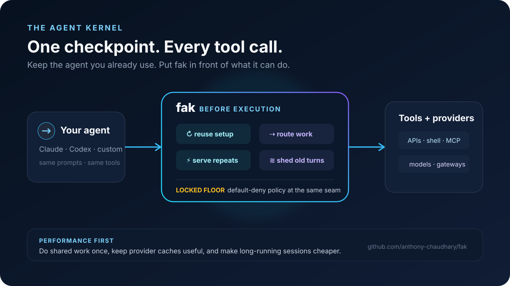
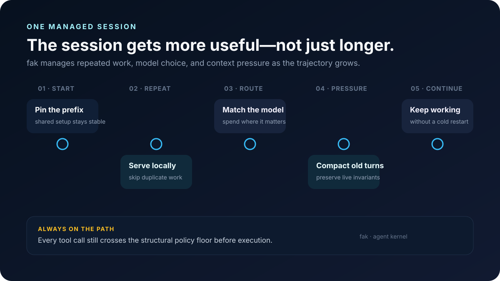
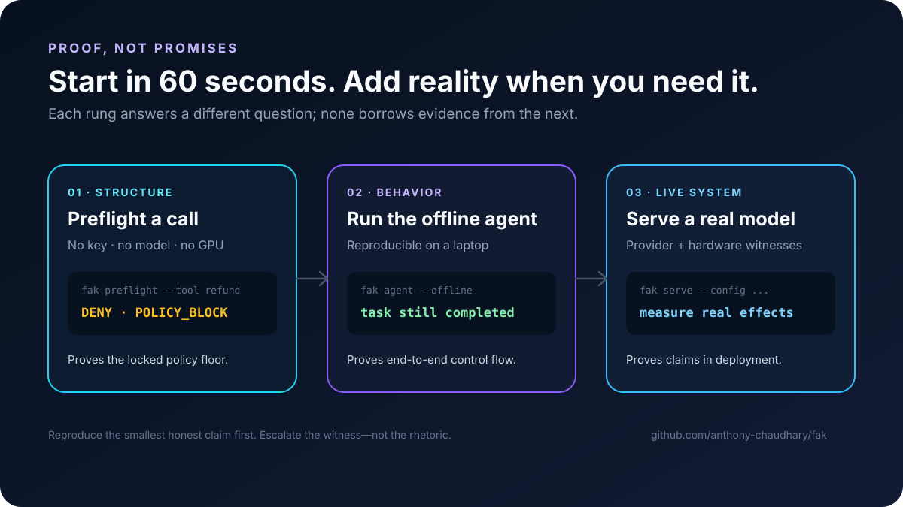

# fak visuals

A curated, current visual system for **fak**, the agent kernel. Start with the three
front-door figures below; the remaining assets are evidence, explainers, and captures
owned by the documents that link to them.

## Current story

### 1. One checkpoint for every tool call

Use this as the general product overview. It describes the current performance-first
positioning without making a benchmark claim: keep the existing agent, put fak at the
execution seam, reuse shared setup, route work, serve repeats, shed context, and enforce
the locked policy floor.

### 2. A managed session improves as it runs

Use this to explain the operating loop. It shows the mechanisms in sequence rather than
implying that raw session length is itself the outcome.

### 3. Evidence has rungs

Use this when introducing the reproducibility path: structural preflight, offline
end-to-end behavior, then live model and hardware evidence. Each rung is deliberately
scoped to what it proves.

## Asset map

| Need | Canonical assets |
|---|---|
| Logos, marks, favicon, color tokens | [`brand/`](brand/) |
| General product overview | [`76-agent-kernel-overview.svg`](76-agent-kernel-overview.svg) |
| Session-management story | [`77-managed-session.svg`](77-managed-session.svg) |
| Reproducibility / proof story | [`78-proof-ladder.svg`](78-proof-ladder.svg) |
| Current measured token economics | [`75-token-savings-frontdoor.svg`](75-token-savings-frontdoor.svg) + [`74-session-effectiveness.svg`](74-session-effectiveness.svg) |
| Live guard terminal capture | [`guard-tui-screenshot.png`](guard-tui-screenshot.png) + capture recipe |
| Live `fak info` surfaces | `info-overlay-*.png` + [`info-overlay-capture.md`](info-overlay-capture.md) |
| Benchmark gallery figures | [`../BENCHMARK-GALLERY.md`](../BENCHMARK-GALLERY.md) |
| Adoption figures | [`../docs/adoption-visuals.md`](../docs/adoption-visuals.md) |
| Context-tape and shedding explainers | [`../docs/explainers/context-tape-visuals.md`](../docs/explainers/context-tape-visuals.md) |

## Curation policy

- A generated visual stays here only when a live document consumes it, it is a current
  front-door asset, or it carries its own capture/reproduction evidence.
- Prefer SVG for diagrams and PNG/GIF/MP4 only for real rendered or recorded surfaces.
- Any numeric headline must name its baseline and point to reproducible evidence. Do not
  turn modeled values into measured claims.
- New front-door figures use the brand ink/cyan/sky/azure palette in
  [`brand/README.md`](brand/README.md), a 16:9 canvas, accessible `<title>`/`<desc>`, and
  text that remains legible in GitHub's renderer.
- Explorations and discarded directions belong in [`explore/`](explore/), not in the
  main gallery.

## Refresh record

The August 2026 refresh removed 33 unreferenced numbered families (88 generated source
and render files) that represented superseded architecture, economics, and launch-story
iterations. Git history remains the archive. The retained collection has a current live
consumer or reproducibility role; the three figures above are the new stable front door.
