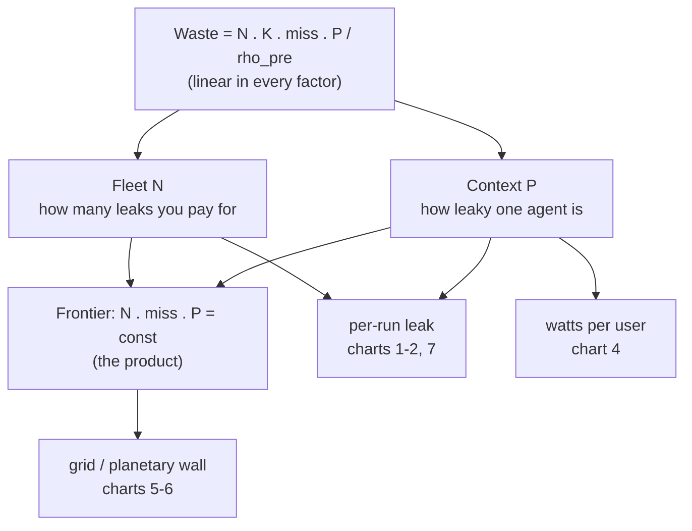

# Re-prefill waste — exploration battery

> Generated by `explore_waste_frontier.py` (private companion — not published). Same physical
> model as `inline_tool_roi.py` (private companion — not published), pushed to extremes and re-expressed
> several ways — including **watts per user** and the asymptotic limits (context per cold miss up to
> **100M tokens**; fleets up to **1 billion agents**). All knobs in the script's `STACK` block.

*The model: waste is linear in N, K, miss, P; the two axes P and N multiply into the frontier, re-expressed across the chart battery as per-run leak, watts/user, and the grid wall.*

## The model (one line)

A two-pass agent loop re-prefills the **entire context `P`** on every cold KV-cache miss; inline keeps
the KV resident so it never does. Per run the waste is `N · K · miss · P / ρ_pre` GPU-seconds →
priced at `$3/GPU-hr` and powered at `700 W/GPU` (8-GPU replica). **The waste is linear in every
factor (N, K, miss, P)** — there is no regime where it saturates; it just runs into physics.

**Anchors:** 0.28 J / prefill-token · 128k ctx ⇒ ~2.84 GPU-hr & ~2 kW wasted per agent-run ·
`run_per_hour = 1` for the watt charts (one K-call run per always-on agent per hour).

## The charts

| # | file | what it shows | killer number |
|---|---|---|---|
| 1 | `01-waste-vs-context.png` | $/run waste vs context P, by fleet size | 100M-ctx agent wastes **~780×** a 128k one |
| 2 | `02-waste-vs-agents.png` | $/run waste vs fleet size N, by context | the **$200k build is sub-one-run** past ~N=1k·128k |
| 3 | `03-iso-cost-frontier.png` | the *real* frontier: iso-waste curves `N·miss·P = const` | the 1B×100M corner sits **~9 orders** past the build line |
| 4 | `04-watts-per-user.png` | watts wasted per always-on user vs context | 128k ⇒ **~2 kW/user**; 100M ⇒ **~1.5 MW/user** |
| 5 | `05-planetary-wall.png` | continuous fleet waste-power vs N, vs the grid | 1B × 100M ⇒ **~520× world electricity**, wasted |
| 6 | `06-agents-per-gigawatt.png` | agents a 1 GW datacenter can hold before waste saturates it | 100M ctx ⇒ **low single-digit** agents |
| 7 | `07-per-call-tax.png` | per-call cost ratio `P / R` (cold two-pass : inline) | 128k ⇒ **2,560×**; 100M ⇒ **2,000,000×** |

## What the extremes say (the reframe you actually want)

- **Drop "break-even runs."** The honest, recurring number is the **leak**: $/run (charts 1–2), W/user
  (4), or GW of grid (5). The one-time $200k build is a footnote that vanishes within a single run at
  any serious scale (chart 2).
- **Two independent axes, multiplied.** Context `P` sets *how leaky one agent is* (charts 1, 4, 7);
  fleet `N` sets *how many leaks you're paying for* (charts 2, 5). The frontier is their **product**
  `N·miss·P` (chart 3) — neither axis alone clears it.
- **At the frontier the curve becomes a wall.** Past ~100M-token contexts and ~10⁸–10⁹ agents, the
  *wasted re-prefill alone* exceeds a datacenter (6), then a nation, then the planet (5). There, inline /
  resident-KV is **not an optimization — it is the only physically feasible design.** This is the one
  regime where the COUNTER's "fusion optimizes a 1–3% slice" argument fully inverts: the slice *is* the
  system.

*Exploration only (2026-06-16); a back-of-envelope, not a commitment. Power/grid anchors: H100 ≈ 700 W,
1 GW datacenter, US ≈ 480 GW, world ≈ 3 TW average.*
